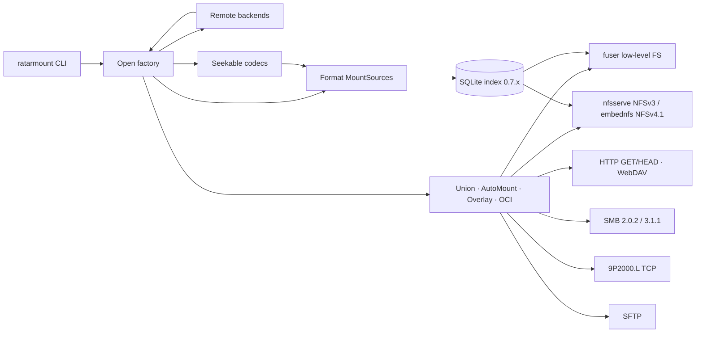

<div align="center">

# ratarmount-rs

### Random Access To Archived Resources — in Rust

**Mount archives as filesystems. Seek instantly. Use almost no RAM.**

A native Rust rewrite of [ratarmount](https://github.com/mxmlnkn/ratarmount): FUSE mounts backed by SQLite indexes, built for cold-start speed and a tiny resident set.

<br/>

[](https://github.com/hilather/ratarmount-rs/actions/workflows/ci.yml)
[](https://github.com/hilather/ratarmount-rs/releases)
[](LICENSE)
[](https://www.rust-lang.org)
[](docs/macos.md)

<br/>

```bash
ratarmount archive.tar.gz mnt/
ls mnt/          # browse without extracting
cat mnt/file     # true random access — even inside compressed streams
```

</div>

---

## Why ratarmount-rs?

| | What you get |
|---|---|
| **~5.2× faster cold mounts** | Index + mount in a fraction of the Python baseline (~6.8× warm) |
| **~4–6.5× lower peak RSS** | Typical **18–22 MiB** vs ~121 MiB for Python ratarmount |
| **One binary** | No interpreter, no wheel hell — deb / rpm / portable tarballs / macOS arm64 (Homebrew tap cask) |
| **Shared SQLite index** | Interoperable 0.7.x schema with upstream for TAR / ZIP / 7z. Portable blob media type `application/vnd.ratarmount.index.v1+sqlite` (not SOCI); auto-discover via `{url}.index.ptr` + `{url}.index.{id}.sqlite`, archive `Link:`, http(s)/S3/GCS/Azure well-known sibling, OCI referrer on local miss; `--publish-index` always writes `{archive}.index.ptr`; remount a previous snapshot with `--index-id HEX` |
| **Nested without `/tmp`** | Most embedded archives open from the parent stream — no spool |
| **Remote-first** | `http(s)`, S3, GCS, Azure, FTP, SSH, OCI, IPFS, rclone, WebDAV, SMB, Dropbox |

> Prefer Python when you need rapidgzip-class throughput or the widest fsspec surface. Prefer **Rust** when mounts are frequent, memory is tight, or you want a static-friendly binary.

Full methodology and fixtures: [benchmarks/python-vs-rust-results.md](benchmarks/python-vs-rust-results.md) · harness: [benchmarks/compare-python-vs-rust.sh](benchmarks/compare-python-vs-rust.sh) · re-run: `BIG=1 ./benchmarks/compare-python-vs-rust.sh`

---

## Install

### Prebuilt packages (recommended)

Grab the latest assets from **[Releases](https://github.com/hilather/ratarmount-rs/releases)** — Linux `.deb` / Rocky `.rpm` / portable glibc 2.31 tarballs, plus **macOS arm64**, all cosign-signed.

```bash
# Example: portable Linux tarball (no clone)
tar xf ratarmount-*-linux-x86_64.tar.gz
install -m 755 ratarmount ~/.local/bin/

# macOS Apple Silicon — GitHub Release tarball (no clone)
# tar xf ratarmount-*-macos-arm64.tar.gz && install -m 755 ratarmount-*/ratarmount ~/.local/bin/

# macOS Apple Silicon — Homebrew tap cask (needs a clone; packaging/homebrew is not a git repo)
# Fully-qualified: homebrew/core has a Linux Python formula also named ratarmount.
# or: ./packaging/homebrew/install.sh
brew tap-new hilather/ratarmount
mkdir -p "$(brew --repo hilather/ratarmount)/Casks"
cp packaging/homebrew/Casks/ratarmount.rb "$(brew --repo hilather/ratarmount)/Casks/"
brew install --cask hilather/ratarmount/ratarmount
```

See [`docs/packaging.md`](https://github.com/hilather/ratarmount-rs/blob/main/docs/packaging.md) for verification and package layout. macOS FUSE + cask: [`docs/macos.md`](https://github.com/hilather/ratarmount-rs/blob/main/docs/macos.md).

### From source

**Linux**

```bash
# deps: rustup stable, fuse3/libfuse3, libarchive, zlib headers
export PATH="$HOME/.cargo/bin:$PATH"
make release && make install   # → ~/.local/bin/ratarmount
# or: cargo install --path ratarmount
# NFSv4.1 + SFTP (opt-in): cargo build --release -p ratarmount --features nfsv4,sftp-russh
#   nfsv4 needs rustc ≥ 1.88; sftp-russh needs russh MSRV 1.85. Workspace default is 1.74.
# Release packages already compile both. Linux NFS kernel client: privileged Docker
#   ./test-harness/nfs-docker/run.sh   (not default CI)
```

**macOS** (Apple Silicon first-class) — full guide: [`docs/macos.md`](docs/macos.md)

```bash
brew install --cask macfuse          # or fuse-t
brew install libarchive pkgconf
export PKG_CONFIG_PATH="$(brew --prefix libarchive)/lib/pkgconfig:${PKG_CONFIG_PATH:-}"
make release && make install
# Tahoe / FSKit fallback if needed:
#   ratarmount -f -o backend=fskit archive.tar.gz mnt/
```

---

## Quick start

```bash
# Mount a compressed archive (daemonizes by default; -f stays in foreground)
ratarmount archive.tar.gz mnt/
ratarmount -f archive.tar mnt/

# Recursive nested archives (prefer -l on huge trees)
ratarmount -r archive.zip mnt/
ratarmount -r -l --recursion-depth 2 package.deb mnt/

# Write overlay + commit back
ratarmount -w /tmp/ov archive.tar mnt/
# …edit under mnt/…
ratarmount --commit-overlay …   # gzip/bzip2/xz GNU tar; .tar.zst splice; ZIP full rebuild

# Missing .tar / .tar.zst + -w creates an empty write-mount base
ratarmount -w /tmp/ov --commit-overlay-interval 2s new.tar.zst mnt/
# Offline --commit-overlay creates a missing uncompressed .tar only
# (missing .tar.zst stays unsupported offline; use on-exit / interval)

# Remote & encrypted
ratarmount http://host/data.tar mnt/
ratarmount s3://bucket/key.tar mnt/
ratarmount gs://bucket/obj.tar mnt/
ratarmount az://container/blob.tar mnt/
ratarmount 'ssh://user@host//path/a.tar' mnt/
ratarmount 'rclone://gdrive:bucket/path.tar' mnt/
ratarmount 'rclone+gdrive:bucket/path.tar' mnt/
ratarmount docker://ubuntu:24.04 mnt/
ratarmount --password secret encrypted.7z mnt/

# Index only (no FUSE)
ratarmount --no-mount -c archive.tar

# Make a single-frame / gzip archive randomly accessible (multi-frame zstd + seek table)
ratarmount --repack-seekable big.tar.gz big.tar.zst
# Gzip sidecar instead of transcode (helpers before the flag or after IN OUT):
ratarmount --repack-keep-gzip --repack-seekable in.gz out.gz   # writes out.gz.rgzi
# Exclusive with --nfs / -w / a FUSE mountpoint. Local files only.

# Locate without FUSE (TSV path, size, mtime). Quote globs. `--fts` / `--offset-order` are find-only.
ratarmount find '*.fits' archive.tar
ratarmount find --fts fits archive.tar.gz
ratarmount find --offset-order '*.fits' archive.tar
# Live mount with --control-interface: quote the glob (not a FUSE write):
#   cat '/mnt/.ratarmount-control/search/*.fits'
# Unix socket: `search *.fits` (TSV + `count N`)

# NFSv3 userspace export (no FUSE mountpoint; default)
ratarmount --nfs archive.tar.gz
# Also: --http :20491 · --webdav :20492 · --smb :20445 · --ninep :20493 · --sftp :20222
#   ratarmount --nfs --http archive.tar.gz     # NFS + HTTP in one process
#   ratarmount --http archive.tar.gz           # HTTP-only (no FUSE mountpoint)
#   ratarmount serve --nfs --http archive.tar.gz  # optional sugar; ≥1 export required
#   --sftp / --sftp-subsystem need --features sftp-russh (Linux/macOS packages enable it)
# Linux: mount -t nfs -o vers=3,tcp,nolock,port=20490,mountport=20490 127.0.0.1:/ mnt
# Opt-in NFSv4.1 (Linux/macOS packages compile nfsv4; source: --features nfsv4, rustc ≥ 1.88)
#   ratarmount --nfs --nfs-vers 4
#   Linux: mount -t nfs -o vers=4.1,tcp,port=20490,sec=sys 127.0.0.1:/ mnt
# Loopback kernel client verified via privileged Docker (./test-harness/nfs-docker/run.sh).
# Uncompressed TAR or .tar.zst: --commit-overlay-on-exit / --commit-overlay-interval (durable -w).
# Last-frame rewrite (does not recompress the prefix). Persist still copies the compressed
# prefix. On-disk sidecar is patched so remount does not rescan prefix frames.
# Plan 2× compressed disk headroom.
# Never refuses on size; warns when the last zstd frame is larger than 64 MiB
# uncompressed. Gzip stays rejected. Live ticks reject prefix-frame mutate;
# offline --commit-overlay splices .tar.zst from the affected frame.

# HPC / systemd / autofs (RO). Helper argv has no secrets — inherit AWS_* / RESTIC_*.
# s3://bucket/dataset.tar.zst  /mnt/archives/dataset  fuse.ratarmount  ro,allow_other,_netdev,x-systemd.mount-timeout=infinity  0  0
# Type=fuse.ratarmount → /usr/sbin/mount.fuse.ratarmount
# CSI is spec-only (separate repo). See docs/systemd-mount.md · docs/csi.md

# Unmount
ratarmount -u mnt/

# What does this build support?
ratarmount --print-features
```

---

## Features

### Archives & disk images

TAR (ustar / PAX / GNU + sparse) · ZIP (store / deflate, password, multi-part) · 7z (pack-offset + AES / BCJ2) · AR · CPIO · ISO 9660 · WARC · XAR · CAB · ASAR · SquashFS · EXT4 · FAT12/16/32 · GPT/MBR disk images (`p1/`… via FAT/EXT4 offset; LVM residual) · UDIF DMG (inner FAT/ISO/exFAT/NTFS; HFS+/APFS residual) · SQLAR · PDF · OGG · HTML · Git · long-tail via **libarchive** (RAR, LHA, …) · split `.001` joins · lrzip
TAR (ustar / PAX / GNU + sparse) · ZIP (store / deflate, password, multi-part) · 7z (pack-offset + AES / BCJ2) · AR · CPIO · ISO 9660 · WARC · XAR · CAB · ASAR · SquashFS · EXT4 · FAT12/16/32 · GPT/MBR disk images (`p1/`… via FAT/EXT4 offset; LVM residual) · WIM (uncompressed + XPRESS, first image; LZX/LZMS residual; factory wire later) · SQLAR · PDF · OGG · HTML · Git · long-tail via **libarchive** (RAR, LHA, …) · split `.001` joins · lrzip
TAR (ustar / PAX / GNU + sparse) · ZIP (store / deflate, password, multi-part) · 7z (pack-offset + AES / BCJ2) · AR · CPIO · ISO 9660 · WARC · XAR · CAB · ASAR · SquashFS · EXT4 · FAT12/16/32 · GPT/MBR disk images (`p1/`… via FAT/EXT4 offset; LVM residual) · QCOW2 v2/v3 (zlib clusters; local backing; factory later) · SQLAR · PDF · OGG · HTML · Git · long-tail via **libarchive** (RAR, LHA, …) · split `.001` joins · lrzip
TAR (ustar / PAX / GNU + sparse) · ZIP (store / deflate, password, multi-part) · 7z (pack-offset + AES / BCJ2) · AR · CPIO · ISO 9660 · WARC · XAR · CAB · ASAR · SquashFS · EXT4 · FAT12/16/32 · GPT/MBR disk images (`p1/`… via FAT/EXT4 offset; LVM residual) · VHD/VHDX (crate; wraps GPT/MBR; factory later) · SQLAR · PDF · OGG · HTML · Git · long-tail via **libarchive** (RAR, LHA, …) · split `.001` joins · lrzip

### Seekable compression

gzip · bzip2 · xz · zstd (multi-frame + seek-table) · lz4 · lzip · lzo · compress (`.Z`) · lzma · zlib

### Compositing & UX

| Capability | Notes |
|------------|--------|
| Recursive automount (`-r`) | Nested open **without `/tmp`** for most stencil formats — [guide](docs/embedded-nested-archives.md) |
| Lazy mount (`-l`) | Open nested archives on first access — preferred for huge trees |
| Union of sources | Directory wins over symlink; optional multi-hop resolve |
| Write overlay (`-w`, `:temp:`) | Full overlay + offline `--commit-overlay` (gzip/bzip2/xz TAR + ZIP + `.tar.zst` splice including earlier-frame delete). A missing uncompressed `.tar` or `.tar.zst` is created as an empty archive when `-w` is set (single local path). Offline `--commit-overlay` create-if-missing is uncompressed `.tar` only. Live `--commit-overlay-on-exit` / `--commit-overlay-interval` for uncompressed TAR and `.tar.zst` (rewrites only the last zstd frame; persist still copies the compressed prefix; on-disk sidecar is patched so remount does not rescan prefix frames; `:memory:` / discarded sidecar still full-rebuild; 2× compressed disk headroom). Interval commits files that have not been modified for `DURATION` (still-hot writes, including files still open for write, stay in the overlay). Gzip stays rejected. Live ticks reject prefix-frame `.tar.zst` mutate; offline `--commit-overlay` is the escape hatch. Warns when the last zstd frame is larger than 64 MiB uncompressed. |
| File versions | `.versions/` by default (`--no-file-versions`) |
| Strip / transform / prefix | Path rewriting on mount |
| Control plane | Unix socket **and** in-FS `/.ratarmount-control/` (read-only `search/<pattern>` glob locate; quote globs). Live `-w` control/socket last-wins overlay creates/COW/tombstones; CLI `find` stays sidecar SQL and rejects `-w`. `ratarmount find '*.fits' ARCHIVE` (no FUSE; `--fts` / `--offset-order` are find-argv only) |
| Seekable producer | `--repack-seekable IN OUT` writes multi-frame zstd + official seek table (default 8 MiB frames; `num_args = 2`; IN OUT must immediately follow the flag). Already-seekable inputs are copied. Helpers (`--repack-keep-gzip` → `OUT.rgzi`; `--repack-gzidx`; `--repack-force`) go **before** `--repack-seekable` or **after** IN OUT. Local files only; exclusive with export / `-w` / a FUSE mountpoint. [guide](https://github.com/hilather/ratarmount-rs/blob/main/docs/zstd-random-access.md) |
| Readahead | `--readahead BYTES` (sequential FUSE window; max 64 MiB; auto **1 MiB** for gzip when flag omitted) |
| Depth control | `--recursion-depth`, `--no-mount` |
| NFS export | NFSv3 default (`--nfs` / `--nfs-bind`; `-w` overlay writes). NFSv4.1 via `--nfs-vers 4` (Linux/macOS packages compile `nfsv4`; source needs `--features nfsv4` + rustc ≥ 1.88; `-w` overlay create/write; Linux kernel client **verified** on loopback via privileged Docker `test-harness/nfs-docker`; no Kerberos/LAN/Windows/mux) — [guide](https://github.com/hilather/ratarmount-rs/blob/main/docs/nfs-export.md) |
| Other exports | `--http` (`127.0.0.1:20491`, GET/HEAD of the **indexed tree**, not host archive bytes; optional `GET /.ratarmount-control/index.sqlite`) · `--webdav` (`:20492`, class 2 LOCK/COPY/Basic; mux residual) · `--smb` (`:20445`, signing when password; Finder/encrypt residual) · `--ninep` (`:20493`, TCP; not `--9p`) · `--sftp` (`:20222`, `--sftp-subsystem` stdio, `--features sftp-russh`, russh MSRV 1.85). Bind flags take a required value (`num_args = 1`). Combine with `--nfs` in one process. `--http --no-mount` exits 2. Optional `ratarmount serve --nfs --http ARCHIVE` sugar (requires ≥1 export; incompatible with `--no-mount`; booleans remain the stable interface) — [guide](https://github.com/hilather/ratarmount-rs/blob/main/docs/export.md) |
| HPC / systemd / autofs | RO `Type=fuse.ratarmount` via `/usr/sbin/mount.fuse.ratarmount` (fstab / systemd `.mount` / autofs). Helper argv has **no** secrets (env / `EnvironmentFile=`). CSI is **spec-only** (separate repo; no kube crates). `-w` StorageClass residual — [systemd](https://github.com/hilather/ratarmount-rs/blob/main/docs/systemd-mount.md) · [CSI spec](https://github.com/hilather/ratarmount-rs/blob/main/docs/csi.md) |
| Other exports | `--http` (`127.0.0.1:20491`, GET/HEAD of the **indexed tree**, not host archive bytes; optional `GET /.ratarmount-control/index.sqlite`) · `--webdav` (`:20492`, class 2 LOCK/COPY/Basic; mux residual) · `--smb` (`:20445`, signing when password; 3.1.1 preauth + optional GCM/CCM encrypt; Finder residual) · `--ninep` (`:20493`, TCP; not `--9p`) · `--sftp` (`:20222`, `--sftp-subsystem` stdio, `--features sftp-russh`, russh MSRV 1.85). Bind flags take a required value (`num_args = 1`). Combine with `--nfs` in one process. `--http --no-mount` exits 2. Optional `ratarmount serve --nfs --http ARCHIVE` sugar (requires ≥1 export; incompatible with `--no-mount`; booleans remain the stable interface) — [guide](https://github.com/hilather/ratarmount-rs/blob/main/docs/export.md) |

### Remote backends

`file://` · `http(s)://` (Range + Basic/Cookie auth; autoindex folders; `{url}.index.ptr` then `{url}.index.{id}.sqlite`, archive `Link: describedby`, well-known sibling `.index.sqlite`) · `s3://` (SigV4 / IMDS / anonymous; prefix folders; sibling pointer/blob/well-known GET; **PUT** of archive + blob-then-pointer; live overlay commit for TAR/ZST) · `gs://` (GOOG1 HMAC; same sibling GET; PUT residual) · `az://` (same sibling GET; PUT residual) · `ftp://` / `ftps://` (REST + LIST/MLSD folders; implicit :990 residual) · `ssh://` / `sftp://` (SFTP `readdir` folders) · WebDAV (Depth-1 collections) · SMB (`smbclient`) · Dropbox · `oci://` / `docker://` / `ghcr://` (overlayfs layer union; `oci:{digest}` cache then OCI 1.1 referrer) · `ipfs://` / `ipns://` · `rclone://remote:path` · `rclone+remote:path`

Remote sidecar **downloads** (whole SQLite blob ≤ 64 MiB, not archive Range I/O) are cached under `$XDG_CACHE_HOME/ratarmount/meta-v3/` (default `~/.cache/...` **even on macOS**; not migrated). Cap: `RATARMOUNT_META_CACHE_BYTES` (default 256 MiB; `=0` disables). Lookup is the sidecar URL — a remount does not need `.ptr`. HPC home-quota: point `XDG_CACHE_HOME` at scratch. `file://` / `:memory:` / an already-local sidecar are not stored again.

`payload-v1/` (decompressed member bodies keyed by sha256) and `local-index-v1/` (UserCache sidecars) are **siblings** under `platform_cache_root()` (`$XDG_CACHE_HOME/ratarmount/` on Linux, `~/Library/Caches/ratarmount/` on macOS unless `XDG_CACHE_HOME` is set, `%LOCALAPPDATA%\ratarmount\` on Windows). `payload-v1` is never nested under `local-index-v1`. Payload cap: `RATARMOUNT_PAYLOAD_CACHE_BYTES` (default 4 GiB; `=0` disables) and `RATARMOUNT_PAYLOAD_CACHE_DIR`. Members larger than 64 MiB are not cached (`RATARMOUNT_PAYLOAD_CACHE_MEMBER_MAX`). Default-on when the sidecar has `user.hash.sha256` (`--hashes sha256`); skipped for `:memory:` indexes and overlay writes. Residual: CDC chunking of large members.

Local-archive **user-cache** indexes (`IndexPolicy::UserCache` / GUI “save in user cache”) live under `platform_cache_root()/local-index-v1/` (macOS `~/Library/Caches/ratarmount/local-index-v1/` unless `XDG_CACHE_HOME` or `RATARMOUNT_LOCAL_INDEX_DIR` is set; Windows `%LOCALAPPDATA%\ratarmount\local-index-v1\`). Files are `{sha256}.sqlite` + `{sha256}.json`. Cap: `RATARMOUNT_LOCAL_INDEX_CACHE_BYTES` (default 2 GiB; `=0` disables). This is **not** `meta-v3/` — remote sidecar downloads stay in the 256 MiB V-3 LRU.

Living matrices: [`docs/mount-options-parity.md`](https://github.com/hilather/ratarmount-rs/blob/main/docs/mount-options-parity.md) · [`docs/parity-todo.md`](https://github.com/hilather/ratarmount-rs/blob/main/docs/parity-todo.md) · [`docs/phase10-remote.md`](https://github.com/hilather/ratarmount-rs/blob/main/docs/phase10-remote.md) · [`docs/export.md`](https://github.com/hilather/ratarmount-rs/blob/main/docs/export.md)

---

## Performance at a glance

Head-to-head vs Python ratarmount 1.3.0 (geo-mean, 2026-08-27, v0.1.27, **BIG** suite: 640 MiB blob + `.tar.zst` / `.tar.lz4`). **Factor > 1 ⇒ Rust wins.** Full tables: [python-vs-rust-results.md](benchmarks/python-vs-rust-results.md).

| Metric | Cold | Warm |
|--------|-----:|-----:|
| Mount time | **5.21×** | **6.76×** |
| Peak RSS | **4.34×** | **6.49×** |
| Random `cat` | **2.84×** | **2.82×** |
| Random 64 KiB pread | **7.72×** | **8.67×** |
| Sequential bandwidth | **3.85×** | **3.16×** |
| `find` walk | **1.26×** | **1.38×** |

**Standouts on this host**

- `large-640m.tar` — sequential `cat` **~20×**; 64 KiB pread **~18×**
- `large-640m.tar.zst` — sequential **~28×**; 64 KiB pread **~40–72×**
- `large-640m.tar.lz4` — sequential **~53×**; 64 KiB pread is cheap in Rust (Python does not seek independent blocks)
- Mount **~5–9×** faster and warm RSS **~6×** lower on almost every archive
- Residual: Python still wins small `.tar.gz` `cat` (rapidgzip) and 640 MiB `.tar.zst` **cold** mount (**1.69×**)

Multi‑GiB/s sequential numbers are FUSE + page cache (the blob fits in RAM), not disk speed. Single-host directional benches — re-run the harness on your hardware. Prior default-suite snapshot (v0.1.20): [python-vs-rust-results-2026-08-15.md](benchmarks/python-vs-rust-results-2026-08-15.md). Three-way vs v0.1.19: [python-vs-rust-results-v0.1.19-vs-0.1.20.md](benchmarks/python-vs-rust-results-v0.1.19-vs-0.1.20.md).

```bash
export RATARMOUNT_PY_ROOT=../ratarmount
cargo build --release
BIG=1 ./benchmarks/compare-python-vs-rust.sh
# → benchmarks/python-vs-rust-results-big.{csv,md}
#    and copies to benchmarks/python-vs-rust-results.{csv,md} (published snapshot)
```

---

## Architecture



**In-process embedders** (desktop GUI, custom hosts) should depend on `ratarmount-session` and follow [`docs/session-api.md`](docs/session-api.md). Do **not** import the `ratarmount` binary crate.

| Crate | Role |
|-------|------|
| `ratarmount` | CLI binary |
| `ratarmount-session` | In-process Session API for embedders (**no FUSE**; optional `http-export`) |
| `ratarmount-core` | `MountSource` trait & options |
| `ratarmount-index` | SQLite 0.7.x index |
| `ratarmount-fuse` | `fuser` low-level filesystem |
| `ratarmount-nfs` | In-process NFSv3 export (`--nfs`); optional NFSv4.1 (`--nfs-vers 4`, `nfsv4` feature) |
| `ratarmount-export-core` | Shared export bind / stop / inode / `fill_read` |
| `ratarmount-http` | HTTP GET/HEAD (`--http`) + WebDAV (`--webdav`) |
| `ratarmount-smb` | Userspace SMB 2.0.2 / 3.1.1 (`--smb`) |
| `ratarmount-9p` | 9P2000.L TCP (`--ninep`) |
| `ratarmount-sftp` | SFTP (`--sftp`, feature `sftp-russh`) |
| `ratarmount-compress` | Seekable codecs + stencils |
| `ratarmount-formats-*` | TAR, ZIP, 7z, ISO, SquashFS, EXT4, … |
| `ratarmount-compositing` | Folder, union, automount, overlay, OCI whiteouts |
| `ratarmount-remote` | HTTP, S3, GCS, Azure, FTP, SSH, OCI, IPFS, rclone, WebDAV, SMB, Dropbox |

```
ratarmount/                 # CLI
ratarmount-session/         # in-process Session API (embedders; no FUSE)
ratarmount-core/            # MountSource trait, options
ratarmount-index/           # SQLite 0.7.x
ratarmount-fuse/            # fuser low-level FS
ratarmount-nfs/             # NFSv3 userspace export + optional NFSv4.1
ratarmount-export-core/     # shared export bind / fill_read
ratarmount-http/            # HTTP GET/HEAD + WebDAV
ratarmount-smb/             # userspace SMB 2.0.2 / 3.1.1
ratarmount-9p/              # 9P2000.L TCP
ratarmount-sftp/            # SFTP (sftp-russh)
ratarmount-compress/        # seekable codecs + stencils
ratarmount-formats-*/       # per-format backends
ratarmount-compositing/     # folder, union, automount, overlay, OCI
ratarmount-remote/          # remote URL backends
test-harness/               # phase allowlists + runners
packaging/                  # deb / rpm / portable / macOS
benchmarks/                 # Python vs Rust comparison
docs/                       # parity, decisions, guides
```

---

## Nested archives

Recursive mounts (`-r`) open nested members from a **seekable parent stream** when possible — **no copy of the nested body to `/tmp`**.

| Nested member | Temp spool? |
|---------------|:-----------:|
| `.tar` / `.tar.gz` / `.zip` / `.7z` inside ZIP · TAR · 7z | **No** |
| CPIO · AR · ISO · WARC · ASAR · XAR · CAB (store/MSZIP) · FAT · GPT/MBR (`pN/`, crate) · UDIF DMG (crate; inner FAT/ISO) | **No** |
| CPIO · AR · ISO · WARC · ASAR · XAR · CAB (store/MSZIP) · FAT · GPT/MBR (`pN/`, crate) · WIM (crate; LZX/LZMS residual) | **No** |
| CPIO · AR · ISO · WARC · ASAR · XAR · CAB (store/MSZIP) · FAT · GPT/MBR (`pN/`, crate) · QCOW2 (crate) | **No** |
| SquashFS (none/gzip/zstd/lz4/lzo/xz) · EXT4 (pure path) | **No** |
| Unencrypted SQLAR · plain nested `.gz`/`.zst`/… | **No** |
| CAB LZX · classic SquashFS LZMA · RAR nested | Often yes (fallback) |

```bash
ratarmount -r archive.zip mnt/           # mnt/inner.tar/file.txt — no /tmp for inner.tar
ratarmount -r -l big.deb mnt/            # large trees: lazy nested open
RUST_LOG=debug ratarmount -r -d 2 …      # “nested reader” vs “temp spool” in logs
```

On enormous packages (e.g. `linux-source-*.deb`), prefer **`-l` / `--lazy`** and optionally **`--recursion-depth`**. Details: [`docs/embedded-nested-archives.md`](docs/embedded-nested-archives.md).

---

## Gaps vs Python ratarmount

Honest residuals — tracking upstream-inspired work in [`docs/tasks/upstream-feature-requests.md`](docs/tasks/upstream-feature-requests.md):

1. **Codec depth** — rapidgzip-class gzip throughput (opt-in Tier D path POC; residual vs default G3 + Python — [perf batch](https://github.com/hilather/ratarmount-rs/blob/main/docs/tasks/rapidgzip-perf-batch.md), [binding decision](https://github.com/hilather/ratarmount-rs/blob/main/docs/gzip-binding-decision.md)); exotic xz filters; single-frame zstd full decode (prefer [`--repack-seekable`](https://github.com/hilather/ratarmount-rs/blob/main/docs/zstd-random-access.md) or multi-frame).
2. **Formats** — pure classic SquashFS lzma; pure RAR; encrypted SQLAR without sqlcipher; residual PDF color spaces; GPT/MBR crate mounts FAT/EXT4 `pN/` (LVM/RAID/Btrfs residual; factory wire later); UDIF DMG crate mounts inner FAT/ISO (HFS+/APFS/encrypted residual; factory wire later).
2. **Formats** — pure classic SquashFS lzma; pure RAR; encrypted SQLAR without sqlcipher; residual PDF color spaces; GPT/MBR crate mounts FAT/EXT4 `pN/` (LVM/RAID/Btrfs residual; factory wire later); WIM LZX/LZMS / WIMBoot / later images (uncompressed + XPRESS crate; factory wire later).
2. **Formats** — pure classic SquashFS lzma; pure RAR; encrypted SQLAR without sqlcipher; residual PDF color spaces; GPT/MBR crate mounts FAT/EXT4 `pN/` (LVM/RAID/Btrfs residual; factory wire later); QCOW2 crate maps guest clusters then the block crate (zstd clusters / HTTP backing residual; factory wire later).
2. **Formats** — pure classic SquashFS lzma; pure RAR; encrypted SQLAR without sqlcipher; residual PDF color spaces; GPT/MBR crate mounts FAT/EXT4 `pN/` (LVM/RAID/Btrfs residual; factory wire later); VHD/VHDX crate (differencing residual; factory later).
3. **7z solids** — AES+LZMA2 and native BCJ/Delta+LZMA2 large solids are progressive (BCJ/Delta is sequential-from-0 + LRU; no dict-reset resume). BCJ2 / multi-pack still full-folder. Progressive pure LZMA2 is bounded but not free.
4. **Write paths** — ZIP `--commit-overlay` is full rebuild (residual encrypted/multi-part); compressed-TAR rename/write edges. A missing uncompressed `.tar` / `.tar.zst` is created as an empty write-mount base when `-w` is set. Live overlay commit accepts uncompressed TAR and `.tar.zst` (rewrites only the last zstd frame; persist still copies the compressed prefix; on-disk sidecar is patched so remount does not rescan prefix frames; `:memory:` still full-rebuild; 2× compressed disk headroom; never refuse on size; warn when the last frame is larger than 64 MiB uncompressed). `--commit-overlay-interval` persists files that have not been modified for `DURATION`. Gzip stays rejected. Offline `--commit-overlay` splices `.tar.zst` (last-window or rewrite from the affected frame through EOF, including earlier-frame delete). Live interval/on-exit still **rejects** prefix-frame mutate. Create-if-missing is uncompressed `.tar` only.
5. **Remote** — HTTP Basic + Cookie env auth done; `ssh_config` HostName/User/Port/IdentityFile/IdentitiesOnly/**ProxyJump**/**Include** done; `gs://` / `az://` / `ftp://` / `oci://` / `ipfs://` / `rclone://` / `rclone+` + F-1 prefix folders shipped (FTP LIST/MLSD; GCS GOOG1 HMAC). Residual: full browser cookie jar; ssh_config **ProxyCommand** / **Match**; implicit FTPS :990; rclone RC `--rc-serve`. [phase10-remote.md](docs/phase10-remote.md).
6. **Platforms** — macOS is **first-class on Apple Silicon** (signed `macos-arm64` tarball on tags; [Homebrew tap cask](https://github.com/hilather/ratarmount-rs/blob/main/packaging/homebrew/Casks/ratarmount.rb); [docs/macos.md](https://github.com/hilather/ratarmount-rs/blob/main/docs/macos.md)). Intel package deferred (no GHA Intel runner). WinFsp / Homebrew-core residual (F-5 `partial`).
7. **NFS** — v3 default; v4.1 opt-in in Linux/macOS packages. Linux kernel client **verified** on loopback (privileged Docker `./test-harness/nfs-docker/run.sh`; not default CI). No Kerberos, LAN, Windows, or v3/v4 mux. Idle TTL is not CLOSE. [nfs-export.md](https://github.com/hilather/ratarmount-rs/blob/main/docs/nfs-export.md).
8. **Other exports** — HTTP GET/HEAD `done`; WebDAV class 2 `done` (mux residual; Finder/Explorer not in CI); SMB **encrypt / 3.1.1 / Finder residual** (signing + NTLMv2 when password set); 9P TCP `done` (virtio residual); SFTP `done` (password env + `--sftp-subsystem`; needs `--features sftp-russh` — packages enable it; default CI does not). No `serve` subcommand. [export.md](https://github.com/hilather/ratarmount-rs/blob/main/docs/export.md).
9. **HPC / K8s** — systemd `.mount` + autofs + `mount.fuse.ratarmount` shipped (RO). CSI driver is spec-only (separate repo; no kube crates). `-w` overlay StorageClass residual. [systemd-mount.md](https://github.com/hilather/ratarmount-rs/blob/main/docs/systemd-mount.md) · [csi.md](https://github.com/hilather/ratarmount-rs/blob/main/docs/csi.md).
8. **Other exports** — HTTP GET/HEAD `done`; WebDAV class 2 `done` (mux residual; Finder/Explorer not in CI); SMB **Finder residual** (signing + NTLMv2 when password set; 3.1.1 preauth + optional AES-128-GCM/CCM encrypt); 9P TCP `done` (virtio residual); SFTP `done` (password env + `--sftp-subsystem`; needs `--features sftp-russh` — packages enable it; default CI does not). No `serve` subcommand. [export.md](https://github.com/hilather/ratarmount-rs/blob/main/docs/export.md).
8. **Other exports** — HTTP GET/HEAD `done`; WebDAV class 2 `done` (mux residual; Finder/Explorer not in CI); SMB **P-2 `done`** (signing + NTLMv2 when password set; 3.1.1 preauth + optional AES-128-GCM/CCM encrypt; leases + durable-handle-v1; Finder/Explorer not in CI; Kerberos/guest encrypt/WAN residual); 9P TCP `done` (virtio residual); SFTP `done` (password env + `--sftp-subsystem`; needs `--features sftp-russh` — packages enable it; default CI does not). No `serve` subcommand. [export.md](https://github.com/hilather/ratarmount-rs/blob/main/docs/export.md).

---

## Development

```bash
export RATARMOUNT_PY_ROOT="$HOME/projects/ratarmount"   # Python tree for fixtures
cargo fmt --all
cargo clippy --workspace --all-targets -- -D warnings
cargo test --workspace
./test-harness/run-all-phases.sh    # or: make suite
```

CI runs `fmt` → `clippy -D warnings` → `test`, FUSE phase allowlists, cold-index gates, and macOS build/test.

**Release checklist** (version bump + packages): see `AGENTS.md` and [`docs/packaging.md`](docs/packaging.md). Tag `v*` publishes signed deb/rpm/portable/macOS assets.

---

## Documentation

| Document | Topic |
|----------|--------|
| [docs/session-api.md](https://github.com/hilather/ratarmount-rs/blob/main/docs/session-api.md) | In-process Session API for embedders (no FUSE) |
| [docs/parity-todo.md](https://github.com/hilather/ratarmount-rs/blob/main/docs/parity-todo.md) | Full feature + test parity checklist |
| [docs/embedded-nested-archives.md](https://github.com/hilather/ratarmount-rs/blob/main/docs/embedded-nested-archives.md) | Nested / no-tmp matrix |
| [docs/mount-options-parity.md](https://github.com/hilather/ratarmount-rs/blob/main/docs/mount-options-parity.md) | CLI / mount-ability matrix |
| [docs/zstd-random-access.md](https://github.com/hilather/ratarmount-rs/blob/main/docs/zstd-random-access.md) | Zstd seek-table & `--repack-seekable` producer |
| [docs/gzip-binding-decision.md](https://github.com/hilather/ratarmount-rs/blob/main/docs/gzip-binding-decision.md) | Gzip seek path design (G3 default + Tier D residual) |
| [docs/fuse-kernel-tuning.md](https://github.com/hilather/ratarmount-rs/blob/main/docs/fuse-kernel-tuning.md) | FUSE mount / kernel tuning + fair disk baseline |
| [docs/nfs-export.md](https://github.com/hilather/ratarmount-rs/blob/main/docs/nfs-export.md) | NFSv3 default + opt-in NFSv4.1 (`--nfs-vers 4`) |
| [docs/export.md](docs/export.md) | HTTP / WebDAV / SMB / 9P / SFTP userspace exports |
| [docs/systemd-mount.md](https://github.com/hilather/ratarmount-rs/blob/main/docs/systemd-mount.md) | fstab / systemd `.mount` / autofs (`Type=fuse.ratarmount`) |
| [docs/csi.md](https://github.com/hilather/ratarmount-rs/blob/main/docs/csi.md) | Kubernetes CSI spec (no in-tree driver) |
| [docs/export.md](https://github.com/hilather/ratarmount-rs/blob/main/docs/export.md) | HTTP / WebDAV / SMB / 9P / SFTP userspace exports |
| [docs/packaging.md](https://github.com/hilather/ratarmount-rs/blob/main/docs/packaging.md) | Packages + cosign verify |
| [docs/macos.md](https://github.com/hilather/ratarmount-rs/blob/main/docs/macos.md) | macOS FUSE / FSKit |
| [docs/phase10-remote.md](https://github.com/hilather/ratarmount-rs/blob/main/docs/phase10-remote.md) | Remote backends |
| [docs/cold-index-and-sparse.md](https://github.com/hilather/ratarmount-rs/blob/main/docs/cold-index-and-sparse.md) | Index perf + sparse TAR |
| [benchmarks/python-vs-rust-results.md](https://github.com/hilather/ratarmount-rs/blob/main/benchmarks/python-vs-rust-results.md) | Latest head-to-head numbers (v0.1.27 BIG suite) |
| [benchmarks/python-vs-rust-results-big.md](https://github.com/hilather/ratarmount-rs/blob/main/benchmarks/python-vs-rust-results-big.md) | Named `BIG=1` output (same snapshot; re-run with `BIG=1`) |
| [benchmarks/README.md](https://github.com/hilather/ratarmount-rs/blob/main/benchmarks/README.md) | Bench harnesses (Python vs Rust, gzip backends, FUSE tuning) |
| [docs/phase12-dual-run.md](https://github.com/hilather/ratarmount-rs/blob/main/docs/phase12-dual-run.md) | Dual-run (crates.io **not** required) |
| [docs/crates-io-policy.md](https://github.com/hilather/ratarmount-rs/blob/main/docs/crates-io-policy.md) | crates.io policy (L0 dry-run only; no live publish) |
| [docs/tasks/beyond-parity-roadmap.md](https://github.com/hilather/ratarmount-rs/blob/main/docs/tasks/beyond-parity-roadmap.md) | Beyond-parity protocols, features, product bets |

---

## Related

- Upstream Python: [mxmlnkn/ratarmount](https://github.com/mxmlnkn/ratarmount)
- Releases: [hilather/ratarmount-rs/releases](https://github.com/hilather/ratarmount-rs/releases)

---

## License

[MIT](LICENSE) — aligned with upstream ratarmount intent.

<div align="center">

<sub>Built for people who open multi‑GB archives more often than they extract them.</sub>

</div>
