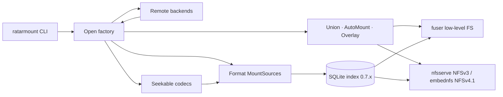

<div align="center">

# ratarmount-rs

### Random Access To Archived Resources — in Rust

**Mount archives as filesystems. Seek instantly. Use almost no RAM.**

A native Rust rewrite of [ratarmount](https://github.com/mxmlnkn/ratarmount): FUSE mounts backed by SQLite indexes, built for cold-start speed and a tiny resident set.

<br/>

[](https://github.com/hilather/ratarmount-rs/actions/workflows/ci.yml)
[](https://github.com/hilather/ratarmount-rs/releases)
[](LICENSE)
[](https://www.rust-lang.org)
[](docs/macos.md)

<br/>

```bash
ratarmount archive.tar.gz mnt/
ls mnt/          # browse without extracting
cat mnt/file     # true random access — even inside compressed streams
```

</div>

---

## Why ratarmount-rs?

| | What you get |
|---|---|
| **~3.9× faster cold mounts** | Index + mount in a fraction of the Python baseline (~5.4× warm) |
| **~6–8× lower peak RSS** | Typical **14–28 MiB** vs 110–350 MiB for Python ratarmount |
| **One binary** | No interpreter, no wheel hell — deb / rpm / portable tarballs / macOS arm64 |
| **Shared SQLite index** | Interoperable 0.7.x schema with upstream for TAR / ZIP / 7z |
| **Nested without `/tmp`** | Most embedded archives open from the parent stream — no spool |
| **Remote-first** | `http(s)`, S3, SSH/SFTP, WebDAV, SMB, Dropbox |

> Prefer Python when you need rapidgzip-class throughput or the widest fsspec surface. Prefer **Rust** when mounts are frequent, memory is tight, or you want a static-friendly binary.

Full methodology and fixtures: [benchmarks/python-vs-rust-results.md](https://github.com/hilather/ratarmount-rs/blob/v0.1.20/benchmarks/python-vs-rust-results.md) · harness: [benchmarks/compare-python-vs-rust.sh](https://github.com/hilather/ratarmount-rs/blob/v0.1.20/benchmarks/compare-python-vs-rust.sh)

---

## Install

### Prebuilt packages (recommended)

Grab the latest assets from **[Releases](https://github.com/hilather/ratarmount-rs/releases)** — Linux `.deb` / Rocky `.rpm` / portable glibc 2.31 tarballs, plus **macOS arm64**, all cosign-signed.

```bash
# Example: portable Linux tarball
tar xf ratarmount-*-linux-x86_64.tar.gz
install -m 755 ratarmount ~/.local/bin/
```

See [`docs/packaging.md`](docs/packaging.md) for verification and package layout.

### From source

**Linux**

```bash
# deps: rustup stable, fuse3/libfuse3, libarchive, zlib headers
export PATH="$HOME/.cargo/bin:$PATH"
make release && make install   # → ~/.local/bin/ratarmount
# or: cargo install --path ratarmount
# NFSv4.1 (opt-in; rustc ≥ 1.88): cargo build --release -p ratarmount --features nfsv4
# Release packages already compile nfsv4. Linux kernel client: privileged Docker
#   ./test-harness/nfs-docker/run.sh   (not default CI)
```

**macOS** (beta) — full guide: [`docs/macos.md`](docs/macos.md)

```bash
brew install --cask macfuse          # or fuse-t
brew install libarchive pkgconf
export PKG_CONFIG_PATH="$(brew --prefix libarchive)/lib/pkgconfig:${PKG_CONFIG_PATH:-}"
make release && make install
# Tahoe / FSKit fallback if needed:
#   ratarmount -f -o backend=fskit archive.tar.gz mnt/
```

---

## Quick start

```bash
# Mount a compressed archive (daemonizes by default; -f stays in foreground)
ratarmount archive.tar.gz mnt/
ratarmount -f archive.tar mnt/

# Recursive nested archives (prefer -l on huge trees)
ratarmount -r archive.zip mnt/
ratarmount -r -l --recursion-depth 2 package.deb mnt/

# Write overlay + commit back
ratarmount -w /tmp/ov archive.tar mnt/
# …edit under mnt/…
ratarmount --commit-overlay …   # TAR + gzip/bzip2/xz; ZIP full rebuild

# Remote & encrypted
ratarmount http://host/data.tar mnt/
ratarmount s3://bucket/key.tar mnt/
ratarmount 'ssh://user@host//path/a.tar' mnt/
ratarmount --password secret encrypted.7z mnt/

# Index only (no FUSE)
ratarmount --no-mount -c archive.tar

# NFSv3 userspace export (no FUSE mountpoint; default)
ratarmount --nfs archive.tar.gz
# Linux: mount -t nfs -o vers=3,tcp,nolock,port=20490,mountport=20490 127.0.0.1:/ mnt
# Opt-in NFSv4.1 (Linux/macOS packages compile nfsv4; source: --features nfsv4, rustc ≥ 1.88)
#   ratarmount --nfs --nfs-vers 4
#   Linux: mount -t nfs -o vers=4.1,tcp,port=20490,sec=sys 127.0.0.1:/ mnt
# Loopback kernel client verified via privileged Docker (./test-harness/nfs-docker/run.sh).

# Unmount
ratarmount -u mnt/

# What does this build support?
ratarmount --print-features
```

---

## Features

### Archives & disk images

TAR (ustar / PAX / GNU + sparse) · ZIP (store / deflate, password, multi-part) · 7z (pack-offset + AES / BCJ2) · AR · CPIO · ISO 9660 · WARC · XAR · CAB · ASAR · SquashFS · EXT4 · FAT12/16/32 · SQLAR · PDF · OGG · HTML · Git · long-tail via **libarchive** (RAR, LHA, …) · split `.001` joins · lrzip

### Seekable compression

gzip · bzip2 · xz · zstd (multi-frame + seek-table) · lz4 · lzip · lzo · compress (`.Z`) · lzma · zlib

### Compositing & UX

| Capability | Notes |
|------------|--------|
| Recursive automount (`-r`) | Nested open **without `/tmp`** for most stencil formats — [guide](docs/embedded-nested-archives.md) |
| Lazy mount (`-l`) | Open nested archives on first access — preferred for huge trees |
| Union of sources | Directory wins over symlink; optional multi-hop resolve |
| Write overlay (`-w`, `:temp:`) | Full overlay + `--commit-overlay` |
| File versions | `.versions/` by default (`--no-file-versions`) |
| Strip / transform / prefix | Path rewriting on mount |
| Control plane | Unix socket **and** in-FS `/.ratarmount-control/` |
| Readahead | `--readahead BYTES` (sequential FUSE window; max 64 MiB; auto **1 MiB** for gzip when flag omitted) |
| Depth control | `--recursion-depth`, `--no-mount` |
| NFS export | NFSv3 default (`--nfs` / `--nfs-bind`; `-w` overlay writes). NFSv4.1 via `--nfs-vers 4` (Linux/macOS packages compile `nfsv4`; source needs `--features nfsv4` + rustc ≥ 1.88; `-w` overlay create/write; Linux kernel client **verified** on loopback via privileged Docker `test-harness/nfs-docker`; no Kerberos/LAN/Windows/mux) — [guide](https://github.com/hilather/ratarmount-rs/blob/main/docs/nfs-export.md) |

### Remote backends

`file://` · `http(s)://` (Range + Basic/Cookie auth) · `s3://` (SigV4 / IMDS / anonymous) · `ssh://` / `sftp://` · WebDAV · SMB · Dropbox

Living matrices: [`docs/mount-options-parity.md`](docs/mount-options-parity.md) · [`docs/parity-todo.md`](docs/parity-todo.md)

---

## Performance at a glance

Head-to-head vs Python ratarmount (geo-mean, 2026-08-15, v0.1.20). **Factor > 1 ⇒ Rust wins.**

| Metric | Cold | Warm |
|--------|-----:|-----:|
| Mount time | **3.85×** | **5.43×** |
| Peak RSS | **6.03×** | **8.53×** |
| `find` walk | **1.45×** | **1.33×** |
| Random `cat` | **1.14×** | 0.95× |
| Sequential bandwidth | 0.97× | 0.73× |

**Standouts on this host**

- `small-100.tar.gz` — warm mount **8.8×** faster; warm RSS **~24×** lower (~14 MiB vs ~351 MiB)
- `large-64m.tar` — random access **~4×** faster; sequential multi‑GiB/s
- `empty-1k.tar` — cold mount **5.5×** faster; warm `find` **1.4×** faster than Python

Rust leads hard on **mount cost**, **memory**, and uncompressed `find` / random `cat`. Python can still edge **gzip** random/`cat` (rapidgzip). Sequential geo-mean excludes a tiny nested-TAR member. Numbers are single-host directional benches — re-run the harness on your hardware. Three-way vs v0.1.19: [python-vs-rust-results-v0.1.19-vs-0.1.20.md](https://github.com/hilather/ratarmount-rs/blob/v0.1.20/benchmarks/python-vs-rust-results-v0.1.19-vs-0.1.20.md).

```bash
export RATARMOUNT_PY_ROOT=../ratarmount
cargo build --release
./benchmarks/compare-python-vs-rust.sh
```

---

## Architecture



| Crate | Role |
|-------|------|
| `ratarmount` | CLI binary |
| `ratarmount-core` | `MountSource` trait & options |
| `ratarmount-index` | SQLite 0.7.x index |
| `ratarmount-fuse` | `fuser` low-level filesystem |
| `ratarmount-nfs` | In-process NFSv3 export (`--nfs`); optional NFSv4.1 (`--nfs-vers 4`, `nfsv4` feature) |
| `ratarmount-compress` | Seekable codecs + stencils |
| `ratarmount-formats-*` | TAR, ZIP, 7z, ISO, SquashFS, EXT4, … |
| `ratarmount-compositing` | Folder, union, automount, overlay |
| `ratarmount-remote` | HTTP, S3, SSH, WebDAV, SMB, Dropbox |

```
ratarmount/                 # CLI
ratarmount-core/            # MountSource trait, options
ratarmount-index/           # SQLite 0.7.x
ratarmount-fuse/            # fuser low-level FS
ratarmount-nfs/             # NFSv3 userspace export + optional NFSv4.1
ratarmount-compress/        # seekable codecs + stencils
ratarmount-formats-*/       # per-format backends
ratarmount-compositing/     # folder, union, automount, overlay
ratarmount-remote/          # remote URL backends
test-harness/               # phase allowlists + runners
packaging/                  # deb / rpm / portable / macOS
benchmarks/                 # Python vs Rust comparison
docs/                       # parity, decisions, guides
```

---

## Nested archives

Recursive mounts (`-r`) open nested members from a **seekable parent stream** when possible — **no copy of the nested body to `/tmp`**.

| Nested member | Temp spool? |
|---------------|:-----------:|
| `.tar` / `.tar.gz` / `.zip` / `.7z` inside ZIP · TAR · 7z | **No** |
| CPIO · AR · ISO · WARC · ASAR · XAR · CAB (store/MSZIP) · FAT | **No** |
| SquashFS (none/gzip/zstd/lz4/lzo/xz) · EXT4 (pure path) | **No** |
| Unencrypted SQLAR · plain nested `.gz`/`.zst`/… | **No** |
| CAB LZX · classic SquashFS LZMA · RAR nested | Often yes (fallback) |

```bash
ratarmount -r archive.zip mnt/           # mnt/inner.tar/file.txt — no /tmp for inner.tar
ratarmount -r -l big.deb mnt/            # large trees: lazy nested open
RUST_LOG=debug ratarmount -r -d 2 …      # “nested reader” vs “temp spool” in logs
```

On enormous packages (e.g. `linux-source-*.deb`), prefer **`-l` / `--lazy`** and optionally **`--recursion-depth`**. Details: [`docs/embedded-nested-archives.md`](docs/embedded-nested-archives.md).

---

## Gaps vs Python ratarmount

Honest residuals — tracking upstream-inspired work in [`docs/tasks/upstream-feature-requests.md`](docs/tasks/upstream-feature-requests.md):

1. **Codec depth** — rapidgzip-class gzip throughput (opt-in Tier D path POC; residual vs default G3 + Python — [perf batch](docs/tasks/rapidgzip-perf-batch.md), [binding decision](docs/gzip-binding-decision.md)); exotic xz filters; single-frame zstd full decode (prefer multi-frame/seekable — [zstd guide](docs/zstd-random-access.md)).
2. **Formats** — pure classic SquashFS lzma; pure RAR; encrypted SQLAR without sqlcipher; residual PDF color spaces.
3. **7z solids** — multi-GB BCJ/AES still full-folder; progressive pure LZMA2 is bounded but not free.
4. **Write paths** — ZIP `--commit-overlay` is full rebuild (residual encrypted/multi-part); compressed-TAR rename/write edges.
5. **Remote** — HTTP Basic + Cookie env auth done; residual full browser cookie jar & full `ssh_config` edges.
6. **Platforms** — macOS is **beta** ([docs/macos.md](https://github.com/hilather/ratarmount-rs/blob/main/docs/macos.md)).
7. **NFS** — v3 default; v4.1 opt-in in Linux/macOS packages. Linux kernel client **verified** on loopback (privileged Docker `./test-harness/nfs-docker/run.sh`; not default CI). No Kerberos, LAN, Windows, or v3/v4 mux. Idle TTL is not CLOSE. [nfs-export.md](https://github.com/hilather/ratarmount-rs/blob/main/docs/nfs-export.md).

---

## Development

```bash
export RATARMOUNT_PY_ROOT="$HOME/projects/ratarmount"   # Python tree for fixtures
cargo fmt --all
cargo clippy --workspace --all-targets -- -D warnings
cargo test --workspace
./test-harness/run-all-phases.sh    # or: make suite
```

CI runs `fmt` → `clippy -D warnings` → `test`, FUSE phase allowlists, cold-index gates, and macOS build/test.

**Release checklist** (version bump + packages): see `AGENTS.md` and [`docs/packaging.md`](docs/packaging.md). Tag `v*` publishes signed deb/rpm/portable/macOS assets.

---

## Documentation

| Document | Topic |
|----------|--------|
| [docs/parity-todo.md](docs/parity-todo.md) | Full feature + test parity checklist |
| [docs/embedded-nested-archives.md](docs/embedded-nested-archives.md) | Nested / no-tmp matrix |
| [docs/mount-options-parity.md](docs/mount-options-parity.md) | CLI / mount-ability matrix |
| [docs/zstd-random-access.md](docs/zstd-random-access.md) | Zstd seek-table & producer recipes |
| [docs/gzip-binding-decision.md](docs/gzip-binding-decision.md) | Gzip seek path design (G3 default + Tier D residual) |
| [docs/fuse-kernel-tuning.md](docs/fuse-kernel-tuning.md) | FUSE mount / kernel tuning + fair disk baseline |
| [docs/nfs-export.md](https://github.com/hilather/ratarmount-rs/blob/main/docs/nfs-export.md) | NFSv3 default + opt-in NFSv4.1 (`--nfs-vers 4`) |
| [docs/packaging.md](https://github.com/hilather/ratarmount-rs/blob/main/docs/packaging.md) | Packages + cosign verify |
| [docs/macos.md](https://github.com/hilather/ratarmount-rs/blob/main/docs/macos.md) | macOS FUSE / FSKit |
| [docs/phase10-remote.md](docs/phase10-remote.md) | Remote backends |
| [docs/cold-index-and-sparse.md](docs/cold-index-and-sparse.md) | Index perf + sparse TAR |
| [benchmarks/python-vs-rust-results.md](https://github.com/hilather/ratarmount-rs/blob/v0.1.20/benchmarks/python-vs-rust-results.md) | Latest head-to-head numbers (v0.1.20) |
| [benchmarks/README.md](benchmarks/README.md) | Bench harnesses (Python vs Rust, gzip backends, FUSE tuning) |
| [docs/phase12-dual-run.md](docs/phase12-dual-run.md) | Dual-run / crates.io notes |

---

## Related

- Upstream Python: [mxmlnkn/ratarmount](https://github.com/mxmlnkn/ratarmount)
- Releases: [hilather/ratarmount-rs/releases](https://github.com/hilather/ratarmount-rs/releases)

---

## License

[MIT](LICENSE) — aligned with upstream ratarmount intent.

<div align="center">

<sub>Built for people who open multi‑GB archives more often than they extract them.</sub>

</div>
