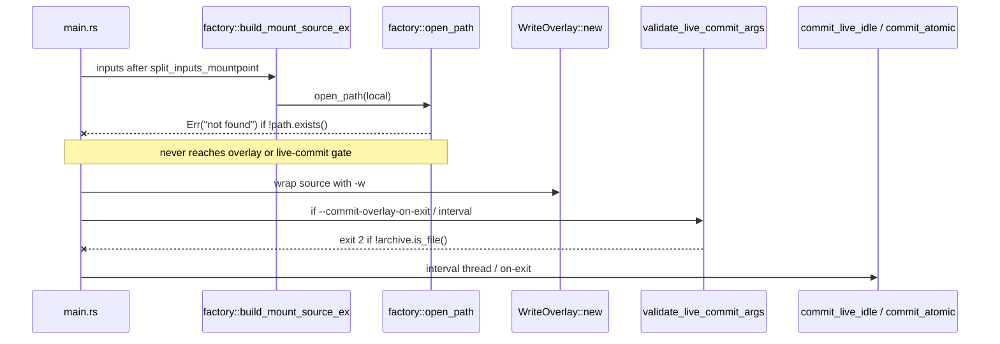
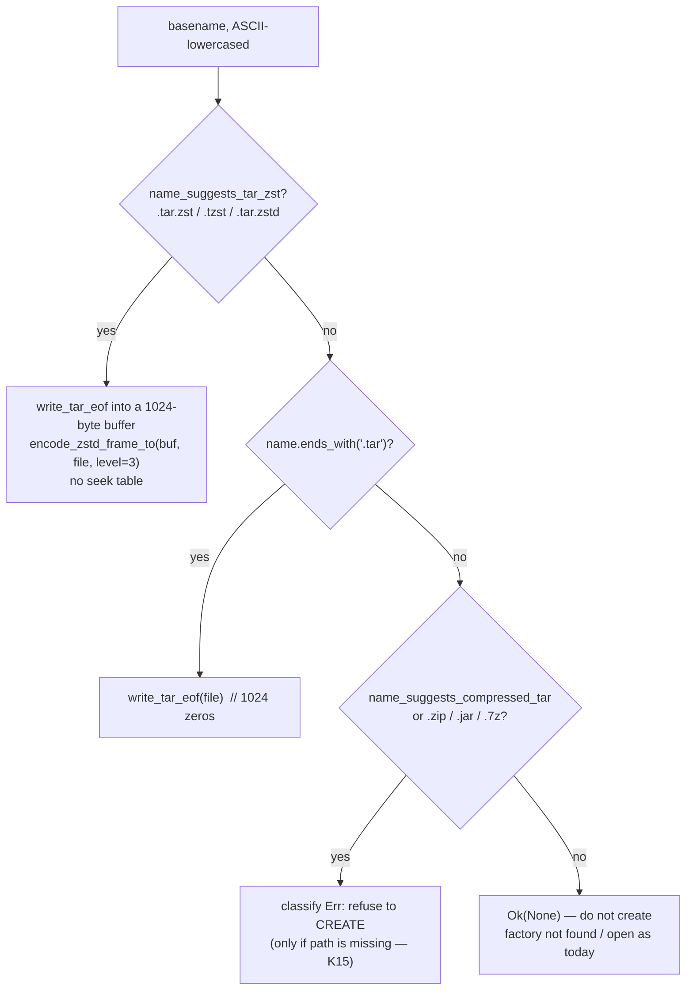
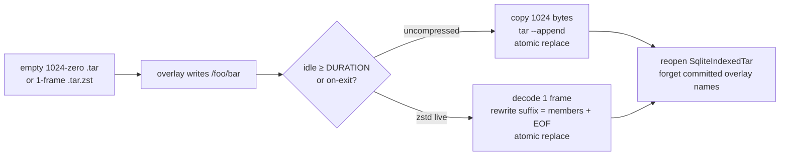

# Create missing TAR / `.tar.zst` as a new empty write mount

| Field | Value |
|-------|--------|
| **Author** | ratarmount-rs |
| **Date** | 2026-08-17 |
| **Status** | Ready for implementation |
| **Scope** | If the designated archive path is missing, create a POSIX-empty uncompressed TAR or a one-frame `.tar.zst` and mount it as a writable empty root (`-w`). Existing **live** overlay commit then persists into that file. Offline `--commit-overlay` may create a missing **uncompressed `.tar` only**. |
| **Out of this train** | Creating `.tar.gz` / other compressed TAR / ZIP / 7z; offline `--commit-overlay` persist for `.tar.zst` (prior-train PR 7); `mkdir -p` of missing parents; inventing a zstd seek table; changing persist algorithms; changing `looks_like_tar` / format probe; union / multi-input auto-create; create of a bare filename `tar` |

---

## Overview

Today a missing archive path is a hard failure. `factory::open_path` returns `not found: …` (`ratarmount/src/factory.rs` ~1639). `overlay_commit::validate_live_commit_args` independently requires `archive.is_file()` and then `live_commit_is_supported`. Offline `--commit-overlay` (`commit_overlay` in `write_overlay.rs` ~1290) uses the same must-be-a-file check. Persist always `File::open`s an existing archive (uncompressed copy + GNU `tar --append`, or `scan_zstd_frames_path` + last-frame splice). None of these paths create a file.

The product request is: **`ratarmount -w <overlay> archive.tar[.zst] [mnt]` when `archive` does not exist should create that file as a new empty TAR, mount `/` as a writable root, and let the already-landed live overlay commit (`WriteOverlay::commit_live_idle` / on-exit flush) write settled overlay files into it.**

This design adds a **CLI-layer, O_EXCL create** of a POSIX-empty archive (two 512-byte zero blocks; optionally one zstd frame around those 1024 bytes) **before** `factory::build_mount_source_ex`. It does **not** put create-if-missing inside `factory::open_path` (that function is also the nested-open path). It **does** extend `is_uncompressed_tar` so a POSIX-empty file is recognized as a TAR — without that, live commit would reject the uncompressed file we just created. It does **not** change `looks_like_tar` (format probe).

Offline `--commit-overlay` is **not** a zstd persist path today (`commit_overlay_tar` rejects `CompressionFormat::Zstd`). The offline branch therefore creates a missing **uncompressed `.tar` only**. A missing `.tar.zst` on that branch exits 2 **without creating a file**.

---

## Background & Motivation

### Current call graph (mount)



Relevant existing pieces (do not reinvent):

| Piece | Location | Today |
|-------|----------|--------|
| Missing-path gate | `factory::open_path_impl` ~1639 | `if !path.exists() { return Err(format!("not found: {}", path.display())); }` |
| Live-commit startup | `overlay_commit::validate_live_commit_args` ~199–229 | durable `-w`, `inputs.len() == 1`, `archive.is_file()`, `live_commit_is_supported` |
| Interval | `spawn_interval_commits` → `WriteOverlay::commit_live_idle` | ~1s poll, shared-lock peek, persist files whose host mtime is ≥ `DURATION` old (uncommitted on the working tree) |
| On-exit | `maybe_commit_on_exit` → `commit_atomic` | persist only; no reopen/reset |
| Uncompressed persist | `WriteOverlay::persist_uncompressed_tar_plan` | sibling `NamedTempFile`, `File::open(archive)` copy, GNU `tar --delete`/`--append`, `persist` |
| `.tar.zst` **live** persist | `persist_tar_zst_plan` | `scan_zstd_frames_path` + `find_last_n_tar_window` + `splice_zstd_last_frames_replace` |
| Offline `--commit-overlay` | `commit_overlay` → ZIP or `commit_overlay_tar` | `None` / Gzip / Bzip2 / Xz only. **`CompressionFormat::Zstd` is rejected** (“got {other:?}”). Not an escape hatch ([tar-zst-live-commit-design.md](https://github.com/hilather/ratarmount-rs/blob/main/docs/tasks/tar-zst-live-commit-design.md) PR 7). |
| Empty TAR bytes | `ratarmount_formats_tar::write_tar_eof` | `write_all(&[0u8; 1024])` |
| Zstd frame encode | `encode_zstd_frame_to` (`SPLICE_ENCODE_LEVEL = 3`) | persist-grade encoder in `zstd_splice.rs` |
| Virtual `/` | `create_root_file_info()` / `SqliteIndex::lookup("/")` | synthesized even when the `files` table is empty |
| Name helpers | `name_suggests_tar_zst` (write_overlay, private), `name_suggests_compressed_tar` (compress, public) | name-only; case-insensitive |
| Factory Tar `by_ext` | `factory.rs` ~339–346 | `path.extension().eq_ignore_ascii_case("tar")` — **not** a bare filename `tar` (`extension()` is `None`) |
| Remote | `ratarmount_remote::is_remote_url` | http(s), file, ftp, s3, ssh/sftp/scp, smb, webdav(s), dropbox. **Binary / factory only** — compositing does not depend on `ratarmount-remote`. |

### Why empty-TAR recognition is part of this work

`is_uncompressed_tar` (`write_overlay.rs` ~2238) requires **ustar/GNU magic at offset 257**. A POSIX-empty archive is **1024 zero bytes** — there is no member header, so the helper returns `false`.

`looks_like_tar` (`ratarmount-compress/src/lib.rs` ~243) uses the same magic check. **This train does not change it.** Factory open of a created `*.tar` already works via `by_ext`. Broadening `looks_like_tar` would make any 1024-zero nameless blob (split-set probes, lrzip materialize, a file named `foo`) newly mount as an empty TAR. That is a format-probe RFC, not this feature.

Consequences if we create 1024 zeros and stop there:

| Path | Result without an `is_uncompressed_tar` fix |
|------|---------------------------------------------|
| Factory open of `foo.tar` | Still works: Tar backend has `by_ext` (`extension() == "tar"`) and will `open_tar` even when `looks_like_tar` is false (`factory.rs` ~339–350). `parse_tar_into_index` sees two zero blocks and stops (`lib.rs` ~1354–1366). `lookup("/")` synthesizes a virtual root. |
| Factory open of a file named `tar` (no suffix) | `by_ext` is false (`Path::extension()` is `None`). Opens as `SingleFileMountSource`. **v1 does not create this name.** |
| Factory open of `foo` (no `.tar`) | Falls through every backend → `SingleFileMountSource`. We will not create such names. |
| `live_commit_is_supported` on the new `.tar` | **Fails** (`is_uncompressed_tar` false) — interval/on-exit unusable. |
| Offline `--commit-overlay` on the new `.tar` | Same `is_uncompressed_tar` reject inside `commit_overlay_tar`. |
| New `.tar.zst` | **Works** for **live** commit: `looks_like_tar_zst` is **name-first**. Persist: one frame, decoded suffix is 1024 zeros, `find_last_tar_eof` + `window_has_member_boundary` (`region_all_zero`) succeed. Factory `open_zstd` treats it as TAR via `name_suggests_compressed_tar`. Offline `--commit-overlay` still **rejects Zstd** (do not create on that branch — K13). |

So the recognition fix is **required for uncompressed `.tar` live and offline persist**, and is scoped to `is_uncompressed_tar` only.

### Pain points

1. Operators who want a **new** writable archive (`ratarmount -w ov --commit-overlay-interval 2s new.tar.zst mnt`) must first hand-build an empty TAR (`tar -cf` / `zstd`) — easy to get wrong (0-byte `touch`, gzip by habit, missing EOF).
2. The failure is late and split: factory `not found` before the live-commit gate can say anything useful.
3. The idle-interval work already on the tree is useless until a file exists.

---

## Goals & Non-Goals

### Goals

1. **`-w` + a single local path that is missing and whose name is uncompressed `.tar` or `.tar.zst` / `.tzst` / `.tar.zstd`:** create that file, then mount as today. Clients see an empty `/` and can `mkdir` / `create` / `write` through the overlay.
2. After create, **existing** `SqliteIndexedTar::create_index` / `create_index_body` + `open_zstd` / Tar `by_ext` open the new file with no new index format.
3. After create, **existing live** commit (`--commit-overlay-interval` per-file idle settle, `--commit-overlay-on-exit` full flush) persists into the new `.tar` or `.tar.zst`. Offline `--commit-overlay` persists into a newly created **uncompressed `.tar` only**. `cmp` of extracted member bytes matches the overlay payload.
4. **Never clobber** a path that already names a non-empty file, directory, symlink (including dangling), or other non-regular node. `O_EXCL` (`create_new(true)`). **Do not refuse** an existing `.tar.gz` / ZIP / 7z just because we will not create that type (K15).
5. **Refuse to create** missing names that look like a **known archive we will not create** (`name_suggests_compressed_tar` except the three zstd TAR suffixes, plus `.zip` / `.jar` / `.7z`) with an explicit exit-2 error when `-w` is set. An **existing** file of those types is **Unchanged** — today’s `-w` overlay on `.tar.gz` / ZIP / 7z must keep working. Unknown suffixes (`missing.iso`, a typo’d folder name) stay today’s factory `not found`.
6. **Refuse** remote URLs (CLI / `overlay_commit.rs`, not the compositing helper), missing parents, parent-is-not-a-directory, and multi-input unions.
7. Tests + docs + CLI help **in the same PR as the user-visible CLI behavior** (AGENTS.md).

### Non-goals

| Item | Reason |
|------|--------|
| Creating gzip/bzip2/xz TAR or ZIP | Live commit rejects them; offline gzip commit is a different persist path; product said out of scope |
| Offline `--commit-overlay` for `.tar.zst` | `commit_overlay_tar` rejects Zstd today. Prior-train PR 7. Creating a file then failing is worse than not creating |
| Literal ustar member named `/` or `.` | Indexes already synthesize `/`; a real `/` member is skipped (`full.is_empty()` → `return Ok(())` in `push_entry`, `ratarmount-formats-tar/src/lib.rs` ~2308–2328) |
| Inventing a zstd seek table on create | Live-commit K5: do not invent a footer if the input did not have one |
| Changing `looks_like_tar` / `body_looks_like_tar` | Would remount nameless 1024-zero blobs as TAR. Factory `by_ext` already opens created `*.tar` |
| Create of a bare filename `tar` | `Path::extension()` is `None`; factory would open it as `SingleFileMountSource`, not an empty root |
| `mkdir -p` of the archive’s parent | Too surprising; typo in `/var/lb/.../a.tar` would create a new tree |
| Create-if-missing inside `factory::open_path` | Nested `open_nested_fn` / remotes must never materialize missing sibling paths |
| Read-only create (no `-w`) | An empty archive with no overlay is a 1024-byte curiosity, not the product |
| Changing persist (GNU tar / last-frame splice) | Empty 1024-byte (or one-frame) archives already fit those algorithms once `is_uncompressed_tar` is fixed |
| Multi-archive union auto-create | Same restriction as live commit (`inputs.len() == 1`) |
| Windows / non-Unix `O_EXCL` semantics | Codebase is Unix (`OpenOptionsExt`, `MetadataExt`) |

---

## Key Decisions

| # | Decision | Rationale |
|---|----------|-----------|
| **K1** | **Create at the CLI layer**, in a new helper called from `main.rs` **after** `split_inputs_mountpoint` and **before** `factory::build_mount_source_ex`. Do **not** teach `factory::open_path` to create. | `open_path` is reused for nested archives (`open_nested_fn` ~482). A missing nested member must stay `not found`. Factory stays “open existing”. |
| **K2** | **Gate on `-w` + exactly one local input + a supported name.** Live-commit flags are **not** required to create on the **mount** path. | Product is “new empty write mount”. Overlay-only (`-w` without `--commit-overlay-*`) is still useful; persist can happen later via live flags. Requiring live-commit flags would surprise `ratarmount -w ov new.tar mnt`. |
| **K3** | **Bytes = POSIX empty TAR only** (1024 zero bytes via `write_tar_eof`). For `.tar.zst` / `.tzst` / `.tar.zstd`, wrap those 1024 bytes in **one** zstd frame (`encode_zstd_frame_to`, level **`SPLICE_ENCODE_LEVEL` (3)**). **No** seek-table footer. **No** `.` / `/` directory member. | Matches the user’s “`/` path clients can manipulate” = virtual root. `parse_tar_into_index` already stops on the first zero-block pair. Persist last-window logic already treats an all-zero suffix as a valid rewrite window (`window_has_member_boundary` → `region_all_zero`). |
| **K4** | **Name-only format choice.** Basename, ASCII-lowercased: `name_suggests_tar_zst` → `TarZst`; else `name.ends_with(".tar")` → `UncompressedTar`; else `name_suggests_compressed_tar` or `.zip` / `.jar` / `.7z` → **`Err` (refuse to create)**; else **`Ok(None)`**. Case-insensitive. **No** bare filename `tar`. | `.tar.gz` ends with `.gz`, not `.tar`. Reuse the existing suffix tables so the refuse list cannot drift. Bare `tar` is not factory-`by_ext`. **`Err` is not a hard mount failure** — see K15. |
| **K5** | **`O_EXCL` create (`OpenOptions::create_new(true)`), mode `0o666` (umask applies), `sync_all`, unlink on write/fsync failure.** If `AlreadyExists`, **never initialize**. Re-stat with `symlink_metadata`; `Unchanged` only if it is now a **regular file of any size**; error on dir / symlink / other. | Never clobber. Two `ratarmount`s: one creates, the other opens the winner’s file even if it is still 0 bytes (factory `by_ext` still mounts an empty `.tar`; live-commit may fail until remount). The loser must not truncate the winner’s in-progress write. |
| **K6** | **Pre-existing 0-byte regular file** (operator `touch`), when `-w` and the name is **createable** (`Ok(Some(kind))`): initialize via a **sibling `NamedTempFile` + `persist`/`rename`**, not `open`+truncate. Any `len > 0` regular file is left untouched. `AlreadyExists` after `create_new` does **not** take this arm. A 0-byte **`.tar.gz` / ZIP / 7z** is `classify` `Err` + exists → **Unchanged** (K15), not initialized. | `touch archive.tar` is a common habit. 0 bytes is not recognized as TAR (K7) so live commit would fail. GNU tar 1.35 `--append`s even a 0-byte file — K6 exists for **recognition / live-commit**, not because GNU tar rejects 0-byte. Atomic replace avoids two processes truncating the same inode. |
| **K7** | **Update `is_uncompressed_tar` only** to accept a POSIX-/GNU-empty TAR. **Do not** change `looks_like_tar` / `body_looks_like_tar`. Keep the existing ustar/GNU magic path first. | Live commit and offline `--commit-overlay` on `.tar` need this. Changing `looks_like_tar` is a format-probe change (see Non-goals). |
| **K8** | **When the name is createable** (`Ok(Some(kind))`): refuse dangling symlinks, existing directories, and any other non-regular node (FIFO, socket, device) with a dedicated error. Use `symlink_metadata`, not `Path::exists()`. Map `create_new` `ENOENT` → parent does not exist; `ENOTDIR` → parent is not a directory. A directory whose name is **not** createable (`Ok(None)` or `Err`) is **Unchanged** — factory binds it as `FolderMountSource`. | `exists()` is false for a dangling symlink. `O_EXCL` on a FIFO/device is wrong. A directory named `*.tar` must not be treated as a createable archive. A directory named `data` or `archive.tar.gz` must keep today’s folder bind. |
| **K9** | **Do not create the parent directory.** Error: `cannot create …: parent directory does not exist`. | Prevents typo-mkdir. Overlay create already does `create_dir_all` on the **overlay** folder (`WriteOverlay::new`); that is a different path. |
| **K10** | **Remote URLs never create.** Check `is_remote_url` in **`main.rs` / `overlay_commit.rs` only**. The compositing helper is local-filesystem-only and must **not** depend on `ratarmount-remote`. `file://` is a URL: refuse even if it points at a local missing path — operator can pass the filesystem path. | Compositing’s `Cargo.toml` has no remote dep (and should not). Both call sites are already in the binary. |
| **K11** | **FUSE and NFS share the same create-then-open path.** No NFS-specific create. | Both go through `main.rs` → `build_mount_source_ex` → overlay wrap → `validate_live_commit_args`. |
| **K12** | **No new CLI flag in v1 — neither opt-in nor opt-out.** Create is implied by `-w` + a missing `.tar` / `.tar.zst` (supported name, single local input). **User-confirmed 2026-08-17:** do not add `--no-create-missing-archive` or `--create-missing-archive`. Revisit only if wrapper scripts report surprise files (they already risk creating an overlay dir via `WriteOverlay::new`). | Product is “just create it”. An extra flag is ceremony and was rejected as Open Question #1. |
| **K13** | **Offline `--commit-overlay` creates a missing uncompressed `.tar` only.** A missing `.tar.zst` / `.tzst` / `.tar.zstd` on that branch exits 2 with `offline --commit-overlay does not support .tar.zst (use --commit-overlay-on-exit / --commit-overlay-interval)` and **does not create a file**. | `commit_overlay_tar` rejects Zstd. Creating then failing leaves a stray archive. Live commit is the zstd persist path. |
| **K14** | **Tighten both zstd last-frame warnings** (`overlay_commit::maybe_warn_large_zstd_last_frame` and `write_overlay::warn_large_zstd_window`) to **`last_plain > 64 MiB` only** (drop `frames.len() == 1` / `single_frame`). Required, not optional. | A brand-new 1024-byte one-frame archive would otherwise warn at startup **and** on the first persist. The warning exists for expensive rewrite windows, not for 1 KiB empties. |
| **K15** | **`classify` `Err` is absence-conditional.** Do **not** `?` the classify result before `symlink_metadata`. `Err` (known type we will not create) + **NotFound** → exit 2. `Err` + **exists** (regular file of any size, dir, symlink, …) → **`Unchanged`** (open as today; never rewrite). `Ok(None)` is always `Unchanged`. `Ok(Some(kind))` follows K5/K6/K8. | `ratarmount -w ov existing.tar.gz mnt` (overlay-only + offline gzip commit), `-w existing.zip`, and `-w existing.7z` are supported today. Treating `classify` `Err` as a hard failure would regress them. A 0-byte existing `.tar.gz` is **not** K6-initialized. |

**Empty-TAR predicate (K7, normative — the only rule):**

```text
is_posix_or_gnu_empty_tar(path):
  let n = metadata.len()
  n >= 1024 && n <= 10240 && n % 512 == 0
  && every byte in the file is 0          // read ≤ 10 KiB; do not slurp larger files
```

`is_uncompressed_tar` returns true if the existing ustar/GNU magic check passes **or** this predicate passes. Files larger than 10240 bytes are **never** treated as empty (even if the first and last 1024 bytes are zero). 0-byte and 512-byte files are not empty TARs.

---

## Proposed Design

### When to create (decision table)

Evaluate **after** `split_inputs_mountpoint` so `inputs` is the archive list (mountpoint already stripped). Remote check in the **CLI** first (`is_remote_url`). Then `classify_createable_archive` (name only). Then `maybe_create_empty_write_archive` (filesystem).

| Situation | `-w`? | Action |
|-----------|-------|--------|
| Missing path, name `.tar` / `.tar.zst` / `.tzst` / `.tar.zstd`, single local input, parent is a directory | yes (mount) | **Create** (K3/K5), log, continue open |
| Same, but no `-w` (read-only) | no | **Unchanged** `not found` from factory |
| Missing, `name_suggests_compressed_tar` (except the three zstd suffixes) or `.zip` / `.jar` / `.7z` | yes | **Exit 2** “cannot create missing … (only uncompressed .tar and .tar.zst)” (K15) |
| **Existing** `.tar.gz` / `.zip` / `.7z` / other `classify` `Err` type (file, dir, symlink, any size including 0) | yes | **Unchanged** (K15). Open as today. Do **not** initialize a 0-byte `.tar.gz`. |
| Missing, unknown suffix (`.iso`, typo folder, no extension) | yes | **Do not create**; factory `not found` (`classify` → `Ok(None)`) |
| Missing, name not createable | no | `not found` (today) |
| `inputs.len() != 1` (union) | yes | **Do not create** any missing member; factory errors on the missing one |
| Remote URL | any | **Never create** (CLI, **mount and offline**); existing remote open / not-found |
| Parent directory missing | yes + createable name | **Exit 2** (`parent directory does not exist`) |
| Parent exists but is not a directory (`ENOTDIR`) | yes + createable name | **Exit 2** (`parent is not a directory`) |
| Directory, name **not** createable (`Ok(None)` or `Err`) e.g. `/data/folder`, `archive.tar.gz/` | any | **Unchanged**; factory binds it as `FolderMountSource` |
| Directory, name **is** createable (`*.tar` / `*.tar.zst`) | yes | **Exit 2** (`is a directory`) (K8). Do not pretend a directory named `*.tar` is an archive. |
| Path is a symlink (dangling or not), createable name | yes | **Exit 2** (`refusing to create archive at symlink path`) |
| Path is FIFO / socket / device / other non-regular, createable name | yes | **Exit 2** (`refusing to create archive at non-regular path`) |
| Regular file, `len == 0`, createable name, **pre-existing** (`touch`) | yes | **Initialize** (K6): sibling tmp + `persist` |
| Regular file, `len == 0`, but we just lost `O_EXCL` (`AlreadyExists`) | yes | **Unchanged** (K5). Do **not** initialize. Proceed to open. |
| Regular file, `len > 0` | any | **Never write**. Open as today (may fail format probe). |
| `:temp:` overlay | yes | **Still create** the archive (the archive path is durable). Live commit continues to reject `:temp:`. |
| `--nfs` vs FUSE vs both | yes | Same helper; no extra branch |
| `--commit-overlay-on-exit` / `--interval` | yes | Create first (`.tar` or `.tar.zst`), then `validate_live_commit_args` sees `is_file()` |
| `--commit-overlay` (offline, no mount), missing `.tar` | yes (already required) | Create uncompressed empty TAR, then `commit_overlay` |
| `--commit-overlay` (offline), missing `.tar.zst` / `.tzst` / `.tar.zstd` | yes | **Exit 2**, **do not create** (K13) |
| `--no-mount` | yes | Create then index/exit; empty index is fine |
| Broken / missing GNU tar | n/a | Create does not call tar. First **uncompressed** persist still needs `ensure_gnu_tar` (existing). `.tar.zst` **live** persist never calls tar. |

`:temp:` + create is intentional: operators can stage an empty archive on disk and throw away the overlay. They cannot live-commit until they remount with a durable `-w`.

### What bytes to write



Name classification alone does **not** fail the mount. `classify` `Err` + existing path is `Unchanged` (K15). The “exit 2” arm fires only when that name is **missing**.

Uncompressed result: **exactly 1024 bytes**, all zero.

`.tar.zst` result: **one** zstd frame (magic `28 B5 2F FD`) whose uncompressed payload is those 1024 bytes. Typical on-disk size is a few dozen bytes. `detect_compression` then returns `Zstd` by magic (no extension fallback needed). `scan_zstd_frames_path` returns `frames.len() == 1`, `uncompressed_size == 1024`.

**Why not a `.` directory member?** It would make `is_uncompressed_tar` pass without K7, but `tar -tf` would list `./`, and the “empty” mount would not be empty. K7 is the smaller, honest fix.

**Why not a seek table?** A single 1024-byte frame does not need one. First persist rewrites that one frame (cheap). Live-commit K5: do not invent a footer.

**GNU blocking factor:** we **write** 1024 bytes, not 10240. POSIX empty is two blocks. GNU tar 1.35 `tar --append` succeeds on 1024-zero, 10240-zero, and even 0-byte files; CI must still assert `--append` on the bytes we write (older/other tars). We **recognize** 10240-zero files (K7) so hand-made `tar -cf empty --files-from /dev/null` empties work. Prefer 1024; switch the write size to 10240 only if the PR 1 smoke fails in CI.

### Where in the call graph

```mermaid
sequenceDiagram
    participant CLI as main.rs
    participant Rem as is_remote_url
    participant Cr as maybe_create_empty_write_archive
    participant Fac as factory::build_mount_source_ex
    participant Open as factory::open_path
    participant Tar as SqliteIndexedTar
    participant OV as WriteOverlay
    participant Val as validate_live_commit_args

    CLI->>CLI: split_inputs_mountpoint
    alt write_overlay is Some and inputs.len()==1
        CLI->>Rem: is_remote_url(inputs[0])
        Rem-->>CLI: true → skip create
        CLI->>Cr: maybe_create_empty_write_archive(&inputs[0])
        alt created or initialized pre-existing 0-byte
            Cr-->>CLI: Ok(Created) / Ok(Initialized)
            Note over CLI: eprintln created empty archive …
        else exists and left alone
            Cr-->>CLI: Ok(Unchanged)
            Note over CLI: includes existing .tar.gz / zip / 7z (K15)
        else known unsupported name AND missing
            Cr--xCLI: Err → exit 2
        else classify Ok(None)
            Cr-->>CLI: Ok(Unchanged) / caller skips
            Note over CLI: factory not found or folder bind
        end
    end
    CLI->>Fac: build_mount_source_ex
    Fac->>Open: open_path (file now exists if created)
    Open->>Tar: create_index / create_index_body
    Tar-->>Open: empty files table; lookup("/") virtual
    CLI->>OV: WriteOverlay::new(base, overlay)
    CLI->>Val: if live-commit flags
    Val-->>CLI: Ok(path)  // is_file + is_uncompressed_tar / looks_like_tar_zst
```

**Module placement**

| Item | Crate / file | Why |
|------|----------------|-----|
| `EmptyArchiveKind`, `classify_createable_archive`, `maybe_create_empty_write_archive` | **`ratarmount-compositing/src/empty_archive.rs`**, re-exported from `lib.rs` | `write_overlay.rs` is already ~4k lines (persist, ZIP rebuild, live zstd). Create is a sibling concern. |
| `is_uncompressed_tar` empty recognition | **Stay in `write_overlay.rs`**, next to `live_commit_is_supported` | Persist gate, not a create helper. |
| `looks_like_tar` | **Unchanged** | K7 |
| Promote `name_suggests_tar_zst` to `pub` | compositing (`write_overlay.rs` or `empty_archive.rs`) | One suffix table for create + `looks_like_tar_zst`. Alternatively move next to `name_suggests_compressed_tar` in compress if that is cleaner; do not duplicate. |
| Remote URL gate | **`ratarmount/src/main.rs`** and/or **`overlay_commit.rs`** | `is_remote_url` lives in `ratarmount-remote`. Do not add compositing → remote. |
| Call site | `ratarmount/src/main.rs` (mount path ~508, `--commit-overlay` branch ~369) | Policy (when, including K13 offline zstd) stays in the CLI; helper is local FS + name classify. |

**Do not** add an `OpenOptions.create_if_missing` flag that `open_path` honors.

### Create algorithm (normative)

```rust
pub enum EmptyCreateOutcome {
    Created,
    InitializedEmpty,
    Unchanged,
}

pub enum EmptyArchiveKind {
    UncompressedTar,
    TarZst,
}

/// Name only. No filesystem, no URL parsing.
/// `Ok(None)` — not a createable name (caller keeps today's not-found / folder bind).
/// `Err` — known archive type we refuse to **create** (gzip/zip/7z/…).
///          Not a mount failure by itself — see K15 / maybe_create.
pub fn classify_createable_archive(path: &Path) -> Result<Option<EmptyArchiveKind>, OverlayError> {
    // 1. name_suggests_tar_zst(path) → Ok(Some(TarZst))
    // 2. lowercase basename ends_with ".tar" → Ok(Some(UncompressedTar))
    //    (not name == "tar")
    // 3. name_suggests_compressed_tar(path) or zip/jar/7z suffix → Err(cannot create …)
    // 4. else Ok(None)
}

/// Local filesystem only. Caller has already refused remotes and unions.
///
/// Combine classify + symlink_metadata. **Do not `?` classify before the stat.**
///
///   Ok(None)                    → Unchanged
///   Ok(Some(kind))              → create / K6 / Unchanged / K8 per metadata
///   Err(unsupported) + NotFound → Err (exit 2: cannot create this type)
///   Err(unsupported) + exists   → Unchanged   // open as today
pub fn maybe_create_empty_write_archive(path: &Path) -> Result<EmptyCreateOutcome, OverlayError> {
    // 1. let class = classify_createable_archive(path);  // do not `?`
    // 2. let meta = symlink_metadata(path);
    // 3. match (class, meta):
    //      (Ok(None), _) → Unchanged
    //      (Err(e), Err(NotFound)) → return Err(e)
    //      (Err(_), Ok(_)) → Unchanged   // existing .tar.gz / zip / 7z / dir / symlink
    //      (Ok(Some(kind)), Err(NotFound)) → create_new + write + sync_all;
    //           AlreadyExists → re-stat; regular file (any size) → Unchanged;
    //                           dir/symlink/other → Err
    //           ENOENT (parent) → Err("parent directory does not exist")
    //           ENOTDIR → Err("parent is not a directory")
    //      (Ok(Some(_)), Ok(dir)) → Err("… is a directory")
    //      (Ok(Some(_)), Ok(symlink)) → Err("refusing to create archive at symlink path")
    //      (Ok(Some(_)), Ok(non-regular)) → Err("refusing to create archive at non-regular path")
    //      (Ok(Some(kind)), Ok(file)) if len==0 → sibling NamedTempFile + persist
    //                           → InitializedEmpty   // createable names only
    //      (Ok(Some(_)), Ok(file)) if len>0 → Unchanged
}
```

Write body:

```rust
fn write_empty_archive<W: Write>(out: &mut W, kind: EmptyArchiveKind) -> io::Result<()> {
    match kind {
        EmptyArchiveKind::UncompressedTar => {
            ratarmount_formats_tar::write_tar_eof(out)
        }
        EmptyArchiveKind::TarZst => {
            let mut eof = Vec::new();
            ratarmount_formats_tar::write_tar_eof(&mut eof)?;
            // SPLICE_ENCODE_LEVEL == 3 (zstd_splice.rs)
            ratarmount_compress::encode_zstd_frame_to(eof.as_slice(), out, 3).map(|_| ())
                .map_err(|e| io::Error::other(e.to_string()))
        }
    }
}
```

`encode_zstd_frame` is documented “tests / tiny frames only”; a 1024-byte payload is exactly that class. Using `encode_zstd_frame_to` into the `O_EXCL` file (or the sibling tmp) avoids an extra `Vec` of compressed output.

**Permissions:** `OpenOptions::new().write(true).create_new(true).mode(0o666)` (`OpenOptionsExt`). Do not `chmod` after the fact. Typical umask `022` → `0644`.

**Durability:** `sync_all` on the file. Optional `sync_all` on the parent directory after create (best-effort; ignore errors). If write or fsync fails after `create_new`, `remove_file` the new path so a retry sees `NotFound` again (not a 0-byte `touch` that a *different* process might initialize while we are still failing).

**0-byte initialize (K6):** `NamedTempFile::new_in(parent)` → `write_empty_archive` → `sync_all` → `persist(path)` (same pattern as `persist_uncompressed_tar_plan`). Two processes initializing the same pre-`touch`ed file both write identical empty-archive bytes; last `persist` wins. Do **not** `open`+truncate the 0-byte inode.

**Logging:** `eprintln!("created empty archive {}", path.display());` plus `log::info!`. 0-byte initialize: `initialized empty archive {}`. Do not print for `Unchanged`.

### Open then index (no new open path)

After create, the existing stack is sufficient:

| Kind | `detect_compression` | Factory | Index |
|------|----------------------|---------|--------|
| `.tar` | `None` (zeros) | Tar backend via `by_ext` | `SqliteIndexedTar::create_index` → `parse_tar_into_index` hits two zero blocks → empty `files` table |
| `.tar.zst` | `Zstd` (frame magic) | `open_zstd` → `name_suggests_compressed_tar` → `open_tar_body` | `create_index_body` on decoded 1024 zeros → same empty table |

`lookup("/")` / `WriteOverlay::lookup("/")` / FUSE / NFS all use `create_root_file_info()`. Clients `mkdir` / `create` land in the overlay folder (`WriteOverlay::new` already `create_dir_all`s the overlay). Interval/on-exit persist then GNU-`tar --append` or last-frame splice into the 1024-zero (or one-frame) archive.

**Index side effect:** an empty TAR may fall under B-119 (`index-minimum-file-count`) and discard a tiny on-disk index. Remount rebuilds instantly. No special case.

**Zstd last-frame warnings (K14):** both sites currently warn when `frames.len() == 1` **or** `last_plain > 64 MiB`:

- Startup: `overlay_commit::maybe_warn_large_zstd_last_frame`
- Persist: `write_overlay::warn_large_zstd_window` (from `find_last_n_tar_window` on every live persist)

Change **both** to `last_plain > 64 MiB` only. A 2 GiB single-frame still warns via size. Required in this train; tests must assert no warning on a 1024-byte one-frame file and a warning when last-frame uncompressed size exceeds 64 MiB.

### Live commit after create



No persist-algorithm changes if K7 lands. First uncompressed persist: GNU `tar --append` onto a 1024-zero file (PR 1 smoke). First zstd **live** persist: last-N window is the whole 1024-byte payload; `has_eof && has_boundary`; splice replaces the only frame.

`validate_live_commit_args` stays as-is **after** create (`is_file()` is true). Do not teach it to create — that would skip factory open of a file that does not exist yet and leave a split brain if create succeeded and open failed.

Offline `--commit-overlay` after a created `.tar` uses existing `commit_overlay_tar` (GNU tar). Offline + missing `.tar.zst` never reaches persist (K13).

### TOCTOU / safety

| Threat | Mitigation |
|--------|------------|
| Clobber existing file | `create_new(true)` (`O_EXCL`). `len > 0` never opened for write. |
| Two processes create the same path | One wins `O_EXCL`. Loser: `AlreadyExists` → re-stat → `Unchanged` if regular file **any size** (including 0). **Never** initialize. Factory may briefly see 0 bytes. |
| Two processes `touch` then both initialize | Sibling tmp + `persist`; identical empty bytes; last rename wins. No truncate of a shared inode mid-write. |
| Dangling symlink | `symlink_metadata` first; refuse. Never `open(O_CREAT)` which would create the symlink’s target. |
| FIFO / socket / device | Refuse non-regular (K8). |
| Crash mid-write after `create_new` | Unlink on any write/fsync error. Hard-crash 0-byte leftover: the **next** start that sees a pre-existing 0-byte file (not `AlreadyExists` in the same race) may initialize (K6). |
| Partial zstd frame left as `len > 0` garbage | Next start does **not** overwrite (K6). Open fails; operator deletes. Prefer unlink-on-error so this is crash-only. |
| `umask 0` world-writable | Document; do not special-case. Same as `WriteOverlay::new` overlay dirs. |
| Remote create | CLI `is_remote_url`; helper never sees URLs. |
| Nested create | Helper not in `open_path`. |
| Parent missing / parent is a file | No `create_dir_all`; map `ENOENT` / `ENOTDIR`. |
| Live-commit persist race (two mounts, one archive) | Existing residual (sibling `NamedTempFile` + `persist`). Out of scope. |

### Extension / magic

Missing path ⇒ **name only** (K4). After create, **magic wins** (`detect_compression` on the bytes we wrote). Do not write uncompressed zeros to a `.tar.zst` path and hope extension fallback applies — `detect_compression_extension` does **not** map `.zst` today (only lz4/lzip/lzo/lzma/zlib/lrzip/`.Z`). A zero-filled `.tar.zst` would open as uncompressed and persist would take the GNU-tar arm. **Always write a real zstd frame.**

---

## API / Interface Changes

No `MountSource` / FUSE / NFS protocol changes. New public API on compositing:

```rust
/// Uncompressed `.tar` vs framed `.tar.zst` / `.tzst` / `.tar.zstd`.
pub enum EmptyArchiveKind { UncompressedTar, TarZst }

pub enum EmptyCreateOutcome { Created, InitializedEmpty, Unchanged }

/// Name-only classifier.
/// `Ok(None)` — name is not createable (caller keeps today's not-found / folder bind).
/// `Err` — known type we refuse to **create** (gzip / bzip2 / xz TAR, zip, 7z, …).
///          Combine with `symlink_metadata` (K15): `Err` + exists → Unchanged.
pub fn classify_createable_archive(path: &Path) -> Result<Option<EmptyArchiveKind>, OverlayError>;

/// Create or initialize a pre-existing 0-byte **createable** regular file. Local FS only.
/// Never clobbers `len > 0`. `AlreadyExists` after `O_EXCL` is Unchanged for any regular file.
/// `classify` `Err` + existing path → `Unchanged` (do not `?` classify first).
pub fn maybe_create_empty_write_archive(path: &Path) -> Result<EmptyCreateOutcome, OverlayError>;
```

`live_commit_is_supported` / `validate_live_commit_args` signatures unchanged.

CLI (`main.rs`):

- **Mount path:** skip create if `is_remote_url`. Then call `maybe_create_empty_write_archive` (K15 lives inside the helper — existing `.tar.gz` / ZIP / 7z return `Unchanged`).
- **Offline `--commit-overlay` branch:** same `is_remote_url` skip (never call create; do not turn `https://…/a.tar` into a local-parent error). If `classify` is `TarZst`, exit 2 (K13) **without** calling create. If `UncompressedTar` and missing, create then `commit_overlay`. Existing gzip/ZIP still go straight to `commit_overlay` (`Unchanged`).

CLI help (clap):

- `-w` / `--write-overlay`: a missing uncompressed `.tar` or `.tar.zst` is created as an empty archive.
- `--commit-overlay-on-exit` / `--commit-overlay-interval`: same create-if-missing (still require durable `-w`).
- `--commit-overlay`: create-if-missing for **uncompressed `.tar` only**; `.tar.zst` remains unsupported offline.

Usage blurb (~401) can add:

```text
ratarmount -w ov --commit-overlay-interval 2s new.tar.zst mnt
```

No new flag (K12).

---

## Data Model Changes

None. No SQLite schema change. The new file is a normal archive:

- Uncompressed: 1024 zero bytes.
- Zstd: one standard frame, no `zstdblocks` / seek table until the first cold `open_zstd` may persist a one-entry side table (existing factory behavior; harmless).

Indexes built after create have an empty `files` table plus the usual `versions` / `tarstats` rows. `tarstats` fingerprints the 1024-byte (or framed) file so a later persist + remount correctly rebuilds.

---

## Alternatives Considered

### A. Create inside `factory::open_path` (rejected)

Add `if !path.exists() && options.create_if_missing { write empty; }`.

| Pros | Cons |
|------|------|
| One gate next to today’s `not found` | `open_path` is the nested opener. A missing `foo.tar` next to a nested member would create junk in the parent temp/dir. Remote materialize paths also call `open_path`. Policy (`-w`, single input) does not belong in the format factory. |

### B. Write a dummy `.` / `./` ustar directory member (rejected)

| Pros | Cons |
|------|------|
| Existing `is_uncompressed_tar` passes with no K7 | `tar -tf` lists `./`. Not an empty root. User asked for a virtual `/`, not a member. `push_entry` of `/` is skipped anyway. |

### C. Require `--commit-overlay-*` or a create/opt-out flag (rejected; user-confirmed K12)

| Pros | Cons |
|------|------|
| Narrower surprise; no file created for overlay-only mounts or typo’d `-w` paths | Product is “missing path + write mount”. Overlay-only then later live-commit is a real workflow. Extra flag is ceremony. **User confirmed:** no `--create-missing-archive` and no `--no-create-missing-archive`. |

### D. `mkdir -p` parent + create (rejected)

| Pros | Cons |
|------|------|
| `ratarmount -w ov /var/lib/app/data/new.tar` works on a fresh host | Typos create directory trees. Overlay already has `create_dir_all`; the archive parent is operator-owned. |

### E. Only create when live-commit flags are set (rejected)

Leaves `ratarmount -w ov new.tar mnt` as `not found`, which is the same surprise the user hit. Create is about **having a base archive**, not about persist.

### F. Offline `--commit-overlay` creates `.tar.zst` too (rejected)

Would implement prior-train PR 7 (full offline zstd persist) or create-then-fail. K13 is the small, honest cut.

### G. Change `looks_like_tar` in lockstep with `is_uncompressed_tar` (rejected)

Would make a 1024-zero `foo` mount as TAR. Separate format-probe RFC.

---

## Security & Privacy Considerations

| Threat | Severity | Mitigation |
|--------|----------|------------|
| Overwrite an existing archive / data file | **High** | `O_EXCL`; never write when `len > 0`; refuse symlinks, directories, non-regular nodes |
| Create a file via a dangling symlink (write through to an unintended target) | **High** | `symlink_metadata` + refuse; never `O_CREAT` without `O_EXCL` on a path that is a symlink |
| `AlreadyExists` loser truncates the winner’s in-progress file | **High** | K5: loser never initializes |
| Create on a remote URL / `file://` that the operator did not intend as a local write | Medium | CLI `is_remote_url` refuse |
| Nested open creates files beside a parent archive | Medium | Helper not in `open_path` |
| World-writable archive if `umask` is 0 | Low | Document; honor umask; no `0o777` |
| Two mounts live-commit the same new path | Medium (existing) | Same as two mounts on a pre-existing TAR; out of scope |
| Predictable empty file used as a confused-deputy target | Low | Operator chose the path; we only create that exact path |

No secrets, no network writes, no index PII changes.

---

## Observability

| Event | Channel |
|-------|---------|
| Created new empty archive | `eprintln!("created empty archive {}", path.display())` + `log::info!` (visible without `-d` 2, same class as “Created temporary overlay directory”) |
| Initialized 0-byte file | `eprintln!("initialized empty archive {}", path.display())` + `log::info!` |
| Refused type / symlink / non-regular / parent / remote | `eprintln!("error: …")` + exit 2 (mount / live-commit class) |
| Offline missing `.tar.zst` | exit 2, message names `.tar.zst` and points at `--commit-overlay-on-exit` / `--interval` |
| Interval persist after create | existing `log::info!("interval overlay commit wrote idle files into …")` |
| On-exit persist | existing `committed write overlay into …` |
| First persist / startup of a new `.tar.zst` | do **not** warn (K14: both predicates `last_plain > 64 MiB` only) |

No new metrics. No alert.

---

## Rollout Plan

1. **PR 1:** K7 (`is_uncompressed_tar` only) + `empty_archive.rs` helper + unit tests + GNU `tar --append` smoke + K14 warning predicates (can land here or in PR 2; must land before/with CLI). No `main.rs` wire-up — factory still `not found`s missing paths.
2. **PR 2:** CLI wire-up **including** clap, README, mount-options, nfs-export, zstd-random-access, parity-todo, AGENTS.md catalog, **and** `commit_overlay_live` missing-path on-exit `.tar` + interval `.tar.zst` `cmp` tests. K13 offline policy. No feature flag (K12).
3. **Rollback:** revert the CLI call site; leftover empty files the operator created are harmless 1024-byte (or tiny zstd) files. Recognition-only commit can stay.

No staged percentage rollout (local CLI). macOS: same Unix `O_EXCL` / umask path.

---

## Tests

Every behavior change needs automated tests in the **same commit/PR** (`Regression:` naming). Prefer the lowest layer that catches the bug; the user-visible CLI PR must include the product e2e (`commit_overlay_live` missing-path `cmp`), not only “file appeared.”

### Unit (`ratarmount-compositing` — `empty_archive` + `is_uncompressed_tar`)

| Test | Assert |
|------|--------|
| `Regression: POSIX empty TAR is recognized as uncompressed TAR` | `write_tar_eof` → `is_uncompressed_tar` true. **`looks_like_tar` stays false** (probe unchanged). |
| GNU-style 10240-zero empty | `is_uncompressed_tar` true |
| 0-byte file | **not** recognized |
| 512-byte zeros | **not** recognized |
| 1025-byte zeros | **not** recognized (not `% 512`) |
| `>10240` file, zero head+tail, non-zero middle | **not** recognized |
| `maybe_create` missing `.tar` | file is 1024 zeros; `Created` |
| `maybe_create` missing `.tar.zst` / `.tzst` / `.tar.zstd` | `detect_compression == Zstd`; `scan_zstd_frames_path` → 1 frame, `uncompressed_size == 1024`; decode == 1024 zeros |
| `maybe_create` existing non-empty `.tar` | bytes unchanged; `Unchanged` |
| `maybe_create` existing `.tar.gz` / `.zip` / `.7z` (any size, including 0) | `Unchanged`; bytes unchanged; **no** `Err` (K15) |
| `maybe_create` missing `.tar.gz` | `Err` (cannot create) |
| `maybe_create` existing directory named `archive.tar` | error (`is a directory`), directory remains |
| `maybe_create` existing directory named `folder` or `archive.tar.gz` | `Unchanged` (factory folder bind) |
| `maybe_create` dangling symlink named `archive.tar` | error, symlink remains |
| `maybe_create` FIFO (if cheap) | error, node remains |
| `maybe_create` parent missing | `parent directory does not exist` |
| `maybe_create` parent is a file (`ENOTDIR`) | `parent is not a directory` |
| `maybe_create` pre-existing 0-byte `.tar` | becomes 1024 zeros via tmp+persist; `InitializedEmpty` |
| `Regression: AlreadyExists on a 0-byte regular file does not truncate` | simulate loser: `create_new` fails `AlreadyExists`, file still 0 bytes (or whatever the winner left), outcome `Unchanged` |
| `classify` `.tar.gz` / `.tgz` / `.tar.bz2` / `.tbz` / `.tar.gzip` / `.tar.xz` / `.zip` / `.jar` / `.7z` / `.tar.lz4` | `Err` naming the type / gzip |
| `classify` `.iso` / no suffix / `typo-folder` | `Ok(None)` |
| `classify` bare `tar` | `Ok(None)` (not createable) |
| `live_commit_is_supported` on a just-created `.tar` and `.tar.zst` | `Ok` |
| Two-thread `create_new` race | one `Created`, one `Unchanged`; no torn file; loser did not truncate |
| GNU `tar --append` smoke on 1024-zero file | succeeds (skip if no GNU tar); if CI fails, switch write size to 10240 |
| K14: 1024-byte one-frame `.tar.zst` | neither startup nor persist helper warns |
| K14: last frame uncompressed > 64 MiB | warn still fires |

No compositing unit test for remote URLs (no remote dep). Cover remotes with a **bin** test.

### CLI / integration (`ratarmount` bin tests + `ratarmount/tests/commit_overlay_live.rs`) — **same PR as CLI wire-up**

| Test | Assert |
|------|--------|
| `validate_live_commit_args` after create helper | accepts new `.tar` / `.tar.zst` |
| `Regression: missing archive.tar is not found without -w` | no `-w` → stderr contains `not found`; no file created |
| `Regression: missing .tar.gz refused for write create` | `-w` + missing `a.tar.gz` → exit 2, message contains `gzip` / `cannot create` |
| `Regression: existing .tar.gz / .zip still mount under -w` | `-w` + **existing** gzip TAR or ZIP → process starts (`--no-mount` / factory-open ok); file bytes unchanged |
| `Regression: missing .iso under -w stays not found` | `-w` + missing `a.iso` → factory `not found`; no file created |
| `Regression: remote URL never creates` | `-w` + `https://…/a.tar` → no local `a.tar` created |
| `Regression: offline --commit-overlay remote URL never creates` | `--commit-overlay -w ov https://…/a.tar` → no local `a.tar`; not a “parent does not exist” error |
| `Regression: missing archive.tar + -w mounts empty root` | `--nfs` or `--no-mount` + `-w` + missing `.tar`; process starts; archive is 1024 zeros |
| `Regression: offline --commit-overlay missing .tar.zst does not create` | exit 2; path still missing; message names on-exit/interval |
| `Regression: offline --commit-overlay missing .tar creates then commits` | overlay file present; created archive; `tar -xf` + `cmp` |
| Mount + write + **on-exit** commit into **created** `.tar` | same shape as `commit_overlay_on_exit_sigterm_cmp_overlay_files`, missing path; `tar -xf` + `cmp` |
| Mount + write + **idle interval** commit into **created** `.tar.zst` | settle ≥ interval; `scan_zstd_frames_path`; extract/decode + `cmp` |
| Refuse existing dir named `*.tar` | `-w` + `mkdir archive.tar` → exit 2 `is a directory`; directory remains |
| Existing dir without createable name | `-w` + `mkdir dest` + dest as input → folder bind as today |
| Refuse clobber | pre-write `secret` into `a.tar`; `-w` mount (may fail format); file still `secret` |

Skip GNU-tar-dependent persist tests with `skip: GNU tar missing` (existing `skip_no_gnu_tar`). Zstd create/persist tests must not require GNU tar.

**AGENTS.md** regression-catalog row (same PR as CLI):

| Symptom / fix | Commands |
|---------------|----------|
| Missing `.tar` / `.tar.zst` write mount create | `cargo test -p ratarmount-compositing --lib empty_archive` · `cargo test -p ratarmount-compositing --lib is_uncompressed_tar` · `cargo test -p ratarmount --test commit_overlay_live create_missing` · `cargo test -p ratarmount --bin ratarmount -- create_missing` |

### Docs / CLI (**same PR as CLI wire-up**)

| File | Update |
|------|--------|
| [`README.md`](https://github.com/hilather/ratarmount-rs/blob/main/README.md) | Write-overlay paragraph + example: missing `archive.tar` / `archive.tar.zst` is created when `-w`. Offline `--commit-overlay` create is `.tar` only. |
| [`docs/mount-options-parity.md`](https://github.com/hilather/ratarmount-rs/blob/main/docs/mount-options-parity.md) | `-w` and live-commit / offline-commit rows |
| [`docs/nfs-export.md`](https://github.com/hilather/ratarmount-rs/blob/main/docs/nfs-export.md) | Quick start + residuals: same create behavior on `--nfs` |
| [`docs/zstd-random-access.md`](https://github.com/hilather/ratarmount-rs/blob/main/docs/zstd-random-access.md) | Live overlay: missing `.tar.zst` → one empty frame, no seek table; offline still not an escape hatch |
| [`docs/parity-todo.md`](https://github.com/hilather/ratarmount-rs/blob/main/docs/parity-todo.md) | Write overlay / live commit rows |
| `main.rs` clap help | `-w` and commit flags |
| Absolute HTTPS links only | per repo docs rule |

---

## Risks

| Risk | Severity | Mitigation |
|------|----------|------------|
| GNU `tar --append` rejects a 1024-zero archive on some CI tars | Medium | GNU tar 1.35 succeeds on 1024-zero, 10240-zero, and 0-byte. Keep the PR 1 smoke; prefer 1024; switch write size to 10240 only if that test fails in CI. K6 is **not** justified by GNU tar rejecting 0-byte. |
| `is_uncompressed_tar` empty rule too loose | Medium | Single predicate (K7): `1024 ≤ n ≤ 10240`, `n % 512 == 0`, entire file zero. Do not slurp larger files. Unit-test the middle-garbage case. |
| Tightening both zstd warnings changes existing test expectations | Low | Grep tests that assert on `frames.len() == 1` / single-frame warn; update |
| Two mounts + live commit on the same new file | Medium (pre-existing) | Document residual |
| `encode_zstd_frame_to` from `empty_archive.rs` | None | Compositing already depends on `ratarmount-compress` |

---

## Open Questions

None remain.

Resolved in Key Decisions:

1. **`--no-create-missing-archive` / opt-in flag?** **No** (K12). User-confirmed: create is implied by `-w` + missing supported name. Revisit only if wrappers report surprise files.
2. **Bare filename `tar`?** **No** (K4). Factory `by_ext` does not treat it as TAR.
3. **Offline `--commit-overlay` create?** **Uncompressed `.tar` only**; missing `.tar.zst` exits 2 without creating (K13).
4. **GNU tar 1024 vs 10240 write size?** **Prefer 1024**; fall back to 10240 only if the PR 1 `--append` smoke fails in CI. Recognition still accepts both (K7).

---

## References

- Live `.tar.zst` commit design: [`docs/tasks/tar-zst-live-commit-design.md`](https://github.com/hilather/ratarmount-rs/blob/main/docs/tasks/tar-zst-live-commit-design.md)
- Factory missing-path gate: [`ratarmount/src/factory.rs`](https://github.com/hilather/ratarmount-rs/blob/main/ratarmount/src/factory.rs) (`open_path_impl`)
- Live-commit CLI + validate: [`ratarmount/src/overlay_commit.rs`](https://github.com/hilather/ratarmount-rs/blob/main/ratarmount/src/overlay_commit.rs), [`ratarmount/src/main.rs`](https://github.com/hilather/ratarmount-rs/blob/main/ratarmount/src/main.rs)
- Persist: [`ratarmount-compositing/src/write_overlay.rs`](https://github.com/hilather/ratarmount-rs/blob/main/ratarmount-compositing/src/write_overlay.rs) (`persist_uncompressed_tar_plan`, `persist_tar_zst_plan`, `live_commit_is_supported`, `is_uncompressed_tar`, `commit_overlay`)
- EOF writer: [`ratarmount-formats-tar/src/write.rs`](https://github.com/hilather/ratarmount-rs/blob/main/ratarmount-formats-tar/src/write.rs) (`write_tar_eof`)
- Indexer empty / virtual root: [`ratarmount-formats-tar/src/lib.rs`](https://github.com/hilather/ratarmount-rs/blob/main/ratarmount-formats-tar/src/lib.rs) (`parse_tar_into_index` zero-block break; `push_entry` skips empty `/`), [`ratarmount-index/src/lib.rs`](https://github.com/hilather/ratarmount-rs/blob/main/ratarmount-index/src/lib.rs) (`lookup("/")` → `create_root_file_info`)
- Mount options / NFS / zstd docs: [`docs/mount-options-parity.md`](https://github.com/hilather/ratarmount-rs/blob/main/docs/mount-options-parity.md), [`docs/nfs-export.md`](https://github.com/hilather/ratarmount-rs/blob/main/docs/nfs-export.md), [`docs/zstd-random-access.md`](https://github.com/hilather/ratarmount-rs/blob/main/docs/zstd-random-access.md)
- Integration tests to extend: [`ratarmount/tests/commit_overlay_live.rs`](https://github.com/hilather/ratarmount-rs/blob/main/ratarmount/tests/commit_overlay_live.rs)
- Agent conventions: [`AGENTS.md`](https://github.com/hilather/ratarmount-rs/blob/main/AGENTS.md)

---

## PR Plan

Two PRs. Each is independently reviewable and mergeable. PR 2 assumes idle-interval persist (`commit_live_idle`) is already on the branch or merged. **Do not merge PR 2 while e2e `cmp` or docs are still open.**

### PR 1 — Recognize POSIX-empty TAR + create helper (no CLI)

- **PR title:** `compositing: treat POSIX-empty TAR as a real archive and add exclusive create helper`
- **Files/components affected:**
  - `ratarmount-compositing/src/empty_archive.rs` (new) + `lib.rs` export
  - `ratarmount-compositing/src/write_overlay.rs` (`is_uncompressed_tar` K7; promote `name_suggests_tar_zst`; `warn_large_zstd_window` K14)
  - `ratarmount/src/overlay_commit.rs` (`maybe_warn_large_zstd_last_frame` K14) — warning-only, no create call site
  - unit tests in compositing (and overlay_commit warn tests)
- **Dependencies:** none
- **Description:** Implement K7 (`is_uncompressed_tar` only; **do not** change `looks_like_tar`). Add `classify_createable_archive` + `maybe_create_empty_write_archive` with `O_EXCL`, sibling-tmp 0-byte initialize **for createable names only**, `AlreadyExists` → never initialize, K15 (`Err` + exists → `Unchanged`; `Err` + missing → `Err`). Refuse createable-name dir/symlink/non-regular. Unit-test create bytes (`.tar` = 1024 zeros; `.tar.zst` = one frame decoding to 1024 zeros), existing `.tar.gz`/`zip` → `Unchanged`, and the K7 matrix (1024, 10240, 0, 512, 1025, >10240 head+tail zero / middle dirty). GNU `tar --append` smoke on 1024-zero; if it fails, switch write size to 10240. K14: both warn predicates `last_plain > 64 MiB` only, with tests. Do **not** wire `main.rs` yet.

### PR 2 — CLI create-if-missing + e2e `cmp` + docs

- **PR title:** `ratarmount: create missing .tar / .tar.zst as an empty write-mount base`
- **Files/components affected:**
  - `ratarmount/src/main.rs` (remote gate; mount path before `build_mount_source_ex`; `--commit-overlay` branch with K13)
  - `ratarmount/src/overlay_commit.rs` (validate tests on created files)
  - clap help strings
  - `ratarmount/tests/commit_overlay_live.rs` (missing-path on-exit `.tar` + interval `.tar.zst` `cmp`)
  - bin tests for refuse / not-found / no-clobber / offline zstd no-create
  - `README.md`, `docs/mount-options-parity.md`, `docs/nfs-export.md`, `docs/zstd-random-access.md`, `docs/parity-todo.md`, `AGENTS.md`
- **Dependencies:** PR 1
- **Description:** Call `maybe_create_empty_write_archive` when `-w` is set and `inputs.len() == 1` and the path is not a remote URL (**same remote skip on the offline branch**). Offline: create `.tar` only; missing `.tar.zst` exits 2 without creating. Existing `.tar.gz` / ZIP / 7z must stay `Unchanged` (K15) — bin-test that. Print `created empty archive`. Keep factory / nested open unchanged. Ship the product e2e (`cmp` after idle/on-exit into a file that did not exist at start) and all user-facing docs in **this** PR.
