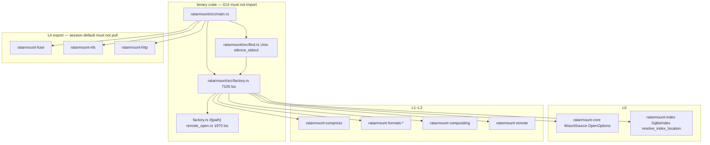
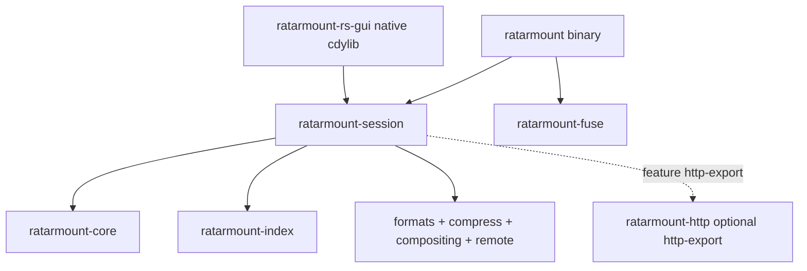
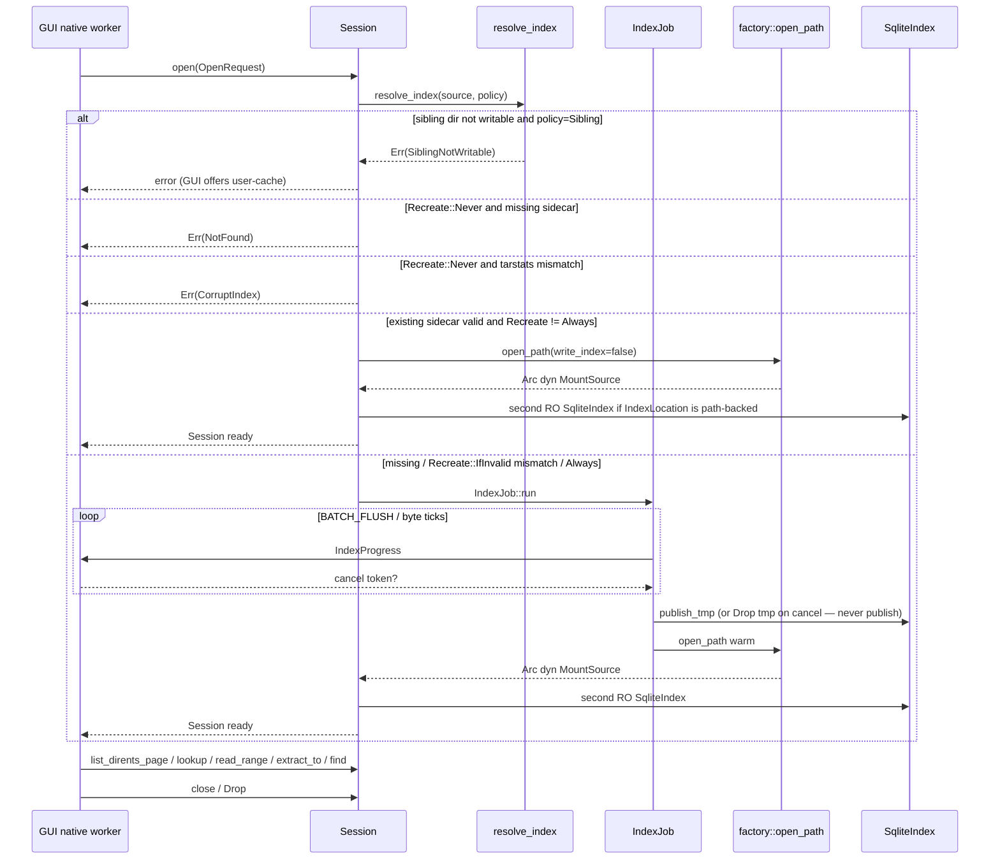
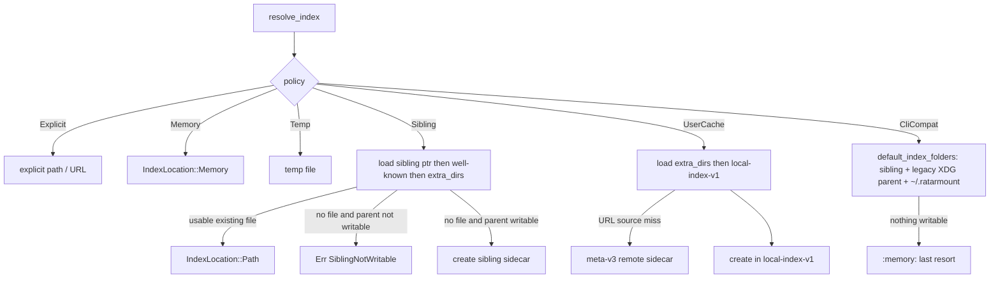

# Engine-side GUI embedder support (`ratarmount-session`)

| Field | Value |
|-------|--------|
| **Author** | Grok (design) |
| **Date** | 2026-08-29 |
| **Status** | Accepted |
| **Engine version** | ratarmount-rs **0.1.29** |
| **Consumer** | [`ratarmount-rs-gui`](https://github.com/hilather/ratarmount-rs-gui) (GPUIX desktop explorer) |
| **Canonical path** | [`docs/tasks/gui-embedder-support.md`](gui-embedder-support.md) |
| **Related** | [`docs/crates-io-policy.md`](../crates-io-policy.md), [`docs/session-api.md`](../session-api.md) (G0.1), GUI `docs/architecture/01-architecture.md`, `02-index-storage.md`, `05-napi-contract.md` |

This file is the **engine-side** work the GUI cannot fake from JS/napi. Implement G0–G7 in **ratarmount-rs**. Do **not** paste GPUI / napi / Electron / React into this repo.

Working G-list origin (2026-08-29 snapshot): `ratarmount-rs-gui/docs/engine/gui-embedder-support.md`. After this file lands, **this path wins on drift**.

---

## Overview

`ratarmount-rs-gui` will browse, search, preview, and extract archives **in-process**. It must link library crates (`ratarmount-core`, `ratarmount-index`, formats, compress, compositing, remote) through a supported **session API**. It must **not** import the `ratarmount` **binary** crate (today the only home of `factory.rs`) and must **not** require FUSE.

Today those libraries work, but they are shaped as a CLI factory (`ratarmount/src/factory.rs`, ~7100 lines) plus export adapters. Index build (`--no-mount -c`), locate (`ratarmount find`), and index path resolution (`resolve_index_location`) are CLI-only or Python-compat helpers that silently fall through to `:memory:` instead of the GUI’s sibling / user-cache policy.

This design adds a new workspace crate **`ratarmount-session`** that:

1. Becomes the **library home of factory glue** (`open_path`, `build_mount_source_ex`, nested openers, remote URL open) so the GUI never depends on the binary crate.
2. Exposes a FUSE-free **`Session`** (open / paged list / lookup / ranged read / extract / close) and **`IndexJob`** (progress + cooperative cancel that leaves a valid old sidecar).
3. Publishes **`resolve_index`** with an explicit `IndexPolicy`, including `SiblingNotWritable` and a new **`local-index-v1/`** cache that is **not** V-3 `meta-v3/`.
4. Shares locate with CLI `find` via one `SearchQuery` implementation, **keyset-paged**.

SQLite sidecar schema stays **`INDEX_VERSION` `"0.7.0"`**. No IVF, no `--readdir-order`, no fuse-on-Windows, no GPUI in this repo.

---

## Background & Motivation

### What the GUI needs that 0.1.29 does not offer as a library

| Capability | Today (0.1.29) | GUI impact |
|---|---|---|
| `MountSource` trait | yes (`ratarmount-core`) | core of the host |
| SQLite 0.7.x index | yes | listing backend |
| Factory `open_path` / `build_mount_source_ex` | **binary crate only** (`ratarmount/src/factory.rs`) | GUI **must not** import this crate |
| `--no-mount -c` | CLI only (`main.rs` builds then returns) | must become `IndexJob` |
| `ratarmount find` | CLI + control socket (`ratarmount/src/find.rs`) | must become `Session::find` |
| `--index-file` / `:memory:` / `--index-folders` | yes | GUI settings map to the same knobs **via policy**, not by reimplementing discovery |
| Sibling `.index.ptr` / `.index.{id}.sqlite` | yes (V-2b) | default “next to archive” |
| `$XDG_CACHE_HOME/ratarmount/meta-v3/` | **remote sidecar LRU only** (V-3) | reuse; do not put local-archive indexes there |
| Index build progress | `println!` / `log` | structured `IndexProgress` events |
| Cancel in-flight index | process kill | cooperative token; tmp+rename already fail-closed |
| Paged dirents | `list_dirents` dumps a whole directory `Vec` | keyset page of 50–500 |
| `MountSource::read` | returns `Vec<u8>` | session must not expose a slurp API |
| FUSE | Linux + macOS arm64 | optional “Reveal as folder” **button** (spawn CLI); not the explorer path |
| Windows | not a CLI product target | **library crates must compile** without `fuser` |

Pain points if we skip this work:

- GUI shells out to `ratarmount find` / `--no-mount` → process-hop latency, no structured progress, cancel = SIGKILL, torn sidecars if anyone ever bypasses tmp+rename.
- GUI imports the binary crate → pulls `fuser`, NFS, SMB, 9P, SFTP, `nix`, Unix sockets; Windows library path dies; crates.io policy forbids it.
- GUI reimplements index discovery → CLI and GUI drift (the exact failure `02-index-storage.md` forbids).

### What already landed (do not re-design)

- SQLite 0.7.x sidecar (`INDEX_VERSION` `"0.7.0"`). Python still opens TAR/ZIP/7z sidecars. **Do not rewrite the schema.**
- V-2a: `SqliteIndex::publish_tmp` tmp+rename; `Drop` of unpublished tmp unlinks tmp only; writers never `remove_file` dest at create (`create_writable` → `{dest}.tmp.{pid}.{seq}`).
- V-2b: `{archive}.index.ptr` + `--index-id` (sha256 bind).
- V-2c: S3/GCS/Azure/HTTP sibling pointer GET then blob (no PUT).
- V-3: `meta-v3/` is **remote sidecar download LRU only**.
- V-4: live overlay commit queue. Offline `--commit-overlay` stays off-queue. **GUI v1 is read-mostly; overlay write is out of session v1.**
- V-1: `MountSource::search_cheap` / `MemIndex::scan_glob`; CLI `find` stays SQL.
- V-5: `find --offset-order` + `list_visible_files_by_offset`; default `ls` / `list_dirents` unchanged.
- Cheap `list_dirents` on most formats.
- `--no-mount -c` and `ratarmount find` exist as **CLI only**.

---

## Goals & Non-Goals

### Goals

1. A second crate can `Session::open` a ~1 GiB compressed TAR, page 200 dirents, `read_range` 4 KiB from a 100 MiB member, and `extract_to` one member to disk **without linking `ratarmount-fuse`**.
2. Index build reports progress **≥ 4 times** on that fixture and is cancellable; cancel leaves the previous sidecar valid.
3. Sidecars written by `IndexJob` are valid for CLI `ratarmount archive mnt` and Python 0.7.x (TAR/ZIP/7z subset).
4. No session API requires the embedder to hold a member in one `Vec<u8>`.
5. One `resolve_index` implementation used by CLI and session (policy enum; see G4).
6. Session default graph has **no `fuser`** (G0.3a). Windows **compile** of that graph is G6 (cfg audit), not a W2 gate.

### Non-goals

- Shipping GPUI / React / napi / Electron in ratarmount-rs.
- A first-class Windows FUSE / WinFsp story (beyond-parity **F-5** stays separate).
- Changing the 0.7.x `files` schema, IVF, `--readdir-order`, or default `ls` order.
- Replacing `--http` with a custom GUI protocol.
- Making `:memory:` the GUI default, or writing local-archive indexes into `meta-v3/`.
- Overlay write / live commit / `--commit-overlay` inside `Session` v1.
- Preview decoding (text/image) — that is the **GUI native** crate (64 MiB cap). Engine only supplies `read_range`.
- Recursing AutoMount nested children in locate (matches today’s sidecar of `inputs[0]`).
- Publishing `ratarmount-session` to crates.io in the first slice (policy update only).

---

## Key Decisions

| # | Decision | Rationale |
|---|----------|-----------|
| **K1** | **New crate `ratarmount-session`**, not `ratarmount-core::session`. | `ratarmount-core` is L0 (`MountSource` + types; deps: `libc` + `thiserror` only). Session must pull formats + compress + compositing + remote + factory. Putting that in core destroys crate layering and crates.io L0. GUI `AGENTS.md` already names `ratarmount-session`. |
| **K2** | **Move `factory.rs` + `remote_open.rs` into `ratarmount-session`**. PR2 is a **path/feature/lockfile move only** (no signature changes). Binary crate becomes CLI-only and depends on the session crate. | The GUI is forbidden from importing the binary crate, and factory is the only `open_path` implementation. Duplicating factory is drift. A third `ratarmount-factory` crate is deferred (see Alternatives). `IndexBuildHooks` is **PR5**, not PR2. |
| **K3** | **Orchestrator still owns format-matrix glue** inside the relocated factory (`DEFAULT_FORMAT_PROBE_ORDER` stays in that file). This design **owns only the named call sites** in [Factory ownership](#factory-ownership-named-call-sites). | Matches `AGENTS.md`: factory glue is orchestrator-owned unless a task lists call sites. |
| **K4** | **`Session` is a blocking, `Send` façade** over `Arc<dyn MountSource>` **plus** an optional second **SQL-only** `SqliteIndex` from `IndexLocation` when the sidecar is path-backed 0.7.x. Open with `SqliteIndex::open_catalog_read_only` — **not** `open_read_only`. Jobs/threads live in the GUI native crate. | After `apply_compositing` the trait object is `FileVersionLayer` / `AutoMountLayer` / … — not `SqliteIndexedTar`. ZIP/7z keep `index` private. Paging/find must not downcast. WAL already allows a second RO connection after `publish_tmp`. `open_read_only` prints the Python harness line **and** loads a second `MemIndex` (up to `MEM_INDEX_MAX_FILES` = 500_000) — paging SQL does not need that. Compact-only / `:memory:` / Folder / Union / AutoMount fall back to per-directory `list_dirents`. Do not add tokio. |
| **K5** | **Dirent paging is keyset over newest-wins `files.name` (`DirCursor`). Find paging is composite `(fullpath, offsetheader)` (`FindCursor`).** Not `MountSource::list()` / `list_dirents()` dumped into a `Vec`. | Today `search_glob_like` is `ORDER BY fullpath, offsetheader` with **no** newest-wins collapse — path-only keyset skips or duplicates versions. Do **not** put rowid on `DirEnt` or on the JS boundary. Napi opaque-encodes either cursor enum. |
| **K6** | **`read_range(path, offset, max_len) -> impl Read + Send`**. No `read_all`. Extract is a streaming copy, not `read_range(0, size)`. | `MountSource::read` returns `Vec<u8>` — must not be the embedder API. Preview cap (64 MiB) is GUI native; engine just takes `max_len`. |
| **K7** | **Progress/cancel: tiny `IndexBuildHooks` on `OpenOptions` (core) + `SqliteIndex::set_build_hooks` + `IndexError::Cancelled`.** Format crates add **one line** after `create_writable` / `create_writable_for_open`; they do **not** grow a second observer trait. Check cancel at `insert_files_batch_soa` start and the TAR header loop. Never `publish_tmp` / `into_read_only` on that path. | Core stays L0 (no dep on index). TAR already flushes every `BATCH_FLUSH` (512) rows. Cancel → `Drop` unlinks tmp, dest untouched (V-2a). |
| **K8** | **`resolve_index` is new; `resolve_index_location` stays Python/CLI last-resort `:memory:`.** Session default policy is `Sibling` and returns **`SiblingNotWritable`** instead of silently using `:memory:`. CLI maps today’s flags to `IndexPolicy::CliCompat`. | GUI `02-index-storage.md` post-G4 order ≠ today’s CLI. Sharing *code* (candidates, pointer, writability probe) without breaking Python “nothing writable → memory”. |
| **K9** | **Local unwritable-sibling cache is `$XDG_CACHE_HOME/ratarmount/local-index-v1/`** (macOS `~/Library/Caches/ratarmount/local-index-v1/`, Windows `%LOCALAPPDATA%\ratarmount\local-index-v1\`). **Not** `meta-v3/`. **Not** the legacy flattened `$XDG_CACHE_HOME/ratarmount/*.index.sqlite` parent. | V-3 bucket is remote sidecar downloads (256 MiB). Mixing would evict the wrong class of blobs. |
| **K10** | **PR1/PR2 default features = same L2 set as today’s binary** (all format crates factory `use`s, including libarchive/git). **Never** fuse/nfs/smb/http/9p/sftp. Optional `http-export`, `gzip-rapidgzip`. **G5.3 (PR9, after W2)** may cfg-gate `FormatBackend` arms so default can shrink to TAR/ZIP/7z. | Factory has no format `#[cfg]`; optional deps that are off do not compile `use ratarmount_formats_ar`. Narrowing default in PR1 would make the mechanical PR2 fail. G0.3a (`cargo tree -i fuser`) still holds. Windows `cargo check` of default session still needs libarchive until G5.3 (G6.1 is best-effort). “Reveal as folder” spawns the CLI. |
| **K11** | **Passwords: `secrecy` on the session boundary; `OpenOptions.passwords: Vec<String>` unchanged in v1.** Never log secrets. | Threading `SecretString` through every format crate is out of G5.2 scope. Residual: plaintext lives in `OpenOptions` / format handles for the session lifetime (needed for per-member ZIP/7z decrypt). |
| **K12** | **Do not change 0.7.x schema. FTS5 stays additive `files_fts`.** | Python ignores unknown tables. `ensure_fts5` is opt-in (find `--fts` / `FindOpts.fts`), never a side effect of `Session::open`. |

---

## Current state (code, 0.1.29)

### Crate graph today



`ratarmount/Cargo.toml` always depends on `ratarmount-fuse`, `ratarmount-nfs`, `ratarmount-http`, `ratarmount-smb`, `ratarmount-9p`, `ratarmount-sftp`. Factory itself does **not** `use` fuse (grep clean), but the binary crate does.

`ratarmount-core` `OpenOptions` (`lib.rs` ~297–338) already has `index_file_path`, `index_in_memory`, `index_folders`, `clear_index_cache`, `write_index`, `read_only_index`, `passwords: Vec<String>`, `recursive`, `recursion_depth: Option<i32>`, plus encoding, `parallelization`, `hashes`, `ignore_zeros`, `gnu_incremental`, `gzip_seek_point_spacing`, `use_backends`, `index_minimum_file_count`. It has **no** progress/cancel, **no** index policy enum. `#[derive(Clone, Debug)]` **prints passwords** (G5.2 / G1 must skip-Debug).

### Factory open path

```text
main.rs
  -> factory::build_mount_source_ex(paths, OpenOptions, recreate, CompositingOptions)
       -> remote_open::open_remote_input | open_path
            -> resolved_index() = resolve_index_location(...)
            -> format/codec open (TAR create_index / ZIP / 7z / …)
            -> maybe_discard_index_below_minimum
       -> apply_compositing (AutoMount / FileVersionLayer / Prefix / Union)
```

`--no-mount` is **not** “return immediately after `build_mount_source_ex`.” `main.rs` calls `factory::build_mount_source_ex` ~861, then `--hashes` fill, `--publish-index`, write-overlay wrap, live-commit validation, and **then** `if args.no_mount { return; }` (~1046) **before FUSE**. Export-flag rejection (`export_incompatible_with_no_mount`) runs at that return, **after** the expensive index build. No progress callback. No cancel short of killing the process. G2 extracts only the **index-build/progress/cancel guts**; `--hashes` / `--publish-index` / `-w` stay in `main.rs` and are **not** routed through `IndexJob` in v1.

`find::locate_hits` cold-indexes via `factory::open_path` with stdout silenced (`dup2` `/dev/null` — **Unix-only**, CLI-only). Then `SqliteIndex::search_query`.

### Index location today (`ratarmount-index/src/location.rs`)

`resolve_index_location(archive, explicit, folders, recreate)`:

1. Explicit `--index-file` (`:memory:`, path, or `http(s):` / `file://` URL materialized).
2. Folder candidates from `--index-folders`, default `["", $XDG_CACHE_HOME/ratarmount, ~/.ratarmount]` (`default_index_folders`). Empty folder = `{archive}.index.sqlite`. Non-empty = flattened `{archive_path_with_slashes_as_underscores}.index.sqlite`.
3. First existing usable file; else first writable create path.
4. **Last resort: `IndexLocation::Memory`** (Python parity).

Sibling `.index.ptr` → `.index.{id}.sqlite` is applied by **callers after a local miss**, not inside `resolve_index_location` (comment at `location.rs` ~1167). Remote `meta-v3` is `MetaCache` (`meta_cache.rs`), keyed by `sha256(backend|url)`, env `RATARMOUNT_META_CACHE_BYTES` default **256 MiB**. `home_dir()` reads **`HOME` only** (Windows-broken). `tar_stats_from_metadata` uses `std::os::unix::fs::MetadataExt`.

`local-index-v1/` **does not exist**.

### Listing today

`SqliteIndex::list_dirents` (`lib.rs` ~1627): `SELECT … FROM files WHERE path = ?1 ORDER BY offsetheader`, fold into `BTreeMap<String, IndexDirent>` (newest-wins by name), return **all** values. `IndexDirent` has name/mode/size/linkname/cookie — **no mtime**. `CheapDirent` (core) is name/mode/size only.

`MountSource::list_dirents` default derives from `list_mode` with `size = 0`.

`SearchQuery` (`search.rs`): `limit` default `DEFAULT_SEARCH_LIMIT = 10_000`; **no keyset cursor**. `ORDER BY fullpath, offsetheader LIMIT n` with **no** newest-wins collapse (TAR updates emit multiple rows per full path). `files.mtime` REAL exists in `create-index-tables.sql`; current `list_dirents` SELECT omits it — additive SELECT is valid, no schema bump.

TAR `MountSource::list_dirents` filters `linkname != DUMPDIR_DELETE_LINKNAME` after the index fold (`formats-tar` ~787–797). Raw `SqliteIndex::list_dirents` still returns tombstone names.

### Index build fail-closed (already)

`SqliteIndex::create_writable`: opens `{dest}.tmp.{pid}.{seq}`, `locking_mode=EXCLUSIVE`, `journal_mode=OFF`. `publish_tmp` close-tmp → `rename` → WAL dest. `Drop` if `publish_target` still set: unlink tmp only. **G2.3 is mostly wiring a cancel flag, not a new publish protocol.**

TAR parse (`formats-tar`, `BATCH_FLUSH = 512`) calls `insert_files_batch_soa` — the natural progress tick.

### Unix-only landmines for G0.3 / G6

**No L0–L3 `Cargo.toml` depends on `fuser`.** Only `ratarmount/Cargo.toml` (unconditional `ratarmount-fuse`) and `ratarmount-fuse` (`fuser = "0.15"`) do. Factory does not `use` fuse (`fuse_style` is a fill-loop regression name). Session default graph has no FUSE **today**. Those crates still **do not compile on Windows**.

| Site | Class | Issue |
|------|--------|--------|
| `ratarmount-core::create_root_file_info` | **compile** | `libc::geteuid` / `getegid`; `S_IFDIR` from `libc` (unix-only on some targets) |
| Many format / compositing crates | **compile** | same `geteuid` (git/fat/sqlar/tar/transform/prefix/control) |
| `ratarmount-compositing/src/empty_archive.rs` | **compile** | unconditional `std::os::unix::fs::{OpenOptionsExt, PermissionsExt}` (still linked via session → compositing) |
| `ratarmount-formats-tar/src/write.rs` `write_file_on_disk` | **compile** | `OpenOptionsExt` + `O_NOFOLLOW` (always compiled with formats-tar) |
| `ratarmount-formats-libarchive` | **compile** | `OsStrExt`; `pkg-config` + `links = "archive"`. **On the PR2 default graph** (same as today’s binary). Optional only after G5.3. |
| `ratarmount-index` `tar_stats_from_metadata` | **compile** | `MetadataExt` (unix) |
| `ratarmount/src/find.rs` | **compile** | module-level `std::os::unix::io::{AsRawFd, RawFd}` + `dup2` — **must not** move wholesale into session |
| `ratarmount/src/main.rs` | CLI-only | `UnixListener` control socket — keep in binary |
| `location.rs` `home_dir` | **runtime** | `HOME` only — not a compile fail; Windows-broken |
| `meta_cache.rs` mode 0700 | already OK | `PermissionsExt` is **`#[cfg(unix)]`** (~238–243) |
| `pid_is_alive` | already OK | `/proc/{pid}` Linux; non-Linux fail-closed `true` |

There is **no** Windows job in `.github/workflows/` today (grep clean). Linux `check` + macOS-14 + nfsv4 + benches + FUSE allowlists.

Split G0.3: **(a)** `cargo tree -p ratarmount-session -i fuser` (true after PR1/PR2) **(b)** Windows compile = G6 crate-by-crate cfg audit. Do not claim default-`formats` `cargo check --target x86_64-pc-windows-gnu` until G6 lists those sites as work.

---

## Proposed Design

### Crate home (G0.2) — `ratarmount-session`

```text
ratarmount-session/                 # NEW workspace member
  Cargo.toml
  examples/session-list.rs          # G5.5
  src/lib.rs                        # re-export Session, OpenRequest, resolve_index
  src/types.rs                      # OpenRequest, DirEnt, DirPage, errors
  src/session.rs                    # Session
  src/index_job.rs                  # IndexJob
  src/extract.rs                    # extract_to streaming
  src/read.rs                       # RangeReader
  src/locate.rs                     # query_index / TSV helpers (no unix fds)
  src/resolve.rs                    # resolve_index façade
  src/factory.rs                    # MOVED from ratarmount/src/factory.rs
  src/factory/remote_open.rs        # OR keep #[path = "remote_open.rs"] next to factory.rs
  src/error.rs
  src/local_cache.rs                # G4.3–G4.4 local-index-v1
```

Keep `remote_open` as **`#[path = "remote_open.rs"] mod remote_open;` inside `factory.rs`** (today `factory.rs` ~56–57), not as a `main.rs` sibling. Moving both files is correct; inventing a new module graph is not. `src/factory/remote_open.rs` is an allowed equivalent.

`ratarmount/` (binary) after the move:

```text
ratarmount/src/main.rs              # clap, FUSE/NFS/HTTP/… export, --no-mount control flow
ratarmount/src/overlay_commit.rs
ratarmount/src/publish_index.rs
ratarmount/src/find.rs              # KEEP: argv + cfg(unix) silence_stdout; calls session locate
# factory.rs + remote_open.rs removed; `use ratarmount_session::factory`
```

Workspace `Cargo.toml`: add member + `[workspace.dependencies] ratarmount-session = { path = "ratarmount-session" }`. Keep **`default-members = ["ratarmount"]`** — session must not become the default binary. New member + `secrecy` **rewrites `Cargo.lock`** (commit it in PR1 or PR2).

Binary `Cargo.toml`: depend on `ratarmount-session`; **keep** fuse/nfs/http/… here only. **Forward** features:

```toml
gzip-rapidgzip = ["ratarmount-session/gzip-rapidgzip"]
gzip-rapidgzip-isal = ["gzip-rapidgzip", "ratarmount-session/gzip-rapidgzip-isal"]
```

Today `gzip-rapidgzip` lives on the **binary** crate (`ratarmount/Cargo.toml`) and `factory.rs` has 21 `#[cfg(feature = "gzip-rapidgzip")]` sites. After the move those cfgs compile on `ratarmount-session`. Without forwarding, rapidgzip tests/`open_path` **silently compile out**.

Session `Cargo.toml` for **PR1 skeleton + PR2 factory move** (must match today’s binary L2 set so unmodified `factory.rs` compiles). Do **not** ship the narrow TAR/ZIP/7z-only list in PR1:

```toml
[package]
name = "ratarmount-session"
description = "In-process Session API for ratarmount-rs embedders (no FUSE)"

[features]
default = ["formats"]
# Same L2 set factory.rs `use`s today (ar, asar, cab, cpio, ext4, fat, git,
# html, iso9660, libarchive, ogg, pdf, sevenzip, sqlar, squashfs, tar, warc,
# xar, zip) + compress + compositing + remote. Not optional until G5.3.
formats = [
  "dep:ratarmount-formats-tar",
  "dep:ratarmount-formats-zip",
  "dep:ratarmount-formats-sevenzip",
  "dep:ratarmount-formats-ar",
  "dep:ratarmount-formats-asar",
  "dep:ratarmount-formats-cab",
  "dep:ratarmount-formats-cpio",
  "dep:ratarmount-formats-ext4",
  "dep:ratarmount-formats-fat",
  "dep:ratarmount-formats-git",
  "dep:ratarmount-formats-html",
  "dep:ratarmount-formats-iso9660",
  "dep:ratarmount-formats-libarchive",
  "dep:ratarmount-formats-ogg",
  "dep:ratarmount-formats-pdf",
  "dep:ratarmount-formats-sqlar",
  "dep:ratarmount-formats-squashfs",
  "dep:ratarmount-formats-warc",
  "dep:ratarmount-formats-xar",
  "dep:ratarmount-compress",
  "dep:ratarmount-compositing",
  "dep:ratarmount-remote",
]
http-export = ["dep:ratarmount-http"]
gzip-rapidgzip = ["ratarmount-compress/gzip-rapidgzip"]
gzip-rapidgzip-isal = ["gzip-rapidgzip", "ratarmount-compress/gzip-rapidgzip-isal"]
# no fuse, nfs, smb, 9p, sftp features in v1

[dependencies]
ratarmount-core.workspace = true
ratarmount-index.workspace = true
secrecy = "0.8"
thiserror.workspace = true
```

**G5.3 / PR9 (after W2):** cfg-gate each `FormatBackend` arm and the corresponding `use` in the relocated factory (this design owns that named call site; orchestrator still owns the **order** of enabled backends). Only then may `default` shrink to TAR/ZIP/7z and `libarchive`/`git` become optional features. Until G5.3, shrinking default is a probe-order/behavior change, not a mechanical move.

**Why not `ratarmount-core::session`:** core would depend on the world; L0 publish story dies; Windows cfg of session would infect the trait crate.

**Why not keep factory in the binary and have session call it:** GUI cannot import the binary crate (constraint 1). A `lib.rs` on the binary crate would still pull fuse via `ratarmount/Cargo.toml`.

### Target crate graph



### Session lifecycle



Multiple sessions are allowed (GUI tabs). Engine does not keep a global handle table — that is napi (`HashMap<SessionId, Arc<Session>>`).

**How paging reaches SQLite (K4):** `factory::open_path` / `apply_compositing` return `Arc<dyn MountSource>` (typically `FileVersionLayer` wrapping the format). Only TAR exposes `index(&self) -> &SqliteIndex`; ZIP/7z keep `index` private. Session therefore stores:

```text
Session {
  source: Arc<dyn MountSource>,   // lookup / open / extract / list_dirents fallback
  catalog: Option<SqliteIndex>,   // second RO connection when IndexLocation::Path
  loc: IndexLocation,
}
```

When `catalog` is `Some` (path-backed 0.7.x, not compact-only), `list_dirents_page` / `find` / extract-all use that `SqliteIndex`. WAL allows the second RO connection after `publish_tmp`. Compact-only nested, `:memory:`, Folder, Union, and AutoMount: `catalog = None` → per-directory `MountSource::list_dirents` (v1; 2M-entry dirs without SQL are out of scope). Do **not** add a `MountSource` paging method. Do **not** downcast. Do **not** change `list_dirents`.

**Do not call `SqliteIndex::open_read_only` for `catalog`.** That API (`lib.rs` ~553–590) always:

1. `println!("Successfully loaded offset dictionary from …")` (Python harness contract). Factory `open_path` already prints once via format `into_read_only` (`lib.rs` ~1289–1296). A second open prints again and breaks `find` TSV / Session stdout.
2. Loads a compact `MemIndex` when `0 < n <= MEM_INDEX_MAX_FILES` (**500_000**). Paging SQL does not need that projection; duplicating it is the RAM cost G1.2 exists to avoid.

PR3 adds a Session-only constructor (keep `open_read_only` for CLI/Python):

```rust
impl SqliteIndex {
    /// SQL-only RO catalog. No stdout. `mem` stays `None`. Still `validate_loaded`.
    pub fn open_catalog_read_only(path: impl AsRef<Path>) -> Result<Self>;
}
```

Internally this is `open_read_only` with `{ announce: false, load_mem: false }` (same `READ_ONLY | NO_MUTEX` + query pragmas). Session tests: `Session::open` of a tiny TAR emits **one** “Successfully loaded…” line (from the format open), not two, and `catalog.mem` is absent.

### Factory ownership (named call sites)

**This design owns** (exception to “orchestrator owns `factory.rs` glue”):

| Call site | When | Change |
|-----------|------|--------|
| File location + `#[path]` remote_open | **PR2** | Move `factory.rs` + `remote_open.rs` into session. Keep `#[path = "remote_open.rs"] mod remote_open` (or `src/factory/remote_open.rs`). Keep `#[cfg(test)]` tests; they become `-p ratarmount-session --lib`. |
| Binary feature forwarding | **PR2** | `gzip-rapidgzip` / `gzip-rapidgzip-isal` on `ratarmount` forward onto `ratarmount-session`. |
| Workspace + `Cargo.lock` + `default-members` | **PR2** | New member; lockfile rewrite; `default-members` stays `["ratarmount"]`. |
| `AGENTS.md` catalog filters | **PR2** | Every row that is `cargo test -p ratarmount` / `--bin ratarmount` for factory tests (`plain_gzip`, `nested_*`, `nested_durable_*`, rapidgzip, …) becomes `-p ratarmount-session --lib` **in the same commit**. |
| `pub fn open_path` / `build_mount_source_ex` signatures | **PR2: none.** **PR5:** copy `OpenOptions.index_build` hooks; **no probe-order change.** | Formats call `index.set_build_hooks(options.index_build.clone())` after `create_writable` (one line, G2). |
| `fn resolved_index` | **PR6** | Call `resolve_index` with policy derived from `OpenOptions` + CLI `CliCompat` vs session `IndexPolicy`. Until G4, keep `resolve_index_location`. |
| `pub fn open_nested_fn` / `open_nested_reader_fn` | **PR2** | Relocate only. **Do not** change nested format matrix / tmp spool. |
| `FormatBackend` `use` / match arms | **PR9 / G5.3 only** | Optional `#[cfg]` so unused L2 can drop off the default graph. **Not PR2.** Probe **order** of enabled backends stays orchestrator-owned. |

**Orchestrator still owns** (in the **relocated** file): `DEFAULT_FORMAT_PROBE_ORDER`, `ordered_format_backends`, compression dispatch, remote scheme table, AutoMount wrap order, nested durable `nestedindexes`, any new format backend.

CLI `main.rs` named call sites:

- **PR2:** `use ratarmount_session::factory` (import path only).
- **G2 / PR5:** `--no-mount` **control flow stays in `main.rs`**. Index-build guts may call `IndexJob::run` / factory with hooks; **do not** fold `--hashes` / `--publish-index` / `-w` / overlay wrap into `IndexJob`.
- **G3:** `find` argv stays in `ratarmount/src/find.rs` (Unix `silence_stdout` wraps `factory::open_path`); session supplies `query_index` / paging / TSV only.

---

## API / Interface Changes

G0.1 lands the user-facing contract as **`docs/session-api.md`**. Types below are the freeze target. Names in this section win over the 2026-08-29 sketch where they differ (cursor enum vs `offset: u64`; `Secret`; structured errors).

### Types

```rust
use secrecy::SecretString;
use std::path::PathBuf;
use std::sync::atomic::AtomicBool;
use std::sync::Arc;

/// What to open. Paths are OS paths; URLs use the same schemes as the CLI
/// (`http(s):`, `s3://`, `gs://`, `oci://`, `docker://`, …).
pub enum SourceSpec {
    Path(PathBuf),
    Url(String),
}

/// Where the 0.7.x sidecar should live. Maps to GUI `index.policy`.
pub enum IndexPolicy {
    /// `{archive}.index.ptr` + `{archive}.index.{id}.sqlite`, else well-known
    /// `{archive}.index.sqlite`. Not writable → [`Error::SiblingNotWritable`].
    Sibling,
    /// `local-index-v1/` (local file://) or `meta-v3/` (remote URL after sibling GET miss).
    UserCache,
    /// Caller-chosen file (`OpenRequest.explicit_index`).
    Explicit,
    /// `:memory:` — tests / `RGUI_FAKE` only. GUI settings must not persist this.
    Memory,
    /// Platform temp, unlinked on `Session` drop. Confirm in UI.
    Temp,
    /// Today’s CLI/Python order including `:memory:` last resort.
    /// Not a GUI policy id.
    CliCompat,
}

pub enum Recreate {
    Never,
    IfInvalid,
    Always,
}

pub struct OpenRequest {
    pub source: SourceSpec,
    pub index: IndexPolicy,
    /// Required when `index == Explicit`.
    pub explicit_index: Option<PathBuf>,
    /// Maps to `--index-folders` extra dirs (not including the implicit sibling `""`).
    pub extra_dirs: Vec<PathBuf>,
    pub password: Option<SecretString>,
    pub recursive: bool,
    pub recursion_depth: Option<i32>,
    pub recreate: Recreate,
}

pub struct Session {
    // source: Arc<dyn MountSource>,
    // catalog: Option<SqliteIndex>, // second RO sidecar when path-backed
    // loc: IndexLocation,
}

/// Opaque keyset for **directory listing**. Napi encodes as `cursor: string`.
/// `find` rejects this type — use [`FindCursor`].
pub enum DirCursor {
    Start,
    /// Exclusive: first newest-wins name strictly after this (UTF-8).
    AfterName { name: String },
}

/// Opaque keyset for **locate**. Composite because `files` may hold multiple
/// rows per full path (`ORDER BY fullpath, offsetheader`, no newest-wins).
pub enum FindCursor {
    Start,
    /// Exclusive: `(fullpath, offsetheader)` lexicographic after this pair.
    AfterPath {
        path: String,
        offsetheader: Option<i64>,
    },
}

pub struct DirPage {
    pub path: String,
    pub entries: Vec<DirEnt>,
    pub next_cursor: Option<DirCursor>,
    /// Cheap `COUNT` when the backend is SQLite `files`; `None` for live FolderMountSource.
    pub total_hint: Option<u64>,
}

pub struct DirEnt {
    pub name: String,
    /// Archive-relative, leading `/`, no trailing `/` (`files.path` + `files.name`).
    pub path: String,
    pub is_dir: bool,
    pub size: u64,
    /// Unix seconds (truncated `FileInfo.mtime`). `None` if the cheap row has no mtime.
    pub mtime: Option<i64>,
    pub mode: u32,
    /// Catalog hint (`offsetheader` ≥ 0). Embedders must not use this to fetch bytes.
    pub archive_offset: Option<u64>,
}

pub struct ReadRequest {
    pub path: String,
    pub offset: u64,
    /// Hard cap. `0` → empty reader. There is no “read the rest of the file” sentinel.
    pub max_len: u64,
}

pub enum Overwrite {
    Skip,
    Replace,
}

pub struct ExtractRequest {
    /// Empty = every payload member (walk catalog, not `list()` fat map).
    pub members: Vec<String>,
    pub dest_dir: PathBuf,
    pub overwrite: Overwrite,
    /// Default false: reject `..`, absolute, and Windows prefixes in member paths.
    pub allow_unsafe_paths: bool,
}

pub struct ExtractProgress {
    pub files_done: u64,
    pub files_hint: Option<u64>,
    pub bytes_out: u64,
    pub current_path: Option<String>,
}

pub enum IndexPhase {
    Scan,
    Write,
    Fts,
    Finalize,
}

pub struct IndexProgress {
    pub phase: IndexPhase,
    pub bytes_scanned: u64,
    pub bytes_total_hint: Option<u64>,
    pub entries: u64,
    pub message: Option<String>,
}

pub struct FindOpts {
    pub fts: bool,
    pub offset_order: bool,
    pub include_hashes: bool,
    /// Algorithms to compute into `user.hash.*` before searching (CLI `--hashes`).
    /// Empty = do not fill. After a successful fill, hits include hashes when
    /// `include_hashes` is true (CLI: `find_hashes || !hashes.is_empty()`).
    pub fill_hashes: Vec<String>,
    pub limit: u32,
    pub cursor: FindCursor,
}

pub struct FindPage {
    pub pattern: String,
    pub fts: bool,
    pub entries: Vec<DirEnt>,
    pub next_cursor: Option<FindCursor>,
    pub total_hint: Option<u64>,
}
```

**Cursor vs the G0 sketch:** the sketch used `offset: u64` / `next_offset`. That is **too easy to leak as a SQLite rowid into JS**. Library API uses `DirCursor` / `FindCursor`. Napi opaque-encodes them. Do not add `rowid` to `DirEnt`. `find` **rejects** `DirCursor::AfterName` (separate types so it cannot be passed).

**`DirEnt.mtime`:** `IndexDirent` today has no mtime. `list_dirents_page` SELECTs `"mtime"` additively. Do **not** change FUSE `CheapDirent` in this work (would churn every format crate). Lookup uses `MountSource::lookup` → `FileInfo.mtime`.

### `Session` methods

```rust
impl Session {
    /// Blocking. Embedders that need a job_id run this on a worker thread.
    /// May build an index when recreate requires it (see Recreate table).
    /// For progress/cancel, use [`open_with_job`]. There is no `IndexJob::start`
    /// / `Session::from_open` (those names were napi-shaped; napi owns job_id).
    pub fn open(req: OpenRequest) -> Result<Self, Error>;

    /// Same as [`open`] with progress/cancel hooks copied onto `OpenOptions.index_build`.
    pub fn open_with_job(req: OpenRequest, hooks: &IndexBuildHooks) -> Result<Self, Error>;

    pub fn list_dirents_page(
        &self,
        path: &str,
        cursor: DirCursor,
        limit: u32,
    ) -> Result<DirPage, Error>;

    pub fn lookup(&self, path: &str) -> Result<Option<DirEnt>, Error>;

    /// Seek + bounded reader. Never returns the member as `Vec<u8>`.
    pub fn read_range(&self, req: ReadRequest) -> Result<RangeReader, Error>;

    /// Stream members to `dest_dir`. `progress` may be called between members
    /// and every 8 MiB copied. `cancel` checked at those points.
    pub fn extract_to(
        &self,
        req: ExtractRequest,
        progress: Option<&dyn Fn(ExtractProgress)>,
        cancel: Option<&AtomicBool>,
    ) -> Result<(), Error>;

    pub fn find(&self, pattern: &str, opts: FindOpts) -> Result<FindPage, Error>;

    /// Optional G5.4 (`http-export` feature).
    #[cfg(feature = "http-export")]
    pub fn start_http(&self, bind: SocketAddr) -> Result<HttpHandle, Error>;
}

impl Drop for Session {
    fn drop(&mut self) {
        // If we hold the unique Arc, call MountSource::close(&mut *src).
        // Format Drop is sufficient when the Arc is shared (GUI handle table).
        if let Some(src) = Arc::get_mut(&mut self.source) {
            src.close();
        }
        if let Some(idx) = self.catalog.take() {
            drop(idx); // RO connection; no publish_tmp
        }
        // IndexPolicy::Temp: unlink the temp sqlite here.
    }
}
```

`Session` is `Send + Sync`. `RangeReader` is `Read + Send`; not `Sync`. Do not impl `Clone` on `Session` — embedders use `Arc<Session>`. `close(self)` is unnecessary; `Drop` is the API. Napi `close(sessionId)` drops the handle-table Arc.

### `OpenRequest` → `OpenOptions` mapping

Session starts from `OpenOptions::default()` (encoding `utf-8`, `write_index: true`, `index_minimum_file_count: 0`, `parallelization` default 1, empty hashes/backends, `gnu_incremental: None`, `gzip_seek_point_spacing: 16 MiB`, `ignore_zeros: false`). v1 **omits** hashes, `use_backends`, `index_minimum_file_count`, `gnu_incremental`, encoding, parallelization unless we add fields later — they stay Default.

| `OpenRequest` / policy | `OpenOptions` field |
|------------------------|---------------------|
| `password: Some(s)` | `passwords = vec![s.expose().to_string()]` (K11 residual; lives for the session) |
| `password: None` | `passwords` empty |
| `recursive` / `recursion_depth` | same names (`Option<i32>`; GUI omit → engine default when recursive, else `None`) |
| `IndexPolicy::Memory` | `index_in_memory = true`, `index_file_path = None` |
| `IndexPolicy::Explicit` | `index_file_path = explicit_index`, `index_in_memory = false` |
| `IndexPolicy::Sibling` / `UserCache` / `Temp` / `CliCompat` | `index_file_path` = path from `resolve_index`; `index_in_memory = false` |
| `extra_dirs` | `index_folders` = extra dirs (Sibling/UserCache do **not** inject `CliCompat` defaults) |
| `Recreate::Always` | `clear_index_cache = true`, `write_index = true`, `read_only_index = false` |
| `Recreate::IfInvalid` | `clear_index_cache = false`, `write_index = true`, `read_only_index = false`; factory rebuilds only on tarstats mismatch / missing sidecar |
| `Recreate::Never` | `write_index = false`, `read_only_index = true`, `clear_index_cache = false`; missing → `NotFound`; mismatch → `CorruptIndex`; never `:memory:` |
| `IndexPolicy::CliCompat` (CLI only) | `index_folders` empty → `default_index_folders()` inside `resolve_index_location` |

`CompositingOptions` for `Session::open`: `recursive` from request, `lazy: false`, `file_versions: true` (CLI default), no prefix/transform, `disable_union_mount: false`. Single `SourceSpec` (GUI v1 = one archive).

### Errors (engine → GUI code mapping)

```rust
#[derive(Debug, thiserror::Error)]
pub enum Error {
    #[error("not found")]
    NotFound,
    #[error("sibling directory is not writable: {0}")]
    SiblingNotWritable(PathBuf),
    #[error("not writable: {0}")]
    NotWritable(PathBuf),
    #[error("password rejected or required")]
    BadPassword,
    #[error("unsupported format")]
    UnsupportedFormat(String),
    #[error("corrupt or mismatched index")]
    CorruptIndex(String),
    #[error("cancelled")]
    Cancelled,
    #[error("member path escapes destination")]
    PathEscape(String),
    #[error("{0}")]
    Internal(String),
}
```

Map to GUI napi codes (`05-napi-contract.md`). Engine v1 **does not produce `Busy`** — two `IndexJob`s on the same dest use distinct `{pid}.{seq}` tmps and last `publish_tmp` wins. Napi may synthesize `Busy` when its handle table already has an in-flight job for that window (`retryable: true`). Engine retryable: `NotWritable`, `SiblingNotWritable`.

`Recreate::IfInvalid` + tarstats mismatch is **not** an error on `open` — it triggers `IndexJob::run`. `Recreate::Never` + missing sidecar → **`NotFound`**. `Recreate::Never` + tarstats mismatch → **`CorruptIndex`**. Never build, never `:memory:`.

`MountSource::open` `io::ErrorKind::PermissionDenied` → **`BadPassword` only** when `OpenOptions.passwords` is non-empty **or** the format already reported encryption (existing 7z/ZIP encrypted-open paths). Other PermissionDenied (chmod 000 archive, overlay EACCES) → `NotWritable` if a path is known, else `Internal` with the io kind in the string. Do not flatten to EIO. Napi `BadPassword` is `retryable: false` — do not auto-retry without a new password.

### `IndexJob`

Engine stays **blocking** (K4). Napi owns threads / `job_id`. Delete `IndexJob::start` / `Session::from_open`.

```rust
// ratarmount-core — tiny, no dep on index. OpenOptions gains `index_build: IndexBuildHooks`
// (Default empty). Custom Debug already required for passwords (G5.2).
#[derive(Clone, Default)]
pub struct IndexBuildHooks {
    pub on_progress: Option<Arc<dyn Fn(IndexBuildTick) + Send + Sync>>,
    pub cancel: Option<Arc<AtomicBool>>,
}

#[derive(Clone, Copy, Debug)]
pub struct IndexBuildTick {
    /// 0 = Scan, 1 = Write, 2 = Fts, 3 = Finalize (session maps to IndexPhase).
    pub phase: u8,
    pub bytes_scanned: u64,
    pub bytes_total_hint: Option<u64>,
    pub entries: u64,
}

// ratarmount-index
impl SqliteIndex {
    pub fn set_build_hooks(&self, hooks: IndexBuildHooks);
}
// IndexError gains Cancelled.

// ratarmount-session — blocking only
pub struct IndexJob;

impl IndexJob {
    /// Cold build (`Recreate::Always` semantics). On success the sidecar is
    /// published (tmp+rename). Caller then `Session::open` warm, or
    /// `Session::open_with_job` does run+open internally.
    pub fn run(req: OpenRequest, hooks: IndexBuildHooks) -> Result<IndexLocation, Error>;
}
```

**Injection (G2, not a second observer trait):** factory copies `hooks` onto `OpenOptions.index_build` and does **not** change probe order. Each format, immediately after `SqliteIndex::create_writable` / `create_writable_for_open`:

```rust
index.set_build_hooks(options.index_build.clone());
```

That one line is in-scope for G2 (TAR first; ZIP/7z same pattern). `insert_files_batch_soa` checks `cancel` at the **start** of the function; TAR `parse_tar_from` header loop checks cancel and may emit a Write tick every 8 MiB of `pos`. Formats must **not** call `into_read_only` / `publish_tmp` when the parse returns `Cancelled` — `Drop` unlinks `{dest}.tmp.{pid}.{seq}`, dest untouched.

CLI `--no-mount -c`: `main.rs` still runs hashes / publish-index / overlay **after** the build. G2 may pass hooks into `build_mount_source_ex` via `OpenOptions.index_build`; it must **not** replace the whole `--no-mount` tail with `IndexJob::run` alone.

Progress **minimum**: one `Scan` at start, one per `insert_files_batch_soa` (512 rows) and/or every 8 MiB of archive bytes, one `Finalize` before `publish_tmp`. **G2.5 must not use the G1.7 1k-entry TAR as the sole progress proof** (1000/512 ≈ 1 write tick). Use ≥ **2048 members** **or** assert observer call count on a stub `SqliteIndex` with injected hooks (start, N batch ticks, finalize).

`Recreate::IfInvalid` uses existing `SqliteIndex::check_tarstats_matches_archive` (size / whole-second mtime / edge hashes when present). Remote: `check_tarstats_matches_remote`. Missing `tarstats` key → treat as valid (legacy Python) unless `Recreate::Always`.

### `read_range` / extract (no slurp)

```rust
pub struct RangeReader {
    inner: Box<dyn ratarmount_core::ArchiveRead>,
    remaining: u64,
}

impl std::io::Read for RangeReader {
    fn read(&mut self, buf: &mut [u8]) -> std::io::Result<usize> {
        if self.remaining == 0 {
            return Ok(0);
        }
        let cap = buf.len().min(self.remaining as usize);
        let n = self.inner.read(&mut buf[..cap])?;
        self.remaining -= n as u64;
        Ok(n)
    }
}
```

Fill loop **must** treat short `Read::read` as “try again”, not EOF — same bug class as FUSE/NFS/HTTP (`read_exact_or_short` in `ratarmount-core`). `RangeReader::read` may return short; **extract** uses a 64 KiB buffer and loops until `Ok(0)` or `remaining`.

Extract algorithm:

1. Resolve member list:
   - Explicit `members` → `WHERE` reconstructed fullpath `IN (…)` (or one lookup each); skip generated + dumpdir + directories unless the path itself is a dir (then `create_dir_all` only).
   - **Extract-all** (`members` empty) + `catalog` present: **keyset SQL walk** over payload rows, page size **1024**: newest-wins per `fullpath` (`ROW_NUMBER` / `COALESCE(offsetheader,-1) DESC`), exclusive `fullpath > ?`, skip `isgenerated`, dumpdir tombstones, and directories (`mode & S_IFMT != S_IFDIR` payload files only). **Do not** call `SqliteIndex::list_visible_files_by_offset` (that returns a `Vec` of the entire payload set — same fat-dump class as A4).
   - No `catalog`: walk per-directory `list_dirents` pages (v1 residual; not 2M-flat).
2. For each member: `lookup` → reject escape (`normpath`, then `dest_dir.join` canonicalized prefix check) → `open` → copy loop → `overwrite` skip/replace (never `ask` — UI-only).
3. Directories: `create_dir_all`. Symlinks: `symlink` when the platform supports it; otherwise skip with a progress message (Windows residual, G6).

`extractPlan` (conflict sample) is **GUI native**, not engine v1 — engine can later add `Session::extract_plan` if we want one implementation; not required for G1.5.

### Find (G3)

Extend `SearchQuery` (do **not** fork a second SQL walker):

```rust
pub struct SearchQuery<'a> {
    pub pattern: &'a str,
    pub fts: bool,
    pub include_hashes: bool,
    pub limit: usize,
    pub offset_order: bool,
    /// Exclusive composite keyset. `None` = first page.
    pub after: Option<FindAfter<'a>>,
}

pub struct FindAfter<'a> {
    pub fullpath: &'a str,
    pub offsetheader: Option<i64>,
}
```

SQL membership (same as today, plus keyset):

```sql
AND (
  ?after IS NULL
  OR fullpath > ?fp
  OR (fullpath = ?fp AND COALESCE(offsetheader, -1) > COALESCE(?oh, -1))
)
ORDER BY fullpath, "offsetheader"
LIMIT ?n
```

`ORDER BY fullpath, offsetheader` stays the membership order (V-5: `--offset-order` re-sorts **that page**, does not change membership). Keyset applies **before** the offset re-sort of the page. GUI search box v1 uses path order. Do not put rowid on `DirEnt`.

CLI `ratarmount find` keeps printing TSV of the **first page** with `limit = DEFAULT_SEARCH_LIMIT` (10_000). **Split `find.rs` before any move:** session `src/locate.rs` gets `query_index` / `SearchQuery` paging / TSV helpers (already mostly in `ratarmount-index` + compositing `live_search_tsv`). Binary **keeps** `ratarmount/src/find.rs` with argv + `cfg(unix) silence_stdout` wrapping `factory::open_path` for cold index. **Do not `use std::os::unix` in the session crate.**

`Session::find` prefers sidecar SQL. If `search_cheap` is `Some` (Folder/Union/OCI live), page that `Vec` **only when it is already the full answer and small**; Folder live glob can stream `read_dir`. Do not merge sidecar + `search_cheap` (V-1 contract: `Some` is the full answer).

FTS: `ensure_fts5` only when `FindOpts.fts` or `fts:` prefix. `IndexPhase::Fts` is for an explicit “build FTS” later; normal `IndexJob` does **not** create `files_fts`.

### Paged dirents (G1.2) — SQL sketch

Newest-wins by name (same rule as `list_dirents`: later/higher `offsetheader` wins; NULL treated as `-1` sentinel), dumpdir filtered, `query_normpath` on the directory argument. SQLite window (bundled sqlite has window functions):

```sql
-- ?1 = query_normpath(path) trimmed trailing slash
-- ?2 = AfterName ('' on first page)
-- dumpdir sentinel = "\0GNU.dumpdir.delete"
WITH newest AS (
  SELECT name, size, mode, mtime, offsetheader, linkname,
         ROW_NUMBER() OVER (
           PARTITION BY name
           ORDER BY COALESCE(offsetheader, -1) DESC, name
         ) AS rn
  FROM "files"
  WHERE "path" = ?1
    AND "name" != ''
)
SELECT name, size, mode, mtime, offsetheader, linkname
FROM newest
WHERE rn = 1
  AND COALESCE(linkname, '') != ?dumpdir
  AND name > ?2
ORDER BY name
LIMIT ?3;
```

Regression: GNU incremental dumpdir tombstone is **absent** from page 1 (same as TAR `MountSource::list_dirents`). FUSE `SqliteIndex::list_dirents` signature unchanged (still returns tombstones; TAR filters).

`total_hint`: `SELECT COUNT(*) FROM newest WHERE rn = 1` (same CTE) — optional, skip if it exceeds a few ms; GUI accepts `null`.

MemIndex path (`mem.list_dirents`): the interned set is already newest-wins; page by scanning names `> cursor` up to `limit` **without** building a fat `FileInfo` map. Do not dump all names into a `Vec` then `slice` for catalogs above `MEM_INDEX_MAX_FILES` (those are SQL-backed anyway).

Fallback when there is no SQLite (live `FolderMountSource`): `read_dir` + sort names + keyset. Cap `limit` at engine `MAX_DIR_PAGE = 10_000`. GUI native clamps to 500.

Default `limit` in session if 0 is passed: **200** (napi default).

**Do not** change `SqliteIndex::list_dirents` signature (FUSE/NFS).

---

## Data Model Changes

**None to 0.7.x `files`.** No migration. No `INDEX_VERSION` bump.

Additive only:

| Store | Change |
|-------|--------|
| `files_fts` | Already additive; still not created on open/index-job. |
| `{archive}.index.ptr` | Unchanged V-2b. |
| **`local-index-v1/`** | New directory of `{sha256}.sqlite` + `{sha256}.json` sidecar (inputs for UI “index for /data/foo.tar”). |
| `meta-v3/` | Unchanged remote LRU. |

### `local-index-v1` layout (G4.3–G4.4)

Platform roots (**do not migrate `meta-v3`**):

| OS | `local-index-v1` | `meta-v3` (unchanged) |
|----|------------------|------------------------|
| Linux | `${XDG_CACHE_HOME:-$HOME/.cache}/ratarmount/local-index-v1/` | existing `xdg_cache_home()/ratarmount/meta-v3/` (`location.rs` ~535–541) |
| macOS | `~/Library/Caches/ratarmount/local-index-v1/` unless `XDG_CACHE_HOME` or `RATARMOUNT_LOCAL_INDEX_DIR` is set | **keep** `xdg_cache_home()` (typically `$HOME/.cache`); do **not** move existing LRU to Library/Caches |
| Windows | `%LOCALAPPDATA%\ratarmount\local-index-v1\` | `%LOCALAPPDATA%\ratarmount\meta-v3\` (G6; today’s Unix helper is `$HOME/.cache`) |

```
<local-index-v1-root>/
  <hex>.sqlite
  <hex>.json
```

Key (UTF-8, NUL-separated), then SHA-256 hex:

```text
canonical_path + '\0' + size + '\0' + mtime_ns + '\0' + file_id
```

- `canonical_path`: `fs::canonicalize` when possible, else the requested path.
- `size`: `u64` decimal.
- `mtime_ns`: Unix `st_mtime * 1e9 + st_mtime_nsec` when available; Windows `FILETIME` converted to ns since Unix epoch.
- `file_id`: Unix inode (`MetadataExt::ino`); Windows volume serial + file index; `0` if unknown.

JSON sidecar (not SQLite schema):

```json
{
  "schema": "ratarmount.local-index-v1",
  "path": "/data/foo.tar",
  "size": 1234,
  "mtime_ns": 0,
  "file_id": "0",
  "last_open_unix": 1730000000
}
```

Env:

| Env | Default | Role |
|-----|---------|------|
| `RATARMOUNT_LOCAL_INDEX_DIR` | platform path above | Override directory |
| `RATARMOUNT_LOCAL_INDEX_CACHE_BYTES` | **2 GiB** (`2147483648`) | LRU cap by sum of `.sqlite` sizes |
| `RATARMOUNT_META_CACHE_BYTES` | **256 MiB** | Existing V-3; do not reuse for local |

Eviction (G4.4): on store, if sum > cap, delete oldest `last_open_unix` (from JSON; fallback file mtime) `.sqlite`+`.json` pairs until under cap. Never delete sibling indexes. GUI “Clear index cache” wipes this directory only.

Mode: `0700` on Unix (`PermissionsExt`). Windows: default ACL of `%LOCALAPPDATA%`.

`Temp` policy: `std::env::temp_dir()/ratarmount-session-<pid>/index-<seq>.sqlite`, `0700`, unlink on `Session` drop. Sweep stale on open (pid dead). **Not** the fallback when sibling fails.

### `resolve_index` order (G4.1) — post-G4 target



**No auto-fallback:** `Sibling` + no usable sibling file + parent `test_writable_dir` fail → **error only**. GUI shows “Save index in user cache instead”; a **new** `resolve_index` call with `IndexPolicy::UserCache` is a separate request after the user confirms. Do not create `:memory:` and do not write `local-index-v1` on that path.

Documented order (session `Sibling` / GUI):

1. Explicit path if policy is `Explicit` (and GUI “this file”).
2. Sibling `{archive}.index.ptr` → `{archive}.index.{id}.sqlite`.
3. Sibling well-known `{archive}.index.sqlite`.
4. `extra_dirs` / `--index-folders` (non-empty entries).
5. `local-index-v1` **only if policy is `UserCache`** (GUI retried after `SiblingNotWritable` by changing policy).
6. Remote `meta-v3` for URL sources (existing `MetaCache`; do not fork).
7. Build new at the location implied by policy — **not** `:memory:` unless policy is `Memory`.

`CliCompat` inserts today’s default folders (empty sibling + legacy XDG parent + `~/.ratarmount`) and keeps `:memory:` last resort so CLI/Python tests stay green.

G4.2: `test_writable_dir` already exists (`location.rs`). If policy is `Sibling` and sibling parent fails that probe (and no usable existing sibling file), return `Error::SiblingNotWritable(parent)` **without** creating `:memory:` and **without** auto-falling into `local-index-v1`. GUI maps that to “Save index in user cache instead”.

Until G4 lands, `Session::open` may call `resolve_index_location` **only for tests** behind a temporary `IndexPolicy::CliCompat` default in the first G1 PR — **must not** ship G1 to GUI W2 with `:memory:` fallback on unwritable sibling. G4.1 is on the W2 critical path (source doc: fourth slice).

---

## Windows library path (G0.3 / G6)

Split:

| ID | What | When |
|----|------|------|
| **G0.3a** | `cargo tree -p ratarmount-session -i fuser` fails (no fuser in default graph). True as soon as the crate exists. | PR1/PR2 |
| **G0.3b / G6** | **Windows compile** of default session features. Real cfg audit — not a surprise after “check the windows target.” | PR11, after PR2 |

Do **not** claim `cargo check --target x86_64-pc-windows-gnu -p ratarmount-session` of default `formats` until G6 lands the list below. G0.3 is not WinFsp.

G6 crate-by-crate (compile unless noted):

1. `ratarmount-core` uid/gid helpers: `#[cfg(unix)] geteuid/getegid`, `#[cfg(windows)] 0`. Portable `S_IF*` wrappers if `libc` constants are unix-only. Use them everywhere `create_root_file_info` and format crates currently call libc.
2. `ratarmount-compositing/src/empty_archive.rs`: stub `OpenOptionsExt` / `PermissionsExt` on Windows (overlay create; still compiled into compositing).
3. `ratarmount-formats-tar/src/write.rs` `O_NOFOLLOW`: Windows stub (no follow-symlink flag).
4. `tar_stats_from_metadata`: `len()` portable; mtime via `SystemTime` on Windows; keep `MetadataExt` on Unix for Python `st_mtime`.
5. `home_dir` (runtime): `HOME`, else `USERPROFILE`, else `HOMEDRIVE+HOMEPATH`.
6. Cache dirs: `local-index-v1` platform helper (K9 / G4.3). **`meta-v3` stays `xdg_cache_home()`** — do not migrate macOS remounts off `$HOME/.cache`.
7. No Unix sockets in session/index. Control UDS stays in `main.rs`.
8. **Split `find.rs` before moving locate** (G3.3 / G6.2): Unix `silence_stdout` stays in the binary; session `locate.rs` has no `std::os::unix`.
9. File locking (G6.3): SQLite `locking_mode=EXCLUSIVE` on the tmp file. NTFS supports SQLite’s lock. Do **not** add `fs2` unless we observe two `publish_tmp` races corrupting dest.
10. `pid_is_alive` already fail-closed `true` on non-Linux.
11. **Until G5.3**, default session still links libarchive/git (same as the binary). Windows `cargo check` of default features **needs** `libarchive` (and may fail without it). G6.1 stays **best-effort**; document skip when pkg-config `archive` is missing. After G5.3, Windows can use a TAR/ZIP/7z default without FFI.

CI (G6.1): best-effort `windows-lib` on `windows-2022`: `cargo check -p ratarmount-session --all-targets` (default = all L2 until G5.3). Not a merge gate in the first slice. Do not let this job skip Linux `fmt + clippy + test`.

---

## Feature flags & HTTP (G5)

| Feature | Default | Pulls |
|---------|---------|--------|
| `formats` | yes | **PR1–PR8:** same L2 set as today’s `factory.rs` (all format crates, including libarchive/git) + compress + compositing + remote |
| `http-export` | no | `ratarmount-http` (`spawn_http_thread` / `ExportStop`) |
| `gzip-rapidgzip` | no | forwarded from binary onto session (PR2) |
| G5.3 (PR9) | after W2 | cfg-gate `FormatBackend`; then default *may* shrink to TAR/ZIP/7z; `libarchive`/`git` optional |

Session **must not** depend on `ratarmount-fuse`, `ratarmount-nfs`, `ratarmount-smb`, `ratarmount-9p`, `ratarmount-sftp`.

G5.4: `Session::start_http` wraps `ratarmount_http::spawn_http_thread` with `HttpOptions { index_sidecar: session.index_path(), .. }`. Stop via existing `ExportStop`. GUI “Share via HTTP” uses this when compiled; else spawns CLI. **Deferred after G1/G2/G4.**

G5.5: `examples/session-list.rs` — open a TAR, print first page of `/`, exit. No FUSE.

G5.6: `docs/crates-io-policy.md` — add **L3.5 — embedder session** (`ratarmount-session`) as a first-class embedder of L0–L4. Still “publish only after docs + semver”; dual-run does not require crates.io.

---

## Compatibility (G7)

| Gate | How |
|------|-----|
| G7.1 GUI/`IndexJob` sidecar mounts with CLI | `cargo test -p ratarmount --bin ratarmount session_index_cli_mount` (or session crate test that writes sidecar + `Command::new(ratarmount)` if binary in PATH; prefer in-process `factory::open_path` as CLI-equivalent plus `SqliteIndex::validate_loaded`) |
| G7.2 CLI sidecar opens with `Session::open` | Build with existing TAR fixture via `SqliteIndexedTar::create_index`, then `Session::open` `Recreate::Never` |
| G7.3 Python 0.7.x | Existing `./test-harness/run-index-interop.sh` (TAR/ZIP/7z). Add a row that the sidecar came from `IndexJob` if Python is present; skip with `eprintln!("skip: …")` plus a pure unit test that schema still matches `create-index-tables.sql` / `INDEX_VERSION` |

Do not add Python as a hard CI dep.

---

## Alternatives Considered

### A1. `ratarmount-core::session` instead of a new crate

**Rejected.** Core’s job is the `MountSource` trait. Session needs factory + every format. L0 would become the world. Windows/FUSE cfg would leak into the trait crate. GUI already standardized on the crate name `ratarmount-session`.

### A2. New `ratarmount-factory` plus thin `ratarmount-session`

**Deferred, not rejected.** Cleaner layering (CLI depends on factory, GUI depends on session→factory). Costs a second workspace crate, two Cargo.toml feature matrices, and a larger first PR. Revisit if `ratarmount-session` public API cannot hide `factory` (`pub use` noise). v1: factory is a **module** of session, `#[doc(hidden)]` for the GUI-facing crate docs, `pub` for the binary.

### A3. Keep factory in the binary; add `src/lib.rs` to `ratarmount`

**Rejected.** Constraint 1 + crates.io policy: do not publish the FUSE binary as a library. `ratarmount/Cargo.toml` unconditionally depends on fuse/nfs/…. A lib target would not compile on Windows and would pull fuser into the GUI.

### A4. Page by dumping `list_dirents` and slicing

**Rejected.** Constraint 4. A directory with 2M names is a real backup-TAR case. Keyset SQL is the point of G1.2.

### A5. Auto-fallback to `local-index-v1` when sibling is not writable

**Rejected for default `Sibling` policy.** GUI wants an explicit “use user cache?” dialog and per-volume remember (`02-index-storage.md`). Silent fallback hides disk-full / permission issues and would write caches the user did not opt into. `CliCompat` may still fall through to legacy XDG / `:memory:`.

### A6. Progress via `log` crate tracing instead of a callback

**Rejected as the GUI API.** Logs are not structured enough for a progress bar (need `bytes_scanned` / `entries` / phase). Keep `log::debug` as a side channel.

### A7. Async `Session` (tokio)

**Rejected.** `MountSource` is sync; FUSE/NFS are sync callbacks; adding a runtime to the library fights every export adapter. GUI already has a worker pool.

---

## Security & Privacy Considerations

| Threat | Mitigation |
|--------|------------|
| Path escape on extract (`../`, absolute, Windows `C:\`) | `normpath` + destination prefix check; `allow_unsafe_paths` default false; `Error::PathEscape` |
| Password leak in logs / `config.toml` | Session API takes `SecretString`; factory nested logs already print **count** not bytes; never log member names at info in session (GUI also forbids world-readable member-name logs) |
| Index cache readable by other users | `0700` on Unix cache dirs; do not store member names in `local-index-v1` JSON (path of **archive** only) |
| `/tmp` world-readable index | Temp is explicit policy; default sibling or user-cache |
| Cancel mid-write tears dest sidecar | Already fail-closed (V-2a tmp+rename + Drop) |
| Encrypted archive wrong-password accepted | Existing format tests; `PermissionDenied` → `BadPassword` **only** if passwords were supplied or the format reported encryption; else `NotWritable` / `Internal` |
| HTTP export binds beyond localhost | Default `127.0.0.1:20491` (existing); session HTTP passes through `HttpOptions.bind` |
| DoS via huge `limit` / `max_len` | Engine `MAX_DIR_PAGE`; `max_len` required; extract copies in 64 KiB chunks |
| TOCTOU on extract dest | Acceptable v1; skip/replace is dest-stat then open |

Passwords remain in `OpenOptions.passwords: Vec<String>` for the mount lifetime (ZIP/7z member decrypt). Treat as residual of K11, not a secret-store.

---

## Observability

| Signal | Mechanism |
|--------|-----------|
| Index progress | `IndexProgress` callback (GUI event `indexProgress`) |
| Extract progress | `ExtractProgress` callback |
| Warm vs cold | `open_read_only` / format `into_read_only` keep `println!("Successfully loaded offset dictionary from …")` (Python harness). Session `catalog` uses `open_catalog_read_only` so it does **not** print a second line. Binary `--no-mount` / CLI mount still see the harness line once. |
| Resolve | `log::debug` redacted path (existing `redact_identity_for_log` for URLs) |
| Metrics | None in-process in v1. Optional later: counters for cache hit/miss, index build seconds |

No new alerting. Failures are returned errors.

---

## Rollout Plan

No feature flag in the binary for “session exists” — it is a new crate. CLI behavior must stay Python-compatible (`CliCompat`).

**GUI W2 is unblocked only after PR1–PR6** (extract, capped `read_range`, IndexJob, `SiblingNotWritable`). Do not ship a Session to W2 that cannot extract or that falls back to `:memory:` on unwritable sibling.

1. **PR1** G0.1+G0.2 — crate skeleton + `docs/session-api.md`.
2. **PR2** factory path move + feature forwarding + `Cargo.lock` + AGENTS.md filters. **Zero signature changes.**
3. **PR3** G1.1+G1.2+G1.3+G1.6 — open, keyset list, lookup, Drop/`close`. Custom `OpenOptions` Debug (passwords redacted) may ride here.
4. **PR4** G1.4+G1.5+G1.7 remainder — `read_range` + `extract_to` (W2 acceptance: extract one member; no member `Vec<u8>`).
5. **PR5** G2 IndexJob progress/cancel (`IndexBuildHooks`, `IndexError::Cancelled`). `--no-mount` control flow stays in `main.rs`.
6. **PR6** G4.1+G4.2 `resolve_index` + `SiblingNotWritable`. **Then W2 is unblocked.**
7. **PR7+** `local-index-v1`, find, ergonomics. HTTP / Windows CI / Python IndexJob harness after W2.

Rollback: revert the PR. Factory move rollback is the painful one — keep PR2 mechanical (path + features + catalog paths) so revert is clean.

User-visible flags: none required for G1. G4 documents `RATARMOUNT_LOCAL_INDEX_DIR` / `RATARMOUNT_LOCAL_INDEX_CACHE_BYTES` in README index-discovery.

---

## Risks

| Risk | Sev | Mitigation |
|------|-----|------------|
| Factory move (~9k loc + tests) fails CI (fmt order, `crate::` paths, binary tests) | **High** | Dedicated PR; `cargo fmt --all`; keep module paths `factory::` via `pub mod factory`; run `cargo test --workspace` |
| `resolved_index` behavior changes accidentally during the move | **High** | No logic change in PR2; golden tests on `resolve_index_location` already in `location.rs` |
| Progress fires < 4 times on the G1.7 1k-entry TAR | **Med** | G1.7 is **paging only**. G2.5 uses ≥2048 members or a stub `SqliteIndex` observer (start, N batch ticks, finalize) — not the 1k TAR |
| Window functions unavailable | **Low** | Bundled sqlite in rusqlite 0.32 is 3.4x; add a unit test that the page SQL prepares |
| `Session` open of Union/AutoMount has no single sidecar for SQL paging | **Med** | K4: second RO `SqliteIndex` when path-backed; else per-directory `list_dirents`. 2M-entry dirs without SQL are out of v1 |
| Orchestrator/factory conflict with parallel format work | **Med** | Named call sites only; nested matrix PRs go to the relocated file |
| Windows `geteuid` blocks G0.3 before session exists | **High** | Core helper first (tiny PR) if G6 is gated |
| GUI W2 starts before extract + G4.1 | **High** | W2 train is PR1–PR6 including PR4 `read_range`/`extract_to`; session default is not `:memory:` |

---

## Tests (same PR as behavior)

Add AGENTS.md catalog rows when each PR lands. Minimum:

| Symptom / fix | Command |
|---------------|---------|
| Session pages 1k-entry TAR (page size 50) | `cargo test -p ratarmount-session --lib list_dirents_page` |
| Session catalog does not reprint harness line / second MemIndex | `cargo test -p ratarmount-session --lib catalog_open_silent` · `cargo test -p ratarmount-index --lib open_catalog_read_only` |
| GNU incremental dumpdir name absent from page 1 | `cargo test -p ratarmount-session --lib list_dirents_page_dumpdir` · `cargo test -p ratarmount-index --lib list_dirents_page` |
| `read_range` 4 KiB from 100 MiB member (no full slurp) | `cargo test -p ratarmount-session --lib read_range_capped` |
| Extract one member to disk | `cargo test -p ratarmount-session --lib extract_to` |
| IndexJob cancel at 50% leaves dest sidecar valid | `cargo test -p ratarmount-session --lib index_job_cancel` |
| `SiblingNotWritable` | `cargo test -p ratarmount-index --lib sibling_not_writable` · `cargo test -p ratarmount-session --lib resolve_sibling` |
| local-index-v1 LRU cap | `cargo test -p ratarmount-index --lib local_index_cache` |
| CLI find ≡ Session::find first page | `cargo test -p ratarmount --bin ratarmount find_session_parity` |
| IndexJob sidecar opens with CLI factory | `cargo test -p ratarmount-session --lib g7_cli_reads_session_index` |
| Session opens CLI sidecar | `cargo test -p ratarmount-session --lib g7_session_reads_cli_index` |
| Session graph has no fuser | `cargo test -p ratarmount-session --lib default_features_no_fuse` (or `cargo tree -p ratarmount-session -i fuser` in a script) |

G1.7 fixture: 1000 ustar members via existing `write_ustar_members` (formats-tar) — **paging only**. 100 MiB member: sparse/zero payload in TAR (do not check in a 100 MiB blob). G2.5: ≥2048 members **or** stub observer on `SqliteIndex` with injected `IndexBuildHooks`. GNU incremental dumpdir name absent from `list_dirents_page` page 1.

---

## Open Questions

1. **Should CLI default stay `CliCompat` forever, or eventually adopt `SiblingNotWritable`?** Recommendation: keep `CliCompat` until a documented major/minor with README note. GUI never uses it.
2. **`factory` module visibility:** `pub` vs `pub(crate)` + a small `pub use` of `open_path` / `build_mount_source_ex` / `CompositingOptions` for the binary. Recommendation: `pub mod factory` with a crate-level doc that **Session is the supported embedder API**.
3. **`OpenOptions.passwords` → `SecretString`:** skip in v1 (K11). Custom `Debug` that prints `passwords: [redacted N]` **rides with PR3 (G1)** (also G5.2). Not an open product question.
4. **Union of two archives in one `Session`:** `OpenRequest` is one `SourceSpec`. Multi-input is CLI `build_mount_source_ex`. GUI v1 is one archive per window. Defer multi-source `OpenRequest.sources: Vec<SourceSpec>`.
5. **`extractPlan` in engine vs GUI native:** leave in GUI for v1 unless duplication hurts.
6. **crates.io publish of `ratarmount-session`:** policy says not required for dual-run. First publish after G1–G4 are stable.

Resolved in this draft (not questions): crate home = `ratarmount-session`; no schema rewrite; no FUSE in default features; `local-index-v1` ≠ `meta-v3`.

---

## References

- GUI snapshot (pre-merge G-list): `ratarmount-rs-gui/docs/engine/gui-embedder-support.md`
- GUI architecture: `01-architecture.md`, `02-index-storage.md`, `05-napi-contract.md`
- Engine: `ratarmount/src/factory.rs` (`open_path`, `build_mount_source_ex`, `resolved_index`)
- Engine: `ratarmount-index/src/location.rs` (`resolve_index_location`, `default_index_folders`)
- Engine: `ratarmount-index/src/meta_cache.rs` (V-3)
- Engine: `ratarmount-index/src/lib.rs` (`publish_tmp`, `create_writable`, `list_dirents`, `INDEX_VERSION`)
- Engine: `ratarmount-index/src/search.rs` (`SearchQuery`, `DEFAULT_SEARCH_LIMIT`)
- Engine: `ratarmount/src/find.rs`, `ratarmount/src/main.rs` (`--no-mount`, `-c`)
- Engine: `ratarmount-core/src/lib.rs` (`MountSource`, `OpenOptions`, `CheapDirent`)
- Engine: `docs/crates-io-policy.md`, `docs/tasks/beyond-parity-roadmap.md` (F-3 locate, F-5 Windows)
- Python interop: `test-harness/run-index-interop.sh`

---

## G0–G7 task list

Status remains **proposed** until the matching PR merges, except **G0.2 is decided** in this document (`ratarmount-session`), **G0.1 landed in PR1**, and **PR2 / G0.3a is landing in this PR** (`factory` lives in `ratarmount-session`; `cargo tree -p ratarmount-session -i fuser` still finds no `fuser`). Effort key: **S** < 0.5d · **M** 0.5–2d · **L** multi-day.

### Phase G0 — Contract freeze

| ID | Task | Effort | Status |
|---|---|---|---|
| **G0.1** | Write `docs/session-api.md` from the API section above; list every type that crosses the GUI boundary | S | **landed** (PR1) |
| **G0.2** | Crate home: **`ratarmount-session`** (not `ratarmount-core::session`) | S | **decided** |
| **G0.3** | Split: (a) `cargo tree -p ratarmount-session -i fuser`; (b) Windows compile is G6, not claimed at freeze | M | **G0.3a landing (PR2)** — tree still has no `fuser`; G0.3b/G6 remains proposed |

### Phase G1 — Session API

| ID | Task | Effort | Status |
|---|---|---|---|
| **G1.1** | `Session::open(OpenRequest)` wrapping factory | M | **landed (PR3)** |
| **G1.2** | `list_dirents_page(path, cursor, limit)` on SQLite keyset | M | **landed (PR3)** |
| **G1.3** | `lookup(path) -> Option<DirEnt>` | S | **landed (PR3)** |
| **G1.4** | `read_range` → `impl Read + Send` with `max_len` | M | **landed (PR4)** |
| **G1.5** | `extract_to` streaming to disk | M | **landed (PR4)** |
| **G1.6** | `close` / `Drop` | S | **landed (PR3)** |
| **G1.7** | Tests: 1k-entry TAR page size 50; extract 1 file; read 4 KiB from 100 MiB member | M | **landed (PR3 paging + PR4 extract / `read_range`)** |

### Phase G2 — Index build as a library

| ID | Task | Effort | Status |
|---|---|---|---|
| **G2.1** | Index-build guts as `IndexJob::run`; `--no-mount` control flow stays in `main.rs` (hashes/publish/overlay not in the job) | M | **landed (PR5)** |
| **G2.2** | Progress callback / channel of `IndexProgress` | M | **landed (PR5)** — `IndexBuildHooks` / `IndexBuildTick` on `OpenOptions` |
| **G2.3** | Cooperative cancel; tmp+rename fail-closed | M | **landed (PR5)** — `IndexError::Cancelled`; never `publish_tmp` |
| **G2.4** | `Recreate::IfInvalid` via tarstats | S | **landed (PR3 factory + PR5 `IndexJob` Always)** |
| **G2.5** | Test: cancel at 50%, dest sidecar valid | M | **landed (PR5)** — `index_job_cancel` + ≥2048 progress |

### Phase G3 — Find / FTS

| ID | Task | Effort | Status |
|---|---|---|---|
| **G3.1** | `Session::find` (glob + FTS + offset-order) | M | **done** |
| **G3.2** | Paged find (`FindCursor` `(fullpath, offsetheader)` + limit) | S | **done** |
| **G3.3** | Share `query_index` with CLI; binary keeps Unix `silence_stdout` / argv (`find.rs` split, no unix in session) | S | **done** |

### Phase G4 — Index location helpers

| ID | Task | Effort | Status |
|---|---|---|---|
| **G4.1** | `resolve_index` public, order in K8 / G4 section | M | proposed |
| **G4.2** | `SiblingNotWritable` | S | proposed |
| **G4.3** | `local-index-v1/` helper (not `meta-v3`) | S | proposed |
| **G4.4** | LRU cap `RATARMOUNT_LOCAL_INDEX_CACHE_BYTES` default 2 GiB | M | proposed |
| **G4.5** | Keep remote sidecars in `meta-v3` (256 MiB) | S | proposed |

### Phase G5 — Embedder ergonomics

| ID | Task | Effort | Status |
|---|---|---|---|
| **G5.1** | `Session` is `Send` | S | proposed |
| **G5.2** | Passwords: `secrecy` on boundary; skip `Debug` on `OpenOptions.passwords` (**PR3**) | S | **landed (PR3)** — `OpenOptions` Debug prints `passwords: [redacted N]` |
| **G5.3** | After W2: cfg-gate factory `FormatBackend` / `use` lines; *then* default may shrink to TAR/ZIP/7z; no fuse/nfs/smb/http. Until then default = all L2 (PR2 compile) | M | proposed |
| **G5.4** | Optional `http-export`: start/stop `--http` on a Session | M | proposed |
| **G5.5** | `examples/session-list.rs` | S | proposed |
| **G5.6** | `docs/crates-io-policy.md` L3.5 embedder note | S | proposed |

### Phase G6 — Windows library path (no FUSE)

| ID | Task | Effort | Status |
|---|---|---|---|
| **G6.1** | CI `cargo check -p ratarmount-session` for Windows (best-effort) | M | proposed |
| **G6.2** | Cfg audit: core uid/gid, compositing `empty_archive`, tar `O_NOFOLLOW`, `MetadataExt`; UDS stays CLI; split `find.rs` first | M | proposed |
| **G6.3** | NTFS: rely on SQLite exclusive/tmp+rename; document | M | proposed |

### Phase G7 — Compatibility gates

| ID | Task | Effort | Status |
|---|---|---|---|
| **G7.1** | Index written by `IndexJob` mounts with CLI | S | **landed (PR5)** — in-process `factory::open_path` |
| **G7.2** | Index written by CLI opened by `Session::open` | S | **landed (PR5)** — `Recreate::Never` of factory sidecar |
| **G7.3** | Python 0.7.x sidecar still opens (TAR/ZIP/7z) | M | proposed |

### Acceptance (engine ready for GUI W2)

- [ ] A second crate can open a 1 GB compressed TAR, page 200 dirents, extract one member to disk, without linking `ratarmount-fuse`
- [ ] Index build reports progress ≥ 4 times on that fixture and is cancellable
- [ ] Sidecar is valid for the existing CLI
- [ ] No API requires the embedder to hold the member bytes in one `Vec<u8>`

---

## File touch map (expected)

| Area | Change |
|---|---|
| `ratarmount-session/` | **new** crate |
| `ratarmount/src/factory.rs` → `ratarmount-session/src/factory.rs` | move |
| `ratarmount/src/remote_open.rs` | move |
| `ratarmount/src/find.rs` | **keep** argv + `silence_stdout`; session gets `locate.rs` only |
| `ratarmount/src/main.rs` | import path; `--no-mount` tail unchanged; optional hooks on open |
| `ratarmount/Cargo.toml` | depend on session; **forward** `gzip-rapidgzip` / `gzip-rapidgzip-isal` |
| `Cargo.lock` | rewrite with new member + secrecy |
| `ratarmount-index` | `open_catalog_read_only`, `list_dirents_page`, `SearchQuery.after`, `IndexError::Cancelled`, `set_build_hooks`, `local-index-v1`, `resolve_index` |
| `ratarmount-core` | `IndexBuildHooks`; portable uid/gid; `OpenOptions` Debug skip passwords (PR3) |
| `docs/session-api.md` | **new** (G0.1) |
| `docs/crates-io-policy.md` | L3.5 |
| `docs/tasks/gui-embedder-support.md` | this file |
| `README.md` | index discovery + library embedder (when G4 env vars / session exist) |
| `.github/workflows/ci.yml` | optional `windows-lib` job (G6.1) |
| `Cargo.toml` workspace members | add `ratarmount-session` |
| `AGENTS.md` | catalog rows; **PR2** rewrite factory test filters to `-p ratarmount-session --lib` |

---

## PR Plan

Incremental, independently reviewable PRs. **Do not combine the factory move with Session API behavior** — reviewers cannot see a ~9k-line mv plus new paging SQL.

**W2 merge order (required, in this order):** PR1 → PR2 → PR3 → PR4 → PR5 → PR6.

W2 is **not** unblocked until extract, capped `read_range`, IndexJob, and Sibling policy exist. PR7+ may trail W2.

### PR 1 — G0.1 + G0.2: contract freeze + crate skeleton

- **Title:** `Add ratarmount-session crate skeleton and session API contract.`
- **Files:** `ratarmount-session/` (lib + types + `Error`, no factory yet), `docs/session-api.md`, `docs/tasks/gui-embedder-support.md` (this design), `docs/crates-io-policy.md` (stub L3.5), workspace `Cargo.toml` + `Cargo.lock` (secrecy / new member), keep `default-members = ["ratarmount"]`
- **Depends on:** nothing
- **Changes:** Decide crate home in-tree. Types compile (`DirCursor` / `FindCursor`, no `Busy` on engine `Error`). `Cargo.toml` **does not** list a TAR/ZIP/7z-only `formats` feature (that would fail PR2). Skeleton may depend on core+index only until PR2 adds the full L2 set. G0.3a: `cargo tree -p ratarmount-session -i fuser` (empty). **No** `open` yet.

### PR 2 — Mechanical factory extraction

- **Title:** `Move archive factory glue into ratarmount-session.`
- **Status:** **landing (this PR).** Factory + `remote_open` live in `ratarmount-session`; G0.3a still holds (`cargo tree -p ratarmount-session -i fuser` empty; no fuse/nfs/smb/http/9p/sftp on session default).
- **Files:** `ratarmount/src/factory.rs` → `ratarmount-session/src/factory.rs`; keep `#[path = "remote_open.rs"]` (move `remote_open.rs` beside it); `ratarmount/src/main.rs` and `find.rs` imports (`crate::factory` → `ratarmount_session::factory`); both `Cargo.toml`; **binary feature forwarding** `gzip-rapidgzip` / `gzip-rapidgzip-isal`; `Cargo.lock`; **`AGENTS.md` catalog** every factory filter (`plain_gzip`, `nested_*`, `nested_durable_*`, rapidgzip, …) → `cargo test -p ratarmount-session --lib`
- **Depends on:** PR 1
- **Changes:** **Behavior-neutral. Zero signature changes.** Session `formats` default = **all L2 factory `use`s today** (including libarchive/git) so unmodified `factory.rs` compiles. No `IndexBuildHooks` yet (that is PR5). Nested matrix unchanged. Orchestrator still owns `DEFAULT_FORMAT_PROBE_ORDER` **in the relocated file**. Do **not** optionalize L2 here (G5.3 / PR9). `cargo fmt --all && cargo clippy --workspace --all-targets -- -D warnings && cargo test --workspace`.

### PR 3 — G1.1 + G1.2 + G1.3 + G1.6: open, page, lookup, Drop

- **Title:** `Add Session open, keyset dirent paging, lookup, and Drop.`
- **Files:** `ratarmount-session/src/session.rs`; `ratarmount-index` `open_catalog_read_only` + `list_dirents_page` (dumpdir + `COALESCE` + `query_normpath`); `ratarmount-core` custom `OpenOptions` Debug (`passwords: [redacted N]`)
- **Depends on:** PR 2
- **Changes:** `Session::open` mapping table. Catalog via `open_catalog_read_only` (no second println, no second MemIndex). Paging SQL. Tests: 1k-entry TAR page size 50; dumpdir tombstone absent; harness line once. **Defer** `SiblingNotWritable` to PR 6. Must not dump `list()` into `Vec<FileInfo>`. Must not ship `:memory:` as the unwritable-sibling fallback to GUI W2.

### PR 4 — G1.4 + G1.5 + G1.7: ranged read and extract (**W2**)

- **Title:** `Add Session read_range and streaming extract_to.`
- **Files:** `ratarmount-session/src/read.rs`, `extract.rs`; extract-all keyset SQL (page 1024); tests (4 KiB of 100 MiB member; extract one file; path-escape reject)
- **Depends on:** PR 3
- **Changes:** `RangeReader`; 64 KiB copy loop; `Overwrite::{Skip,Replace}`; `PathEscape`. No `Vec<u8>` of the member. **Do not** call `list_visible_files_by_offset`. **On the W2 path** — do not defer past IndexJob.

### PR 5 — G2.1–G2.5: IndexJob progress and cancel (**W2**)

- **Title:** `Expose index build as IndexJob with progress and cancel.`
- **Files:** `ratarmount-core` `IndexBuildHooks` on `OpenOptions`; `ratarmount-index` `set_build_hooks` + `IndexError::Cancelled` + cancel check at `insert_files_batch_soa`; TAR header loop one-line + byte ticks; format `set_build_hooks` after `create_writable`; `IndexJob::run` / `Session::open_with_job`; G2.5 (≥2048 members or stub observer) + **G7.1/G7.2**
- **Depends on:** PR 3 (can land immediately after PR4 or in parallel once PR3 is in, but W2 waits for both PR4 and PR5)
- **Changes:** Blocking `run` only. `--no-mount` **control flow stays in `main.rs`** (hashes/publish/overlay still wrap the build). Cancel never `publish_tmp`. Progress ≥ 4 events on the G2.5 fixture — not the 1k TAR.
- **Status:** **landed**

### PR 6 — G4.1 + G4.2: `resolve_index` + `SiblingNotWritable` (**W2**)

- **Title:** `Add resolve_index with SiblingNotWritable for embedders.`
- **Files:** `ratarmount-index/src/location.rs` (shared candidate helpers), `ratarmount-session/src/resolve.rs`, `factory.rs` `resolved_index` named call site, session tests, `docs/session-api.md`
- **Depends on:** PR 3
- **Changes:** New function; `resolve_index_location` **unchanged** (`CliCompat` / Python `:memory:` last resort). `Sibling` + unwritable parent → **error only** (no auto `local-index-v1`). Session default is not `:memory:`. **W2 unblocked after this PR (and PR4+PR5).**

### PR 7 — G4.3 + G4.4 + G4.5: `local-index-v1` LRU

- **Title:** `Add local-index-v1 cache helper distinct from meta-v3.`
- **Files:** `ratarmount-index` or `ratarmount-session/src/local_cache.rs`, eviction tests, README env vars, `docs/session-api.md`
- **Depends on:** PR 6
- **Changes:** User-cache policy writes sha256 keys; LRU 2 GiB; macOS Library/Caches unless XDG override; **`meta-v3` stays `xdg_cache_home()`**.

### PR 8 — G3.1–G3.3: paged find shared with CLI

- **Title:** `Add Session::find and composite-keyset SearchQuery paging.`
- **Files:** `ratarmount-index/src/search.rs` (`FindAfter`); `ratarmount-session/src/locate.rs`; **keep** `ratarmount/src/find.rs` argv + Unix silence; CLI parity test
- **Depends on:** PR 3
- **Changes:** `(fullpath, offsetheader)` keyset; CLI default limit stays 10_000; `ensure_fts5` still opt-in. No `std::os::unix` in session.
- **Status:** **landed** (G3.1–G3.3).

### PR 9 — G5.1 + G5.2 remainder + G5.3 + G5.5 + G5.6: embedder polish

- **Title:** `Harden session embedder API: Send, optional L2 features, example.`
- **Files:** relocated `factory.rs` `#[cfg]` on `FormatBackend` arms / `use` lines (named call site); session `Cargo.toml` (optional libarchive/git/other L2 **after** those cfgs); `secrecy` on `OpenRequest` if not in PR3; `cargo tree` no fuser; `examples/session-list.rs`; `docs/crates-io-policy.md`
- **Depends on:** PR 2 (factory location); after W2
- **Changes:** **G5.3 lives here, not in PR1/PR2.** Cfg-gate unused L2, then default *may* shrink to TAR/ZIP/7z. Probe **order** of enabled backends stays orchestrator-owned. Password `Debug` should already be in PR3. User-visible: none unless README library section.

### PR 10 — G5.4: optional HTTP on Session (after W2)

- **Title:** `Add optional http-export feature to start the Range server on a Session.`
- **Files:** `ratarmount-session` feature `http-export`, wrapper around `spawn_http_thread`
- **Depends on:** PR 3
- **Changes:** Not a W2 blocker (GUI can spawn `ratarmount --http`).

### PR 11 — G6.1–G6.3: Windows library compile (after W2)

- **Title:** `Make session and index crates compile for Windows without FUSE.`
- **Files:** core uid/gid; compositing `empty_archive`; tar `O_NOFOLLOW`; `tar_stats_from_metadata`; `home_dir`; `.github/workflows/ci.yml` `windows-lib`
- **Depends on:** PR 2
- **Changes:** Best-effort CI. Default session still includes libarchive until G5.3 — skip/soft-fail if `archive` is missing. No WinFsp. Do not migrate `meta-v3` to Library/Caches.

### PR 12 — G7.3: Python interop explicit IndexJob path (after W2)

- **Title:** `Prove IndexJob sidecars still open in Python ratarmount 0.7.x.`
- **Files:** `test-harness/run-index-interop.sh` or focused script; skip if no Python; unit schema assertion always
- **Depends on:** PR 5
- **Changes:** Catalog row in `AGENTS.md`. Can fold into PR 5 if small.

**After W2:** PR7 (user-cache), PR8 (find), PR9 (polish), then PR10–12.

---

*Implement G0–G7 in ratarmount-rs. Do not paste GPUI / napi code here.*
