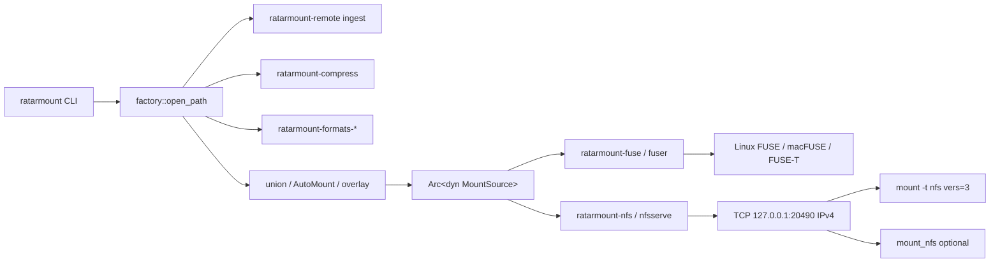
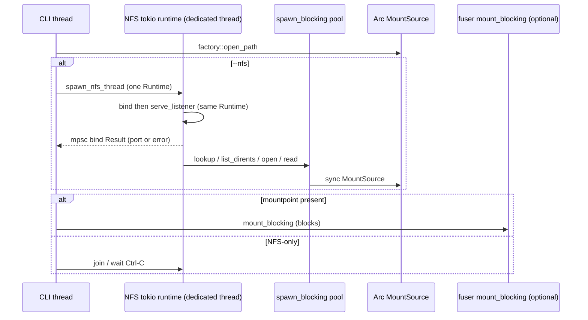
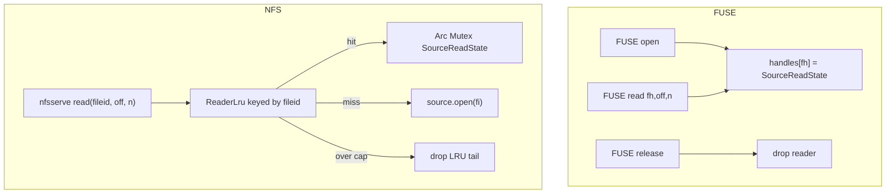

# NFSv3 Userspace Export of ratarmount-rs `MountSource`

| Field | Value |
|-------|--------|
| **Author** | ratarmount-rs |
| **Date** | 2026-08-15 |
| **Status** | Draft (revised after review) |
| **Workspace** | `/home/mbrewer/projects/ratarmount-rs` (workspace version `0.1.20`) |
| **Audience** | Implementers who already know `MountSource`, `ratarmount-fuse`, and the CLI factory |

---

## Overview

ratarmount-rs can **ingest** remote protocols (`ratarmount-remote`: http(s), S3, SSH/SFTP, WebDAV, SMB, Dropbox) and **export** a filesystem only via FUSE (`ratarmount-fuse` + `fuser`). Operators who want a LAN-visible share today must FUSE-mount locally and then glue kernel `nfsd` on top. That is a double hop, requires root + kernel NFS, and is not a product.

This document specifies an **in-process NFSv3 server** in a new crate `ratarmount-nfs`. It implements Hugging Face `nfsserve` 0.11.0’s `NFSFileSystem` on `Arc<dyn MountSource>` — the same stack FUSE already uses — **without** requiring a local FUSE mount. v1 is **read-only**, binds **127.0.0.1:20490** by default, speaks AUTH_SYS, and keeps a **server-side per-fileid reader + readahead LRU** because NFSv3 has no open/close while gzip / zstd / solid 7z `cat` requires a live `ArchiveRead`.

CLI (boolean `--nfs` plus optional `--nfs-bind`; **never** an optional-value `--nfs` that can steal the archive path):

```bash
# NFS only (no FUSE, no default mountpoint, no stem directory)
ratarmount --nfs archive.tar.gz
ratarmount --nfs --nfs-bind 20490 archive.tar.gz
ratarmount --nfs --nfs-bind 0.0.0.0:20490 archive.tar.gz   # explicit LAN bind (IPv4)

# FUSE + NFS in one process (explicit mountpoint; prefer -f so bind errors are visible)
ratarmount -f --nfs archive.tar.gz mnt/
```

Client (Linux — **v1 acceptance target**):

```bash
sudo mount -t nfs -o vers=3,tcp,nolock,noacl,port=20490,mountport=20490 \
  127.0.0.1:/ /mnt/nfs
```

macOS `mount_nfs` is a secondary target. Windows NFS client is a **residual**, not v1 acceptance.

---

## Background & Motivation

### Current export surface

| Surface | What it is | Why it is not NFS export |
|---------|------------|--------------------------|
| `ratarmount-fuse` | Only filesystem **export**. `mount_blocking` → `fuser::mount2`. | Local kernel FUSE only. |
| `ratarmount-remote` | **Ingest** URLs into a `MountSource`. | Opposite direction. Must not grow an NFS server. |
| `--no-mount` | Index then exit (`main.rs` returns before `mount_blocking`). | No file protocol. |
| `--control-interface` | Unix socket: `ping` / `status` / `unmount` / `help`. | Control plane, not data plane. |
| FUSE-T (macOS) | FUSE without kext; kernel talks NFS/SMB/**to the Mac**. | Local Mac mount, not a LAN export (`docs/macos.md`). |

`MountSource` (`ratarmount-core/src/lib.rs`) is already the right VFS:

- Sync, path-based, `Send + Sync`.
- `lookup` / `list_dirents` / `open` + `ArchiveRead` / `read(fi, size, offset)` / `readlink` (via `FileInfo.linkname`) / `statfs`.
- `member_seek_is_cheap` flags progressive/compressed members (only 7z overrides today; compositing wrappers must forward it — see Reader LRU).
- `WriteOverlay` already has `create_file` / `open_overlay_fd` / `mkdir` / `unlink` / `truncate` for a later writable slice.

FUSE (`ratarmount-fuse/src/lib.rs`) already solved the hard parts we must reuse conceptually:

- Lazy inode map: `FUSE_ROOT_ID = 1`, `next_ino` starts at `2`. **fileid 0 is reserved** (nfsserve docs).
- `OpenBackend::Source` holds `Arc<Mutex<SourceReadState>>` for the lifetime of the FUSE fh — comments say this is **critical for `cat`**.
- `fill_read_for_fuse` loops `Read::read` until the buffer is full or **true** EOF (AGENTS.md truncated-`.gz` / UnexpectedEof class).
- `readahead_fill` + `--readahead` (upstream #180) amortizes short inflate windows.

### Pain points this solves

1. **Linux (and typically macOS) clients** can mount the archive over NFSv3 without a FUSE driver on the *client*.
2. **Containers / appliances** that cannot load FUSE but can run a userspace TCP server.
3. **No kernel nfsd, no privileged 2049, no libnfsd**. Portable/deb/rpm stay as they are (static-friendly binary).

Windows `mount.exe` is **not** a v1 goal. nfsserve’s protocol `READDIR` is unimplemented (clients that insist on READDIR first, including Windows, may fail `dir`). See residuals.

### Settled architecture (do not reopen)

- New crate `ratarmount-nfs`. **Not** in `ratarmount-remote`. **Not** a FUSE re-export.
- Do **not** change format crates, index, compress, factory open path, or the `MountSource` **trait** for v1. **Do** forward `member_seek_is_cheap` on compositing wrappers so pin works on the factory stack.
- Tokio is **not** in any workspace `Cargo.toml` today. `nfsserve` is async. First runtime lives in `ratarmount-nfs`; binary calls a blocking `serve_*` entry. Sync `MountSource` `open`/`read` **must** go through `spawn_blocking` (not optional).
- v1: RO NFSv3, high port 20490, AUTH_SYS, bind **IPv4** `127.0.0.1`, no lockd, no Kerberos, no NFSv4. **No `--nfs-allow`** (stock nfsserve 0.11.0 has no public accept hook). Non-loopback bind is warn-and-document only.

---

## Goals & Non-Goals

### Goals (v1)

- Export any factory-built `Arc<dyn MountSource>` (TAR/ZIP/7z/… + compositing + remote ingest) as NFSv3.
- Work **without** a FUSE mountpoint (`--nfs` + archive, no extra path). Must **not** call `default_mountpoint` or create a stem directory.
- Optionally run **FUSE + NFS** when an **explicit** mountpoint is also given.
- Correct sequential `cat` of gzip/zstd/solid 7z (live reader + `fill_read_for_fuse` semantics).
- Isolated concurrent readers (one `ArchiveRead` per LRU slot; backends already mutex `Read+Seek` where needed).
- Documented Linux client mount line: `vers=3,tcp,nolock,port=,mountport=`.
- Tests per AGENTS.md in the same commits. Docs matrices updated in the same change as the CLI capability.

### Non-Goals (v1)

| Explicitly out | Why |
|----------------|-----|
| NFSv4 / NFSv4.1 | Different state machine (`embednfs` exists; not this project). |
| Kerberos / RPCSEC_GSS / ACLs | AUTH_SYS only; spoofable; localhost + RO is the mitigation. |
| NLM / lockd | Clients must pass `nolock`. |
| Stable filehandles across process restart | nfsserve generation = server start time. Restart → `NFS3ERR_STALE` / `BADHANDLE`. |
| Kernel nfsd re-export of FUSE | Operator glue, not a product. |
| Writable NFS | Later PR via `WriteOverlay`. v1: `VFSCapabilities::ReadOnly` + `NFS3ERR_ROFS`. |
| Changing `MountSource` for stable file ids | Optional later. v1 reuses FUSE-style lazy path→id. |
| Extracting a shared `VfsAdapter` used by FUSE+NFS | Right long-term; extra 3–5 days. Copy RO subset / steal helpers. |
| Putting NFS in `ratarmount-remote` | Wrong crate (ingest vs export). |
| Requiring a local FUSE mount to export | Product path is in-process NFS. |
| IPv6 bind | `NFSTcpListener::bind` splits on first `:`; `[::1]:port` cannot work. v1 is IPv4-only. |
| `--nfs-allow` / accept-time CIDR filter | `process_socket` is private in nfsserve 0.11.0. Do not ship an unenforceable flag. |
| NFS-only `--control-interface` | Live socket/`ControlFolder` require a FUSE mountpoint. v1: error exit 2. |
| Windows NFS client `dir` / `mount.exe` | nfsserve READDIR residual + default port 20490. Residual only. |

### “Done” (acceptance)

An engineer can:

1. `ratarmount --nfs testdata.tar.gz` → process listens on `127.0.0.1:20490`. **No** stem directory is created. `paths` still contains the archive (clap must not steal it).
2. Linux `mount -t nfs -o vers=3,tcp,nolock,port=20490,mountport=20490 127.0.0.1:/ mnt` → `ls` / `cat` match the archive.
3. `cat` of a multi-MiB `.gz` member is complete (not truncated at first inflate window).
4. Two concurrent `cat`s of the same compressed member return the full payload (no crossed cursors).
5. `touch` via the NFS mount → `EROFS` / `NFS3ERR_ROFS`.
6. Unit tests pass **without** a live NFS mount or root. Optional live Linux `mount -t nfs` skips cleanly when unprivileged.
7. `cargo fmt --all && cargo clippy --workspace --all-targets -- -D warnings && cargo test --workspace` green.
8. README / parity-todo / mount-options-parity / `--print-features` mention NFS export (same merge as the CLI).

**Not acceptance:** Windows `mount.exe` / `dir`. macOS `mount_nfs` is best-effort / documented.

---

## Proposed Design

### High-level architecture



Factory, formats, index, and compress are **unchanged**. The new crate is a sibling of `ratarmount-fuse`.

### Process / runtime layout



- **Tokio is owned by `ratarmount-nfs`**, not the binary. Public entry: `serve_blocking(source, opts) -> io::Result<()>`.
- `serve_blocking` builds `tokio::runtime::Builder::new_multi_thread()` (worker count = `available_parallelism`, min 2) and `block_on(serve(source, opts))`.
- Sync `MountSource` **`open` and member `read` (readahead fill) are required to run on `spawn_blocking`** (or an equivalent dedicated blocking pool). Calling them on tokio worker threads during solid-7z prefix-from-0 **stalls getattr/readdir** on the same runtime. Lookup / `list_dirents` / getattr may stay inline (they are index-cheap). There is **no** “MVP exception” that allows blocking `open`/`read` on the RPC executor.
- FUSE remains fully sync on its own thread (`fuser::mount2`). No tokio in `ratarmount-fuse`.

### New crate layout

```
ratarmount-nfs/
  Cargo.toml
  src/
    lib.rs          # NfsOptions, parse_nfs_bind, serve / serve_blocking / stop
    vfs.rs          # RatarmountNfs: NFSFileSystem
    inode.rs        # path ↔ fileid (copy of FUSE ino map; no cheap FileInfo)
    reader.rs       # ReaderLru + copied fill_read_for_fuse / readahead_fill
    error.rs        # io_to_nfsstat3 (mirror io_to_errno)
    bind.rs         # --nfs-bind [addr:]port parser (IPv4 only)
    names.rs        # filename3 ↔ path (UTF-8 lossy, NAMETOOLONG)
```

Workspace wiring (`Cargo.toml`):

```toml
# root Cargo.toml
members = [ /* existing */, "ratarmount-nfs" ]

[workspace.dependencies]
ratarmount-nfs = { path = "ratarmount-nfs" }
```

`ratarmount-nfs/Cargo.toml`:

```toml
[package]
name = "ratarmount-nfs"
version.workspace = true
edition.workspace = true
license.workspace = true
description = "In-process NFSv3 export of a ratarmount MountSource"
repository.workspace = true
rust-version.workspace = true   # 1.74

[dependencies]
ratarmount-core.workspace = true
nfsserve = "0.11"
async-trait = "0.1"
tokio = { version = "1", features = ["rt-multi-thread", "net", "macros", "sync", "time"] }
log.workspace = true
thiserror.workspace = true
# No libc: error mapping stays on io::ErrorKind / nfsstat3.
# No ipnet: --nfs-allow is not a v1 flag (no accept hook).

[dev-dependencies]
tempfile.workspace = true
tokio = { version = "1", features = ["rt-multi-thread", "macros"] }
```

**No crate feature flag for v1.** NFS has no extra system library (unlike FUSE / libarchive). Always compile it into the binary. If tokio ever becomes a size concern for a slim build, add `nfs` as a default feature on `ratarmount` later — do not do that in v1.

`docs/crates-io-policy.md`: classify `ratarmount-nfs` as **L4 export adapter** next to `ratarmount-fuse`. Do **not** publish. Path dep only.

### Why `nfsserve` 0.11.0 (and the alternatives)

Checked 2026-08-15:

| Crate | Version / home | Verdict |
|-------|----------------|---------|
| **`nfsserve`** | **0.11.0**, Hugging Face / xet, BSD-3-Clause, ~408k downloads. `NFSFileSystem` + `NFSTcpListener`. In-process portmapper + MOUNT + NFS on **one TCP port**. | **Default.** Trait matches our needs. Used in production (`hf-mount`). |
| `fernfs` | Same `NFSFileSystem` / `NFSTcpListener` surface (docs are a near-clone). | No advantage; less provenance. |
| `nfs3_server` (Vaiz/nfs3) | Modular `nfs3_types` + server + client. More protocol-complete, still async. | Fallback if nfsserve’s missing `READDIR` RPC (not the trait) blocks Windows. Do not switch unless implementation hits a hard blocker. |
| `embednfs` | NFSv4.1 | Out of scope. |
| `fractal-nfs` | Small embeddable NFSv3 | Less mature / less used. |

**Known nfsserve residuals (encode in docs; not v1 acceptance blockers):**

1. Protocol `READDIR` is unimplemented; `READDIRPLUS` is implemented. Linux/macOS use READDIRPLUS. Windows “always tries READDIR first” and may print noise / fail `dir`. **Windows is residual.** Verify Linux/macOS only in v1. Do not switch crates for Windows in v1.
2. `NFSTcpListener::bind` does `ipstr.split_once(':')` then parse port. **IPv4 only.** `SocketAddr::to_string()` for V6 (`[::1]:20491`) cannot be passed to `bind`. v1 rejects IPv6 in `parse_nfs_bind`.
3. `process_socket` / accept loop are **private**. No public accept-filter. **No `--nfs-allow` in v1.** Do not vendor `handle_forever`.
4. AUTH_SYS is accepted, not verified. Fine for v1 (localhost + RO).
5. No NLM. Clients must use `nolock`.
6. Filehandle generation = process start. Restart invalidates clients.

Recommended client lines (print Linux on ready; macOS in `docs/nfs-export.md`; Windows residuals only):

```text
# Linux (v1 acceptance; print this)
mount.nfs -o user,noacl,nolock,vers=3,tcp,rsize=131072,port=20490,mountport=20490 127.0.0.1:/ mnt

# macOS (documented, not CI)
mount_nfs -o nolocks,vers=3,tcp,rsize=131072,port=20490,mountport=20490 127.0.0.1:/ mnt

# Windows 11 Pro — residual only (READDIR + default client port 2049).
# Upstream demo (not our default port): 
#   mount.exe -o anon,nolock,mtype=soft,fileaccess=6,casesensitive,lang=ansi,rsize=128,wsize=128,timeout=60,retry=2 \\127.0.0.1\\ X:
# mount.exe historically may not honor port=20490. Not a v1 Done item.
```

### CLI flags and interactions

**Do not** use clap `num_args = 0..=1` on `--nfs`. In clap 4 an optional value consumes the next token unless it looks like a flag, so `ratarmount --nfs archive.tar.gz` would bind-spec `archive.tar.gz` and leave `paths` empty. `default_missing_value` only applies at EOL or when the next token starts with `-`.

Add to `ratarmount/src/main.rs` `Args`:

```rust
/// Export the archive as NFSv3 (userspace). Does not require a FUSE mountpoint.
/// Bind address is `--nfs-bind` (default 127.0.0.1:20490).
#[arg(long = "nfs", action = ArgAction::SetTrue)]
nfs: bool,

/// NFSv3 listen address (`[host:]port`, IPv4 only). Default 127.0.0.1:20490.
/// Bare port (`20490`) or `:20490` → 127.0.0.1:that port.
#[arg(long = "nfs-bind", value_name = "ADDR:PORT", default_value = "127.0.0.1:20490")]
nfs_bind: String,

/// MOUNT export name without slashes (nfsserve `with_export_name`). Default: `/`.
#[arg(long = "nfs-export-name", value_name = "NAME")]
nfs_export_name: Option<String>,
```

`--nfs-bind` is ignored unless `--nfs` is set (still parsed; cheap). **No `--nfs-allow` in v1.**

Required clap/CLI tests (PR 4b):

- `Args::try_parse_from(["ratarmount", "--nfs", "testdata.tar.gz"])` → `nfs == true`, `paths == ["testdata.tar.gz"]`.
- `["--nfs", "--nfs-bind", "0.0.0.0:20490", "a.tar", "mnt"]` → bind + both paths.
- `["--nfs", "testdata.tar.gz", "--help"]` still documents `--nfs` as a switch (trycmd or clap help).

`parse_nfs_bind` (in `ratarmount-nfs`, unit-tested; **IPv4 only**):

| Input | Result |
|-------|--------|
| (empty / default) | `127.0.0.1:20490` |
| `20490` | `127.0.0.1:20490` |
| `:20490` | `127.0.0.1:20490` |
| `0.0.0.0:20490` | `0.0.0.0:20490` |
| `192.168.1.10:20490` | that socket |
| `[::1]:20491` / any `:` count that is not IPv4 `a.b.c.d:port` | **Error** (`nfs-bind is IPv4-only; nfsserve bind splits on first ':'`) |
| `::1` | **Error** |

Helper `nfs_bind_string(addr: SocketAddr) -> String` must format IPv4 as `a.b.c.d:port` (never `SocketAddr::to_string()` on V6). Unit-test that the string survives `split_once(':')` + `u16` parse the way nfsserve 0.11.0 `tcp.rs` does.

Port `0` is allowed (ephemeral); log the actual port from `NFSTcpListener::get_listen_port()`.

#### Control-flow rewrite (mandatory — do not insert NFS into the current FUSE-only tail)

Live `main.rs` today:

```593:605:ratarmount/src/main.rs
    if args.no_mount {
        return;
    }

    let mp = match mountpoint {
        Some(mp) => mp,
        None => {
            let mp = default_mountpoint(&inputs[0]);
            std::fs::create_dir_all(&mp).ok();
            mp
        }
    };
```

`split_inputs_mountpoint` treating `len==1` as “no mountpoint” is **not** enough. Following “after control wrap, before fork” **without** skipping that block yields **FUSE+NFS** for `ratarmount --nfs archive.tar.gz` and creates a stem directory. Readahead is also computed only after this block today — **hoist** it.

Required structure after overlay wrap:

```text
if args.nfs && args.no_mount { eprintln!(...); exit 2 }
if args.nfs && args.control_interface && mountpoint.is_none() {
    eprintln!("error: --control-interface requires a FUSE mountpoint; NFS-only has no mp");
    exit 2
}

// Hoist readahead parse + gzip auto-1MiB HERE (needed for NFS-only).
let readahead = ... existing should_auto_readahead ...;

let nfs_opts = if args.nfs {
    let bind = parse_nfs_bind(&args.nfs_bind)?;
    if !bind.ip().is_loopback() {
        eprintln!("warning: NFS bound off-loopback ({bind}); AUTH_SYS is spoofable; no IP allowlist in v1");
    }
    if bind.ip().is_ipv6() { eprintln!("error: --nfs-bind is IPv4-only"); exit 2 }
    Some(NfsOptions { bind, export_name, readahead, stop: None, .. })
} else { None };

if args.no_mount { return; }   // already rejected with --nfs

let fuse_mp: Option<PathBuf> = match mountpoint {
    Some(mp) => Some(mp),
    None if nfs_opts.is_some() => None,          // NFS-only: NEVER default_mountpoint
    None => {
        let mp = default_mountpoint(&inputs[0]);
        std::fs::create_dir_all(&mp).ok();
        Some(mp)
    }
};

match (nfs_opts, fuse_mp) {
    (None, None) => unreachable!("no_mount already returned"),
    (Some(opts), None) => run_nfs_only(source, opts),          // fg, print recipe, wait stop/Ctrl-C
    (None, Some(mp)) => existing_fuse_path(mp, ...),           // today's fork / -f
    (Some(opts), Some(mp)) => run_fuse_and_nfs(source, opts, mp, args.foreground, ...),
}
```

`run_nfs_only`: no `create_dir_all` of a stem, no `mount_blocking`, no fork. Bind errors → stderr + exit 1. Print Linux mount recipe.

**Interaction matrix**

| Flags | Behavior |
|-------|----------|
| `--nfs` + archive, no extra path | **NFS only.** Skip `default_mountpoint` / `create_dir_all(stem)` / `mount_blocking`. Foreground. `-f` is a no-op. |
| `--nfs` + archive + explicit mountpoint | **FUSE + NFS.** See daemonize/bind below. Prefer `-f`. |
| `--nfs` + `--no-mount` | **Error, exit 2.** |
| `--nfs` + `--control-interface` + no mountpoint | **Error, exit 2.** Live `start_control_interface` / `ControlFolder` require a FUSE `mp`. |
| `--nfs` + `--control-interface` + mountpoint | Allowed. Existing socket: `status` stays `mounted {mp}`; `unmount` FUSE-unmounts **and** calls `NfsStop::request_stop()`. ControlFolder `/.ratarmount-control/` is visible on **both** FUSE and NFS (same `MountSource` wrap). |
| `--nfs` + `-u` | `-u` remains FUSE unmount only. NFS-only: Ctrl-C. |
| `--nfs` + `-w` overlay | Overlay wraps FUSE writes. NFS v1 stays RO (`NFS3ERR_ROFS`). |
| `--nfs` + `--readahead` | Same hoisted value feeds FUSE and NFS (including gzip auto-1 MiB). |
| `--nfs-bind` port `< 1024` | Attempt bind; on `PermissionDenied` print “use 20490 or run as root; 2049 is not the product default”. |

`print_features()` adds:

```
  export: fuse (fuser); nfsv3 (nfsserve, --nfs / --nfs-bind, default 127.0.0.1:20490, ro, ipv4)
```

A user who writes `ratarmount --nfs archive.tar mnt` still gets both (last path is the mountpoint via existing `split_inputs_mountpoint`).

### Inode / fileid assignment

Mirror `RatarmountFs::ino_for_path` (`ratarmount-fuse/src/lib.rs:364–390`).

```text
ROOT_FILEID = 1          # same as fuser::FUSE_ROOT_ID; nfsserve forbids 0
next_id     = AtomicU64(2)
path_to_id  : Mutex<HashMap<String, u64>>
id_to_ent   : Mutex<HashMap<u64, InodeEntry { path, file_info: Option<FileInfo> }>>
```

Algorithm `id_for_path(path) -> u64` — **path only**, like FUSE `ino_for_path` (not `ino_for_path_with_fi`):

1. Normalize with `ratarmount_core::normpath`.
2. Hit in `path_to_id` → return (do **not** write FileInfo).
3. Else `id = next_id.fetch_add(1)`, insert `InodeEntry { path, file_info: None }`.

**Never store cheap readdir `FileInfo`.** Default `list_dirents` sets `size = 0` and has empty `userdata`. TAR `open` requires `UserData::Tar` offsets (`missing TAR userdata` → `InvalidInput`). Caching `{ size: 0, userdata: [] }` then passing it to `source.open` / treating size 0 as empty `cat` is a production bug.

`store_lookup_fi(id, fi)` is allowed **only** with a `FileInfo` from `source.lookup` (or `create_root_file_info` for `/`).

Root is pre-inserted as `"/"` → `1` with `create_root_file_info()`.

**Generation:** do **not** implement our own fh. Use nfsserve defaults:

- `id_to_fh` / `fh_to_id` encode `(generation=server_start, fileid)`.
- Restart → clients get `NFS3ERR_STALE` / `BADHANDLE`. Document this. Do not promise stable ids.

**Why not change `MountSource`:** TAR/ZIP/7z already have offsets in `UserData`, but compositing (union, automount, versions) would need a stack-wide stable id. Lazy path map matches FUSE and is enough for one process lifetime.

### The one real design problem: stateless `read`



NFSv3 / `NFSFileSystem::read(id, offset, count) -> (Vec<u8>, eof)` has **no open/close**. FUSE keeps `Box<dyn ArchiveRead>` on the fh. Comments in `OpenBackend::Source`:

> Keep the archive member reader open for the lifetime of the fh (**critical for cat**).

If NFS called `MountSource::read` (which `open`s, seeks, reads, drops) on every RPC:

- gzip / rapidgzip / multi-frame zstd: seek + inflate from checkpoint **per 32–128 KiB NFS read**.
- Solid 7z (`member_seek_is_cheap == false`): prefix-from-0 **per read** — minutes of `cat` (AGENTS.md nested/non-solid 7z first-cat).
- Short `Read::read` (~64 KiB inflate window) would become **false EOF** if we ever reply short. Same bug class as `fill_read_for_fuse` / `fuse_style` / `nested_large_plain_gzip`.

#### Reader LRU

Copied types (do **not** make them `pub` in fuse for v1):

- `fill_read_for_fuse` → `fill_read_for_nfs` (identical loop).
- `ReadAheadWindow`, `ReadaheadState`, `readahead_fill`.
- `SourceReadState { reader, readahead }`.

`ReaderLru`:

| Field | Value |
|-------|--------|
| Key | `fileid` (`u64`) |
| Value | `Slot { fi: FileInfo, state: Arc<Mutex<SourceReadState>>, last_used: Instant }` |
| Cap | default **64** live readers (same ballpark as 7z “≤64 LRU windows”). CLI: `--nfs-reader-cache` later if needed; v1 constant `DEFAULT_READER_SLOTS = 64`. |
| Eviction | LRU by `last_used`. Evict only when inserting a new key and `len == cap`. |
| Empty files | Treat size 0 as empty **only after** `source.lookup`. Never use readdir cheap size. |
| Concurrency | Process-wide `Mutex<HashMap<…>>` for the map only. After lookup, **drop the map lock** then `state.lock()` — same pattern as FUSE `read` (`lib.rs:833–857`) so a long decompress does not stall getattr/readdir. |
| Isolation | Each slot’s `reader` is a distinct `source.open(&fi, 0)` with **lookup** `FileInfo`. Never share one `ArchiveRead` across fileids. Same-fileid concurrent RPCs serialize on that slot’s mutex (seek + fill). |
| `member_seek_is_cheap` pin | **Requires compositing forwards** (below). Only `SevenZipMountSource` overrides the trait today; factory wraps `FileVersionLayer` (and often AutoMount/Union/Prefix). Without forwards, the product `Arc<dyn MountSource>` always reports cheap seek and pin never fires. After forwards: pin `!source.member_seek_is_cheap(&lookup_fi)`. Evict unpinned first; if every slot is pinned, evict least-recent pinned. |
| Idle expiry | Optional v1.5: drop unused slots after 60s. Not required to ship. |
| Failed open | Map `io::Error` via `io_to_nfsstat3`. Encrypted nested without `--password` → `PermissionDenied` → `NFS3ERR_ACCES` (same as FUSE `io_to_errno` / AGENTS.md). |

`read` implementation:

```rust
async fn read(&self, id: fileid3, offset: u64, count: u32) -> Result<(Vec<u8>, bool), nfsstat3> {
    // get_or_open must source.lookup (or use lookup-only cache) before size==0.
    let (fi, state) = self.readers.get_or_open(id).await?;    // spawn_blocking for open
    if fi.size == 0 || offset >= fi.size {
        return Ok((Vec::new(), true));
    }
    let readahead = self.readahead_bytes;
    let buf = tokio::task::spawn_blocking(move || {
        let mut g = state.lock().unwrap();
        readahead_fill(g.reader.as_mut(), &mut g.readahead, readahead, offset, count as usize)
    }).await.map_err(|_| nfsstat3::NFS3ERR_IO)?.map_err(|e| io_to_nfsstat3(&e))?;
    let eof = offset.saturating_add(buf.len() as u64) >= fi.size || buf.len() < count as usize;
    Ok((buf, eof))
}
```

**EOF flag:** nfsserve requires `eof == true` when the read reaches the end. Use `offset + n >= fi.size` **or** a short fill after `fill_read_for_nfs` (true EOF). Never treat a single short `Read::read` as EOF — that is the whole point of the fill loop.

**Readahead default:** reuse CLI `--readahead` + existing gzip auto-1 MiB (`should_auto_readahead` in `main.rs`). NFS clients often use `rsize=128KiB`; a 1 MiB window still collapses ~8 RPCs per inflate-seek on gzip.

**Do not** call `MountSource::read` for member data. That helper opens+seeks+drops every time (`core/src/lib.rs:360–367`) and is the wrong path for NFS.

#### Compositing must forward `member_seek_is_cheap` (not a trait change)

Today only `SevenZipMountSource::member_seek_is_cheap` overrides the default `true` (`formats-sevenzip/src/lib.rs:1593`). These wrappers **do not** forward it: `FileVersionLayer`, `AutoMountLayer`, `UnionMountSource`, `PrefixMountSource`, `TransformMountSource`, `WriteOverlay`, `ControlFolderMountSource`. Factory always wraps `FileVersionLayer` unless `--no-file-versions`.

v1 **must** add one-line (or winning-source) forwards. This is allowed: it is not a `MountSource` trait change and not a factory open-path change.

| Wrapper | Forward |
|---------|---------|
| `FileVersionLayer` | `self.inner.member_seek_is_cheap(file_info)` |
| `PrefixMountSource` / `TransformMountSource` | inner, same `FileInfo` (userdata still belongs to inner) |
| `UnionMountSource` | winning source for that `FileInfo` / path (same winner as `open`) |
| `AutoMountLayer` | nested mount if the path is inside one; else parent |
| `WriteOverlay` | host overlay file → `true`; else `self.base.member_seek_is_cheap` |
| `ControlFolderMountSource` | control nodes → `true`; else inner |

Ship **both** forward tests (dummy inner that returns `false` is enough — cheap and proves the wrapper, not only 7z):

1. `FileVersionLayer` over that dummy (factory default wrap).
2. **`AutoMountLayer` (or factory `-r`)** over that dummy as a nested member — the dangerous product path is nested/solid 7z under AutoMount + default FileVersionLayer. A versions-only dummy does not prove AutoMount.

Without these forwards, delete the pin claim and document 64-slot eviction as a residual — **do not** ship the claim. Preferred path is the forwards.

### Readdir cookie / `start_after`

nfsserve:

```text
readdir(dirid, start_after, max_entries) -> ReadDirResult { entries, end }
```

Docs: if ids are `[1,6,2,11,8,9]` and `start_after=6`, return `2,11,8,…`. Pagination is **“start after this fileid”**, not a FUSE index cookie.

Algorithm:

1. Resolve `dirid` → path. Missing → `NFS3ERR_STALE`.
2. `source.list_dirents(&path)` (cheap; never fat `list()`). None → `NFS3ERR_NOTDIR` if lookup says file, else `NOENT`.
3. For each `CheapDirent`: `child_path = join_path(dir, name)`, `cid = id_for_path(child_path)` — **path only, `file_info` stays `None`**.
4. **Stable order = sort by `fileid` ascending.** Fileids are assigned on first sight; once assigned they never change in-process.
5. Prefix the listing with `.` (fileid = dirid) then `..` (fileid = parent; export-root parent is the export root). Real children stay sorted by fileid after that prefix. Do **not** store a cheap readdir stub for `.` / `..` — attrs come from lookup `FileInfo` of the directory / parent. `lookup` still handles `"."` / `".."`.
6. If `start_after == 0`: take from the beginning (the `.` / `..` prefix).
7. Else:
   - At the export root, `.` and `..` share fileid 1 (nfsserve cookie = `DirEntry.fileid`). Never split them across pages; `start_after == 1` skips both and starts at children. Splitting would make `start_after=1` re-emit `..` forever.
   - In a subdirectory, `start_after == dirid` starts at `..`; `start_after == parent_id` starts at the first child.
   - Otherwise skip while `fileid != start_after` among children; then skip that entry; take the rest. If `start_after` is **not** in the list, resume at the next surviving id (do not `BAD_COOKIE` — that aborts `ls`).
8. Return at most `max_entries` (except the root `.`/`..` pair, which is never split). `end = (taken_until == last)`.

**READDIRPLUS `fattr3.size`:** use `CheapDirent.size` when `> 0`. When `== 0`, do **not** invent a cached `FileInfo`. Either (preferred for v1 correctness on residual formats) `source.lookup` that child for attrs, or emit size 0 **without** storing it on the inode. Never pass a cheap struct to `open`. Clients that cache size 0 from READDIRPLUS on residual formats may skip READ — lookup-on-zero-size for the page being returned is the safe default (one lookup per 0-size dirent in the page, not the whole tree).

`lookup(dirid, filename3)`:

- Decode name: UTF-8 **lossy** (match FUSE `OsStr::to_string_lossy`). Reject `name.len() > 255` → `NFS3ERR_NAMETOOLONG`. Empty name → `NFS3ERR_INVAL`.
- `"."` → `dirid`.
- `".."` → parent path’s id (`"/"` → `1`).
- else `join_path` + `source.lookup(path, 0)` → assign id, **`store_lookup_fi`**. Missing → `NFS3ERR_NOENT`.

`getattr(id)`: if inode has a **lookup-sourced** `FileInfo`, use it; else `source.lookup`. Never serve getattr from a cheap readdir stub.

`readlink(id)`: lookup-sourced `FileInfo.linkname` as `nfspath3` (same as FUSE `readlink_target`).

Readdir `DirEntry.name`: encode the archive name as bytes (UTF-8 of the `String` from `list_dirents`). Non-UTF-8 synthetic names: lossy on the way in; unit-test a `0xff` name if the source allows it.

### Error mapping (`io_to_nfsstat3`)

Mirror `ratarmount-fuse::io_to_errno` (`lib.rs:34–43`):

| `io::ErrorKind` | FUSE errno | `nfsstat3` |
|-----------------|------------|------------|
| `NotFound` | `ENOENT` | `NFS3ERR_NOENT` |
| `PermissionDenied` | `EACCES` | `NFS3ERR_ACCES` |
| `IsADirectory` | `EISDIR` | `NFS3ERR_ISDIR` |
| `NotADirectory` (1.83+; else string/other) | — | `NFS3ERR_NOTDIR` |
| `InvalidInput` | `EINVAL` | `NFS3ERR_INVAL` |
| `Unsupported` | `ENOSYS` | `NFS3ERR_NOTSUPP` |
| other | `EIO` | `NFS3ERR_IO` |

Plus VFS-level (no `io::Error`):

| Situation | Status |
|-----------|--------|
| Unknown fileid | `NFS3ERR_STALE` |
| Mutating op (v1) | `NFS3ERR_ROFS` |
| `read` on directory | `NFS3ERR_ISDIR` |
| `readdir` on file | `NFS3ERR_NOTDIR` |
| `readlink` on non-link | `NFS3ERR_INVAL` |
| Name too long (`> 255`) | `NFS3ERR_NAMETOOLONG` |
| Stale readdir cookie | `NFS3ERR_BAD_COOKIE` |

### `NFSFileSystem` method table (v1)

| Method | v1 behavior |
|--------|-------------|
| `capabilities` | `VFSCapabilities::ReadOnly` |
| `root_dir` | `1` |
| `lookup` / `getattr` / `read` / `readdir` / `readlink` | As above |
| `setattr` / `write` / `create` / `create_exclusive` / `mkdir` / `remove` / `rename` / `symlink` | `Err(NFS3ERR_ROFS)` |
| `fsinfo` | Override defaults. **Confirm field names and `FSF_*` against docs.rs `nfsserve` 0.11.0 in the impl PR** (do not assume). Intended values: `rtmax`/`rtpref` = 1 MiB, `wtmax` = 0 (RO), `maxfilesize` = `u64::MAX`, `time_delta` = 1s, `properties` = symlink + homogeneous bits if those constants exist. `dtpref` from `StatFs.namemax`. |
| `path_to_id` | Default walk is OK; optionally fast-path `id_for_path(normpath)`. |

`fattr3` from `FileInfo` (mirror `RatarmountFs::file_attr`):

```text
ftype  ← mode & S_IFMT  (NF3REG/NF3DIR/NF3LNK/…)
mode   ← fi.mode & 0o7777
nlink  ← 1
uid/gid← fi.uid / fi.gid
size   ← fi.size
used   ← fi.size
fileid ← id
fsid   ← 1
atime = mtime = ctime ← fi.mtime (f64 unix → nfstime3)
```

### FUSE + NFS coexistence

```text
open source (factory) ──► Arc<dyn MountSource>
        │
        ├─ NFS-only (fuse_mp is None):
        │     serve_blocking on this thread (fg). Bind fail → stderr + exit 1.
        │
        ├─ FUSE-only: today's fork / -f / mount_blocking
        │
        └─ FUSE + NFS:
              bind NFS first (see below), then FUSE session.
```

- Two threads: FUSE session (sync `fuser`) + **one** NFS tokio `Runtime` owned by the NFS thread. They share `Arc<dyn MountSource>` and an `NfsStop` (`AtomicBool`). `main.rs` does **not** name tokio.
- `MountSource` is already `Send + Sync`. Compress backends that need it (`XzBackend::Shared`, gzip Shared) already mutex concurrent opens.

#### One runtime: bind and serve must not be split

`NFSTcpListener` owns a `tokio::net::TcpListener` tied to the **runtime that called `bind`**. Constructing a second `Runtime` (or dropping the bind-time runtime after `block_on` returns) is a tokio 1.x footgun (panic / “no reactor” / I/O from a dropped runtime).

**Rule:** `bind_nfs` and `serve_listener` are polled on the **same** `Runtime` that created the listener. Never bind on main’s runtime and serve on a new one.

Supported FUSE+NFS `-f` path is **(1)** — NFS thread owns the runtime for its whole life:

```text
main:  let (tx, rx) = std::sync::mpsc::sync_channel(1);
       let stop = NfsStop::new();
       thread::spawn("ratarmount-nfs") {
           let rt = Runtime::new();                    // the only NFS Runtime
           rt.block_on(async {
               match bind_nfs(fs, &opts).await {
                   Ok(listener) => {
                       let port = listener.get_listen_port();
                       let _ = tx.send(Ok(port));      // unblocks main
                       serve_listener(listener, stop).await
                   }
                   Err(e) => { let _ = tx.send(Err(e)); }
               }
           })
       };
       let port = rx.recv()??;                         // fail here → stderr + exit 1
       // print recipe using port
       mount_blocking(...);                            // FUSE on main
       stop.request_stop();
```

Do **not** do: `block_on(bind_nfs)` on main, then `thread::spawn { Runtime::new(); serve_listener }`.

Alternative (2) — `block_on(bind)` on main then `thread::spawn` **that same** `Runtime` (it is `Send`) — is valid but unused in v1 so `main.rs` never constructs a Runtime.

NFS-only: `serve_blocking` = one Runtime, bind+serve in one `block_on`. Fine.

#### Bind visibility (do not silently lose NFS)

`NFSTcpListener::bind` is async and owns the socket; we **cannot** inject a pre-bound `std::net::TcpListener` without vendoring nfsserve. Therefore:

| Mode | Bind / failure |
|------|----------------|
| NFS-only | Always foreground. `serve_blocking` on this thread (one Runtime). Bind fail → stderr + exit 1. Print Linux mount recipe. |
| FUSE+NFS **`-f`** | `spawn_nfs_thread` (pattern (1) above). Main waits on the bind `mpsc` **before** `mount_blocking`. Bind error → stderr + exit 1. Recipe is visible. **This is the supported FUSE+NFS path in the first CLI PR.** |
| FUSE+NFS daemonize (no `-f`) | Parent: sync `std::net::TcpListener::bind(addr)` **probe**; on fail, stderr + exit 1 **before fork**. Drop the probe socket. Child after `setsid`: same `spawn_nfs_thread` as `-f`; on bind fail write `/tmp/ratarmount-rs-nfs-error.log` and **exit 1 before `mount_blocking`** so `wait_until_mounted` fails and the parent exits 1 (30s timeout residual). Without `-f`/`--log-file`, the mount recipe is **not** printed (stdio redirected). Document this. Probe-to-child bind is a small TOCTOU; acceptable. |

Crate API: internal `bind_nfs` + `serve_listener` (same runtime). CLI-facing: `serve_blocking` (NFS-only) and `spawn_nfs_thread` (FUSE+NFS).

#### `handle_forever` + stop (not hand-wavy)

`handle_forever` “loops forever and never returns.” v1 stop is `NfsStop` (`Arc<AtomicBool>`), **not** `tokio::sync::Notify` (that would leak tokio into `main.rs`).

```rust
async fn stop_fut(stop: NfsStop) {
    while !stop.is_stopped() {
        tokio::time::sleep(Duration::from_millis(200)).await;
    }
}
tokio::select! {
    r = listener.handle_forever() => r,
    _ = stop_fut(stop) => Ok(()),
}
```

- In-flight `process_socket` tasks keep running until the client disconnects; dropping the accept loop does **not** drain them. Fine for unmount / process exit.
- Unit test (PR 4a, **may** use `NFSTcpListener`): `serve` on `127.0.0.1:0`, `stop.request_stop()`, assert return within 1s.

**NFS-only SIGINT:** default process-killing SIGINT is enough (drop the listener with the process). Do **not** add `ctrlc` or `tokio::signal` — they are not workspace deps and the crate’s tokio features do not include `signal`. Control-socket `unmount` (FUSE+NFS only) calls `NfsStop::request_stop()`.

### Later writable slice (not v1)

A follow-up PR can:

1. Pass `Option<Arc<WriteOverlay>>` into `RatarmountNfs` (same as `RatarmountFs`).
2. `capabilities()` → `ReadWrite` when overlay is `Some`.
3. Map `create`/`mkdir`/`remove`/`setattr(size)` onto `create_file` / `mkdir` / `unlink` / `truncate`.
4. Writes go to overlay fds (or reopen per write — NFS is still stateless). Invalidate reader LRU on truncate/unlink.
5. Keep v1 RO tests; add overlay tests in that PR.

Do not block v1 on this.

---

## API / Interface Changes

### New public API (`ratarmount-nfs`)

```rust
pub const DEFAULT_NFS_HOST: &str = "127.0.0.1";
pub const DEFAULT_NFS_PORT: u16 = 20490;
pub const DEFAULT_READER_SLOTS: usize = 64;

/// Tokio-free stop flag so `main.rs` does not name tokio (same idea as control-socket AtomicBool).
#[derive(Clone)]
pub struct NfsStop(Arc<AtomicBool>);
impl NfsStop {
    pub fn new() -> Self { /* ... */ }
    pub fn request_stop(&self) { /* store true */ }
    pub fn is_stopped(&self) -> bool { /* load */ }
}

#[derive(Clone, Debug)]
pub struct NfsOptions {
    pub bind: SocketAddr,              // IPv4; default 127.0.0.1:20490
    pub export_name: Option<String>,   // nfsserve with_export_name
    pub readahead_bytes: u64,          // already clamped
    pub reader_slots: usize,           // default 64
    pub stop: Option<NfsStop>,
}

pub fn parse_nfs_bind(s: &str) -> Result<SocketAddr, String>; // IPv4 only
pub fn nfs_bind_string(addr: SocketAddr) -> String;          // "a.b.c.d:port"

/// Bind + serve on **one** Runtime. Convenience for NFS-only (this thread).
pub fn serve_blocking(source: Arc<dyn MountSource>, opts: NfsOptions) -> io::Result<()>;

/// FUSE+NFS: dedicated thread owns the only Runtime; bind then serve there.
/// Blocks until bind succeeds (returns listen port) or fails. `main.rs` never constructs tokio.
pub fn spawn_nfs_thread(
    source: Arc<dyn MountSource>,
    opts: NfsOptions,
) -> io::Result<NfsServerHandle>;

pub struct NfsServerHandle {
    pub port: u16,
    // join handle; Drop or explicit stop via opts.stop
}

/// Same-runtime internals / tests. Caller’s Runtime must be the one that called bind.
pub async fn bind_nfs<T: NFSFileSystem + Send + Sync + 'static>(
    fs: T,
    opts: &NfsOptions,
) -> io::Result<NFSTcpListener<T>>;
pub async fn serve_listener<T: NFSTcp>(listener: T, stop: Option<NfsStop>) -> io::Result<()>;

/// Async entry for tests (caller owns **one** runtime for bind+serve).
pub async fn serve(source: Arc<dyn MountSource>, opts: NfsOptions) -> io::Result<()>;

/// NFSFileSystem adapter. Public so VFS unit tests can call methods without TCP.
pub struct RatarmountNfs { /* ... */ }
impl RatarmountNfs {
    pub fn new(source: Arc<dyn MountSource>, readahead: u64) -> Self;
}
```

`ratarmount/Cargo.toml` does **not** add a tokio dependency. Only `ratarmount-nfs`.

`NFSFileSystem` impl is the product surface; tests call `lookup`/`getattr`/`read`/`readdir` via `block_on`.

### Binary

- `ratarmount` depends on `ratarmount-nfs`.
- No change to `factory.rs` open path / format crates / `MountSource` **trait**.
- **Required compositing change:** forward `member_seek_is_cheap` on wrappers (see Reader LRU). Same PR as the pin implementation (PR 3).

### `print_features` / help

Update `about` / `long_about` to mention NFS export.

---

## Data Model Changes

None. No SQLite schema change. No on-disk NFS state.

In-memory only:

- path ↔ fileid maps (process lifetime).
- Reader LRU (process lifetime).
- nfsserve fh generation (process start unix time).

**Migration:** n/a.

---

## Alternatives Considered

### 0. Kernel `nfsd` re-export of a FUSE mount

Operator runs `ratarmount archive mnt` then `/etc/exports` + `exportfs`.

| | |
|--|--|
| Pros | Zero new code. |
| Cons | Root, rpcbind, lockd, firewall, FUSE+NFS double cache, flaky `fsid`, not portable, not in the binary. |
| Verdict | **Not a product.** Mention in docs as unsupported operator glue. |

### 1. In-process NFSv3 via `nfsserve` (recommended)

| | |
|--|--|
| Pros | One binary, no FUSE on server, Linux/macOS clients, high port, RO by construction. Trait is small. |
| Cons | First tokio runtime. Stateless read → we own the LRU. nfsserve READDIR residual on Windows. AUTH_SYS spoofable. |
| Verdict | **v1 path.** |

### 2. Extract shared `VfsAdapter` used by FUSE + NFS first

Move inode map, readahead, `io_to_*` into `ratarmount-core` or a new `ratarmount-vfs`.

| | |
|--|--|
| Pros | One copy of the short-read / inode logic. Right long-term. |
| Cons | Touches `ratarmount-fuse` (high-risk `cat` path) + 3–5 days before any NFS exists. |
| Verdict | **Not required for MVP.** Copy RO subset. A later cleanup PR can dedupe once NFS is green. |

### Other crate alternatives

Covered above (`fernfs`, Vaiz `nfs3_server`, `embednfs`). **Stay on `nfsserve` 0.11.0** unless implementation finds a protocol blocker.

---

## Security & Privacy Considerations

### Threat model (v1)

| Threat | Severity | Mitigation |
|--------|----------|------------|
| Anyone on the net reads the archive | **High** if bind `0.0.0.0` | Default bind **127.0.0.1**. Binding a non-loopback address logs a **warning**. |
| AUTH_SYS uid spoof | **High** on LAN | Accept AUTH_SYS / AUTH_NONE; do **not** honor client uid for authorization. Export is RO and world-readable at NFS layer (Unix mode bits still reported). No password on the NFS wire. |
| Encrypted nested 7z/ZIP | **High** | Server still needs `--password` / `--password-file` at **open** time. NFS does not prompt. Wrong/missing password → `NFS3ERR_ACCES` on open/read, same as FUSE. |
| Port 2049 privileged / surprise | Medium | Default **20490**. Document. Bind `<1024` may fail without root. |
| IP spoofing / LAN bind | Medium | Default loopback. Non-loopback: warn; host firewall. No `--nfs-allow` (unenforcible). |
| Writer via NFS | Medium | v1 always `ReadOnly` / `ROFS` even if `-w` is set for FUSE. |
| Stale fh after restart | Low | Generation bump; clients remount. |
| Path traversal in names | Low | `normpath` + `join_path`; never use client paths raw on the host except overlay (out of v1). |

### Bind + allowlist (v1 story: localhost is the boundary)

Verified on nfsserve 0.11.0: `process_socket` is a **private** `async fn`; `handle_forever` accepts every peer and `tokio::spawn`s it. There is no public connection handler. Vendoring accept + `RPCContext` is 80+ lines of private code / a fork. **v1 will not do that.**

1. **Default `127.0.0.1`** is the security boundary.
2. **No `--nfs-allow` flag** (do not ship an accepted-but-unenforced option).
3. Non-loopback `--nfs-bind` (`0.0.0.0`, LAN IPv4): **warn** on stderr that AUTH_SYS is spoofable and every peer on that socket can read the export. Document host firewall / bind to a specific IPv4 instead.
4. Later (not v1): fork/vendor accept loop or wait for an upstream hook, then add `--nfs-allow`.

### What we do not promise

- Kerberos, export pinning, per-uid squashing, TLS (nfsovertls), “this is a NAS”.
- Kernel re-export of this NFS as another NFS (loop).

---

## Observability

| Signal | How |
|--------|-----|
| Ready | `log::info!` bind address, export name, RO, Linux mount command. Invisible without `-f`/`--log-file` when daemonized. |
| Accept / reject | `debug!` peer if nfsserve/tracing-log surfaces it. No allowlist drops in v1. |
| Bind fail | stderr (fg) or `/tmp/ratarmount-rs-nfs-error.log` (daemon child). Never silent success. |
| Read errors | `debug!` path, offset, size, `ErrorKind` (same as FUSE). |
| LRU | `debug!` evict fileid/path; `info!` if pinned 7z slot evicted under pressure. |
| Metrics | None in v1 (no metrics crate). Optional later: live readers, RPC counts. |
| Tracing | nfsserve uses `tracing`. Do **not** add a second subscriber that fights `env_logger`. If nfsserve logs vanish, add `tracing-log` bridge in `serve_blocking` only — not globally. |

Debug levels stay CLI `-d` / `RUST_LOG`.

---

## Rollout Plan

1. **Land crate + unit tests** (no CLI) — reviewable, `cargo test -p ratarmount-nfs`.
2. **Wire CLI `--nfs` / `--nfs-bind`** (boolean + bind). Docs land in the same merge as the CLI.
3. **Docs + `--print-features`** with that CLI PR (not a later follow-up).
4. **No feature flag / no staged % rollout** — this is a CLI opt-in (`--nfs`).
5. **Rollback:** don’t pass `--nfs`. Binary without the crate = revert the member.
6. **Packaging:** no new runtime (no `nfs-utils` on the *server*, no `libnfsd`). Linux clients need `nfs-common`; macOS `mount_nfs` is documented. Windows NFS Client is residual. Portable/deb/rpm **unchanged** except binary size (+tokio + nfsserve, on the order of a few hundred KiB–1 MiB). Note in `docs/packaging.md`: “NFS export is userspace; no extra package dep.” Privileged port: not used by default.

CI: existing `fmt + clippy + test` covers the crate. No live-mount job in v1 (privileges). Optional later: privileged integration on Linux.

---

## Test Plan (AGENTS.md)

Every behavior lands with tests in the same PR. Prefer **no live mount**.

### Unit (`ratarmount-nfs`, synthetic `MountSource`)

| Test | Asserts |
|------|---------|
| `root_fileid_is_one_never_zero` | `root_dir() == 1`; no id `0` assigned. |
| `lookup_assigns_stable_ids` | Same path → same id; new path → monotonic. |
| `getattr_maps_fileinfo` | size/mode/uid/mtime from **lookup**. |
| **`Regression: readdir cheap size 0 then cat`** | Synthetic `list_dirents` size 0 + `lookup` size N + real body + TAR-like userdata → `read` returns N bytes; `open` FileInfo has userdata. Must **not** return `([], true)`. |
| `io_to_nfsstat3_maps_permission_denied_to_acces` | Mirror FUSE `io_to_errno` test (AGENTS.md encrypted nested). |
| `mutating_ops_return_rofs` | write/create/mkdir/remove/rename/setattr/symlink. |
| `readdir_start_after_fileid` | Deterministic order; pagination of real children by name; unknown cookie resumes (empty page + eof). |
| `readdir_dot_dotdot_prefix_root_and_subdir` | Cookie-0 listings start with `.` then `..`; root pair not split; max_entries=1 walk terminates. |
| `read_empty_file` | After lookup size 0 → `([], true)`. |
| `filename3_lossy_and_nametoolong` | `name.len() > 255` → `NAMETOOLONG`; non-UTF-8 bytes decode lossy. |
| **`Regression: short Read::read is not NFS EOF`** | Reader that yields 64 KiB then more; `read(0, 1MiB)` returns full buffer. Copy the FUSE `fill_read_for_fuse_assembles_short_codec_reads` fixture. |
| **`Regression: concurrent readers isolated`** | Two tasks `read` same fileid at different offsets; payloads not mixed. |
| `reader_lru_evicts_unpinned` | Cap=2; third cheap-seek file evicts oldest cheap handle. |
| `reader_lru_pins_expensive_seek` | After compositing forwards: `member_seek_is_cheap == false` not evicted while a cheap slot exists. |
| `member_seek_is_cheap_forwards_on_file_version_layer` | `FileVersionLayer` over a dummy that returns `false` still reports false. |
| `member_seek_is_cheap_forwards_on_automount` | `AutoMountLayer` (or factory `-r`) over the same dummy still reports false (nested 7z path). |
| `parse_nfs_bind_*` | IPv4 table; IPv6 rejected; `nfs_bind_string` survives nfsserve `split_once(':')`. |
| `serve_returns_after_stop` | Bind `127.0.0.1:0`, `NfsStop::request_stop()`, `serve` returns. **Uses `NFSTcpListener` (exempt).** |

Copy a **private synthetic `MountSource` into `ratarmount-nfs` tests**. Do **not** use FUSE `XattrSource` — it is `#[cfg(test)]` private in `ratarmount-fuse`.

CLI / binary tests (PR 4b, `ratarmount` crate):

| Test | Asserts |
|------|---------|
| clap `--nfs testdata.tar.gz` | archive stays in `paths`; `nfs == true`. |
| `--nfs` + `--no-mount` | exit 2. |
| `--nfs` + `--control-interface` + no mp | exit 2. |
| NFS-only does not `default_mountpoint` | no stem directory created (integration or extracted helper). |

**Listener rule:** `vfs` / `reader` / `inode` / `names` tests call `NFSFileSystem` methods directly — **no** `NFSTcpListener`. Serve/bind tests (`serve_returns_after_stop`, bind string smoke) **may** `NFSTcpListener::bind("127.0.0.1:0", …)` on one test runtime.

### Optional live mount (skip if unprivileged)

```rust
// tests/live_mount.rs
if !can_mount_nfs() { eprintln!("skip: no nfs mount privileges"); return; }
```

`can_mount_nfs`: not root **and** `modprobe nfs` / `mount -t nfs` fails → skip. Never silent-pass the happy path without the unit tests above.

If run: Linux `ls` + `cat` a small tar.gz member equals the extracted file. **Not** Windows `dir`.

### AGENTS.md catalog rows (land with PR 3 / 4b, not only docs)

```
| NFS export short-read EOF | `cargo test -p ratarmount-nfs --lib fill_read` · `cargo test -p ratarmount-nfs --lib regression_short` |
| NFS concurrent reader isolation | `cargo test -p ratarmount-nfs --lib concurrent` |
| NFS readdir size-0 then cat | `cargo test -p ratarmount-nfs --lib regression_readdir_size0` |
| NFS CLI does not steal archive | `cargo test -p ratarmount --bin ratarmount nfs_flag_` |
```

---

## Docs Delta

| File | Change |
|------|--------|
| `README.md` | Architecture mermaid: `Composite → NFS` alongside FUSE. Crate table + directory listing add `ratarmount-nfs`. Compositing table: row **NFSv3 export (`--nfs`)**. Quick start snippet. |
| `docs/parity-todo.md` | New row under Compositing & FUSE UX: `NFSv3 userspace export` Python=`no` Rust=`yes (ro, nfsserve, ipv4)` Status=`[x]` / residual Windows READDIR + port, no v4, no allowlist. |
| `docs/mount-options-parity.md` | CLI rows `--nfs`, `--nfs-bind`, `--nfs-export-name`. **No `--nfs-allow`.** Ability row “NFSv3 export (no FUSE required)”. |
| `docs/nfs-export.md` | **New** operator page: bind defaults, Linux/macOS recipes, Windows residual, `nolock`, AUTH_SYS warning, password-at-server, no lockd/v4, FUSE-T is not this, daemonize recipe visibility. Absolute GitHub links from README. |
| `docs/crates-io-policy.md` | L4 row `ratarmount-nfs`. |
| `docs/packaging.md` | One sentence: userspace NFS, no extra runtime. |
| `AGENTS.md` | Regression catalog rows (above). |
| `print_features` / OSS attributions | `nfsserve` (BSD-3-Clause). |

Do **not** mark nested/temp matrices changed (factory open path unchanged).

---

## Open Questions

1. **Windows READDIR / port:** Residual. Optionally verify in a later PR; **not** a Linux v1 blocker and **not** acceptance. Switching to `nfs3_server` is out of v1 unless Linux READDIRPLUS is broken.
2. **NFS-only daemonize:** v1 stays foreground. Fork later if operators ask (need a listening wait in the parent).
3. **Idle reader TTL:** 60s expiry would bound RSS on huge trees. Defer unless RSS shows up in review.
4. **`--nfs-allow` later:** only after an upstream accept hook or a deliberate vendor of `handle_forever`.
5. **`--nfs` default when both FUSE and NFS:** readahead already shared. Separate `--nfs-readahead` is unnecessary for v1.

---

## Key Decisions

| Decision | Rationale |
|----------|-----------|
| New crate `ratarmount-nfs`, not `ratarmount-remote` | Remote is ingest. Export is a FUSE sibling. |
| `nfsserve` 0.11.0 | Mature trait, one-port MOUNT+NFS+portmap, HF production use. Alternatives checked; no Linux blocker. |
| Boolean `--nfs` + `--nfs-bind` | Optional-value `--nfs` steals `archive.tar.gz` in clap 4. |
| Explicit control-flow rewrite | Live `default_mountpoint` would FUSE-mount NFS-only and create a stem dir. |
| Do not change `MountSource` trait / factory open / formats | v1 is an adapter. **Do** forward `member_seek_is_cheap` on compositing wrappers. |
| Do not extract shared VfsAdapter first | 3–5 extra days on the FUSE `cat` path. Copy readahead helpers. |
| First tokio runtime owned by the NFS crate | Keeps FUSE sync. Binary calls `serve_blocking`. |
| `spawn_blocking` **required** for `open`/`read` | Solid 7z on a tokio worker stalls getattr/readdir. Not optional. |
| v1 read-only, `NFS3ERR_ROFS` | Overlay writes are a later PR; trait already has the hooks. |
| Default bind IPv4 `127.0.0.1:20490` | Unprivileged, not LAN-exposed. nfsserve `bind` cannot take `[::1]:port`. |
| No `--nfs-allow` in v1 | `process_socket` is private; do not ship an unenforced flag or vendor accept. |
| AUTH_SYS, no Kerberos, no NLM | Client `nolock`; threat model is localhost / warned LAN bind. |
| Fileid starts at **1**, never 0 | nfsserve + FUSE_ROOT_ID. |
| Never cache cheap readdir `FileInfo` | Default `list_dirents` size 0 + empty userdata; TAR `open` needs lookup userdata. |
| Server-side per-fileid reader LRU (cap 64) + pin after compositing forwards | NFSv3 has no open/close; pin is dead without wrapper forwards. |
| Steal `fill_read_for_fuse` / `readahead_fill` | Same UnexpectedEof class as AGENTS.md truncated `.gz`. |
| Readdir order = `.` / `..` prefix then sort children by fileid; cookie = last fileid | Matches nfsserve `start_after` contract, not FUSE index cookies. Root `.`/`..` share fileid 1 so they are never split across pages. |
| filename3 = UTF-8 lossy, `>255` → NAMETOOLONG | Match FUSE `to_string_lossy`. |
| NFS-only forbids `--control-interface` | Live socket/ControlFolder require a FUSE `mp`. |
| FUSE+NFS `-f` binds before `mount_blocking` | Daemonize bind fail must not look like success. |
| One tokio `Runtime` owns bind **and** serve | `NFSTcpListener` is tied to the creating runtime. NFS thread: bind then serve; oneshot/mpsc reports bind to main. |
| `NfsStop` (`AtomicBool`) at the crate boundary | `main.rs` must not name tokio. Poll 200 ms in `serve_listener`. |
| NFS-only SIGINT = default process kill | No `ctrlc` / `tokio::signal` deps. |
| Windows is residual | nfsserve READDIR + port 20490. Linux is acceptance. |
| Docs land with CLI PR | AGENTS.md forbids capability without README / mount-options-parity. |
| Tests without live mount | AGENTS.md; skip live Linux `mount -t nfs` if unprivileged. |

---

## Risks

| Risk | Severity | Mitigation |
|------|----------|------------|
| Short-read codecs → truncated NFS `cat` | **High** | Mandatory fill-loop + regression test cloned from FUSE. |
| Concurrent NFS RPCs corrupt shared decompressors | **High** | One `ArchiveRead` per LRU slot; map lock released before I/O; existing Shared mutex backends. |
| Solid 7z reader evicted mid-`cat` | **High** | Forward `member_seek_is_cheap` on compositing; pin those slots; factory-stack test. |
| Cheap readdir size 0 → empty `cat` | **High** | Never cache cheap `FileInfo`; lookup before open/read. |
| clap `--nfs` steals archive | **High** | Boolean `--nfs` + `--nfs-bind`; parse test. |
| NFS-only creates FUSE stem dir | **High** | Skip `default_mountpoint` when `--nfs` && no explicit mp. |
| tokio + MSRV 1.74 | Medium | tokio 1.x MSRV is ≤1.70; pin `tokio 1` without newest-only features. CI `fmt+clippy+test` catches it. |
| nfsserve Windows READDIR | Low (v1) | Residual; not acceptance. |
| AUTH_SYS + `0.0.0.0` data leak | **High** | Default localhost; warn on non-loopback; no fake allowlist. |
| Daemonized NFS bind fail looks like success | **High** | Probe bind before fork; child bind fail exits 1 + error log; prefer `-f`. |
| FUSE+NFS deadlock on one `MountSource` mutex | Medium | Same as multi-open FUSE; do not hold NFS map lock during `source.open`. |
| Binary size (tokio) | Low | Accept for v1; no extra sysdep. |
| Stale fh after crash/restart | Low | Document remount. |

---

## Implementation notes (enough to code without another design pass)

### `RatarmountNfs` sketch

```rust
pub struct RatarmountNfs {
    source: Arc<dyn MountSource>,
    readahead_bytes: usize,
    inodes: Mutex<HashMap<u64, InodeEntry>>,
    path_to_id: Mutex<HashMap<String, u64>>,
    next_id: AtomicU64,
    readers: Mutex<LruMap<u64, ReaderSlot>>,
    reader_slots: usize,
}

struct ReaderSlot {
    fi: FileInfo,
    state: Arc<Mutex<SourceReadState>>,
    last_used: Instant,
    pin: bool, // !source.member_seek_is_cheap(&fi)
}
```

`get_or_open(id)`:

1. Map lock: if slot exists, clone `Arc`, update `last_used`, unlock, return.
2. Unlock. Resolve **lookup** `FileInfo` (`store_lookup_fi` cache **or** `source.lookup`; never cheap readdir stub). If lookup size 0, return empty sentinel (no `open`).
3. `spawn_blocking`: `source.open(&lookup_fi, 0)?`.
4. Map lock again: if raced, drop the extra reader and use the winner. Else insert; while `len > cap` evict unpinned oldest (or pinned oldest if all pinned). `pin = !source.member_seek_is_cheap(&lookup_fi)` **after** compositing forwards.

### `serve_blocking`

```rust
pub fn serve_blocking(source: Arc<dyn MountSource>, opts: NfsOptions) -> io::Result<()> {
    let rt = tokio::runtime::Builder::new_multi_thread()
        .enable_all()
        .thread_name("ratarmount-nfs-worker")
        .build()?;
    rt.block_on(serve(source, opts))
}

pub async fn serve(source: Arc<dyn MountSource>, opts: NfsOptions) -> io::Result<()> {
    let fs = RatarmountNfs::new(source, opts.readahead_bytes);
    // IPv4 only — nfs_bind_string, NOT opts.bind.to_string() (V6 would be "[::1]:port").
    let mut listener = NFSTcpListener::bind(&nfs_bind_string(opts.bind), fs).await?;
    if let Some(name) = &opts.export_name {
        listener.with_export_name(name);
    }
    log::info!(
        "NFSv3 listening on {} (ro). mount: mount -t nfs -o vers=3,tcp,nolock,port={},mountport={} {}:/ <dir>",
        opts.bind, opts.bind.port(), opts.bind.port(), opts.bind.ip()
    );
    serve_listener(listener, opts.stop).await
}

async fn serve_listener(listener: impl NFSTcp, stop: Option<NfsStop>) -> io::Result<()> {
    match stop {
        None => listener.handle_forever().await,
        Some(s) => {
            tokio::select! {
                r = listener.handle_forever() => r,
                _ = async {
                    while !s.is_stopped() {
                        tokio::time::sleep(Duration::from_millis(200)).await;
                    }
                } => Ok(()),
            }
        }
    }
}
```

`serve` / `serve_blocking` run bind **and** `serve_listener` on the same Runtime. `spawn_nfs_thread` builds **one** Runtime on the NFS thread, `block_on`s bind then serve, and sends the bind `Result` (port or error) to the caller over `std::sync::mpsc`.

### CLI insertion point (`main.rs`)

Do **not** splice into the existing FUSE tail. Use the control-flow rewrite in the CLI section: hoist readahead; reject `--nfs`+`--no-mount` and NFS-only `--control-interface`; `fuse_mp = None` when `--nfs` and no explicit mountpoint; then `run_nfs_only` / `existing_fuse_path` / `run_fuse_and_nfs`.

`run_fuse_and_nfs` (`-f`): `spawn_nfs_thread` (bind+serve on that thread’s Runtime) → wait mpsc bind result (fail → exit 1) → `mount_blocking` → `NfsStop::request_stop()`. **Never** `block_on(bind)` on main then a second Runtime in the child thread.

Daemonize path: probe `TcpListener::bind` in parent; child rebinds then FUSE; bind fail → nfs error log + exit 1.

---

## References

- `ratarmount-core/src/lib.rs` — `MountSource`, `FileInfo`, `CheapDirent`, `ArchiveRead`, `member_seek_is_cheap`, `statfs`, `create_root_file_info`, `normpath`
- `ratarmount-fuse/src/lib.rs` — `RatarmountFs`, `ino_for_path`, `OpenBackend`, `SourceReadState`, `fill_read_for_fuse`, `readahead_fill`, `io_to_errno`, `mount_blocking`, `FUSE_ROOT_ID`
- `ratarmount/src/main.rs` — CLI, `--no-mount`, `--readahead`, control socket, `print_features`, `split_inputs_mountpoint`, daemonize/fork
- `ratarmount-compositing/src/{versioning,automount,union,prefix,transform,write_overlay,control}.rs` — add `member_seek_is_cheap` forwards; overlay mutators for a later writable PR
- `docs/crates-io-policy.md`, `docs/parity-todo.md`, `docs/mount-options-parity.md`, `docs/macos.md` (FUSE-T ≠ LAN NFS), `docs/packaging.md`
- `AGENTS.md` — fmt-first CI, tests-for-every-fix, truncated-`.gz` catalog
- [nfsserve 0.11.0](https://crates.io/crates/nfsserve) · [docs](https://docs.rs/nfsserve/0.11.0/nfsserve/vfs/trait.NFSFileSystem.html) · [README](https://github.com/huggingface/nfsserve)
- RFC 1813 (NFSv3 + MOUNT) · RFC 1057 (RPC / portmap)
- Alternatives: [Vaiz/nfs3](https://github.com/Vaiz/nfs3) (`nfs3_server`), [fernfs](https://crates.io/crates/fernfs)

---

## PR Plan

Incremental, independently reviewable PRs. v1 is PRs 1–4b+docs. Writes are PR 6 (optional, not required to ship).

### PR 1 — `ratarmount-nfs` crate skeleton + IPv4 bind parser

- **Title:** Add `ratarmount-nfs` crate skeleton with IPv4 bind parser.
- **Files:** `Cargo.toml` (workspace members + dep), `ratarmount-nfs/Cargo.toml`, `ratarmount-nfs/src/{lib.rs,bind.rs,error.rs}`, `docs/crates-io-policy.md` (L4 row).
- **Depends on:** none.
- **Changes:** Crate compiles with `nfsserve` + tokio. `parse_nfs_bind` / `nfs_bind_string` / `io_to_nfsstat3` + unit tests (IPv6 rejected; IPv4 string survives `split_once(':')`). **No** `parse_nfs_allow`, **no** `libc`/`ipnet`. No CLI. No `NFSFileSystem`. `cargo fmt --all` + `cargo test -p ratarmount-nfs`.

### PR 2 — `RatarmountNfs`: inodes, getattr/lookup/readdir/readlink, RO mutators

- **Title:** Implement read-only `NFSFileSystem` metadata on `MountSource`.
- **Files:** `ratarmount-nfs/src/{vfs.rs,inode.rs,names.rs}`, in-crate synthetic `MountSource` (do not import FUSE `XattrSource`).
- **Depends on:** PR 1.
- **Changes:** fileid assignment (root=1, path-only), `lookup` / `getattr` / `readdir` (`start_after`) / `readlink`, writers → `NFS3ERR_ROFS`. **Never store cheap readdir FileInfo.** filename3 lossy + NAMETOOLONG. Tests: stable ids, BAD_COOKIE, ROFS, symlink, nametoolong.

### PR 3 — Reader LRU + compositing forwards + short-read / concurrency regressions

- **Title:** Add NFS per-fileid reader LRU and forward `member_seek_is_cheap`.
- **Files:** `ratarmount-nfs/src/reader.rs`, `vfs.rs` `read()`, compositing wrappers (`versioning.rs`, `automount.rs`, `union.rs`, `prefix.rs`, `transform.rs`, `write_overlay.rs`, `control.rs`), `AGENTS.md` catalog rows for short-read / concurrent / size-0 cat.
- **Depends on:** PR 2.
- **Changes:** Copy `fill_read_for_fuse` / `readahead_fill` / `SourceReadState`. `spawn_blocking` for `open`/`read`. LRU cap 64 + pin after forwards. **Regression:** short `Read::read` is not EOF. **Regression:** concurrent isolation. **Regression:** readdir size 0 then `read` N bytes with userdata. `FileVersionLayer` **and** `AutoMountLayer` (or factory `-r`) cheap-seek forward tests (dummy inner is enough). Do not use `MountSource::read` for member I/O.

### PR 4a — Tokio `bind_nfs` / `serve` / stop (no CLI)

- **Title:** Serve `RatarmountNfs` over nfsserve with a stoppable accept loop.
- **Files:** `ratarmount-nfs/src/lib.rs` (`serve`, `serve_blocking`, `bind_nfs`, `serve_listener`).
- **Depends on:** PR 3.
- **Changes:** IPv4 `nfs_bind_string` into `NFSTcpListener::bind`. `select!` `handle_forever` vs `NfsStop` (200 ms poll). `spawn_nfs_thread` (one Runtime, bind then serve, mpsc bind result). Unit test `serve_returns_after_stop` **may** bind `127.0.0.1:0`. Confirm `fsinfo3`/`FSF_*` against docs.rs. No `main.rs` yet.

### PR 4b — CLI `--nfs` / `--nfs-bind` + control-flow rewrite

- **Title:** Export archives over NFSv3 via `--nfs` without a FUSE mount.
- **Files:** `ratarmount/src/main.rs`, `ratarmount/Cargo.toml`, clap/CLI tests, `--print-features`.
- **Depends on:** PR 4a.
- **Changes:** Boolean `--nfs` + `--nfs-bind`. Hoist readahead. Skip `default_mountpoint` when NFS-only. Reject `--nfs`+`--no-mount` and NFS-only `--control-interface`. FUSE+NFS `-f` uses `spawn_nfs_thread` (one Runtime, mpsc bind result) then `mount_blocking`. **No tokio dep on `ratarmount`.** Daemonize probe-bind + child error log. Tests: clap does not steal archive; NFS-only creates no stem dir; exit 2 cases.

### PR 5 — Docs (same merge train as PR 4b)

- **Title:** Document NFSv3 userspace export in README and parity tables.
- **Files:** `README.md`, `docs/parity-todo.md`, `docs/mount-options-parity.md`, `docs/nfs-export.md` (new), `docs/packaging.md`, OSS attributions.
- **Depends on:** PR 4b (land together or as the second commit of the same PR). **Do not merge 4b without this.**
- **Changes:** Absolute HTTPS links. Honest residuals (Windows READDIR+port, IPv4-only, no allowlist, no v4/Kerberos/NLM, localhost default, overlay writes not exported, daemonize recipe visibility).

### PR 6 — (later, not v1) Writable NFS via `WriteOverlay`

- **Title:** Allow NFSv3 writes through the existing write overlay.
- **Files:** `ratarmount-nfs` vfs mutators, `main.rs` pass `Arc<WriteOverlay>`, overlay tests.
- **Depends on:** PRs 1–5 shipped.
- **Changes:** `VFSCapabilities::ReadWrite` when `-w` is set; map create/mkdir/unlink/truncate; invalidate reader LRU; keep RO default.

---

*End of design. Implementation should not need another design pass if this document is followed.*
