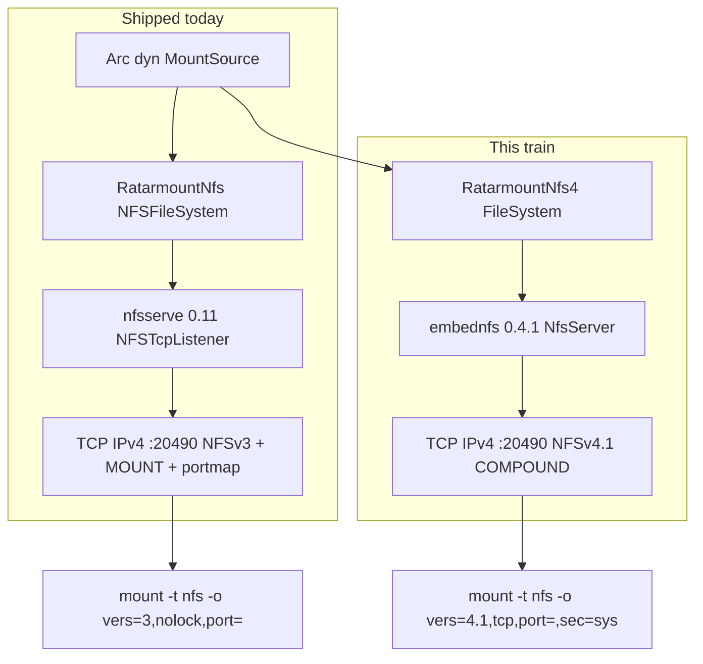
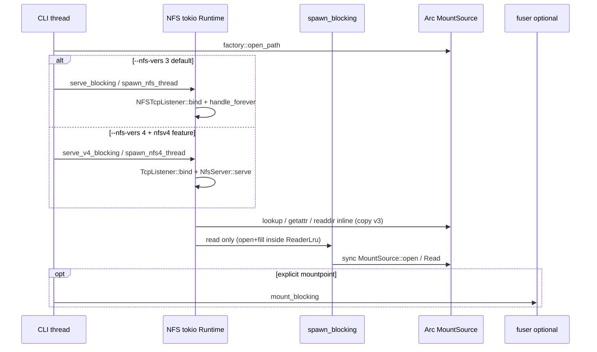

# Roadmap: NFSv3 leftover-on-path through usable NFSv4.1 export

| Field | Value |
|-------|--------|
| **Author** | ratarmount-rs |
| **Date** | 2026-08-15 |
| **Status** | Draft |
| **Workspace** | `/home/mbrewer/projects/ratarmount-rs` (workspace version `0.1.20`, `rust-version = "1.74"`) |
| **Audience** | Implementers who already know `MountSource`, `ratarmount-nfs` NFSv3, `WriteOverlay`, and the CLI factory |

---

## Overview

ratarmount-rs already ships an **in-process NFSv3 export** (`--nfs`, default `127.0.0.1:20490`) on the same `Arc<dyn MountSource>` that FUSE uses. Overlay writes (`-w`) land on v3 today via `RatarmountNfs::with_overlay`. This document is the **implementation train** from that shipped v3 surface to **usable NFSv4.1 export** without breaking existing `vers=3,nolock,port=` clients.

v4 cannot grow out of Hugging Face `nfsserve` 0.11.0 (`NFSFileSystem` + MOUNT + portmap on one TCP port). The protocol is COMPOUND + OPEN/CLOSE + 4.1 sessions/leases and has **no mountd**. The recommended crate is **`embednfs` 0.4.1** (`FileSystem` trait, `NfsServer::listen` / `NfsServer::serve(TcpListener)`). The first implementation PR is a **hard-stop spike**: bind IPv4 high-port + empty/`MemFs`, document blockers. Do **not** start a from-scratch NFSv4 stack in the same PR.

A first-class constraint, verified 2026-08-15 on crates.io: **embednfs 0.4.1 declares `rust-version = "1.88"` and `edition = "2024"`**. Workspace MSRV is **1.74**. The train therefore **feature-gates** v4 (`nfsv4`), following the existing `gzip-rapidgzip` (rustc ≥ 1.87) pattern. Default CI (`cargo clippy --workspace --all-targets` / `cargo test --workspace`) stays on 1.74 and does **not** compile embednfs.

**Product claim “NFSv4 support”** after this train: `ratarmount --nfs --nfs-vers 4 archive.tar.gz` + Linux `mount -t nfs -o vers=4.1,tcp,port=20490,sec=sys 127.0.0.1:/ mnt` → `ls`/`cat`; writes without `-w` fail; overlay create/write on v4 when `-w` is set; lease/idle expiry drops reader slots. Kerberos / RPCSEC_GSS / ACLs / delegations are **follow-on**, not required. A privileged Linux kernel mount is **not** required to merge the spike, but it **is** required before README may say “usable on Linux” (unprivileged EXCHANGE_ID smoke is the required protocol gate; see PR 2).

---

## Background & Motivation

### What is already shipped (do not reimplement)

| Surface | Location | Behavior |
|---------|----------|----------|
| CLI `--nfs` / `--nfs-bind` / `--nfs-export-name` | `ratarmount/src/main.rs` `Args` (~L99–115), `run_nfs_only` (~L764), `run_fuse_and_nfs` (~L784) | Boolean `--nfs` (must not steal archive). NFS-only skips `default_mountpoint`. Overlay `NfsOptions.overlay` is already passed. |
| v3 adapter | `ratarmount-nfs/src/vfs.rs` `RatarmountNfs` | `NFSFileSystem` on `MountSource`. RO default; `-w` maps create/write/mkdir/remove/setattr-size. Rename/symlink stay `NFS3ERR_ROFS`. |
| Inodes | `ratarmount-nfs/src/inode.rs` `InodeTable` | Path ↔ fileid. Root `ROOT_FILEID = 1`. Never stores cheap readdir `FileInfo`. |
| Reader LRU | `ratarmount-nfs/src/reader.rs` `ReaderLru` | Per-fileid live `ArchiveRead`. `fill_read_for_nfs` loops short codec reads. Cap 64. Pin when `!member_seek_is_cheap`. `invalidate` on overlay mutate. |
| Serve | `ratarmount-nfs/src/serve.rs` | One tokio `Runtime` owns bind **and** `handle_forever`. `NfsStop` is tokio-free (`AtomicBool`). |
| Bind | `ratarmount-nfs/src/bind.rs` | IPv4 only — nfsserve `NFSTcpListener::bind` splits on first `:`. |
| Overlay | `ratarmount-compositing/src/write_overlay.rs` | `create_file` / `open_overlay_fd` / `mkdir` / `unlink` / `rmdir` / `truncate`. |
| Operator docs | `docs/nfs-export.md` | v3 recipes, residuals, AUTH_SYS warning. |

Existing remotes (`ratarmount-remote`: HTTP/S3/SSH/WebDAV/SMB) are **ingest**, not export. Do not grow an NFS server there.

### Why v4 is a different stack



- NFSv3: stateless READ; we own the per-fileid LRU because there is no OPEN/CLOSE.
- NFSv4.1: COMPOUND, OPEN/CLOSE, sessions, clientid, leases. **embednfs implements the state machine internally.** Its `FileSystem` trait has **no** `open`/`close`/`lease_expired` hooks (verified docs.rs 0.4.1). We still need a live `ArchiveRead` for gzip / solid 7z `cat`, so the LRU stays — keyed by handle (`u64` fileid), with a later idle/lease approximation (PR 5).
- v3 stays the **CLI default**. Existing clients keep working.

### Pain this train solves

1. Linux clients that prefer or require `vers=4.1` (no separate `mountport=`, no portmap).
2. A path to stateful OPEN so we can pin expensive readers for the life of a client open, then drop on CLOSE / lease expiry (v3 can only LRU-evict).
3. Same overlay write story on v4 (`-w`) without a second overlay implementation.

---

## Goals & Non-Goals

### Goals (this train → “NFSv4 support”)

- Keep **v3 default** and fully working (RO + `-w` overlay). Do not regress AGENTS.md NFS catalog rows.
- Ship **RO NFSv4.1** on `MountSource`: lookup / getattr / readdir / read / readlink.
- CLI `--nfs-vers 3|4` (default `3`), validated **only when `--nfs` is set**. `--nfs-vers 4` requires the `nfsv4` feature. FUSE-only `--nfs-vers 4` is ignored (must not exit 2).
- Bind **IPv4 high port** (default still `127.0.0.1:20490`). Reuse `parse_nfs_bind` / `NfsStop` / skip-`default_mountpoint`.
- Overlay create / write / mkdir / remove / setattr-size on v4 when `-w` is set; same invalidation contract as v3 overlay tests.
- Approximate lease/clientid expiry by dropping idle reader slots (embednfs does not expose OPEN/CLOSE to the trait).
- Docs + `--print-features` + honest residuals. Tests per AGENTS.md in the same PR as the behavior.

### Non-Goals (not “NFSv4 support” v1)

| Explicitly out | Why |
|----------------|-----|
| Kerberos / RPCSEC_GSS | Later optional PR if LAN share is the product. embednfs `AuthContext` is `None` / `Sys` / `Unknown` today — no GSS. |
| ACLs, delegations, pNFS, named attributes / xattrs | embednfs lists these as unsupported or extension-only. Do not advertise. |
| Growing `nfsserve` into v4 | Impossible; different state machine. |
| From-scratch NFS4 stack | Spike stop-and-document instead. |
| Shared FUSE+NFS `VfsAdapter` **before** the spike | Optional cleanup **after** v4 RO lands. |
| Changing `MountSource` / factory open / format crates | Adapter-only. |
| Putting v4 in `ratarmount-remote` | Wrong crate. |
| Leftover **v3 residuals** as train blockers | Listed below; do not schedule them here. |

### Residual v3 — **not on the v4 path** (exclude from this train)

These stay documented in `docs/nfs-export.md`. Do **not** put them in the implementation train as prerequisites.

| Residual | Why it is not a v4 blocker |
|----------|----------------------------|
| nfsserve protocol `READDIR` / Windows `mount.exe` `dir` | v4 uses embednfs READDIR. Windows v3 stays residual. |
| Overlay **rename / symlink** over v3 | v3 leaves `NFS3ERR_ROFS`. v4 overlay PR may still leave rename/symlink `ReadOnly` (same as v3). Not a v3-first blocker. |
| `--nfs-allow` | nfsserve 0.11 `process_socket` is private. embednfs also has no documented accept filter. Localhost remains the boundary. |
| IPv6 bind on `NFSTcpListener` | nfsserve split-on-first-`:`. v4 bind uses `tokio::net::TcpListener` (could do v6 later); this train stays IPv4 to share `--nfs-bind`. |
| NFS-only daemonize | v1 NFS-only stays foreground. Unchanged. |

### “Done” (acceptance for the train)

An engineer can:

1. `ratarmount --nfs testdata.tar.gz` — still NFSv3 on `127.0.0.1:20490`. No stem directory. Existing v3 mount line works.
2. **With** a `nfsv4`-enabled binary: `ratarmount --nfs --nfs-vers 4 testdata.tar.gz` listens on the same default bind (no MOUNT/portmap).
3. Linux `mount -t nfs -o vers=4.1,tcp,port=20490,sec=sys 127.0.0.1:/ mnt` → `ls` / `cat` match the archive. (`sec=sys` is required so AUTH_SYS does not hang on idmap/`nobody`; see client recipe.) This item is the **product** claim: it may stay residual if only unprivileged CI ran, but then README must not say “usable on Linux.”
4. `cat` of a multi-MiB gzip member is complete (fill-loop). Two concurrent `cat`s do not mix cursors.
5. Without `-w`, v4 writes/creates fail (`FsError::ReadOnly` → NFS4ERR_ROFS).
6. With `-w`, v4 create + write + read-back + unlink matches v3 overlay tests.
7. Idle / lease-window expiry drops the reader slot (unit test; no live client required).
8. Unit tests pass without a live mount. PR 2 **requires** an unprivileged TCP EXCHANGE_ID smoke. Live Linux `mount -t nfs -o vers=4.1,tcp,port=,sec=sys` skips if unprivileged and then **blocks** the README Linux claim (does not fail the spike if EXCHANGE_ID passed).
9. `cargo fmt --all && cargo clippy --workspace --all-targets -- -D warnings && cargo test --workspace` green **without** `--features nfsv4`.
10. `cargo test -p ratarmount-nfs --features nfsv4` and `cargo test -p ratarmount --features nfsv4 --bin ratarmount nfs_vers` green on rustc ≥ 1.88.
11. README / parity-todo / mount-options-parity / `docs/nfs-export.md` / `--print-features` updated in the same merge as the CLI capability.

---

## Proposed Design

### High-level process layout



Rules carried over from the v3 design (still true):

- **One Runtime owns bind and serve.** `NfsServer::serve` takes a `tokio::net::TcpListener` created on that runtime. Never bind on main and serve on a second Runtime.
- **`spawn_blocking` scope copies shipped v3** (`vfs.rs` L425–526): **only `read`** (the path that calls `source.open` + fill). lookup / getattr / readdir / access / parent / statfs stay inline on the tokio worker. Overlay `write` / `create` stay inline (same as v3 `write_sync` / `create_sync`). Document the residual: a solid-7z `open` inside `read` on a tokio worker can stall sibling COMPOUND ops on that worker — identical to today’s v3 getattr stall. **Do not** wrap every `FileSystem` method in `spawn_blocking` in PR 3 unless the spike shows COMPOUND LOOKUP+READ deadlocking on one worker; if it does, expand the scope in that PR and say so in `docs/nfs-export.md`.
- **`main.rs` must not name tokio.** Public entry stays `serve_blocking` / `spawn_nfs_thread` (v3) plus v4 twins.
- **`NfsStop`** (`AtomicBool`, 200 ms poll) wraps v4 `serve` in `tokio::select!` the same way `serve_listener` wraps `handle_forever`.

### Feature / MSRV layout (critical)

Verified 2026-08-15 ([crates.io/crates/embednfs](https://crates.io/crates/embednfs), [docs.rs/embednfs/0.4.1](https://docs.rs/embednfs/0.4.1/embednfs/)):

| Crate | Latest | rust-version | edition | License | Downloads |
|-------|--------|--------------|---------|---------|-----------|
| **embednfs** | **0.4.1** (2026-03-10) | **1.88** | **2024** | MIT | ~868 |
| embednfs-proto | 0.4.1 (path dep of embednfs) | 1.88 | 2024 | MIT | — |

Dependencies of embednfs 0.4.1: `async-trait ^0.1.89`, `bytes ^1.11.1`, `dashmap ^6.1.0`, `embednfs-proto ^0.4.1`, `thiserror ^2.0.18`, `tokio ^1.50.0`, `tracing ^0.1.44`.

Workspace today: `rust-version = "1.74"`. CI check job uses `dtolnay/rust-toolchain@stable` **without** features. Precedent: `gzip-rapidgzip` is optional, needs rustc ≥ 1.87, default CI off.

**Decision: do not bump workspace MSRV.** Gate v4:

```toml
# ratarmount-nfs/Cargo.toml
[features]
default = []
# NFSv4.1 via embednfs (requires rustc ≥ 1.88 / edition 2024).
nfsv4 = ["dep:embednfs", "dep:bytes"]

[dependencies]
embednfs = { version = "0.4.1", optional = true }
bytes = { version = "1", optional = true }
```

```toml
# ratarmount/Cargo.toml
[features]
nfsv4 = ["ratarmount-nfs/nfsv4"]
```

| Build | v4 compiled? |
|-------|----------------|
| `cargo test --workspace` (CI `fmt + clippy + test`) | **No** |
| `cargo test -p ratarmount-nfs --features nfsv4` (rustc ≥ 1.88) | Yes |
| Packaging (Linux native + AppImage on rustup **stable**) | **Yes** — `packaging/build-native-packages.sh` and `packaging/build-appimage.sh` must pass `--features nfsv4`. Editing only `.github/workflows/packages.yml` does **not** compile v4 (`build-native-packages.sh` L80–81 is `cargo build --release -p ratarmount` with no features today, same as `gzip-rapidgzip`). |
| `cargo build` (no features) | `--nfs --nfs-vers 4` → exit 2: `rebuild with --features nfsv4 (rustc >= 1.88)` |

Optional CI job (PR 2 or 6): `dtolnay/rust-toolchain@stable` + `cargo test -p ratarmount-nfs --features nfsv4` + `cargo test -p ratarmount --features nfsv4 --bin ratarmount nfs_vers`. Soft-skip is **not** allowed for the unit tests once the feature compiles; the job itself may be `continue-on-error` only if we decide not to gate merge on it in the spike. After the RO adapter lands, the job should be required **or** packaging-only — spike PR documents which.

### embednfs API we will actually call (do not invent)

From [docs.rs/embednfs/0.4.1](https://docs.rs/embednfs/0.4.1/embednfs/):

**Listen / serve**

```rust
// Preferred: we own the socket (IPv4 high-port, ephemeral :0 in tests).
let listener = tokio::net::TcpListener::bind(opts.bind).await?;
let port = listener.local_addr()?.port();
embednfs::NfsServer::new(fs).serve(listener).await?;

// Also available: NfsServer::listen(&self, addr: &str) — string form
// "127.0.0.1:20490" is IPv4 and does not hit nfsserve's split-on-first-':' bug.
// Spike must try BOTH listen("127.0.0.1:0" or :20490) AND serve(pre-bound TcpListener).
```

`NfsServerBuilder` only exposes `id_mapper` + `build`. No lease-time, no bind-hook, no accept-filter in the public builder (0.4.1).

**`FileSystem` (required methods)** — all async except `root` / provided `capabilities` / `limits`:

| Method | Notes for our adapter |
|--------|----------------------|
| `type Handle: Clone + Eq + Hash + Send + Sync` | Use `u64` (same as `InodeTable` fileid). `MemFs` does this. **Handle is backend identity, not the NFS wire filehandle and not automatically the exported `fileid`** (embednfs README). We happen to use the same integer for both; still **always set `Attrs.fileid` explicitly**. embednfs owns the wire fh. |
| `root() -> Handle` | `ROOT_FILEID` (`1`). |
| `statfs(ctx)` | Map `MountSource::statfs()` → `FsStats`. |
| `getattr(ctx, handle)` | Lookup-sourced `FileInfo` → `Attrs`. |
| `access(ctx, handle, requested)` | `requested & granted`. docs.rs 0.4.1 `AccessMask` bits: `READ`, `LOOKUP`, `MODIFY`, `EXTEND`, `DELETE`, `EXECUTE` (+ `BitAnd`). RO `granted = READ \| LOOKUP \| EXECUTE`. Overlay adds `MODIFY \| EXTEND \| DELETE`. **Do not honor AUTH_SYS uid for authorization.** Do **not** return `requested` unchanged. |
| `lookup(ctx, parent, name: &str)` | Same as v3 `lookup_sync` but `name` is already `&str` (not `filename3`). |
| `parent(ctx, dir)` | `parent_path`; root → `Ok(None)`. |
| `readdir(ctx, dir, cookie, max_entries, with_attrs)` | Cookie-driven (see below). |
| `read(ctx, handle, offset, count)` | LRU + `fill_read_for_nfs` → `ReadResult { data: Bytes, eof }`. |
| `write` / `create` / `remove` / `rename` / `setattr` | RO: `Err(FsError::ReadOnly)`. Overlay PR maps the subset we support. |

**Provided extension getters** (default `None`):

- `symlinks()` → implement `Symlinks` for **readlink only**; `create_symlink` → `ReadOnly`.
- `xattrs` / `hard_links` / `commit_support` → leave `None`.

**Types we map**

| embednfs | Our source |
|----------|------------|
| `Attrs { object_type, fileid, change, size, space_used, link_count, mode, uid, gid, atime, mtime, ctime, birthtime, … }` | `FileInfo` + fileid. `change` = bump counter on overlay mutate (start at 1). `ObjectType::{File,Directory,Symlink}` only — FIFOs/devices become `File`. |
| `SetAttrs.size` | `WriteOverlay::truncate`. Other setattr fields ignored or `ReadOnly`. |
| `CreateRequest { kind: File \| Directory, attrs }` | Overlay: `create_file` / `mkdir`. Return `CreateResult { handle: id, attrs }` from post-create getattr (docs.rs 0.4.1 `CreateResult { handle, attrs }`). |
| `DirEntry { name, handle, cookie, attrs }` | Child name, fileid, cookie = that fileid, optional `Attrs` when `with_attrs`. |
| `DirPage { entries, eof }` | Same pagination idea as v3 `ReadDirResult`. |
| `ReadResult { data: Bytes, eof }` | Fill-loop buffer. |
| `WriteResult { written, stability }` | `written = data.len() as u32`. **`WriteStability::{Unstable, DataSync, FileSync}`** (docs.rs 0.4.1; there is **no** `FileWritten`). After `write_all` **without** `fsync`, return **`DataSync`** (bytes reached the overlay file/page cache). Do not claim `FileSync` unless PR 4 adds an explicit `sync_all`. |
| `FsError` | See error table. |
| `FsCapabilities` | `symlinks: true`, `hard_links: false`, `xattrs: false`, `explicit_sync: false`, `case_sensitive: true`, `case_preserving: true`. |
| `FsLimits` | `max_name_bytes` from `statfs().namemax` (255), `max_read`/`max_write` = 1 MiB, `max_file_size` = `u64::MAX`. RO: `max_write = 0`. |
| `RequestContext { auth: AuthContext }` | Ignore for authz. `AuthContext::{None, Sys { uid, gid, supplemental_gids }, Unknown { flavor }}`. |
| `NumericIdMapper` | Default is fine (`NfsServer::new`). |

**What embednfs handles internally (we do not reimplement):** EXCHANGE_ID, CREATE_SESSION, SEQUENCE, DESTROY_SESSION, DESTROY_CLIENTID, PUTROOTFH/PUTFH/GETFH, OPEN/CLOSE/OPEN_DOWNGRADE, LOCK/LOCKT/LOCKU, RECLAIM_COMPLETE, filehandles. Support target of embednfs itself is **macOS over localhost**. Our first **product** acceptance is Linux `vers=4.1` **after** a privileged mount succeeds. The spike **must** prove protocol via unprivileged EXCHANGE_ID; a skipped live mount is a residual, not a green Linux claim. macOS `vers=4` means NFSv4.0 — clients must pass **`vers=4.1`** (embednfs README).

**embednfs non-promises (encode in docs):** “does not guarantee correct or robust behavior over a real network”; “does not guarantee correct behavior for non-macOS clients.” Our POC boundary is **localhost + RO** (then overlay on localhost). LAN + Kerberos is out.

### Module layout

```
ratarmount-nfs/src/
  lib.rs          # existing v3 exports + cfg-gated v4
  bind.rs         # shared IPv4 parser (unchanged)
  error.rs        # io_to_nfsstat3; add io_to_fserror behind nfsv4
  inode.rs        # shared InodeTable (protocol-free)
  names.rs        # join_path / parent_path (v4 lookup uses &str)
  reader.rs       # shared ReaderLru + fill_read_for_nfs
  serve.rs        # v3 serve / spawn_nfs_thread
  vfs.rs          # RatarmountNfs : NFSFileSystem
  v4/             # #[cfg(feature = "nfsv4")]
    mod.rs
    adapter.rs    # RatarmountNfs4 : embednfs::FileSystem + Symlinks
    serve.rs      # serve_v4 / serve_v4_blocking / spawn_nfs4_thread
    error.rs      # io_to_fserror
```

Do **not** implement `NFSFileSystem` for the v4 type. Do **not** start a MOUNT listener for v4.

### Shared types: what to reuse vs copy

| Type | Reuse? | How |
|------|--------|-----|
| `InodeTable` | **Yes, as-is** | Already protocol-free (`pub(crate)` in the same crate). |
| `join_path` / `parent_path` | **Yes** | `names.rs`. v4 `lookup` takes `&str`; still reject `name.len() > 255` → `NameTooLong`. |
| `fill_read_for_nfs` / `readahead_fill` / `fill_from_state` | **Yes** | Same UnexpectedEof class. |
| `ReaderLru` | **Yes after a 10-line hygiene change** | Today `get_or_open` returns `nfsstat3`. Add `get_or_open` returning `io::Error` (or keep nfsstat3 mapper as a thin wrapper). **Do not copy the LRU.** |
| `parse_nfs_bind` / `nfs_bind_string` / `NfsStop` / `NfsOptions` | **Yes** | Add `NfsOptions.vers: NfsVers` (`V3` default, `V4` only compiled/accepted with feature). |
| `RatarmountNfs` / `NFSFileSystem` | **No** | v3 only. |
| `io_to_nfsstat3` | v3 only | v4 uses `io_to_fserror`. |

Hygiene (PR 1) is **on the v4 path** because `get_or_open` is the only coupling. Do **not** dump leftover v3 residuals into that PR.

```rust
// reader.rs — target shape after PR 1
impl ReaderLru {
    pub(crate) fn get_or_open(
        &self,
        source: &dyn MountSource,
        inodes: &InodeTable,
        id: u64,
    ) -> io::Result<(FileInfo, Arc<Mutex<SourceReadState>>)> { /* existing body; map STALE via ErrorKind::NotFound */ }

    pub(crate) fn invalidate(&self, id: u64) { /* unchanged */ }
}

// vfs.rs v3 maps:
// get_or_open(...).map_err(|e| if e.kind() == NotFound { STALE } else { io_to_nfsstat3(&e) })
```

Unknown fileid: `path_for_id` is `None` → `io::ErrorKind::NotFound` → v3 `NFS3ERR_STALE`, v4 `FsError::Stale`. Do **not** use `NotFound` for “name missing in directory” at the VFS layer — that is `FsError::NotFound` / `NFS3ERR_NOENT` from `lookup` itself.

### `NfsOptions` / CLI

```rust
#[derive(Clone, Copy, Debug, PartialEq, Eq)]
pub enum NfsVers {
    V3,
    #[cfg(feature = "nfsv4")]
    V4,
}

pub struct NfsOptions {
    pub bind: SocketAddr,                 // existing
    pub export_name: Option<String>,      // v3 MOUNT only; ignored on v4
    pub readahead_bytes: u64,
    pub reader_slots: usize,              // unused on v3 today (`nfs_from_opts` ignores it); v4 also ignores — always DEFAULT_READER_SLOTS. Do not claim it is wired.
    pub stop: Option<NfsStop>,
    pub overlay: Option<Arc<WriteOverlay>>,
    pub vers: NfsVers,                    // NEW, default V3
}
```

CLI (`main.rs`):

`--nfs` stays `ArgAction::SetTrue` (must not steal the archive). `--nfs-vers` is a **required-value** string like `--nfs-bind`:

```rust
/// NFS protocol version. Default 3 (nfsserve). `4` is NFSv4.1 (embednfs; needs --features nfsv4).
/// Required value (`num_args = 1`). Do **not** use `num_args = 0..=1` or `default_missing_value`
/// — that recreates the `--nfs` archive-steal bug.
#[arg(long = "nfs-vers", value_name = "3|4", default_value = "3", num_args = 1)]
nfs_vers: String,
```

**When to parse:** same as `--nfs-bind` (`main.rs` L659–669). Call `parse_nfs_vers` **only if `args.nfs`**. Without `--nfs`, ignore `--nfs-vers` (optional `log::debug!`); **must not exit 2**. Feature-off exit 2 only for `--nfs --nfs-vers 4`.

`--nfs --nfs-vers testdata.tar.gz` (missing value) consumes the archive as the version string; clap succeeds, then `parse_nfs_vers("testdata.tar.gz")` → exit 2. That is acceptable; state it in the steal-regression comment.

Parse table (**applies only when `--nfs` is set**):

| Input | Feature off | Feature on |
|-------|-------------|------------|
| omitted / `3` | V3 | V3 |
| `4` / `4.1` / `4.0` | exit 2, rebuild message | `4` and `4.1` → V4. **`4.0` → exit 2** (“only NFSv4.1; embednfs rejects v4.0-only ops”; macOS `vers=4` is 4.0) |
| anything else | exit 2 | exit 2 |

`--nfs-export-name` on v4: **warn and ignore** (no MOUNT). Do not fail.

`run_nfs_only` **and** `run_fuse_and_nfs` branch on `opts.vers` for **both** the serve path and the **stderr ready-line**. Today `run_fuse_and_nfs` hardcodes `NFSv3 ({}) on port {}` (`main.rs` L805–814) — implementers must not leave that string after `--nfs-vers 4`.

Ready-line (NFS-only **and** FUSE+NFS):

```text
# v3 (unchanged)
NFSv3 (ro) on 127.0.0.1:20490. Client: mount -t nfs -o vers=3,tcp,nolock,port=20490,mountport=20490 127.0.0.1:/ <dir>

# v4 — include sec=sys so Linux AUTH_SYS does not hang on nfsidmap / nobody.
# If localhost still maps nobody, operators may set nfs4_disable_idmapping=1 or
# Domain = localdomain in /etc/idmapd.conf; that is **client config**, not a protocol kill.
# Optional: nosharecache if remounting the same server:port after a restart.
NFSv4.1 (ro) on 127.0.0.1:20490. Client: mount -t nfs -o vers=4.1,tcp,port=20490,sec=sys 127.0.0.1:/ <dir>
```

No `mountport=` / `nolock` on the v4 line (4.1 has no separate mountd; embednfs implements LOCK ops as cheap compatibility — we still document “no NLM product promise”). Spike must record the **minimal Linux option set** that actually mounts `MemFs` and put that string here and in `docs/nfs-export.md` if it differs (likely `vers=4.1,tcp,port=,sec=sys`, maybe `nosharecache`).

### Adapter sketch (`RatarmountNfs4`)

```rust
#[cfg(feature = "nfsv4")]
pub struct RatarmountNfs4 {
    source: Arc<dyn MountSource>,
    overlay: Option<Arc<WriteOverlay>>,
    inodes: Arc<InodeTable>,
    readers: Arc<ReaderLru>,
    readahead_bytes: usize,
    change: AtomicU64, // Attrs.change; fetch_add on overlay mutate
}

impl RatarmountNfs4 {
    pub fn with_overlay(
        source: Arc<dyn MountSource>,
        readahead_bytes: usize,
        overlay: Option<Arc<WriteOverlay>>,
    ) -> Self { /* same fields as RatarmountNfs; ReaderLru::new(DEFAULT_READER_SLOTS) — do not pass NfsOptions.reader_slots (unused on v3) */ }

    fn bump_after_mutate(&self, id: u64) {
        self.readers.invalidate(id);
        self.inodes.clear_lookup_fi(id);
        self.change.fetch_add(1, Ordering::Relaxed);
    }
}
```

**Never store cheap readdir `FileInfo`.** Same TAR-userdata bug class as v3 (`readdir_size_zero_then_read_uses_lookup_userdata`).

**`read`:** clone Arcs, **`spawn_blocking` only here** (copy v3 `NFSFileSystem::read`) → `readers.get_or_open` → `fill_from_state`. EOF: `offset + n >= fi.size || n < count`. Short `Read::read` is **not** EOF. Other `FileSystem` methods stay inline.

**`readdir` cookies:** sort children by fileid (same as v3). Do **not** emit `.` / `..` — Linux `nfs4_setup_readdir` injects them at cookie 0 (reserved cookies 1/2); returning them duplicates `ls -lah`. `cookie == 0` starts at the first child. Child `DirEntry.cookie = fileid` (`> 2`). `eof` when the page includes the last child. Unknown/vanished child cookie → resume at the next surviving child (empty page + eof at end), not an error (embednfs maps errors to NFS4ERR_INVAL which aborts `ls`). Returned cookies are never 0, 1, or 2. lookup still handles `"."` / `".."`.

**`access`:** `Ok(requested & granted)` using docs.rs 0.4.1 constructors (`AccessMask::READ` etc. + `BitAnd`). No fallback that returns `requested` unchanged.

```rust
let mut granted = AccessMask::READ | AccessMask::LOOKUP | AccessMask::EXECUTE;
if self.overlay.is_some() {
    granted |= AccessMask::MODIFY | AccessMask::EXTEND | AccessMask::DELETE;
}
Ok(requested & granted)
```

**`statfs`:** map `StatFs { bsize, namemax }` into `FsStats`. Confirm remaining `FsStats` fields on docs.rs in the impl PR (space totals for an archive). Use zeros / `u64::MAX` for unknown space; this is an archive, not a block device.

### Overlay writes on v4 (PR 4)

Same mapping as `vfs.rs` `create_sync` / `write_sync` / `mkdir_sync` / `remove_sync` / `setattr_sync`:

| FileSystem | Overlay |
|------------|---------|
| `create(..., CreateKind::File)` | `WriteOverlay::create_file` then close fd (NFS create is not a FUSE fh). Return `CreateResult { handle: id, attrs }` from post-create getattr. |
| `create(..., CreateKind::Directory)` | `mkdir`. Same `CreateResult { handle, attrs }`. |
| `write(handle, offset, data, _)` | `open_overlay_fd` + seek + `write_all`; `bump_after_mutate`. Return `WriteResult { written: data.len() as u32, stability: WriteStability::DataSync }` (no `fsync`). |
| `setattr` with `SetAttrs.size = Some(n)` | `truncate`; bump. Other setattr: ignore (return current `Attrs`) unless we later add chmod. |
| `remove` | `unlink` or `rmdir` from lookup mode. |
| `rename` | `FsError::ReadOnly` (same as v3). |
| `Symlinks::create_symlink` | `FsError::ReadOnly`. |

Without overlay: every mutator → `FsError::ReadOnly`.

`write` on v4 still reopens the overlay fd per RPC (stateless at the `FileSystem` layer). Invalidate reader so the next `read` cannot serve pre-mutation bytes — **same contract as** `overlay_truncate_and_unlink_invalidate_reader`.

### Lease / OPEN state (PR 5)

**Fact:** embednfs `FileSystem` has no OPEN/CLOSE. Sessions, clientid, and leases live inside `NfsServer`. There is no public “lease expired” callback in 0.4.1.

**Therefore we do not pretend we receive CLOSE.** We implement a **reader idle TTL** that approximates lease expiry:

| Knob | Value |
|------|--------|
| `READER_IDLE_TTL` | **90s** (typical NFSv4 lease). Constant in `v4/adapter.rs`; not a CLI flag in this train. |
| Sweep | On `get_or_open` insert, and a 1 Hz task in `serve_v4` that calls `readers.evict_idle(ttl)`. |
| Pin | Existing `!member_seek_is_cheap` still prefers evicting cheap slots first under cap. Idle sweep **may** drop pinned slots after TTL — that is the lease approximation. Next READ re-opens (prefix-from-0 for solid 7z; acceptable after 90s idle). |
| Cap 64 | Unchanged. |

PR 5 also adds `ReaderLru::evict_idle(ttl: Duration)` (shared; v3 may call it later — **not required** for v3 in this train).

Unit tests (no TCP): insert a slot, sleep past TTL (injectable `Instant` **or** test-only `last_used` backdate), assert `get_or_open` opens a new reader (identity via a counting `MountSource::open`). Do **not** require a live NFSv4 client to prove TTL.

If the spike discovers a hidden embednfs hook (`FileSystem` default method, builder callback), prefer that and shrink the TTL to a safety net. Spike must **grep the crate source** (`~/.cargo/registry/src/**/embednfs-0.4.1`) for `lease`, `close`, `open` on the trait. Document the finding in `docs/nfs-export.md`.

### try-v4-then-v3 / port 2049 (optional PR 7)

**Do not implement dual-protocol on one port in this train unless it is cheap after PRs 3–5.** Reasons:

- NFSv3 (RPC program 100003 + MOUNT 100005 + portmap) and NFSv4.1 (COMPOUND, no portmap) cannot share `nfsserve`’s `NFSTcpListener` and `embednfs::NfsServer` on the **same** accepted socket without a custom RPC dispatcher. Neither crate documents a “detect version and hand off” API.
- Linux clients pick `vers=` explicitly. `mount -t nfs` without `vers=` may try v4 first on modern kernels — that is a **client** policy, not something we can mux without a combined server.

**Document** (docs PR): use `--nfs-vers 4` or default v3. If operators want “try 4 then 3”, they run two processes on two ports, or we revisit after embednfs grows a mux (unlikely).

Port **2049**: optional later. Default stays **20490**. Binding 2049 needs root or `CAP_NET_BIND_SERVICE`. Same `parse_nfs_bind("2049")` already works (`127.0.0.1:2049`). Docs recipe only.

### Spike kill criteria (PR 2 — stop and document)

The spike PR **must stop** (land docs-only residual + feature stub that errors clearly) and **must not** start a from-scratch NFS4 stack if any of:

1. `embednfs = "0.4.1"` does not compile on rustc ≥ 1.88 behind `nfsv4`.
2. Cannot bind IPv4 `127.0.0.1:0` or `:20490` via `TcpListener::bind` + `NfsServer::serve` **or** `NfsServer::listen("127.0.0.1:20490")`.
3. **Protocol:** required unprivileged EXCHANGE_ID smoke fails (TCP connect + RPC NFSv4 COMPOUND `EXCHANGE_ID` does not get a usable reply — hang, RST, `PROG_UNAVAIL`, or no NFS4_OK-class result). This is the kill, **not** a skipped `mount`.
4. `FileSystem` cannot be implemented on a handle that is just `u64` / cannot sit beside `MountSource` (trait requires something we cannot provide).

**Not a kill (record as residual / client config):**

- Live `mount -t nfs` skipped because unprivileged → document **“Linux kernel client unverified”**. Spike may merge; README **must not** claim usable-on-Linux until a privileged run with `vers=4.1,tcp,port=,sec=sys` succeeds.
- Mount hangs or maps `nobody` **without** `sec=sys` / idmap disabled → **idmap/client policy**, not missing EXCHANGE_ID. Retry with `sec=sys` (and note `nfs4_disable_idmapping` / `idmapd.conf`). Do not trip kill #3.
- Mount still fails **after** `sec=sys` while EXCHANGE_ID passed → residual that **blocks** the Linux product claim; do not start a from-scratch stack. New design pass only if we cannot live with “protocol OK, kernel client residual.”

On kill: update `docs/nfs-export.md` + `docs/parity-todo.md` with the exact blocker, keep `--nfs-vers 4` as “not shipped”, leave v3 default. Later design pass required before a from-scratch stack.

---

## API / Interface Changes

### `ratarmount-nfs` (always compiled)

```rust
pub enum NfsVers { V3, /* cfg nfsv4: V4 */ }

impl NfsOptions {
    // new field: vers: NfsVers (default V3)
}

/// Map io::Error → nfsstat3 (existing).
pub fn io_to_nfsstat3(err: &io::Error) -> nfsstat3;
```

`serve` / `serve_blocking` / `spawn_nfs_thread` stay **v3-only** (current signatures). Adding a `match opts.vers` inside them is acceptable **if** v4 is cfg-gated so the default build does not pull embednfs. Prefer separate `serve_v4_*` symbols to keep v3 reviewable.

### `ratarmount-nfs` (`--features nfsv4`)

```rust
pub fn io_to_fserror(err: &io::Error) -> embednfs::FsError;

pub struct RatarmountNfs4 { /* ... */ }
impl RatarmountNfs4 {
    pub fn new(source: Arc<dyn MountSource>, readahead: usize) -> Self;
    pub fn with_overlay(...) -> Self;
}

pub async fn serve_v4(source: Arc<dyn MountSource>, opts: NfsOptions) -> io::Result<()>;
pub fn serve_v4_blocking(source: Arc<dyn MountSource>, opts: NfsOptions) -> io::Result<()>;
pub fn spawn_nfs4_thread(...) -> io::Result<NfsServerHandle>;
```

`io_to_fserror`:

| `io::ErrorKind` | `FsError` |
|-----------------|-----------|
| `NotFound` | `NotFound` (VFS layer remaps inode-miss to `Stale`) |
| `PermissionDenied` | `AccessDenied` (encrypted nested without `--password`) |
| `IsADirectory` | `IsDirectory` |
| `InvalidInput` | `InvalidInput` |
| `Unsupported` | `Unsupported` |
| other | `Io` |

VFS-level (no `io::Error`): `Stale`, `NotFound`, `NotDirectory`, `IsDirectory`, `ReadOnly`, `NameTooLong`, `AlreadyExists`.

### Binary

- `nfsv4` feature forwards to `ratarmount-nfs/nfsv4`.
- `--nfs-vers` is a required-value clap flag (`num_args = 1`). **Validate only when `--nfs` is set** (same as `--nfs-bind`). FUSE-only `--nfs-vers 4 archive mnt` must parse and must **not** exit 2 at the vers gate. Without feature, **`--nfs --nfs-vers 4`** exits 2.
- No tokio dep on `ratarmount`.
- `print_features()`:

```
  nfs: nfsserve NFSv3 (--nfs, default); NFSv4.1 embednfs (--nfs-vers 4, --features nfsv4, rustc>=1.88)
```

Without feature, print `nfsv4: not compiled`.

### `MountSource` / factory / formats

**No trait change.** No factory open-path change.

---

## Data Model Changes

None on disk. No SQLite schema.

In-memory additions (v4 process lifetime):

- Same `InodeTable` + `ReaderLru`.
- `AtomicU64` changeid for `Attrs.change`.
- embednfs internal clientid/session/lock state (opaque; process lifetime; restart invalidates clients).

**Migration:** n/a.

---

## Alternatives Considered

### 1. Feature-gated embednfs 0.4.1 (recommended)

| | |
|--|--|
| Pros | Real NFSv4.1 COMPOUND/session stack. `FileSystem` matches our VFS. `serve(TcpListener)` binds IPv4 high-port without nfsserve’s `:` split. MIT. Same tokio runtime pattern. |
| Cons | rustc 1.88 / edition 2024. ~868 downloads, macOS-localhost support target. No OPEN/CLOSE hook. Young crate (first publish 2026-03-08). |
| Verdict | **Train path.** Spike is the risk valve. |

### 2. Bump workspace MSRV to 1.88 and always compile embednfs

| | |
|--|--|
| Pros | `--nfs-vers 4` always in the default binary; no feature flag. |
| Cons | Breaks `rust-version = "1.74"` (README badge, `gzip-rapidgzip` already special-cased). Touches every crate. Out of scope for an NFS adapter. |
| Verdict | **Reject.** Follow `gzip-rapidgzip`. Enable `nfsv4` only in packaging + optional CI. |

### 3. Vendor / rewrite embednfs to edition 2021 / MSRV 1.74

| | |
|--|--|
| Pros | Default builds get v4 without a feature. |
| Cons | ~7800 LOC + proto crate. High risk. Violates “do not start a from-scratch NFS4 stack.” |
| Verdict | **Reject** unless spike kill #1 (cannot depend on 0.4.1 at all, even on 1.88). Then a **new design pass**. |

### 4. Dual-listen nfsserve + embednfs on one port / try-v4-then-v3

| | |
|--|--|
| Pros | `mount -t nfs` without `vers=` might work. |
| Cons | No mux API. Two RPC program models. Easy to break v3. |
| Verdict | **Out of train.** Document two ports or explicit `--nfs-vers`. |

### 5. Extract shared `VfsAdapter` before the spike

| | |
|--|--|
| Pros | One copy of inode/reader. |
| Cons | Touches the live v3 `cat` path before v4 exists. Settled: copy/reuse in-crate; extract only if spike lands. |
| Verdict | **Not required.** PR 1 is only `ReaderLru` error decoupling. Optional cleanup PR after PR 3 is green. |

### 6. Stay on nfsserve / skip v4

| | |
|--|--|
| Pros | Zero new risk. |
| Cons | Does not meet the product goal. |
| Verdict | **Reject** as the train; v3 remains the default fallback. |

---

## Security & Privacy Considerations

### Threat model (v4 POC)

| Threat | Severity | Mitigation |
|--------|----------|------------|
| LAN read of archive | **High** if non-loopback bind | Default `127.0.0.1`. Warn on non-loopback (existing v3 warning; reuse). |
| AUTH_SYS spoof | **High** on LAN | Do **not** authorize by `AuthContext::Sys` uid. World-readable at NFS layer. Localhost is the boundary. |
| AUTH_NONE / `AuthContext::None` | Medium | Accept; same as v3 AUTH_SYS-not-verified. |
| Encrypted nested 7z/ZIP | **High** | Password still at **server** open (`--password`). Map `PermissionDenied` → `FsError::AccessDenied`. |
| Writer without overlay | Medium | `FsError::ReadOnly`. |
| Writer with overlay | Medium | Overlay is a local directory; same as FUSE `-w`. No wire encryption. |
| Port 2049 surprise | Medium | Default 20490. |
| Stale fh after restart | Low | Remount. Document. |
| embednfs lock implementation | Low | Not a product lockd. Do not claim POSIX locks. |

Kerberos is the only credible LAN-auth story; it is **out of v1**.

### What we do not promise

- “This is a NAS.”
- RPCSEC_GSS, TLS, export pinning, per-uid squash.
- Windows NFSv4 client.
- Kernel `nfsd` re-export of this export.

---

## Observability

| Signal | How |
|--------|-----|
| Ready | `log::info!` + stderr recipe (v3 or v4.1 line). Daemonize: still invisible without `-f`/`--log-file`. |
| Bind fail | stderr (fg) or `/tmp/ratarmount-rs-nfs-error.log` (daemon child). Unchanged. |
| Feature missing | **`--nfs --nfs-vers 4`** without `nfsv4` → stderr + exit 2. Bare `--nfs-vers 4` without `--nfs` is ignored. |
| Read / overlay errors | `debug!` path, offset, `FsError`. |
| Idle evict | `debug!` fileid; `info!` if a pinned 7z slot is dropped. |
| Metrics | None (no metrics crate). |
| Tracing | embednfs uses `tracing`. Same rule as v3: do **not** add a second subscriber that fights `env_logger`. If v4 logs vanish, add `tracing-log` **only** in `serve_v4_blocking`. |

---

## Rollout Plan

1. **PR 1** hygiene (ReaderLru `io::Error`) — default CI, no feature.
2. **PR 2 spike** — `nfsv4` feature + bind `MemFs` / empty FS. Kill or proceed.
3. **PR 3** RO adapter + `--nfs-vers`. v3 default untouched.
4. **PR 4** overlay writes on v4.
5. **PR 5** idle/lease reader drop.
6. **PR 6** docs + `--print-features` + packaging `nfsv4` + AGENTS.md rows (docs for flags land **with** PR 3/4 per AGENTS.md; PR 6 is the consolidating pass).
7. **PR 7** optional: 2049 recipe / explicit “no mux” doc. No try-v4-then-v3 implementation unless spike found a cheap mux.

**Feature flag:** `nfsv4` (compile-time). No runtime percentage rollout.

**Rollback:** omit `--nfs-vers 4`; or ship packages without `nfsv4`; or revert the member.

**Packaging:** enable `nfsv4` in **`packaging/build-native-packages.sh`** (L80–81 today has no features) and **`packaging/build-appimage.sh`** (L30). Optional: `packaging/build-macos-tarball.sh` (L62–63) if the macOS builder is rustc ≥ 1.88 (rustup stable — expected). This is a **stronger** packaging commitment than `gzip-rapidgzip` (still off). Current jobs install rustup **stable**, so 1.88+ is expected; if a Rocky/portable builder is ever pinned below 1.88, keep the feature off and document. Workflow YAML alone does not compile v4.

---

## Test Plan (AGENTS.md)

Every behavior lands with tests in the same PR. Prefer **no live mount**.

### PR 1 (no feature)

| Test | Asserts |
|------|---------|
| Existing `fill_loops_until_full` / `concurrent_readers_isolated` / overlay tests | Still green after `get_or_open` returns `io::Error`. |
| `get_or_open` unknown id | `ErrorKind::NotFound`. |

### PR 2 spike (`--features nfsv4`)

| Test | Asserts |
|------|---------|
| `v4_bind_ipv4_high_port` | `TcpListener::bind("127.0.0.1:0")` + `NfsServer::new(MemFs::new()).serve` starts; `NfsStop` returns within 2s. **May** use a real socket. |
| `v4_listen_string_ipv4` | `listen("127.0.0.1:0")` or documented equivalent; skip if `listen` cannot take `:0` (then `serve` is the supported path). |
| **`v4_exchange_id_smoke` (required, unprivileged)** | Bind `MemFs` on `127.0.0.1:0`. From the same test process, TCP-connect and send an ONC-RPC NFSv4 COMPOUND `EXCHANGE_ID` (program 100003, version 4). Expect a reply that is not RST/timeout/`PROG_UNAVAIL` and that decodes as a successful EXCHANGE_ID-class result (NFS4_OK or embednfs’s documented success). May use embednfs’s `nfs-rs` foreign-client smoke lane as a **dev-dep** if it compiles on rustc ≥ 1.88; otherwise a minimal hand-rolled RPC is fine. **This test is the Linux protocol gate.** Live `mount` is **not** a substitute. |

If bind tests cannot be written because the API will not bind → **kill**, docs only. If `v4_exchange_id_smoke` fails → **kill #3**. Optional live Linux `mount -t nfs -o vers=4.1,tcp,port=$PORT,sec=sys 127.0.0.1:/ …` skip-if-unprivileged: on skip, write **“Linux kernel client unverified”** in `docs/nfs-export.md` and do **not** treat the spike as green for the README Linux claim.

### PR 3 RO adapter (`--features nfsv4`)

Synthetic `MountSource` (copy the v3 `Synth` in `vfs.rs` tests; do not import FUSE `XattrSource`).

| Test | Asserts |
|------|---------|
| `v4_root_and_lookup_stable` | `root() == 1`; stable handle; getattr size/mode. |
| `v4_missing_is_notfound_unknown_handle_stale` | lookup miss → `NotFound`; getattr(99) → `Stale`. |
| `v4_readdir_cookie_and_unknown` | Pagination of real children by name; unknown cookie → empty page + eof (not an error). Cookies `> 2`. No `.` / `..` entries. |
| `v4_readdir_does_not_emit_dot_dotdot` | Cookie-0 listings omit `.` / `..` (Linux client injects them). |
| `v4_writers_readonly` | write/create/remove/rename/setattr-size → `ReadOnly`. |
| `v4_readlink` | `Symlinks::readlink` returns target. |
| **`Regression: v4 readdir cheap size 0 then cat`** | Same as v3 `readdir_size_zero_then_read_uses_lookup_userdata`. |
| **`Regression: v4 short Read::read is not EOF`** | Fill-loop. |
| **`Regression: v4 concurrent readers isolated`** | Two tasks, different offsets. |
| `v4_read_dir_isdir` | `read` on root → `IsDirectory`. |
| CLI `nfs_vers_default_is_3` | `--nfs a.tar` → vers 3. |
| **`Regression: nfs_vers_4_does_not_steal_archive`** | `Args::try_parse_from(["ratarmount", "--nfs", "--nfs-vers", "4", "testdata.tar.gz"])` → `nfs == true`, `nfs_vers == "4"`, `paths == ["testdata.tar.gz"]`. Next to `nfs_flag_does_not_steal_archive`. |
| CLI `nfs_vers_ignored_without_nfs` | `["ratarmount", "--nfs-vers", "4", "archive.tar.gz", "mnt"]` parses; `nfs == false`; paths keep archive + mountpoint. Vers gate must **not** exit 2 (unit on the helper: do not call `parse_nfs_vers` unless `nfs`). |
| CLI `nfs_vers_4_accepted` (feature on) | `--nfs --nfs-vers 4 a.tar` → V4. |
| CLI `nfs_vers_4_rejected_without_feature` | `#[cfg(not(feature = "nfsv4"))]` unit: `parse_nfs_vers("4")` is the rebuild error. Only reached from CLI when `--nfs` is set. |
| CLI `nfs_vers_missing_value_exits_2` | `--nfs --nfs-vers testdata.tar.gz` treats the archive as the version string → parse fail → exit 2. Acceptable; comment it. |

Optional live: `tests/live_mount_v4.rs` skip if unprivileged.

### PR 4 overlay (`--features nfsv4`)

Mirror `overlay_create_write_read_mkdir_readdir` and `overlay_truncate_and_unlink_invalidate_reader` against `RatarmountNfs4`.

### PR 5 idle TTL

| Test | Asserts |
|------|---------|
| `reader_evict_idle_drops_slot` | Backdated `last_used` → next open increments `MountSource::open` count. |
| `reader_evict_idle_keeps_fresh` | Recent slot not dropped. |

### AGENTS.md catalog rows (land with PR 3 / 4 / 5)

```
| NFSv4.1 RO adapter (lookup/read/readdir) | `cargo test -p ratarmount-nfs --features nfsv4 --lib v4_` |
| NFSv4 overlay create/write invalidate | `cargo test -p ratarmount-nfs --features nfsv4 --lib v4_overlay` |
| NFSv4 reader idle/lease drop | `cargo test -p ratarmount-nfs --features nfsv4 --lib evict_idle` |
| NFS --nfs-vers 3\|4 clap | `cargo test -p ratarmount --bin ratarmount nfs_vers` |
| NFSv4 EXCHANGE_ID smoke | `cargo test -p ratarmount-nfs --features nfsv4 --lib v4_exchange_id` |
```

Keep existing v3 rows. Run filters separately (`cargo test` does not treat `|` as OR).

---

## Docs Delta (with the PR that ships the capability)

| File | Change |
|------|--------|
| `docs/nfs-export.md` | v3 remains default. Add v4.1 Linux recipe **`vers=4.1,tcp,port=,sec=sys`** plus idmap notes (`nfs4_disable_idmapping`, `idmapd.conf`) so idmap is not a false protocol failure. macOS must pass `vers=4.1` (`vers=4` is 4.0). Feature/`rustc` note. Honest embednfs residuals (macOS-first upstream, localhost, no Kerberos, no mux, no OPEN hook → idle TTL, Linux kernel client unverified until privileged mount). Absolute GitHub links. |
| `docs/nfsv4-export-design.md` | Optional: this document can be copied in-tree when implementation starts (orchestrator). Not required for spike. |
| `README.md` | Compositing/export row: NFSv3 default; NFSv4.1 via `--nfs-vers 4` (`nfsv4` feature / release packages). |
| `docs/parity-todo.md` | New row: NFSv4.1 userspace export — Python=`no` Rust=`yes (embednfs, --nfs-vers 4, localhost)` Status after PR 3 `[~]` then `[x]` after PR 4–6. Residual Kerberos/LAN/Windows. |
| `docs/mount-options-parity.md` | `--nfs-vers`. |
| `docs/crates-io-policy.md` | L4 blurb: NFSv3 nfsserve + optional NFSv4.1 embednfs. Still do not publish. |
| `docs/packaging.md` | `nfsv4` is enabled in `packaging/build-native-packages.sh` / `build-appimage.sh` (not only workflow YAML); rustc ≥ 1.88 (stable). Stronger than `gzip-rapidgzip`. |
| `AGENTS.md` | Catalog rows above. |
| `--print-features` / OSS attributions | `embednfs` (MIT) when compiled. |

Do **not** mark nested/temp matrices changed (factory open path unchanged).

---

## Open Questions

1. **Privileged Linux kernel mount (product claim only).** Protocol gate is the required EXCHANGE_ID smoke. If a privileged `vers=4.1,tcp,port=,sec=sys` mount is never run, README must say “Linux kernel client unverified.” If that mount fails **after** `sec=sys` while EXCHANGE_ID passed, record as residual and do not silently claim Linux — not an automatic from-scratch-stack trigger.
2. **`FsStats` remaining fields** (blocks/free inodes for an archive). Confirm on docs.rs in the impl PR. **Closed here:** `AccessMask::{READ,LOOKUP,MODIFY,EXTEND,DELETE,EXECUTE}`; `WriteStability::{Unstable,DataSync,FileSync}` — use `DataSync`; `CreateResult { handle, attrs }`.
3. **macOS package `nfsv4`.** Linux native + AppImage: yes. `build-macos-tarball.sh`: enable if the macOS builder is rustc ≥ 1.88; otherwise leave off and document. Not a Linux ship blocker.
4. **Optional CI job required?** After PR 3, yes if we claim v4 in README. Spike may land without a required job, but `v4_exchange_id_smoke` must be in `cargo test -p ratarmount-nfs --features nfsv4`.
5. **Idle TTL 90s vs making it CLI.** Constant is enough for v1. Revisit if RSS shows up.

---

## Key Decisions

| Decision | Rationale |
|----------|-----------|
| v3 remains default (`--nfs` = vers 3) | Do not break `vers=3,nolock,port=,mountport=` clients. |
| embednfs **0.4.1** is the v4 crate | Only mature-enough in-process NFSv4.1 `FileSystem` server on crates.io. `serve(TcpListener)` binds IPv4 high-port. |
| Feature `nfsv4`; **do not bump MSRV 1.74** | embednfs is edition 2024 / rustc 1.88. Same pattern as `gzip-rapidgzip`. |
| Spike PR hard-stop | No from-scratch NFS4 in the same PR if compile/bind/`FileSystem`/EXCHANGE_ID fail. Skipped live mount is **not** a kill. |
| `Handle = u64` backend id; always set `Attrs.fileid` | Matches `InodeTable` / `MemFs`. Handle is not the wire fh (embednfs README). |
| `--nfs-vers` validated only with `--nfs` | Same as `--nfs-bind`. FUSE-only `--nfs-vers 4` must not exit 2. |
| clap `--nfs-vers` required value (`num_args = 1`) | Optional value would steal the archive. Steal-regression test required. |
| `spawn_blocking` only for `read` (copy v3) | Unless spike shows COMPOUND LOOKUP+READ deadlock. 7z getattr stall stays residual. |
| Linux recipe includes `sec=sys` | Avoid idmap/`nobody` false spike-kill. `vers=4` on macOS is 4.0 — require `4.1`. |
| Packaging: edit the **build scripts**, not only `packages.yml` | `build-native-packages.sh` L80–81 / `build-appimage.sh` L30 actually compile the binary. Stronger than `gzip-rapidgzip`. |
| Reuse `InodeTable` + `ReaderLru`; do not extract FUSE+NFS adapter first | Same crate; copy was for FUSE→v3. v4 can share. |
| PR 1 only decouples `ReaderLru` from `nfsstat3` | Required for v4 `FsError` mapping; not a v3 residual dump. |
| Do not reuse `NFSFileSystem` / MOUNT for v4 | Different protocol. `--nfs-export-name` ignored on v4. |
| AUTH_SYS not used for authz | Localhost + RO/overlay is the POC boundary. |
| Overlay rename/symlink stay `ReadOnly` on v4 | Same as shipped v3; not a train blocker. |
| Overlay `create` → `CreateResult { handle, attrs }`; `write` → `DataSync` | docs.rs 0.4.1 types; no `FileWritten`; no `fsync` unless added later. |
| `NfsOptions.reader_slots` unused on v4 | Same as v3 `nfs_from_opts`; do not claim it is wired. |
| Both NFS-only and FUSE+NFS ready-lines branch on `vers` | `run_fuse_and_nfs` today hardcodes `NFSv3`. |
| No OPEN/CLOSE on `FileSystem` → idle TTL 90s | embednfs 0.4.1 has no hook. Honest approximation; unit-tested. |
| No try-v4-then-v3 mux | No crate API; two RPC models. Document explicit `--nfs-vers`. |
| Kerberos / GSS / ACLs / delegations out of “NFSv4 support” | Follow-on if LAN share is the product. |
| v3 residuals (Windows READDIR, `--nfs-allow`, IPv6, NFS-only daemonize) out of train | Not on the v4 path. |
| Docs + tests with the capability PR | AGENTS.md. |
| Packaging enables `nfsv4` on Linux via build scripts | Release binary is how users get `--nfs-vers 4` without building from source. |

---

## Risks

| Risk | Severity | Mitigation |
|------|----------|------------|
| embednfs will not speak NFSv4.1 on the wire | **High** | **Required** unprivileged EXCHANGE_ID smoke. Kill if that fails. |
| Linux kernel client / idmap | **High** (product claim) | Recipe is `vers=4.1,tcp,port=,sec=sys`. Idmap/`nobody` without `sec=sys` is **not** a protocol kill. Skipped live mount → residual, blocks README Linux claim. |
| edition 2024 / 1.88 vs MSRV 1.74 | **High** | Feature gate. Default CI never compiles embednfs. |
| Short-read codecs → truncated v4 `cat` | **High** | Reuse `fill_read_for_nfs`; regression test. |
| Concurrent COMPOUND READs mix decompressors | **High** | Same per-fileid mutex as v3. |
| Solid 7z reader evicted mid-`cat` | **High** | Existing pin + cap 64; idle TTL only after 90s. |
| Cheap readdir size 0 → empty `cat` | **High** | Never cache cheap `FileInfo`. |
| No CLOSE → reader leak | Medium | Cap 64 + idle TTL (PR 5). |
| Young crate / API drift | Medium | Pin `0.4.1`. Spike records the API actually used. |
| AUTH_SYS + `0.0.0.0` | **High** | Default localhost; warn. |
| tokio Runtime split | **High** | Same one-Runtime rule as v3. |
| Feature-off `--nfs --nfs-vers 4` looks like a runtime NFS error | Medium | Exit 2 + rebuild message. Do not apply this gate without `--nfs`. |
| Binary size (embednfs + proto) | Low | Feature + packaging only. |

---

## Implementation notes (enough to code without another design pass)

### Spike (`v4/serve.rs`) minimum

```rust
#[cfg(feature = "nfsv4")]
pub async fn serve_v4_memfs_smoke(bind: SocketAddr, stop: NfsStop) -> io::Result<u16> {
    let listener = tokio::net::TcpListener::bind(bind).await?;
    let port = listener.local_addr()?.port();
    let server = embednfs::NfsServer::new(embednfs::MemFs::new());
    tokio::select! {
        r = server.serve(listener) => r,
        _ = async {
            while !stop.is_stopped() {
                tokio::time::sleep(Duration::from_millis(200)).await;
            }
        } => Ok(()),
    }?;
    Ok(port)
}
```

If `serve` does not return `io::Result<()>` exactly as above, match the real signature (docs say `serve(self, listener) -> Result<()>`). If `MemFs::new` needs extra setup, read embednfs examples in the crate README.

### CLI insertion

Do **not** invent a new control-flow. Build `NfsOptions.vers` **only inside the `if args.nfs` branch** (next to `parse_nfs_bind`). In `run_nfs_only` / `run_fuse_and_nfs`, after `NfsOptions` is built:

```text
match opts.vers {
    NfsVers::V3 => existing serve_blocking / spawn_nfs_thread,
    #[cfg(feature = "nfsv4")]
    NfsVers::V4 => serve_v4_blocking / spawn_nfs4_thread,
}
```

`spawn_nfs4_thread` clones the v3 `spawn_nfs_thread` shape: one Runtime on the NFS thread, bind `TcpListener`, mpsc the port, then `select!` serve vs `NfsStop`.

### `print_features` / help

Update `about` only when `--nfs-vers` exists (PR 3). Mention v3 default.

---

## Follow-on (not required PRs)

| Item | When |
|------|------|
| Kerberos / RPCSEC_GSS | LAN share is the product; needs embednfs GSS or a different server. |
| ACLs / delegations / xattrs | If embednfs grows the extension and a client needs it. |
| IPv6 `--nfs-bind` | After v4 `TcpListener` path is proven; still blocked for v3 nfsserve. |
| `--nfs-allow` | Needs an accept hook in embednfs or nfsserve. |
| Shared `VfsAdapter` with FUSE | After v4 RO + overlay green. |
| try-v4-then-v3 mux | Only if a crate API appears. |
| Windows NFSv4 client | Residual. |
| Overlay rename/symlink | Separate; FUSE overlay may already support more. |
| NFS-only daemonize | Operator request. |

---

## References

- `ratarmount-nfs/src/{lib.rs,vfs.rs,reader.rs,inode.rs,serve.rs,bind.rs,error.rs,names.rs}`
- `ratarmount/src/main.rs` — `--nfs`, `--nfs-bind`, `-w`, `run_nfs_only`, `run_fuse_and_nfs`, `print_features`
- `ratarmount-compositing/src/write_overlay.rs` — `create_file` / `open_overlay_fd` / `mkdir` / `unlink` / `truncate`
- `ratarmount-core/src/lib.rs` — `MountSource`, `FileInfo`, `member_seek_is_cheap`, `statfs`
- `docs/nfs-export.md`, `docs/tasks/nfsv3-export-design.md`
- `AGENTS.md` — fmt-first CI, tests-for-every-fix, docs-on-capability
- `docs/gzip-binding-decision.md` — rustc-gated optional feature precedent
- [embednfs 0.4.1 crates.io](https://crates.io/crates/embednfs) · [docs.rs](https://docs.rs/embednfs/0.4.1/embednfs/) · [GitHub PeronGH/embednfs](https://github.com/PeronGH/embednfs)
- [nfsserve 0.11.0](https://crates.io/crates/nfsserve)
- RFC 7530 (NFSv4.0) / RFC 5661 (NFSv4.1) — COMPOUND, sessions, leases
- RFC 1813 (NFSv3) — shipped path

---

## PR Plan

Ordered, independently reviewable. Implementers execute **in order**. After a spike **kill**, stop; do not start PR 3.

### PR 1 — Decouple `ReaderLru` from `nfsstat3`

- **Title:** Return `io::Error` from NFS reader LRU so a v4 adapter can share it.
- **Files:** `ratarmount-nfs/src/reader.rs`, `ratarmount-nfs/src/vfs.rs` (`read_member` / `get_or_open` call sites only).
- **Depends on:** none.
- **Description:** Change `ReaderLru::get_or_open` to `io::Result<...>`. Map unknown fileid to `ErrorKind::NotFound`. v3 maps NotFound → `NFS3ERR_STALE`, other kinds via existing `io_to_nfsstat3`. **No** CLI. **No** embednfs. **No** leftover v3 residuals (READDIR/Windows/`--nfs-allow`/IPv6).
- **Test plan:** Existing `cargo test -p ratarmount-nfs --lib` green (fill_read, concurrent, overlay, readdir size 0). Add `get_or_open` unknown-id → `NotFound`. `cargo fmt --all` + `cargo clippy -p ratarmount-nfs --all-targets -- -D warnings`.

### PR 2 — embednfs dependency + bind spike (hard-stop)

- **Title:** Add optional `nfsv4` feature and prove embednfs binds IPv4 high-port.
- **Files:** `ratarmount-nfs/Cargo.toml` (`nfsv4` feature, `embednfs = "0.4.1"`, `bytes`), `ratarmount/Cargo.toml` (`nfsv4` forward), `ratarmount-nfs/src/lib.rs` (cfg module), `ratarmount-nfs/src/v4/{mod.rs,serve.rs}`, `docs/nfs-export.md` (spike status + MSRV + **Linux kernel client unverified** until privileged `sec=sys` mount), `docs/parity-todo.md` (row `~` spike).
- **Depends on:** none strictly; prefer after PR 1.
- **Description:** `NfsServer::new(MemFs::new())` + `tokio::net::TcpListener::bind("127.0.0.1:0")` + `serve` + `NfsStop`. Also attempt `listen("127.0.0.1:…")`. **Required:** unprivileged EXCHANGE_ID TCP smoke (`v4_exchange_id_smoke`). Record the minimal Linux mount option set (`vers=4.1,tcp,port=,sec=sys`, maybe `nosharecache`) even if live mount is skipped. Document rustc ≥ 1.88. **If compile, bind, or EXCHANGE_ID fails: stop, document blocker, do not implement `FileSystem` on `MountSource` and do not write an NFS4 codec.** A skipped live mount is **not** a kill and is **not** enough to claim Linux usable. No CLI `--nfs-vers` yet (or a stub that exits 2 “not compiled / spike incomplete”).
- **Test plan:** `cargo test -p ratarmount-nfs --features nfsv4 --lib v4_bind` + **`v4_exchange_id`** (required) on rustc ≥ 1.88. Default `cargo test -p ratarmount-nfs` (no feature) still green. `cargo fmt --all`. Optional live `mount -t nfs -o vers=4.1,tcp,port=,sec=sys` skip-if-unprivileged → residual, not green Linux claim.
- **Kill output:** a short “Blockers” subsection in `docs/nfs-export.md` with the exact API/error. Train ends.

### PR 3 — RO NFSv4.1 adapter + `--nfs-vers`

- **Title:** Export `MountSource` over NFSv4.1 with `--nfs-vers 4`.
- **Files:** `ratarmount-nfs/src/v4/adapter.rs`, `v4/error.rs`, `v4/serve.rs`, `serve.rs`/`lib.rs` (`NfsVers`, `NfsOptions.vers`), `ratarmount/src/main.rs` (`--nfs-vers`, branch in `run_nfs_only` / `run_fuse_and_nfs`), clap tests, `--print-features` line, `docs/nfs-export.md` + `docs/mount-options-parity.md` + README row (capability in this merge).
- **Depends on:** PR 2 green (not killed). PR 1 for shared LRU.
- **Description:** `RatarmountNfs4` implements `embednfs::FileSystem<Handle=u64>` + `Symlinks` (readlink only). lookup/getattr/readdir/read/parent/statfs/access. Mutators → `ReadOnly`. Reuse `InodeTable`, `ReaderLru`, `fill_from_state`. **`spawn_blocking` only for `read`** (copy v3). `NfsOptions.reader_slots` stays unused (same as v3). CLI: `--nfs-vers` required value (`num_args = 1`); parse **only when `--nfs`**. Default remains 3. Without feature, **`--nfs --nfs-vers 4`** exits 2; FUSE-only `--nfs-vers 4` is ignored. `4.0` rejected; `4`/`4.1` accepted. `--nfs-export-name` warned/ignored on v4. Ready-lines in **both** `run_nfs_only` and `run_fuse_and_nfs` print the Linux `vers=4.1,tcp,port=,sec=sys` recipe. `access` is `requested & granted` with documented `AccessMask` bits.
- **Test plan:** Table in Test Plan § PR 3 including **`nfs_vers_4_does_not_steal_archive`** and `nfs_vers_ignored_without_nfs`. `cargo test -p ratarmount-nfs --features nfsv4 --lib v4_`. `cargo test -p ratarmount --bin ratarmount nfs_vers`. Live mount skip-if-unprivileged. `cargo fmt --all` + clippy default workspace **and** `clippy -p ratarmount-nfs --features nfsv4 --all-targets -- -D warnings`.

### PR 4 — Overlay writes on v4

- **Title:** Allow NFSv4.1 writes through the existing write overlay.
- **Files:** `ratarmount-nfs/src/v4/adapter.rs` (create/write/setattr/remove), tests, `docs/nfs-export.md` (v4 + `-w`).
- **Depends on:** PR 3.
- **Description:** When `NfsOptions.overlay` is `Some`, map File/Directory create, write, truncate, unlink/rmdir onto `WriteOverlay` exactly as `vfs.rs` `*_sync`. `create` returns `CreateResult { handle, attrs }`. `write` returns `WriteResult { written, stability: DataSync }` (no `fsync`). `bump_after_mutate` + `Attrs.change++`. rename + create_symlink stay `ReadOnly`. Wire is already there (`main.rs` sets `nfs_opts.overlay`).
- **Test plan:** Port v3 `overlay_create_write_read_mkdir_readdir` and `overlay_truncate_and_unlink_invalidate_reader` to `RatarmountNfs4`. RO tests still pass without overlay. `cargo fmt --all`.

### PR 5 — Reader idle / lease approximation

- **Title:** Drop NFS reader slots after idle TTL to approximate NFSv4.1 lease expiry.
- **Files:** `ratarmount-nfs/src/reader.rs` (`evict_idle`), `v4/serve.rs` (1 Hz sweep), `v4/adapter.rs` (constant 90s), tests, `docs/nfs-export.md` (honest: not a real CLOSE hook).
- **Depends on:** PR 3 (PR 4 optional but preferred so overlay invalidation + idle coexist).
- **Description:** `ReaderLru::evict_idle(ttl)`. Sweep from `serve_v4`. Document that embednfs 0.4.1 `FileSystem` has no OPEN/CLOSE; TTL is the v1 contract. If spike found a real hook, use it and keep TTL as backup.
- **Test plan:** `evict_idle` unit tests (backdate `last_used`; counting `open`). Fresh slots kept. `cargo fmt --all`.

### PR 6 — Docs consolidation + packaging + AGENTS.md

- **Title:** Document NFSv4.1 export as opt-in vers=4 with v3 default.
- **Files:** `README.md`, `docs/parity-todo.md`, `docs/mount-options-parity.md`, `docs/nfs-export.md`, `docs/packaging.md`, `docs/crates-io-policy.md`, `AGENTS.md`, `print_features` / OSS attributions, **`packaging/build-native-packages.sh`** (add `--features nfsv4` at the `cargo build --release -p ratarmount` line), **`packaging/build-appimage.sh`**, optionally `packaging/build-macos-tarball.sh`, `.github/workflows/packages.yml` only if it needs to pass an env through (not sufficient alone), optional `.github/workflows/ci.yml` nfsv4 job.
- **Depends on:** PR 3 (can merge docs-delta of 3/4/5 here if those PRs already updated the living docs — this PR is the checklist closer).
- **Description:** Absolute HTTPS links. v3 default recipe unchanged. v4.1 Linux line with **`sec=sys`** + idmap notes. Residuals: Kerberos, LAN, Windows, no mux, idle-TTL-not-CLOSE, embednfs macOS-first upstream, rustc ≥ 1.88 for source builds without packaged feature, Linux kernel client unverified if no privileged mount. Status `[x]` only if PRs 3–5 exist **and** (for “usable on Linux”) a privileged `sec=sys` mount has been recorded.
- **Test plan:** No behavior change unless packaging flags; if version-resolve scripts change, `./packaging/test-version-resolve.sh`. Grep the build scripts for `--features nfsv4`. `cargo fmt --all`.

### PR 7 — (optional, only if cheap after 3–5) Port 2049 recipe; no mux

- **Title:** Document privileged port 2049 for NFSv4.1; do not mux v3/v4.
- **Files:** `docs/nfs-export.md` only (unless a one-line `CAP_NET_BIND_SERVICE` note in packaging).
- **Depends on:** PR 3.
- **Description:** Explain why try-v4-then-v3 is **not** implemented (two servers, no mux API). Operators who want 2049 pass `--nfs-bind 2049` (already parsed). No code unless spike made `listen("0.0.0.0:2049")` special.
- **Test plan:** None if docs-only. If any code, clap still accepts `2049`.

### Explicitly not in this train

- Kerberos / RPCSEC_GSS / ACLs / delegations.
- v3 Windows READDIR, `--nfs-allow`, IPv6 nfsserve bind, NFS-only daemonize, v3 overlay rename/symlink.

---

*End of design. Implementation should not need another design pass if this document is followed. A spike kill requires a new design before any from-scratch NFSv4 stack.*
