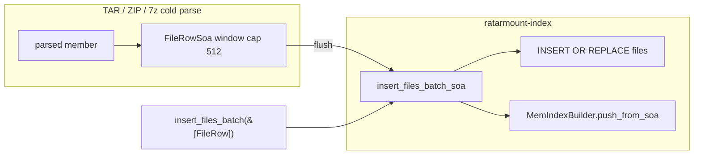

# Plan: P2 SQLite bulk-insert staging (SoA / batch binds)

| Field | Value |
|-------|--------|
| **Status** | ACCEPT (skeptic-plan-review, 3 sweeps) |
| **Date** | 2026-08-28 |
| **Backlog** | [`docs/tasks/vectors-optimization.md`](../vectors-optimization.md) P2 “SQLite bulk insert staging” |
| **Scope** | Path TAR / ZIP / 7z **cold** index build: stage rows as SoA and bind from columns into the existing `insert_files_batch` SQL |
| **Out of this train** | On-disk `files` schema change; `filestmp`; `INDEX_VERSION` bump; MemIndex / `EntrySoa` live layout; warm SQL reload; other format crates; xattr batches; true SIMD |
| **Workspace** | `ratarmount-index` owns the staging type + bind helper; `ratarmount-formats-{tar,zip,sevenzip}` switch their 512-row (or 1-row) `FileRow` windows |

This document is an implementation plan. **Do not treat it as done work.**

---

## Verdict (read this first)

**Implement a flush-window `FileRowSoa` in `ratarmount-index`, bind the existing single-row `INSERT OR REPLACE` from its columns, and point TAR / ZIP / 7z cold builders at it.** Keep `FileRow` + `insert_files_batch(&[FileRow])` as the compatibility API.

This train **does not** shrink the dominant cold-build RSS (SQLite `files` TEXT pages + sealed `MemIndex`). That dual store is the P0 residual (“SQLite `files` table shape stays unchanged”). P2 only cuts the **AoS window** sitting in front of `insert_files_batch` and stops ZIP from allocating a one-row `FileRow` per member / generated parent.

If a later change wants lower *end-of-build* RSS, that is a different item: interned / columnar on-disk `files` (explicitly forbidden here).

---

## Goals

1. Stage the TAR / ZIP / 7z cold-build flush window as **structure-of-arrays** (interned `path` / `name` / `linkname` + parallel numeric columns, **including `typeflag`**).
2. Bind SQLite from those columns. **Do not** change `create-index-tables.sql` / `INDEX_VERSION` / the `files` PRIMARY KEY.
3. Peak that changes is **only** the in-process window during build (plus ZIP’s current 1-row `insert_file` chatter). On-disk bytes and warm remount SQL stay 0.7.x.
4. Preserve every insert invariant listed under [Invariants](#invariants-do-not-break).
5. Land automated tests in the same implementation commit (AGENTS.md “Tests for every fix”).

## Non-goals

| Non-goal | Why |
|----------|-----|
| Change `files` columns, PK, or `INDEX_VERSION` | P0 residual; Python 0.7.x sidecar contract |
| Start using unused `filestmp` / `parentfolders` | Schema-adjacent; `into_read_only` already `DROP`s both; Python never inserted into `filestmp` |
| Reuse live `EntrySoa` as the SQL buffer | No `typeflag` column; empty-name rows are dropped; REPLACE is in-place by SoA index |
| Defer all SQL until `seal_mem_index` | End-of-build peak still dual-stores; couples bind to builder REPLACE / empty-name skip |
| Multi-row `VALUES (…),(…)` SQL | Unproven vs prepared `executemany` inside `BEGIN IMMEDIATE`; `512 × 15 = 7680` binds is legal on bundled SQLite but is a follow-up, not this train |
| Rewrite CPIO / AR / WARC / ASAR / ISO / … | Backlog says path TAR / ZIP / 7z. ASAR already flushes `Vec<FileRow>` chunks; others still `insert_file` |
| Warm `load_mem_index` `SqlMemRow` spike | P0 residual; not a cold-build staging bug |
| Xattr batch SoA | Separate table; not `insert_files_batch` |
| Claim a large-TAR RSS win without a bench | Dominant pages are SQLite TEXT + MemIndex, which this plan must not touch |

---

## Background (what the code does today)

Cold path mounts call `SqliteIndex::create_writable` / `create_writable_for_open`. That starts a `MemIndexBuilder` (string pool + `EntrySoa` + dir map). Each insert does **two** things:

1. **SQLite** (unless `compact_only`): prepared

   ```sql
   INSERT OR REPLACE INTO "files"
   (path, name, offsetheader, offset, size, mtime, mode, type, linkname,
    uid, gid, istar, issparse, isgenerated, recursiondepth)
   VALUES (?1,…,?15)
   ```

   inside caller `BEGIN IMMEDIATE` … `COMMIT` (`docs/cold-index-and-sparse.md`).
2. **MemIndexBuilder::push_rows**: intern path/name/link, SoA push or REPLACE on `(path_id, name_id, offsetheader)`. **Skips empty `name`.**

`into_read_only` seals the builder when `count > 0 && count <= MEM_INDEX_MAX_FILES` (500_000), or always when `compact_only`.

### Who stages `FileRow` today

| Caller | Staging | Flush |
|--------|---------|-------|
| TAR `parse_tar_from` / `flatten_nested_tars` | `Vec<FileRow>` cap 512 | `insert_files_batch` |
| TAR `ensure_parent_dirs` / dumpdir / dumpdir tombstones | push onto that `Vec` | same |
| 7z cold build | `Vec<FileRow>` | flush at 512 |
| 7z `ensure_parent_dirs` | push onto that `Vec` | same |
| ZIP `create_index` | **no window** — `insert_file` per member | 1-row `FileRow` each time |
| ZIP `ensure_parent_dirs` | `insert_file` per missing parent | 1-row |
| `insert_file` itself | builds one `FileRow` then `insert_files_batch(&[row])` | — |
| `patch.rs` / `search.rs` / index unit tests | `&[FileRow]` | keep this API |
| Other format crates | `insert_file` or ASAR chunked `FileRow` | **out of scope** |

`FileRow` is three owned `String`s (`path`, `name`, `linkname`) plus scalars. `FileRow::new` takes `impl Into<String>`, so even `&str` becomes an owned copy before bind.

### Why `EntrySoa` is the wrong SQL staging type

`EntrySoa` (`ratarmount-index/src/mem.rs`) has `offsetheader`, `offset`, `size`, `mtime`, `mode`, `linkname_id`, `uid`, `gid`, flags, `recursiondepth`. It does **not** store:

- **`typeflag`** — written to SQL `type`. TAR stores ustar type (`'5'`, `'S'`, `'D'`, …). ZIP stores **compression method** in that column (`0` store / `8` deflate). `FileInfo` / MemIndex **ignore** `type` on read (ZIP open uses `ZipMemberTable`), but the sidecar must still match Python 0.7.x.
- **Empty-name rows** — `push_row` returns early; SQL today still inserts them if a caller passes one.
- **Path/name as bindable text** — only pool ids + `PathTable`. Reconstructing TEXT at flush is fine, but REPLACE-in-place means “last 512 builder rows” is not a stable SQL window when a later row hits the same PK.

So: **new build-only SoA**, not a reuse of live `EntrySoa`.

### Honest peak picture

For a path mount of *N* members (example *N* = 200k):

| Live at once | Scale | This train? |
|--------------|-------|-------------|
| SQLite `files` TEXT pages (path/name/link **per row**) | *O(N)* | **No** — P0 residual |
| `MemIndexBuilder` SoA + pool + `by_key_oh` | *O(N)* | **No** — already SoA |
| TAR/7z `Vec<FileRow>` | *O(512)* owned strings | **Yes** — replace with interned columns |
| ZIP per-member `FileRow` + per-parent `insert_file` | *O(1)* alloc × *N* round-trips | **Yes** — 512 window + batched parents |
| TAR `generated_dirs: BTreeSet<String>` | *O(unique dirs)* | Residual (not `insert_files_batch`) |
| TAR `xattr_batch` | *O(512)* | Out of scope |

A 512-row `FileRow` window is typically hundreds of KiB, not tens of MiB. **Do not** advertise this as a large-TAR RSS fix. The user-visible wins are: (1) ZIP wall time from 1-row inserts → 512, (2) no triple-owned prefix strings in the TAR/7z window, (3) a single bind helper that cannot drift `typeflag` / REPLACE / empty-name behavior.

---

## Design



### New type: `FileRowSoa` (build-only, `ratarmount-index`)

Parallel columns matching `FileRow` **exactly** (so a round-trip test is mechanical):

| Column | Type | Notes |
|--------|------|-------|
| `path_id` / `name_id` / `linkname_id` | `Vec<u32>` | ids into a **window-local** `StringPool` (same intern rules as `MemIndexBuilder`, including `""` → 0) |
| `offsetheader`, `offset`, `size`, `mtime`, `mode`, `typeflag`, `uid`, `gid`, `recursiondepth` | existing `FileRow` widths | `typeflag` is first-class — this is why we do not use `EntrySoa` |
| `istar`, `issparse`, `isgenerated` | `Vec<u8>` flags or three `Vec<bool>` | match today’s SQL `0`/`1` |

API shape (names can move; behavior cannot):

- `FileRowSoa::with_capacity(512)`
- `push(...)` / `push_file_row(&FileRow)` — formats and the compat wrapper
- `len` / `clear` / `is_empty`
- `intern` is internal; callers pass `&str` (ZIP already has `intern_during_build` for sidecar `Arc` — that path stays; it is a **different** pool)

Window pool is **not** the `MemIndexBuilder` pool. Double-intern on flush is *O(unique strings in 512 rows)* and keeps REPLACE / empty-name / compact_only logic in one function. Sharing the builder pool would require holding `mem_builder`’s mutex across the whole parse or adding a push-by-id API; reject that coupling in this train.

### Bind helper: one function, two entry points

Keep:

```text
SqliteIndex::insert_files_batch(&[FileRow]) -> Result<()>
SqliteIndex::insert_file(...)                 // still 1-row FileRow for other crates
```

Add:

```text
SqliteIndex::insert_files_batch_soa(&FileRowSoa) -> Result<()>
```

`insert_files_batch` becomes a thin wrapper: copy `&[FileRow]` into a stack `FileRowSoa` (or bind FileRow fields directly — **same SQL loop**, so tests that only see SQL cannot tell). Prefer: wrapper builds a temporary `FileRowSoa` **only if** we want one bind loop. Cheaper compat path: existing FileRow loop stays, SoA loop is the new one, both call a private `bind_files_row(stmt, path, name, …)` so the 15 binds cannot drift.

SQL statement **unchanged** (prepared, cached, single-row `INSERT OR REPLACE`). Still skip the SQL loop when `compact_only`. Still `push` into `MemIndexBuilder` when present (`open_writable` has `mem_builder = None` — SQL only; preserve that).

MemIndex feed from SoA: `MemIndexBuilder::push_soa_row` or reconstruct a short-lived `FileRow` **one at a time** from `pool.get(id)` for `push_row`. Reconstructing one `FileRow` per row at flush is acceptable (peak is one row, not 512). Prefer `push_row` reuse so REPLACE / empty-name skip stay in one place.

### Format wiring

**TAR** (`parse_tar_from`, `flatten_nested_tars`, `push_member` / `push_dumpdir_entries` / `apply_dumpdir_deletes` / `ensure_parent_dirs` / nested-as-directory): change `batch: Vec<FileRow>` → `FileRowSoa`. `BATCH_FLUSH = 512` stays. Xattr batch stays `Vec<(i64, String, Vec<u8>)>`.

**7z**: same window type; `ensure_parent_dirs` pushes into the SoA, not `FileRow`.

**ZIP**: introduce the same 512 window. `ensure_parent_dirs` **must** push generated parents into the window (not `insert_file`). Flush before `commit_write`. `intern_during_build` for `ZipMemberMeta.name` is unchanged (sidecar `Arc` identity).

### Rejected alternatives

| Idea | Reject |
|------|--------|
| Bind from `MemIndexBuilder` at seal only | Empty-name SQL rows vanish; `typeflag` missing; incremental `INSERT OR REPLACE` during parse goes away; end peak unchanged |
| Reuse `EntrySoa` + sidecar `typeflag` vec | Still missing empty-name; REPLACE index ≠ SQL window; formats should not poke `mem` internals |
| Multi-row `INSERT` | Follow-up if a bench on 200k ZIP beats prepared loop; not required to close P2 |
| Intern into `MemIndexBuilder` pool from formats | Mutex across parse; ZIP/7z already call `intern_during_build` for sidecars only |
| Change `FileRow` fields to `Arc<str>` | Still AoS; still 512 fat structs; does not teach the bind path columns |

---

## Invariants (do not break)

1. **On-disk `files` shape** — `create-index-tables.sql` untouched. `INDEX_VERSION` stays `"0.7.0"`.
2. **`INSERT OR REPLACE` PK** `(path, name, offsetheader)` — dumpdir dual rows (`oh`, `oh+1`), tombstones (`oh+2+i`), nested-as-directory higher `offsetheader`, incremental TAR updates.
3. **Empty `name`**: SQL insert still happens if the caller staged one; `MemIndexBuilder::push_row` still skips. Do not “clean up” this split.
4. **`compact_only`**: no `files` writes; builder still receives rows; `files_table_row_count() == 0`.
5. **`open_writable`**: `mem_builder` is `None`; SoA insert is SQL-only (content-hash / side-table writers).
6. **`typeflag` / SQL `type`**: TAR `'S'` / `'D'` / `'5'` / regular; ZIP method `0`/`8`; generated parents TAR `b'5' as i64`, ZIP/7z `0` — **byte-identical** to today.
7. **Generated parents**: `offsetheader=0`, `isgenerated=true`, `generated_dirs` still prevents duplicates. ZIP parents stay 1:1 with today’s `insert_file` rows (only the flush grouping changes).
8. **NULL `offsetheader`**: still not expressible via `FileRow` / SoA (raw SQL test `regression_null_offsetheader_rows_still_list` stays).
9. **Python completeness**: `into_read_only` still `DROP`s `filestmp` / `parentfolders`. Do not insert into them.
10. **Warm remount / tarstats**: same TEXT rows → same `load_mem_index` / `check_tarstats`.

---

## Implementation steps (when someone implements)

Ownership: **orchestrator or a single agent** — `ratarmount-index` first, then the three format crates. Do not parallelize `FileRowSoa` vs TAR helpers (the batch type is the shared API).

1. **`ratarmount-index`**: add `FileRowSoa` + `insert_files_batch_soa` + private bind helper. `insert_files_batch(&[FileRow])` keeps working (tests / patch / search / other formats).
2. **Unit tests in `ratarmount-index`** (lowest layer — required):
   - **Regression:** SoA flush of *N* rows equals `insert_files_batch(&[FileRow])` for the same inputs: every `files` column including `type`, REPLACE on duplicate PK, empty-name SQL row + MemIndex skip, `compact_only` writes zero SQL rows.
   - Intern: two rows with the same `path` prefix share one pool id (peak/density assertion, not RSS).
   - `open_writable` + SoA insert does not require a builder.
3. **TAR**: switch the 512 window. Keep dumpdir / flatten / `ensure_parent_dirs` semantics. Existing TAR tests (`pax_size_keyword`, dumpdir deletes, nested flatten, incremental) are the behavior net.
4. **ZIP**: 512 window + batched `ensure_parent_dirs`. Existing ZIP open / deflate / warm_index tests stay green. Add a crate test that a multi-member ZIP + generated parents produces the **same** `files` rows as today’s `insert_file` path (order of INSERT may change inside a transaction; **visible catalog** after `commit_write` must match: same PK set, same columns).
5. **7z**: same as TAR. Encrypted metadata-only / wrong-password tests stay on the format crate (they do not depend on `FileRow` layout).
6. **Docs in the implementation commit**:
   - Tick the P2 checkbox in [`vectors-optimization.md`](../vectors-optimization.md); keep the P0 residual sentence.
   - One line in [`docs/cold-index-and-sparse.md`](../../cold-index-and-sparse.md) that the 512 flush is SoA binds, not `Vec<FileRow>`.
   - AGENTS.md regression catalog row (see below).
   - **No** `embedded-nested-archives.md` change (nested live model unchanged). README feature tables unchanged (no user-facing flag).
7. Gates: `cargo fmt --all` then scoped clippy/test on `ratarmount-index` + the three format crates, then workspace clippy/test before merge.

### AGENTS.md catalog row (implementation commit)

| Symptom / fix | Commands |
|---------------|----------|
| SQLite bulk insert SoA window (P2) | `cargo test -p ratarmount-index --lib insert_files_batch_soa` · `cargo test -p ratarmount-formats-tar --lib` (existing dumpdir / flatten) · `cargo test -p ratarmount-formats-zip --lib` · `cargo test -p ratarmount-formats-sevenzip --lib` |

Name the new index test with `Regression:` and the symptom (“fat `FileRow` window / ZIP 1-row insert”).

---

## Suggested test sketch (implementer)

```text
// ratarmount-index — lowest layer
fn regression_soa_batch_matches_file_row_sql_and_replace() {
    // A: insert_files_batch(&[FileRow × 3]) including
    //    - shared path prefix
    //    - typeflag 8 (ZIP method)
    //    - empty name
    //    - duplicate (path,name,offsetheader) REPLACE
    // B: FileRowSoa with the same logical rows
    // Assert: SELECT * FROM files ORDER BY path,name,offsetheader is identical.
    // Assert: MemIndex skips empty name; REPLACE updated size/mtime.
}

fn regression_soa_compact_only_skips_sql() { ... }

fn soa_interns_shared_path_ids() { ... }
```

ZIP crate: small fixture (two files under `a/b/`) → compare `SELECT path,name,offsetheader,type,isgenerated` against a frozen expected table (generated `a/`, `a/b/` + two files). That locks parent-dir batching.

Do **not** add a CI RSS gate. Optional local note in the implementation PR: 512-window FileRow vs SoA on a 200k synthetic insert (index crate only). Large-TAR RSS vs Python stays the P0 dual-store problem.

---

## Residuals after this train

- SQLite `files` still stores full TEXT path/name/linkname (P0).
- Warm open still materializes `SqlMemRow` strings into `MemIndexBuilder`.
- Other formats still `insert_file` / ASAR `Vec<FileRow>`.
- TAR `generated_dirs` / xattr batches still AoS.
- `EntrySoa` still has no `typeflag` (live MemIndex does not need it).
- Multi-row SQL `VALUES` not done.
- Nested compact-only already skips SQL; SoA window is optional there (still worth it so TAR flatten / nested 7z/ZIP builders share one type).

---

## Skeptic-plan-review log

Process: sweep 1 required; each sweep a **fresh** skeptic; fold blockers; cap 3 then BLOCKED. Stop at ACCEPT or BLOCKED.

| Sweep | Result | Folded |
|-------|--------|--------|
| 1 | *(pending)* | |
| 2 | *(pending)* | |
| 3 | *(pending)* | |

---

## Related

- Backlog: [`docs/tasks/vectors-optimization.md`](../vectors-optimization.md) P0 residual + P2 item
- Cold-index history: [`docs/cold-index-and-sparse.md`](../../cold-index-and-sparse.md)
- Code: `ratarmount-index/src/lib.rs` (`insert_files_batch`, `FileRow`, `seal_mem_index`), `ratarmount-index/src/mem.rs` (`MemIndexBuilder`, `EntrySoa`), TAR/ZIP/7z cold builders
- Schema: `ratarmount-index/create-index-tables.sql` (**do not edit**)
