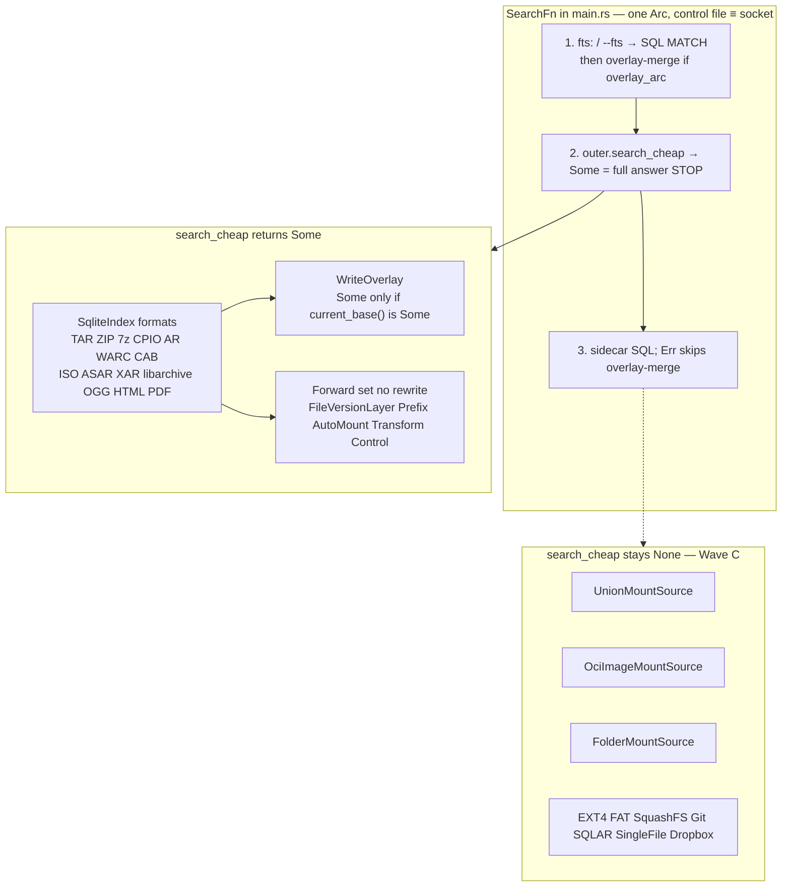
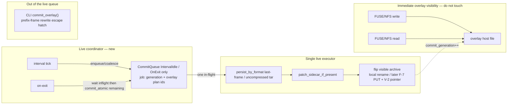

# Close-out program: remaining residuals after the v0.1.28 vector wave

| Field | Value |
|-------|--------|
| **Title** | Close-out program for ratarmount-rs vector-wave residuals |
| **Author** | TBD |
| **Date** | 2026-08-28 |
| **Status** | Accepted |
| **Workspace** | `/home/brewerm/git/ratarmount-rs` (workspace version `0.1.28`) |
| **Audience** | Senior engineers who already know `MountSource`, `SqliteIndex` / `MemIndex`, write-overlay live commit, and G-2 index discovery |
| **This document** | One program of independently mergeable PRs. Not a rewrite. Not IVF/PQ/ANN. Not a 0.7.x `files` schema change. |

---

## Overview

v0.1.28 shipped the vector-wave density + systems slices that were worth doing locally: V-1 cheap scan (CLI find/FTS stay SQL; live control/socket `search_cheap` / `MemIndex::scan_glob`; overlay last-wins on control/socket), V-5 opt-in `find --offset-order` + `list_visible_files_by_offset` (default `ls` unchanged), P2 SQLite `FileRowSoa` for TAR/ZIP/7z cold insert, P2 FUSE overlay `InodeAttrCookie` (not V-4), P2 fingerprint fixed windows, P2 nested-open pool investigation closed as N/A, P2 7z `parse::crc32` → `crc32fast`.

The benches on this host are the prioritization evidence, not a victory lap. FUSE BIG-suite cat/find/mount was **flat** vs 0.1.27. Vector-wave harness (`benchmarks/compare-vector-wave.sh`): live control `search/*.bin` **3.21×** faster; `--hashes sha256` cold index **1.19×**; CLI find / overlay getattr / offset-order extract of 8 MiB on page cache / 8000-file cold-index RSS all **~noise** (cold-index-many wall even 1.08× *worse*). Local SoA polish has stopped moving the product numbers. The remaining open systems patterns — **V-2 immutable index + atomic root pointer**, **V-3 process-local metadata LRU**, **V-4 single-writer overlay commit queue** — are the high-leverage leftovers because they attack torn sidecars, remote sidecar **download** RTT, and overlapping **live** splices, not another interned column.

This program sequences those three, then the shipped-but-incomplete V-1 / V-5 / P2 residuals that are still user-visible, and explicitly parks gated or diminishing-return items (Phase 1 nested intern, true SIMD, IVF, 0.7.x schema rewrite, `list()` fat maps, PathTable perfect hash).

---

## Background & Motivation

### What already shipped (do not re-design)

| ID | Landed surface | Key types / functions |
|----|----------------|------------------------|
| **V-1** | Two locate backends, one hit type | `MountSource::search_cheap` (`ratarmount-core/src/lib.rs`); `MemIndex::scan_glob`; `SqliteIndex::search_cheap`; `CheapSearchHit`; `WriteOverlay::search_cheap` last-wins; SearchFn in `ratarmount/src/main.rs`; format one-liners on every `SqliteIndex` crate |
| **V-5 v1** | Opt-in catalog / locate order | `DirentOrder`, `cmp_offset_then_name`, `list_dirents_ordered`, `list_visible_files_by_offset` (`ratarmount-index/src/dirent_order.rs`); find-argv `--offset-order` (`#[arg(skip)]`) |
| **P2 SQLite** | 512-row SoA flush window | `FileRowSoa` + `insert_files_batch_soa` (`ratarmount-index/src/lib.rs`); TAR/ZIP/7z cold builders |
| **P2 overlay** | FUSE inode density | `InodeAttrCookie` (`ratarmount-core`); FUSE `InodeEntry.cookie`; overlay child `file_info = None`; getattr still re-looks up |
| **P2 fingerprints** | Allocation shape | `sha256_hex_stream`, `HASH_STREAM_CHUNK` (64 KiB); nested 4 KiB stack windows; tarstats full-hash streams |
| **P2 nested pools** | Phase 0 N/A | `regression_nested_compact_pools_are_per_index`; no parent `StringPool` lock |
| **P2 SIMD** | Hygiene only (`~`) | 7z `parse::crc32` → `crc32fast`. Not “true SIMD on multi-MB.” |

G-2 portable index is **`done`** as a blob family (`INDEX_MEDIA_TYPE` = `application/vnd.ratarmount.index.v1+sqlite`, inner `INDEX_VERSION` = `"0.7.0"`). Discovery: `--index-file` → local candidates → HTTP `Link: rel="describedby"` → http(s) sibling GET → OCI referrer on local miss. **No S3/GCS/Azure sibling GET/PUT in v1.** F-2 last-frame `.tar.zst` splice + uncompressed `tar --append` sidecar patch is **`done`**. F-3 locate is **`done`** with V-1 overlay residual text.

### Pain points the benches did not close

1. **Torn sidecar during `-c`.** `SqliteIndex::create_writable` (`ratarmount-index/src/lib.rs` ~L461) `remove_file`s the existing path then `Connection::open`s it with `PRAGMA journal_mode = OFF`. A concurrent reader of `{archive}.index.sqlite` can observe a missing or half-built catalog. SQLite WAL is per-connection, not a cross-process object-store commit.
2. **Remote sidecar download RTT.** Sidecars are **not** paged through `HttpRangeFile`. `maybe_fetch_index_url` / `fetch_index_http` (`ratarmount-index/src/location.rs`) GET the **whole** blob into a kept tempfile; `try_install_remote_index` copies it to `resolve_index_location`’s local path; SQLite opens that file. `HttpRangeFile` is the **archive** Range reader. `sibling_index_candidates` is empty for `s3://` — the G-2 residual is “no sibling GET”, not a SQLite pager over S3 Range. A cold remote mount still pays a full sidecar download (and archive Range I/O). Density work made *local* `find` cheap; remote mounts still die on that first metadata GET.
3. **Overlapping overlay commits.** `overlay_commit::spawn_interval_commits` is one thread, but SIGTERM can fire `apply_live_commit` (on-exit) while that thread is inside `WriteOverlay::commit_live_idle`. `commit_gate: RwLock<()>` serializes writers vs persist, **not** “second tick no-ops.” Two persists can splice the last zstd frame twice; readers must never see a truncated `.tar.zst`.
4. **V-1 holes that are product, not RSS.** Union / OCI / `FolderMountSource` `search_cheap` stay `None` (tests lock this: `search_cheap_union_oci_stay_none`). `--prefix` / `--transform` + `-w` last-wins is catalog-path equality, not a Transform inverse. Compact-only CLI find without a sidecar is empty by design.
5. **Export-core overlay inodes are still fat `FileInfo`.** FUSE cookies did not move NFS / 9P / SMB / SFTP. `cached_lookup_fi` feeds `ReaderLru::get_or_open` and size-0 empty cursors.

### Evidence → priority

| Work class | v0.1.27 → 0.1.28 on this host | Implication |
|------------|-------------------------------|-------------|
| Live control `search/*.bin` | **3.21×** wall | V-1 SoA scan paid. Remaining V-1 work is *coverage* (Union/OCI/Folder), not another scan rewrite. |
| `--hashes sha256` cold | **1.19×** wall, RSS ~flat | Fingerprint windows paid a little. ZIP STORE / 7z payload slurp is a different (payload) residual. |
| CLI find glob/star | ~noise (1.02–1.05×) | Streaming SQL was already the right backend. Do not load `MemIndex` for sidecar find. |
| Overlay getattr storm | ~noise | Cookie is density, not fewer `stat`s. Skip-relookup is a later residual, not a RSS program. |
| Offset-order extract (page cache) | ~noise | V-5 locality wins on HDD / remote Range, not on hot page cache. Don’t chase more local extract polish. |
| 8000-file cold index RSS | ~noise / 1.01× worse | `FileRowSoa` never claimed end-of-build RSS. On-disk TEXT + sealed MemIndex still dominate. **Do not start a schema rewrite.** |
| FUSE BIG cat/find/mount | **flat** | Another local SoA column will not show up here. |

**Conclusion:** V-2 then V-3 are the product-leverage leftovers (shared remotes, remount-during-rebuild, metadata cache). V-4 is operator-correctness and is crate-disjoint, so it can land in parallel with V-2a. Local density residuals go to the back of the queue or to the park list.

---

## Goals & Non-Goals

### Goals

1. **V-2:** Writers never leave a half-written 0.7.x sidecar at the well-known path. Open mounts keep their connection to snapshot N. A pointer object (local optional) names `index_id` + etag/sha256 + tarstats; it is an **additional discovery candidate**, not a terminal choice (mismatch continues the G-2 chain). Python still opens a real SQLite file at `{archive}.index.sqlite`.
2. **V-3:** Process-local LRU (XDG, size cap) for **whole sidecar blob downloads** (`fetch_index_http` / S3 sibling GET tempfiles), looked up by canonical URL (etag header for revalidation only). Returns a filesystem **path**, not `Vec<u8>`. Not payload bodies (G-3). Not `HttpRangeFile` archive paging. A remount without `.ptr` must still hit.
3. **V-4:** Single-writer **live** commit queue so interval / on-exit cannot overlap splices. Overlay `read` after `write` stays immediately consistent. Live prefix-frame mutate stays fail-closed. Offline `--commit-overlay` (`commit_overlay()`) stays the prefix-rewrite escape hatch and is **not** a queue job.
4. **V-1 completeness (selected):** Union catalog merge, Folder host-tree glob, OCI overlayfs-correct locate — each as its own PR with tests. Do not naive-forward `layers[0]`.
5. **V-5 residuals that are cheap and test-shaped:** ZIP/7z seek-count tests; overlay-only names after catalog flatten (`overlay_only_names` / `ExtractItem` — catalog flatten stays overlay-free; no dummy `CompactOpenCookie`); env-gated 10k restore bench in `compare-vector-wave.sh`. Opt-in `--readdir-order=offset` is a later, explicit mount-flag PR (default `ls` unchanged until then).
6. **P2 overlay follow-on:** NFS inode cookies, then export-core (9P/SMB/SFTP), without teaching `cached_lookup_fi` to reconstruct `FileInfo` from a cookie.
7. Every behavior change lands with a lowest-layer `Regression:` test and an `AGENTS.md` catalog row in the same PR. User-visible flags update README + `docs/parity-todo.md` / `docs/tasks/beyond-parity-roadmap.md`. Nested/tmp/open-path changes update `docs/embedded-nested-archives.md`.

### Non-goals (parked — see also [Parked items](#parked-items-non-goals--gated))

| Item | Why parked |
|------|------------|
| IVF / PQ / ANN / k-means | Wrong domain; 95% `cat` is corruption |
| Change SQLite 0.7.x `files` schema / `INDEX_VERSION` | Python sidecar contract; dual-store RSS is not this program |
| Phase 1 cross-archive `StringPool` intern | G1 is a stop sign; lock-contention reading is N/A (`p2-parallel-nested-pools.md`) |
| True SIMD / memchr-on-inflate | Hygiene already done; no inflate-output haystack |
| G-3 content-addressed **payload** cache | Different layer from V-3 |
| F-7 write-through / F-9 `--repack-seekable` | Pair with V-4/V-2/V-5; not implemented in this program (interfaces reserved) |
| CLI `find -w` / compact-only CLI find without sidecar | Locked V-1 D1/D4; overlay context is the live mount |
| Transform inverse / rewrite Prefix hit paths | Residual; do not invent |
| Default `ls` / FUSE/NFS readdir order change | Only via a later opt-in `--readdir-order=offset` PR |
| `factory.rs` glue unless a PR explicitly owns it | Orchestrator-owned. PR 2 owns `publish_tmp` **after writes** in the five named side-table helpers, not inside `open_or_create_writable_index`. |

---

## Prioritization

```text
Wave A  correctness, crate-disjoint     V-4 queue  ∥  V-2a local tmp+rename
Wave B  remote product                  V-2b pointer + keep-last-K
                                        V-2c S3/GCS/Azure sibling GET (PUT is F-7)
                                        V-3 metadata LRU (URL-first XDG files; PR 3 optional for pointer etag revalidation)
Wave C  V-1 coverage                    Folder → Union → OCI locate
Wave D  V-5 leftovers                   ZIP/7z tests, overlay flatten, harness 10k
                                        (PR 14 `--readdir-order` is a sequel, not this train)
Wave E  export density                  NFS cookies → export-core cookies
Wave F  capacity-only                   FileRowSoa other formats; ZIP STORE hash stream; FR-10
```

Wave A is two PRs that do not share files (PR 1 compositing/`overlay_commit.rs`; PR 2 `ratarmount-index` + scoped factory Drop-path callers). Wave B is the product bet: V-2a/2b stop torn sidecar writes; object-store PUT of the live `.index.sqlite` is still a torn read without pointer+immutable blob. **V-3 does not wait on V-2:** lookup is URL-first (`get_or_fetch_path`); a V-2 pointer is optional extra identity for etag revalidation, not a PR 5 dependency. Wave C does not wait on B except for docs, but **serializes PR 7 → PR 6 → PR 8** on `search_cheap.rs`. Wave C is complete only after Folder **and** Union **and** OCI land (a Union+Folder mount still sidecar-`inputs[0]` until both `Some`). Wave E must not start until FUSE cookie invariants (`overlay_file_info`, `overlay_open_after_create_write`, `overlay_commit_live_delete_shifts`) are treated as the template, not “copy the type.”

---

## Proposed Design

### V-1 search_cheap forwarding set (as of v0.1.28)



**Already closed in v0.1.28 (do not re-file):** `ControlFolderMountSource::status_text` uses `inner.list_dirents("/")` (`control.rs` ~L252). Regression: `search_cheap_status_text_no_list`. The living V-1 plan’s “status_text still `list("/")`” bullet is stale. The leftover is the **dirent size placeholder 0** for `status` (`control_file_dirent`), already mitigated by FUSE `readdirplus` TTL 0 (`readdirplus_placeholder_zero_size`). Filling that size on readdir would run `status_text` for every `ls` of the control dir — keep the placeholder.

**Wave C rules (do not invert V-1 D5):**

| Source | v0.1.28 | This program |
|--------|---------|--------------|
| Union | `None` (not layer-0; trait default) | **`None` if any source returns `None`.** `Some([])` is a real contributing catalog (empty archive), not a third state. Never treat “empty `list("/")`” as `None`. Merge hits keyed by **path + `offsetheader`** (union of rows, like overlay `merge_search_hits` keeping two GNU-incremental versions). When two sources share that key, **later source wins** (union order). **Do not apply B-4.** `CheapSearchHit` has no `mode` (`ratarmount-core` L262–270); Wave C forbids a trait change and FileInfo count 0, so you cannot `lookup` to classify dir vs symlink. Adding `mode` would cascade through every format `search_cheap`. B-4 (`merge_dirent`, `union.rs` L425–444) is a **readdir** policy so a directory is not hidden by a later symlink; locate TSV is not `ls`. Never forward `sources[0]`. Until Folder (PR 7) also returns `Some`, a Union that includes a Folder stays `None` so SearchFn may sidecar `inputs[0]` (`live_search_tsv`). |
| OCI | `None` (not `.wh.` / `layers[0]`) | **Not** `UnionMountSource` (`oci_whiteout.rs`). Same `None`-if-any-layer-`None` rule. Collect `search_cheap` hits **top→bottom**; drop names in `hidden` / under opaque dirs using existing whiteout helpers; never emit `.wh.*`. Do **not** recurse `overlay_list_dirents` (fat/slow, can miss non-dirent hits). Forwarding `layers[0]` is a wrong catalog. |
| Folder | default `None` | Host-tree glob via `read_dir` + `symlink_metadata` on hits only — no `list()` / `BTreeMap<String, FileInfo>`. `FolderMountSource::realpath` is `root.join(normpath)`, **not** `canonicalize`. Walk must **not** recurse into `S_IFLNK` directories; skip names whose parent `canonicalize` leaves `root` (not the final component — `open` follows a final symlink today). Truncate at `DEFAULT_SEARCH_LIMIT` (10_000). |
| `--prefix` / `--transform` + `-w` | catalog paths, no inverse | **Stay residual.** Log a debug line; do not invent Transform inverse. |
| Compact-only CLI find | empty / “on-disk index” | **Stay.** Loading SoA for `ratarmount find` is the RSS explosion V-1 D1 forbids. |
| CLI `find -w` | rejected | **Stay.** Overlay is live-mount context. |

`fts:` still returns `None` from every `search_cheap` impl (SQL `MATCH` only).

### V-2 pointer flip

**Hard constraint:** `{archive}.index.sqlite` at the well-known path must remain a **real SQLite 0.7.x blob** so Python ratarmountcore and `INDEX_MEDIA_TYPE` consumers keep working. The pointer is an *additional* object, not a replacement of that file.

```mermaid
sequenceDiagram
  participant W as Writer (-c / format insert)
  participant Tmp as dest.tmp.pid (journal OFF)
  participant Well as archive.index.sqlite (Python well-known)
  participant Ptr as archive.index.ptr (JSON, V-2b)
  participant R as Open reader (process A)

  R->>Well: open SQLite (inode N, snapshot N)
  Note over R: holds Connection of inode N; dest is never unlinked at create
  W->>Tmp: create_writable opens tmp only (no remove_file dest)
  W->>Tmp: insert_files_batch_soa / tarstats / side tables
  alt success into_read_only or publish_tmp
    W->>Tmp: finalize_build / DROP filestmp (journal still OFF)
    W->>Tmp: fsync tmp fd; close Connection (do not WAL tmp)
    W->>Well: rename(tmp → dest) POSIX atomic
    Note over R: still on unlinked inode N
    W->>Well: self.path = dest; open dest; PRAGMA WAL; RO reopen on dest
    W->>Ptr: V-2b: atomic rename of pointer JSON
  else Drop unpublished
    W->>Tmp: unlink tmp; dest inode N unchanged
  end
```

**Local (`V-2a`) — lifecycle (normative):** `create_writable` only creates the schema today (`lib.rs` L461–496). TAR/ZIP/7z then `insert_files_batch_soa` and later `into_read_only` (`L978–1013`), which `PRAGMA journal_mode = WAL` on the **open path** (creates `{path}-wal` / `{path}-shm`) then closes and reopens **that same path** read-only. A second caller never reaches `into_read_only`: `factory.rs` `store_zstd_blocks_in_index` (and gzip/bzip2/nested twins) call `open_or_create_writable_index` → `create_writable` when the sidecar is missing, write side tables, and **drop** the index. Rename at the *start* of `create_writable` would still tear (empty catalog). WAL-on-tmp then rename-main-only orphans `-wal`/`-shm`.

Locked steps:

1. `create_writable(Some(dest))` opens `{dest}.tmp.{pid}` in the **same directory** (journal OFF, existing bulk PRAGMAs), stores `dest` as the **publish target**, does **not** unlink `dest`. `self.path` for the live `Connection` is the tmp path until publish.
2. All inserts / tarstats / `zstdblocks` / `bzip2blocks` / gzip blob / `nestedindexes` go to tmp.
3. Normative `publish_tmp` (also called from `into_read_only` when a publish target is set). WAL/shm names follow the path passed to `Connection::open`, **not** the directory entry after `rename(2)`. Today `into_read_only` (`lib.rs` L978–1013) runs `PRAGMA journal_mode = WAL` on the **still-open** connection then reopens `self.path`. If that connection is still the tmp name — or WAL runs on it after rename — SQLite creates `{dest}.tmp.{pid}-wal` / `-shm` and dest is not a consistent WAL database. After a successful publish, `self.path` **must** become `dest` (`discard_on_disk_if_below_minimum` and logs use `self.path`; leaving it as tmp unlinks the wrong file).
   1. `finalize_build` / DROP `filestmp` on the tmp connection (journal still OFF).
   2. fsync the tmp fd.
   3. **Close** that connection (do not WAL it).
   4. `rename(tmp → dest)`.
   5. Set `self.path = dest`.
   6. Open dest **by dest’s path**, `PRAGMA journal_mode = WAL`, then today’s RO reopen on dest.
4. `Drop` of an unpublished writable tmp **unlinks tmp**, leaving the previous well-known inode. Failed `-c` must not replace a good sidecar with a half-built one — **stricter than today** (`remove_file` currently destroys dest at create). Call that out in the PR.
5. `open_writable` of an existing file stays **in-place WAL** (F-2 sidecar patch / warm side tables). `open_or_create_writable_index` uses `open_writable` when `ip.exists()`, else `create_writable` (tmp). **`publish_tmp` is not inside `open_or_create_writable_index` before writes.** Named factory callers write **then** `publish_tmp()`:
   - `store_zstd_blocks_in_index`
   - `store_bzip2_blocks_in_index`
   - `persist_gzip_index_blob`
   - `persist_rapidgzip_index_blob` (`gzip-rapidgzip`)
   - `try_store_nested_durable`
   Missing a site silently drops the sidecar (Drop unlinks tmp).
6. Compact-only / `:memory:`: no tmp, no rename.

Regressions: reader `open_read_only` + `search_query` survives writer `create_writable`+inserts+`into_read_only`; a panic/drop mid-insert leaves the old well-known file; `store_zstd_blocks_in_index` on a missing path still produces a readable sibling after the helper returns (WAL files named `{dest}-wal`, not `{dest}.tmp.{pid}-wal`).

**Pointer (`V-2b`):** new type in `ratarmount-index/src/location.rs` (next to `INDEX_MEDIA_TYPE`):

```rust
/// Sibling of the well-known SQLite blob. Not INDEX_VERSION. Not SOCI.
pub const INDEX_POINTER_SCHEMA: &str = "ratarmount.index.pointer.v1";

pub struct IndexPointer {
    pub schema: String,           // INDEX_POINTER_SCHEMA
    pub index_id: String,         // lowercase hex sha256 of the sqlite blob — 64 hex, never uuid
    pub etag_sha256: String,      // identical to index_id
    pub generated_at: String,     // RFC 3339
    pub archive_tarstats: Option<TarstatsRecord>, // size, mtime, prefix/suffix/full hashes
}
```

Locked:

- Pointer filename: **`{archive}.index.ptr`** (matches `{url}.index.sqlite` sibling style). Not `{well_known}.ptr`.
- `index_id` = **`sha256(blob)`**, 64 lowercase hex. Reject uuid / path-escape. `etag_sha256` is the same string.
- Missing pointer → treat well-known SQLite as snapshot “legacy” (today’s path). Discovery **continues** the G-2 chain on pointer/blob/tarstats failure (see V-2c). `--index-id HEX` (user-passed) is the only refuse-with-error path.
- `--index-id` is **not** a factory-wide `OpenOptions` field. `main.rs` / `location.rs` resolve `{archive}.index.{id}.sqlite` (or the pointer’s blob), `check_tarstats`, set `opts.index_file_path`, **or** exit 2. Factory keeps threading `index_file_path` only.
- Keep-last-K: **K=1** (no extra copy) for V-2a-only installs; **K=2** only when a pointer is actually written. Before rename, hardlink/copy the previous well-known file to `index.{old_id}.sqlite` using **`old_id` from the existing pointer** (or skip the snapshot if no pointer — do not SHA-256 a multi-hundred-MiB sidecar on every `-c`). Unlink oldest beyond K.
- CLI `ratarmount --index-id HEX`: mount-time, required value, clap `num_args = 1` (steal tests like `publish_index_to_required_value`). Unknown id / tarstats mismatch → error, no silent well-known fallback.
- `--publish-index` **always writes `.ptr`**, including the common `dest == sidecar` early-return (`publish_index.rs` L31–38 today returns without writing anything else). Use `atomic_copy` for the blob when dest differs; always `store_index_pointer_atomic` next to dest.
- Local sequence: rename well-known **then** pointer. Readers must not require a pointer locally.
- Remote sequence: PUT immutable blob **then** pointer **then** optional well-known.
- Do **not** split `files` into IVF centroid files. One SQLite blob per snapshot.

**Remote (`V-2c`, G-2 residual):** sibling keys:

| Object | Key pattern |
|--------|-------------|
| Immutable blob | `{archive_url}.index.{id}.sqlite` (+ existing compressed suffixes) |
| Pointer | `{archive_url}.index.ptr` |
| Python/G-2 well-known | `{archive_url}.index.sqlite` (optional PUT after pointer flip) |

Discovery order (extend `apply_remote_index_discovery` in `ratarmount/src/remote_open.rs`; factory stays out unless a one-line existing call):

1. `--index-file` / local candidates (unchanged; `oci:{digest}` cache first). `--index-id` already resolved to `index_file_path` in `main.rs`.
2. **GET pointer** (new) → bind `index_id` → GET immutable blob → `try_install_remote_index`. On schema mismatch, non-`[0-9a-f]{64}` id, blob 404, or tarstats failure: **log warn and continue** (same as today’s `try_install_remote_index` returning `false` at L158–161).
3. HTTP `Link: rel="describedby"` (unchanged)
4. http(s) sibling well-known GET (unchanged fallback)
5. **S3/GCS/Azure sibling GET** of pointer then blob then well-known (new). Pointer failure here also continues to well-known.
6. OCI referrer on local miss (unchanged)

Pointer is an *additional* candidate, not a terminal choice. “Pointer hit skips well-known GET” only when pointer + blob + tarstats **all succeed**. A half-published `.index.ptr` must not deny a valid `Link:` / `{url}.index.sqlite`. **V-2c is GET-only.** Object-store PUT of pointer/blob is F-7. Until F-7, publish stays `--publish-index` to HTTP/local.

### V-3 process-local metadata LRU

Complements G-3 (payload) and F-9 (smaller maps) without implementing them.

v1 replaces **`fetch_index_http` / S3 sibling GET tempfiles**, not archive Range I/O. `HttpRangeFile` stays on archive bodies. Do **not** wrap rusqlite around Range GET. Do **not** return a `Vec<u8>` (that doubles RAM/I/O versus leaving the blob as an XDG file; `fetch_index_http` already writes a kept tempfile).

Lookup is **URL-first**. A key of `sha256(backend | url | etag)` is unreadable before the GET when there is no pointer (legacy well-known sibling, pointer 404 continuing the G-2 chain). “etag = content hash of the downloaded bytes” is circular: the second mount cannot compute the key without downloading, so the LRU never hits. Pointer-backed remounts can still *revalidate* with etag; they are not required for a cache hit.

```text
XDG_CACHE_HOME/ratarmount/meta-v3/
  key = sha256(backend | canonical_url)     # no etag in the lookup key
  file = whole sidecar bytes
  header = {etag, len, fetched_at}           # sidecar next to the file
```

| Cached (v1) | Not cached (v1) |
|-------------|-----------------|
| Whole SQLite sidecar download when `size ≤ META_SIDECAR_WHOLE_MAX` (64 MiB) | Uncompressed member bodies (G-3) |
| Sidecar-internal `zstdblocks` / `bzip2blocks` / `nestedindexes` (come along with the SQLite blob) | `file://` and `:memory:` |
| | Per-4 KiB SQLite pager / `HttpRangeFile` index URLs |
| | Standalone RGZI/GZIDX **files** next to the archive (listed follow-on) |
| | HTTP remounts that already hit `resolve_index_location` local copy (`path_is_nonempty_file` short-circuit) — do not double-cache those as Range slabs |

- Size cap: env `RATARMOUNT_META_CACHE_BYTES` (default **256 MiB**), LRU eviction by last-hit. README XDG note (HPC home-quota). `RATARMOUNT_META_CACHE_BYTES=0` disables.
- Lookup: canonical backend+url → on-disk header `{etag, len}`. If a pointer etag is present **and** matches the header, return that **path**. If no pointer, serve the URL hit (optional HEAD / `If-None-Match` when cheap) without a second full GET. On etag mismatch, GET, replace file, return path.
- `SqliteIndex::open_read_only(path)` on the XDG file (or copy to `cache_dest` as `try_install_remote_index` does today). Keep skipping `path_is_nonempty_file` local copies.
- Corrupt / truncated cache file → delete entry, refetch (fail closed to network, not to a bad catalog).
- Owner: `ratarmount-index` `maybe_fetch_index_url` / `fetch_index_http` + `remote_open.rs` sibling GET. Optional `ratarmount-remote/src/meta_cache.rs` if the LRU helper wants a home. **Not** `ratarmount-compress`.
- Skip policy in tests: no live S3; fake HTTP whole-GET (existing `fetch_index_http` / `remote_open.rs` style).

**Success metric:** second mount of `http://127.0.0.1/…/a.tar.zst` with a published well-known sidecar **≤ `META_SIDECAR_WHOLE_MAX`** (pointer optional — G-2 publish today is `.index.sqlite` without `.ptr`) does **zero sidecar downloads**; corrupting the cached blob forces exactly one refetch; `check_tarstats` still fires on a replaced archive. Local `path_is_nonempty_file` hits stay zero network (today).

### V-4 commit queue vs overlay visibility

Today:

```text
spawn_interval_commits  ──► commit_live_idle  ──► commit_live_inner (write commit_gate)
main SIGTERM            ──► apply_live_commit ──► commit_live / commit_atomic
offline --commit-overlay──► commit_overlay()     // NOT persist_by_format; prefix rewrite
overlay read/write      ──► commit_gate.read()   // create/write/unlink
```

`commit_gate` is a writer-vs-persist lock, not a job coalescer. Overlay `read` after `write` is already immediate (`has_file` → `OverlayFd`). V-4 must **not** make overlay reads eventually consistent.

Live ticks already fail-closed: `persist_tar_zst_plan` → `classify_tar_zst_path` returns `earlier_frame_err` when any `offsetheader` is below the last-window start (`write_overlay.rs` L2786–2798) and tells the user to use **offline** `--commit-overlay`. Offline is a **different** function: `commit_overlay()` (L1716) → `commit_overlay_tar` / `commit_overlay_tar_zst`, not `WriteOverlay::persist_by_format`. It does not take `commit_gate`. Tests lock earlier-frame delete (`commit_overlay_tar_zst_earlier_frame_delete`). Routing Offline through `persist_tar_zst_plan` would regress that escape hatch.

Interval vs on-exit overlap **is** real: `spawn_interval_commits` can be inside `commit_live_idle` while SIGTERM `apply_live_commit` runs `commit_atomic`/`commit_live` on the same `WriteOverlay`. `commit_gate` serializes but does not coalesce.



**Queue semantics:**

1. **Live only:** `CommitKind::{IntervalIdle, OnExit}`. There is **no** `CommitKind::Offline`. CLI `commit_overlay()` remains the prefix-rewrite path and is out of the live executor. Do not route it through `persist_tar_zst_plan`.
2. Two processes (`ratarmount --commit-overlay` vs a live mount) are **not** serialized by an in-process `Mutex`. File locking is a different program (explicit non-goal).
3. Interval thread sets `inflight` **before** `commit_live_inner` and clears in a `Drop`/finally. Second interval tick while `inflight`: **Coalesced** (log debug), do not start a second `persist_by_format`.
4. On-exit: wait for inflight, then one `commit_atomic` of remaining files. Do not splice twice on the same plan. If wait times out (2× last persist duration, min 60s): **log error and still attempt the final flush** (fail-closed for data, not skip — on-exit is the user’s last chance).
5. Job record is lightweight: overlay plan (`collect_overlay_commit_plan_from_conn`) + `commit_generation` snapshot.
6. Hot files (open write fd, younger than interval) stay in the overlay — keep that filter.
7. Live prefix-frame `.tar.zst` mutate stays fail-closed via existing `classify_tar_zst_path` / `earlier_frame_err`.
8. Persist still uses sibling `NamedTempFile` + atomic replace. Readers never see a truncated `.tar.zst`.
9. Overlay `create`/`write` stay on `commit_gate.read()`. Do **not** hold `db` or the writer-visible gate across splice I/O except the existing persist **write** lock. Inflight is a separate flag, not “hold write lock from enqueue until unmount.”
10. Later F-7 uses the same **live** queue. **Do not implement F-7 here.**

`interval_disabled` after persist-ok / cleanup-fail stays: further ticks must not persist again.

### V-5 residuals (Wave D)

v1 already landed. Residuals from `v5-offset-order-locality.md` §9:

| §9 | This program |
|----|----------------|
| FUSE/NFS `--readdir-order=offset` | **Sequel after Waves A–C (PR 14), not the default merge train.** Needs FUSE cookie = stable identity (today listing index `i+1`) and NFS fileids allocated in offset order. Default `list_dirents` **unchanged**. CheapDirent still has no `offsetheader` — do not grow it on the default path. Sort in the FUSE/NFS layer from `list_dirents_ordered` **only when the flag is set**, and teach WriteOverlay/Union not to re-BTreeMap when the flag is on (or sort after merge). |
| Control/socket TSV offset order | Park as default. Optional `order=offset` in the pattern is a small follow-on; `LocateOptions::default()` stays path-order. |
| Overlay names in offset-aware extract | **Do, without calling `SqliteIndex` from `WriteOverlay`.** `current_base()` is `Arc<dyn MountSource>` (`write_overlay.rs` L170–176), not `SqliteIndex`. `MountSource` has no flatten API. Overlay wrapping ZIP/Union has no single catalog. `VisibleMember.cookie` is `CompactOpenCookie` (TAR offsets/flags, `mem.rs` L309–318); overlay-only host files are opened via `has_file` / overlay fd, not those offsets. Dummy cookies (`offsetheader = -1`) would make a restore loop `open` the base at garbage offsets. Pick one: **(a)** free function `overlay_only_names(ov: &WriteOverlay) -> Vec<String>` that the harness concatenates after `idx.list_visible_files_by_offset()`, or **(b)** `list_visible_files_by_offset_with_overlay(catalog: &[VisibleMember]) -> Vec<ExtractItem>` where `ExtractItem` is `Catalog(VisibleMember) \| OverlayHost { virt, host }`. Catalog flatten stays overlay-free. Callers: compositing unit test + `compare-vector-wave.sh`. There is no restore CLI today (`find --offset-order` is sidecar SQL and rejects `-w`). |
| ZIP/7z seek-count tests | **Do.** TAR-only fake-reader exists (`regression_offset_order_seeks`). Add ZIP local-header order + 7z pack-offset + name tie-break. Solid prefix-from-0 inflate unchanged. |
| 10k-member restore | **Harness only.** Extend `benchmarks/compare-vector-wave.sh` with `N_RESTORE=10000` env; `#[ignore]` / skip in default CI. v1 gate stays N≥32 interleaved. |

F-9 `--repack-seekable` (still `todo` on the beyond-parity roadmap) must pack members in existing archive order. This program does not implement F-9; Wave D tests + docs keep that constraint visible.

### P2 leftovers that stay in-program vs parked

**In-program (Wave E / F):**

- NFS `InodeTable` cookie follow-on, then `ratarmount-export-core` (9P/SMB/SFTP). Copy the consumer audit from `docs/tasks/plans/p2-overlay-cookies.md` into PR 11 as a checklist (NFS is **not** FUSE-shaped):
  - `file_info_for_id` (`nfs/src/vfs.rs` L61–79) — already skips cache when overlay is set, then `store_lookup_fi` of a fat `FileInfo`
  - `ReaderLru::get_or_open` (`reader.rs` L253–277) — trusts `cached_lookup_fi` unless `overlay:`-tagged; **`fi.size == 0` → empty cursor** (FUSE `OpenBackend::Empty` analogue)
  - `read_member` (`vfs.rs` L478–496) — `cached_lookup_fi` then `fi.size == 0` is EOF **before** filling
  - v4 `adapter.rs` (~L434) — same `cached_lookup_fi` / size-0 pattern
  - export-core `reader.rs` `get_or_open` — same
  - generation sweep — must clear cookies the same way it clears `FileInfo`
  Production must **not** call `to_file_info`. Cookie-only with `file_info = None` is safe **if** every consumer re-looks up. Reconstructing a size-0 `FileInfo` without `overlay:` userdata reintroduces empty `cat`. There is no NFS `has_file` → overlay fd path today: either keep skip-cache-when-overlay **and** `file_info = None` (always lookup), or add a `WriteOverlay::has_file` analog on NFS open (FUSE `open_inode` template). Tests: NFS overlay create → write → read **payload** (not only getattr), empty create → cat `""`, `overlay_commit_live_delete_shifts`. PR 12 repeats the same audit, not “copy the NFS type.”
- Overlay getattr still re-looks up (`file_info_for_ino`). Cookie is density. A skip-relookup PR is **optional Wave F** and must refresh cookie size on `write`/`truncate` and keep `OVERLAY_ATTR_TTL = 0`. Size-0 create residual must stay green.
- ZIP STORE parallel `--hashes` (`decode_plain_member_from_file` → `read_file_range_at` full `Vec`): stream into `compute_hashes_limited` with a fixed scratch. Deflate parallel slurp and 7z `read_member_bytes_io` stay labeled payload residuals (folder decode / inflate) unless a later spike shows `--hashes` wall dominance on those formats.

**Parked (see [Parked items](#parked-items-non-goals--gated)):** on-disk TEXT RSS, warm `SqlMemRow` spike, other-format `insert_file` (capacity-only Wave F), TAR `generated_dirs` AoS, multi-row `VALUES`, nested compact-only SoA window, PathTable `by_flat`, 7z `SevenZipFileEntry` fat row, ZIP inflate `HashMap`, `list()` fat `FileInfo`, Phase 1 intern, true SIMD.

---

## API / Interface Changes

### New (V-2)

```rust
// ratarmount-index — V-2a lifecycle on SqliteIndex (not a FnOnce wrapper)
impl SqliteIndex {
    pub fn create_writable(path: Option<&Path>) -> Result<Self>; // dest.tmp.{pid}; dest not unlinked
    pub fn publish_tmp(&mut self) -> Result<()>;
    // close tmp conn (no WAL) → rename → self.path = dest → open dest → WAL → RO
    // into_read_only calls publish_tmp when a publish target is set
}

// ratarmount-index — V-2b
pub const INDEX_POINTER_SCHEMA: &str = "ratarmount.index.pointer.v1";
pub fn load_index_pointer(path: &Path) -> Result<Option<IndexPointer>>;
pub fn store_index_pointer_atomic(path: &Path, ptr: &IndexPointer) -> Result<()>;
pub fn index_id_path(archive: &Path, index_id: &str) -> Result<PathBuf>; // {archive}.index.{64hex}.sqlite
```

Do **not** add `write_index_atomically(dest, FnOnce)` — that API cannot see insert-then-`into_read_only` / factory Drop. `publish_tmp` is the complete-build publish.

CLI (V-2b, user-visible → README + `docs/parity-todo.md` + `docs/tasks/beyond-parity-roadmap.md` G-2 residual row + `docs/mount-options-parity.md`):

- `--index-id HEX` required value, mount-time, clap `num_args = 1` (do not steal ARCHIVE). Resolved in `main.rs`/`location.rs` to `opts.index_file_path` (or exit 2). No `OpenOptions::index_id`.
- `--publish-index` always writes `{archive}.index.ptr`, including `dest == sidecar`. No new flag for V-2a.

### New (V-3)

```rust
// ratarmount-index (fetch_index_http) and/or ratarmount-remote
pub struct MetaCache { /* XDG LRU of whole sidecar files */ }
impl MetaCache {
    /// URL-first. Returns a filesystem path for SqliteIndex::open_read_only.
    /// Never materializes the sidecar as Vec<u8>.
    pub fn get_or_fetch_path(
        &self,
        backend_url: &str,
        pointer_etag: Option<&str>,
        fetch: impl FnOnce() -> io::Result<PathBuf>,
    ) -> io::Result<PathBuf>;
}
```

Env: `RATARMOUNT_META_CACHE_BYTES` (README remote + XDG note). Default 256 MiB. `0` disables. `file://` / `:memory:` skip.

### New (V-4)

```rust
// ratarmount-compositing — inherent on WriteOverlay
pub fn enqueue_commit(&self, kind: CommitKind) -> Result<CommitOutcome>;
pub enum CommitKind { IntervalIdle(Duration), OnExit } // no Offline
pub enum CommitOutcome { DidWork, Coalesced, Nothing, Disabled }
```

`overlay_commit::spawn_interval_commits` calls `enqueue_commit(IntervalIdle)` instead of `commit_live_idle` directly. CLI `commit_overlay()` unchanged. No new CLI flag.

### V-1 Wave C

No trait signature change. `FolderMountSource::search_cheap` / `UnionMountSource::search_cheap` / `OciImageMountSource::search_cheap` override the default `None`. Tests in `ratarmount-compositing/src/search_cheap.rs`: **serialize PRs on this file** (PR 7 first). Split `search_cheap_union_oci_stay_none` **only in the PR that lands `Some`** (`folder_globs_host` in PR 7, `union_merges_all_sources` in PR 6, `oci_applies_whiteouts` in PR 8). `fts:` stays `None`.

### V-5 optional mount flag (PR 14 sequel, not this train)

`--readdir-order=offset` find-argv style is **wrong** (it is a mount option). Add to `Args` as a mount flag with `num_args = 1`, values `name|offset`, default `name`. Update `docs/mount-options-parity.md`. **Forbidden** to change default. Start only after Waves A–C.

### Unchanged on purpose

- `INDEX_VERSION` `"0.7.0"` and `create-index-tables.sql`
- `MountSource::list` / `list_dirents` default order
- `CheapDirent` fields
- `SearchQuery::glob` / `fts` `offset_order: false`
- CLI `find` rejects `-w`
- FUSE overlay re-lookup (until optional Wave F)

---

## Data Model Changes

| Store | Change |
|-------|--------|
| SQLite `files` | **None.** `INDEX_VERSION` stays `0.7.0`. |
| Well-known `{archive}.index.sqlite` | Still a SQLite blob. Written via tmp+rename (V-2a). |
| New `{archive}.index.ptr` | Tiny JSON (`IndexPointer`). Optional locally (legacy well-known works). Written on `--publish-index` always; on local `-c` only when keep-last-K=2. |
| New `{archive}.index.{id}.sqlite` | Immutable snapshot copies (keep-last-K local; remote immutable key). `id` = 64 hex sha256. |
| XDG `meta-v3/` | Whole sidecar downloads + header. Not a SQLite schema. Not Range slabs. |
| Overlay SQLite `"files"` (deleted=1) | **None.** |
| RNIB nested blob | **None.** V-3 caches the blob bytes. |

**Migration:** missing pointer = legacy well-known SQLite (today). No upgrade rewrite of existing sidecars. `-c` after V-2a produces a clean atomic replace (tmp unpublished on failure). Pointer is written on `--publish-index` always; on local `-c` only when keep-last-K=2.

**Breaking alternative (rejected):** replace well-known `.index.sqlite` with JSON pointer. That breaks Python 0.7.x and `INDEX_MEDIA_TYPE` GET. Do not.

---

## Alternatives Considered

### V-2: POSIX `rename` only, no pointer object

- **Pros:** Tiny; fixes local torn reads; Python-compatible.
- **Cons:** Object-store PUT of one key is not atomic for concurrent GET; no remount-`--index-id` after a bad `-c`; no pointer etag for optional V-3 revalidation (V-3 cache hits still work URL-first without a pointer).
- **Decision:** V-2a *is* rename-only (Wave A). Pointer is V-2b for snapshots / G-2 sibling PUT / optional V-3 revalidation — **not** because V-3 lookup requires it. Do not skip 2b if Wave B is in scope.

### V-2: pointer *is* the well-known `.index.sqlite`

- **Pros:** One name.
- **Cons:** Breaks Python; HTTP GET of `index.sqlite` would no longer be `INDEX_MEDIA_TYPE` SQLite.
- **Decision:** Rejected.

### V-3: page-level SQLite pager over Range GET / wrap `HttpRangeFile` for index URLs

- **Pros:** Large sidecars (n > 500k) would not pull 100+ MiB.
- **Cons:** Remote sidecars are already whole-GET (`fetch_index_http`); SQLite never sees Range. Custom pager on rusqlite 0.32 / MSRV 1.74 is a project; 64 MiB whole-blob cap covers the catalogs we actually mount.
- **Decision:** Whole-blob LRU replacing `fetch_index_http` tempfiles. Page pager and `HttpRangeFile` index wrapping are residuals, not v1. Leave `HttpRangeFile` on archive bodies.

### V-3: key the LRU by etag / content-hash of the downloaded bytes

- **Pros:** Stable across URL aliases.
- **Cons:** Unreadable before the GET when there is no pointer; second mount always misses. G-2 publish today is well-known `.index.sqlite` without `.ptr`.
- **Decision:** URL-first lookup. Etag is a header for revalidation, not the lookup key.

### V-3: mmap the sidecar from XDG and skip SQLite open of the remote URL

- Already how local discovery works (`resolve_index_location` materializes; `path_is_nonempty_file` skips network). V-3 is an LRU **file** in front of **those downloads**, returning a path for `open_read_only`, not a second cache of already-local files and not a `Vec<u8>`.

### V-4: rely on `commit_gate` write lock alone

- **Pros:** Zero new types.
- **Cons:** Serializes but does not coalesce: on-exit waits, then persists **again** (second last-frame rewrite). Interval thread vs on-exit is the actual race (`GOT_TERM` during `commit_live_idle`).
- **Decision:** Explicit in-flight + coalesce for **IntervalIdle/OnExit only**.

### V-4: put Offline on the same live fail-closed executor

- **Pros:** One coordinator for every commit surface.
- **Cons:** Live `classify_tar_zst_path` fail-closed is the reason offline `--commit-overlay` exists (`earlier_frame_err` text). `commit_overlay()` rewrites from the affected frame and does not take `commit_gate`. Folding Offline into `persist_tar_zst_plan` regresses `commit_overlay_tar_zst_earlier_frame_delete`.
- **Decision:** Rejected. Offline stays `commit_overlay()`. Cross-process file locking is a different program.

### V-1 Union: SearchFn sidecar of `inputs[0]` forever

- **Pros:** Already works for single-archive unions.
- **Cons:** Multi-source catalog is wrong; the 3.21× live path never runs on Union.
- **Decision:** Wave C implements a correct merge; keep `None` until that PR so we never ship a partial `Some`.

### Schema rewrite / interned on-disk `files`

- **Pros:** Would actually cut cold-index RSS (the P0 residual).
- **Cons:** Breaks Python 0.7.x; benches show local RSS is not the current product problem.
- **Decision:** Explicit non-goal. If a later program wants it, that is a new `INDEX_VERSION` with a dual-read window — not this close-out.

---

## Security & Privacy Considerations

| Threat | Mitigation |
|--------|------------|
| Pointer JSON from a sibling GET is attacker-controlled | Schema must match `INDEX_POINTER_SCHEMA`; reject path-escape `index_id` (`[0-9a-f]{64}` only). On mismatch/404/tarstats fail: **warn and continue** the G-2 chain (describedby → well-known sibling → OCI). Only `--index-id` (user-passed) refuses with error. |
| V-3 cache poisoning | Lookup key is canonical URL only. Pointer etag, when present, must match the on-disk header or the file is replaced. Corrupt file deleted. `check_tarstats_matches_remote` still runs after install. Cache dir is user XDG, mode 0700. |
| V-3 caches Authorization-bearing URLs | Key must **not** include `Cookie` / `Authorization` header bytes (would leak into filenames). Key is canonical backend+url. Existing `HttpRangeFile` Debug already avoids leaking cookies — keep that (archive reader; V-3 does not wrap it). |
| Overlay commit queue deadlock | Do not hold `db` mutex across persist I/O. Overlay writers stay on `commit_gate.read()`. On-exit wait timeout (2× last persist, min 60s) **logs error and still attempts `commit_atomic`** — do not skip the user’s last flush. |
| `--index-id` of a foreign snapshot | `check_tarstats` still required; mismatch → refuse that id, do not mount the wrong catalog. |
| S3 sibling PUT | Same credentials as archive PUT (F-7 later). V-2c GET uses existing remote auth (HMAC/GOOG1/etc.). No new secret store. |

Do not log full pointer JSON if it ever grows tokens (it should not).

---

## Observability

| Signal | Where |
|--------|-------|
| `log::info!` interval commit coalesced / did-work | existing `overlay_commit.rs` |
| `log::debug!` V-3 cache hit/miss/evict + download count | `fetch_index_http` / meta cache; test spies the counter |
| `log::warn!` pointer/blob/tarstats miss continues G-2 chain | `apply_remote_index_discovery` |
| `log::error!` interval commit failed / on-exit wait timeout then flush | `overlay_commit.rs` |
| Control `status` | optional one-liner `index_id=` when pointer present (not required for v1) |

No new metrics crate. Bench GET count is the acceptance metric for V-3 (fake HTTP).

Alerting: N/A (single-process FUSE). Fail-closed persist already sets `interval_disabled`.

---

## Rollout Plan

1. **No feature flags** for V-2a / V-4 — they are correctness fixes on existing `-c` / interval paths. Rollback = revert the PR (well-known path still SQLite).
2. **V-2b pointer:** missing `.ptr` is legacy well-known. Rollback leaves legacy sidecars. Pointer failure never skips describedby / well-known GET.
3. **V-2c object-store sibling:** S3/GCS/Azure **GET** of pointer then blob then well-known. **No PUT in this program** — F-7 owns write-through. Until then, publish stays `--publish-index` to HTTP/local.
4. **V-3:** default on, skip `file://`. Env `RATARMOUNT_META_CACHE_BYTES=0` disables. Rollback = env 0 or revert. Only applies to sidecar downloads ≤ 64 MiB.
5. **Wave C:** Folder then Union then OCI. Union+Folder stays `None` (sidecar `inputs[0]`) until both PRs land — documented residual, not “Wave C complete after Union.”
6. **`--readdir-order`:** sequel after Waves A–C (PR 14). Default `ls` stays name order. Not in the default merge train. Docs land in that sequel PR.
7. Staged order = Waves A→F. **PR 5 may land without PR 3.** Pointer etag is revalidation only (cache key is canonical URL, so `-c` / republish of the same well-known URL still hits until tarstats fail). Merge order PR3→PR4→PR5 is **recommended**, not required.

---

## Risks

| Risk | Severity | Mitigation |
|------|----------|------------|
| `rename` across filesystems | M | `create_writable` already requires parent dir; tmp lives in the same directory as dest. |
| Windows / non-atomic replace | L | Linux/macOS are the product; NFS export of the *sidecar file* still needs pointer for shared remotes (V-2c). |
| Keep-last-K fills disk | L | K=1 unless a pointer is written (then K=2); unlink oldest beyond K; README. |
| V-3 caches a sidecar that tarstats no longer match | H | URL-first XDG file + `check_tarstats_matches_remote` after install. On mismatch `try_install_remote_index` already `remove_file`s `fetched` (`remote_open.rs` L158–161); if `fetched` is the XDG path that is the invalidate, and the next mount GETs. Not “etag in the lookup key.” |
| Queue wait blocks unmount | M | Timeout then **still** `commit_atomic`; persist uses temp+rename so a killed executor does not truncate. |
| NFS cookie-only store reconstructs FileInfo without TAR userdata | **H** | Consumer checklist in PR 11; no production `to_file_info`; size-0 empty-cursor sites must re-lookup. |
| Union `Some` of layer-0 | H | Tests must fail that; merge-all or `None`. |
| Implementer “unifies” find onto MemIndex | H | V-1 D1 still locked; CLI find tests keep `mem: None` on warm sidecar. |
| Default `ls` order changes | H | `--readdir-order` default `name`; do not edit `list_dirents` bodies. |
| factory.rs drive-by | M | Each PR lists factory as out-of-scope unless explicitly owned. PR 2 **does** own `publish_tmp()` **after writes** in `store_zstd_blocks_in_index`, `store_bzip2_blocks_in_index`, `persist_gzip_index_blob`, `persist_rapidgzip_index_blob`, `try_store_nested_durable`. Not inside `open_or_create_writable_index`. `--index-id` must **not** add `OpenOptions::index_id`. |

---

## Parked items (non-goals / gated)

### Explicitly gated — do not start

| Item | Why |
|------|-----|
| Phase 1 nested cross-archive intern | `p2-parallel-nested-pools.md` G1 is a stop sign, not a measurement program expected to authorize merge. Phase 0 closed lock-contention as N/A. |
| True SIMD / memchr-on-inflate | `p2-bulk-simd.md` hygiene done (`~`). `--hashes` already `crc32fast`+`sha2`. No inflate-output haystack. |
| IVF / PQ / ANN | Spec ban. |
| 0.7.x `files` schema / `INDEX_VERSION` bump | Python contract; local RSS benches are noise. Breaking alternative only with a dual-read window and a new program. |
| G-3 payload chunk cache | Product bet, different layer from V-3. |
| F-7 write-through, F-9 `--repack-seekable` | Interfaces reserved (V-4 flip site, V-5 member order). Not this program’s PRs. |

### Diminishing-return density — park unless a named bench fails

| Item | Why |
|------|-----|
| `list()` still fat `FileInfo` | Additive `ListNeed` exists. Live readdir is `list_dirents`. Residual callers are opt-in fat APIs. |
| PathTable `by_flat` HashMap; no perfect hash | Needed for `resolve_path_id`. Post-seal FNV+bisect already for names. Perfect hash will not move FUSE BIG. |
| 7z `SevenZipFileEntry` fat row | Open needs path/size/folder. Offset lookup is already sorted keys. |
| ZIP inflate cache `HashMap` | Runtime `Arc<Vec<u8>>` of completed members, not the sidecar. First inflate is payload CPU. |
| On-disk TEXT dominant RSS / warm `SqlMemRow` | Schema / load-path rewrite; benches say don’t. |
| TAR `generated_dirs` AoS / multi-row `VALUES` / nested compact SoA window | P2 SQLite residuals after the train that did not move RSS. Multi-row VALUES unproven vs prepared loop. |
| FUSE skip overlay getattr re-lookup | Cookie is not getattr truth; size-0 residual. Optional Wave F only with write-path cookie refresh. |
| Control `status` dirent size 0 | TTL 0 already; filling size runs `status_text` on readdir. |
| CLI find `-w` / compact-only CLI find / Prefix-Transform inverse / control TSV offset default | Locked V-1/V-5 residuals; changing them is a new product decision. |

### Adjacent correctness, not this program unless Wave F has capacity

| Item | Why |
|------|-----|
| FR-10 `lookup(join(listed_path, name))` may leave `S_IFLNK` on path-keyed archives listed through a symlink-to-dir | Real bug (`docs/mount-options-parity.md` `~`). Small compositing PR, not a vector residual. Include only if a Wave F owner wants it; do not block V-2/V-3. |

---

## Open Questions

Resolved in this revision (not left to implementers):

1. **Pointer filename:** `{archive}.index.ptr`.
2. **Keep-last-K:** K=1 for V-2a-only; K=2 when a pointer is actually written. Reuse old pointer `index_id`; do not hash the sidecar on every `-c`.
3. **V-3 caps:** `META_SIDECAR_WHOLE_MAX` = 64 MiB per blob; `RATARMOUNT_META_CACHE_BYTES` default **256 MiB**; README XDG / HPC home-quota note; `=0` disables.
4. **S3 sibling PUT in V-2c vs wait for F-7:** **GET in V-2c, PUT later (F-7).** Unblocks remote readers now. Publish stays `--publish-index` to HTTP/local until F-7.
5. **`--readdir-order` in this program or a sequel:** **Sequel after Waves A–C.** Default `ls` stays name order. The flag is a different cookie/fileid project. PR 14 stays labeled optional sequel, **not** part of the default merge train.

None remaining.

---

## Verification & benches

Prefer `benchmarks/compare-vector-wave.sh` extensions over FUSE BIG cat (already flat).

| Item | Success metric |
|------|----------------|
| V-2a | Reader `open_read_only`+`search_query` survives writer `create_writable`+inserts+`into_read_only` (never `SQLITE_CORRUPT`); panic/drop mid-insert leaves old well-known; `store_zstd_blocks_in_index` on a missing path produces a readable sibling with `{dest}-wal` (not `{dest}.tmp.{pid}-wal`); after publish `self.path == dest`; `create_writable` does not `remove_file` dest |
| V-2b | Pointer flip atomic; `--index-id` pre-resolves to `index_file_path` (clap-steal tests); dest==sidecar still writes `.ptr`; `check_tarstats` rejects replaced archive |
| V-2c | Fake HTTP/S3: pointer+blob+tarstats success skips well-known GET; pointer 404 / tarstats fail **continues** to describedby / well-known; `link_describedby` still works |
| V-3 | Fake HTTP: remount well-known sidecar **download** count = 0 when blob ≤ 64 MiB **without requiring `.ptr`**; URL-first hit returns a **path** (not `Vec<u8>`); pointer etag mismatch → 1 GET; corrupt cache → 1 GET; `file://` skip; local `path_is_nonempty_file` still zero network |
| V-4 | Two interval fires during injected long persist → second `Coalesced`; on-exit waits then one `commit_atomic`; live prefix-frame still `earlier_frame_err`; `commit_overlay_tar_zst_earlier_frame_delete` green; `overlay_commit_live_delete_shifts` (FUSE+NFS) green |
| V-1 Folder | `list()` count 0; symlink-to-`/etc` not in TSV; `DEFAULT_SEARCH_LIMIT`; `fts:` None |
| V-1 Union | any `None` → Union `None`; `Some([])` contributes; path+offsetheader merge; later source wins on that key; **no B-4 / no `mode`**; no `sources[0]`; `fts:` None; FileInfo count 0 |
| V-1 OCI | any layer `None` → `None`; whiteout/opaque; no `.wh.` / no `layers[0]` |
| V-5 ZIP/7z | Zero backward `SeekFrom::Start` on offset flatten vs ≥1 on name order |
| V-5 overlay extract | `overlay_only_names` (or `ExtractItem::OverlayHost`) after catalog flatten; no dummy `CompactOpenCookie`; catalog flatten unchanged |
| V-5 10k | `N_RESTORE=10000 ./benchmarks/compare-vector-wave.sh` documented; not default CI |
| NFS cookies | Overlay create→write→read **payload**; empty create → `""`; `overlay_commit_live_delete_shifts`; no `to_file_info`; `get_or_open` / `read_member` / v4 adapter audited |

Existing catalog rows that must stay green (run filters separately): `scan_glob`, `search_cheap`, `find_glob`, `find_offset_order`, `dirent_order`, `regression_offset_order_seeks`, `overlay_file_info`, `overlay_open_after_create_write`, `overlay_commit_live_delete_shifts`, `insert_files_batch_soa`, `regression_nested_compact_pools_are_per_index`, `regression_head_only`, `control_search`.

---

## References

- [`docs/tasks/vectorize-steal-patterns.md`](docs/tasks/vectorize-steal-patterns.md) — V-1..V-5 systems steal (not ANN)
- [`docs/tasks/vectors-optimization.md`](docs/tasks/vectors-optimization.md) — density backlog
- [`docs/tasks/plans/v1-cheap-scan-refine.md`](docs/tasks/plans/v1-cheap-scan-refine.md)
- [`docs/tasks/plans/v5-offset-order-locality.md`](docs/tasks/plans/v5-offset-order-locality.md) §9
- [`docs/tasks/plans/p2-sqlite-bulk-staging.md`](docs/tasks/plans/p2-sqlite-bulk-staging.md) residuals
- [`docs/tasks/plans/p2-overlay-cookies.md`](docs/tasks/plans/p2-overlay-cookies.md)
- [`docs/tasks/plans/p2-fingerprint-windows.md`](docs/tasks/plans/p2-fingerprint-windows.md)
- [`docs/tasks/plans/p2-parallel-nested-pools.md`](docs/tasks/plans/p2-parallel-nested-pools.md) Phase 1 gated
- [`docs/tasks/plans/p2-bulk-simd.md`](docs/tasks/plans/p2-bulk-simd.md)
- [`docs/tasks/beyond-parity-roadmap.md`](docs/tasks/beyond-parity-roadmap.md) G-2/G-3/F-2/F-3/F-7/F-9
- [`docs/tasks/tar-zst-live-commit-design.md`](docs/tasks/tar-zst-live-commit-design.md)
- [`docs/phase10-remote.md`](docs/phase10-remote.md)
- [`benchmarks/vector-wave-v0.1.27-vs-0.1.28.md`](benchmarks/vector-wave-v0.1.27-vs-0.1.28.md)
- Code: `ratarmount-core/src/lib.rs` (`search_cheap`, `InodeAttrCookie`, `CheapSearchHit`); `ratarmount-index/src/{mem,search,dirent_order,lib,location}.rs`; `ratarmount-compositing/src/{write_overlay,control,search_cheap,union,folder,oci_whiteout}.rs`; `ratarmount/src/{overlay_commit,remote_open,main,publish_index,factory}.rs` (`open_or_create_writable_index`); `ratarmount-fuse/src/lib.rs`; `ratarmount-nfs/src/{inode,reader,vfs,v4/adapter}.rs`; `ratarmount-export-core/src/{inode,reader}.rs`

---

## Key Decisions

1. **Prioritize V-2/V-3 (and parallel V-4) over more local SoA.** Evidence: 3.21× control-search already landed; FUSE BIG and cold-index RSS did not move. Torn sidecar + remote sidecar **download** RTT are the remaining product problems.
2. **Well-known `.index.sqlite` stays a real SQLite blob.** Pointer is an additional **candidate**, not a terminal choice and not a replacement of the Python 0.7.x path. Filename `{archive}.index.ptr`. `index_id` = sha256(blob) 64 hex (no uuid).
3. **V-2a publish is at `into_read_only` / `publish_tmp`, not at `create_writable`.** Close the tmp connection **before** WAL. Rename, set `self.path = dest`, open dest by dest’s path, then WAL. Drop unpublished tmp leaves dest. Factory helpers call `publish_tmp()` **after writes**, not inside `open_or_create_writable_index`.
4. **Do not change `INDEX_VERSION` / `files` schema.** Dual-store RSS is a different program.
5. **V-3 v1 is whole sidecar downloads** (`fetch_index_http` / sibling GET) stored as **XDG files**. Lookup is URL-first (`get_or_fetch_path` → `PathBuf`, not `Vec<u8>`). Etag is a header for revalidation, not the lookup key. Not `HttpRangeFile`. Not RGZI/GZIDX files (follow-on). Payload is G-3. Skip `file://` / `:memory:` / already-local `path_is_nonempty_file`. A remount without `.ptr` must still hit the cache.
6. **V-4 coalesces IntervalIdle/OnExit only; overlay reads stay immediately consistent.** Offline `commit_overlay()` stays the prefix-rewrite escape hatch. `commit_gate` is not enough. F-7 reuses the live queue later; do not build F-7 now.
7. **Union/OCI `search_cheap` stay `None` until a correct merge PR.** Any source/layer `None` → `None`. `Some([])` is a real catalog. Union merge is path+offsetheader, later source wins; **no B-4** (`CheapSearchHit` has no `mode`). OCI is overlayfs whiteout walk, not B-4. Folder first (PR 7), then Union, then OCI. Naive `layers[0]` / `sources[0]` is a wrong catalog. Do not grow `CheapSearchHit`.
8. **CLI find stays streaming SQL, no `-w`, compact-only without sidecar stays empty.** V-1 D1/D4 remain locked.
9. **Default `ls` order does not change** unless a later PR adds opt-in `--readdir-order=offset`.
10. **FUSE overlay getattr keeps re-lookup** in the cookie PRs. NFS/export-core cookies rewire the p2-overlay-cookies consumer list (`get_or_open`, `read_member`, v4 adapter, size-0 empty cursor); no production `to_file_info`.
11. **Phase 1 nested intern, true SIMD, IVF, schema rewrite are parked.** G1 is a stop sign.
12. **`status_text` fat `list("/")` is already fixed** in v0.1.28; do not re-open. Status dirent size 0 stays (TTL 0).
13. **Orchestrator owns `factory.rs` glue.** Exception: PR 2 calls `publish_tmp()` **after writes** in the five named side-table helpers. `--index-id` pre-resolves to `index_file_path` in `main.rs`/`location.rs` — no `OpenOptions::index_id`. V-2 discovery lives in `location.rs` + `remote_open.rs`.
14. **Benches extend `compare-vector-wave.sh`** (sidecar download count, overlapping live commit, `--index-id` remount, overlay extract), not FUSE BIG cat.
15. **MSRV 1.74.** No rusqlite major, no custom SQLite pager in V-3 v1.
16. **Keep-last-K / XDG:** K=1 until a pointer is written (then K=2); V-3 default 256 MiB with README XDG note.

---

## PR Plan

Independently reviewable and mergeable. Each PR: `cargo fmt --all`, scoped clippy `-D warnings`, tests in the same commit, docs per AGENTS.md.

### PR 1 — V-4: single-writer overlay commit queue

- **Title:** Coalesce interval and on-exit overlay commits so splices cannot overlap
- **Files / crates:** `ratarmount-compositing/src/write_overlay.rs` (`enqueue_commit`, inflight state); `ratarmount/src/overlay_commit.rs` (`spawn_interval_commits`, `apply_live_commit`); tests in compositing + `ratarmount/tests/commit_overlay_live.rs`
- **Depends on:** none
- **Changes:** In-flight flag set before `commit_live_inner`, cleared in finally; interval coalesce; on-exit waits then `commit_atomic` (timeout still flushes); live prefix-frame stays `classify_tar_zst_path` fail-closed; **do not** route CLI `commit_overlay()` through the queue; overlay writers stay on `commit_gate.read()`; comment that F-7 will reuse the live queue. No CLI flag.
- **Tests / metric:** Regression: two interval fires during injected long persist → second `Coalesced`; live prefix-frame delete still `earlier_frame_err`; `commit_overlay_tar_zst_earlier_frame_delete` green; `overlay_commit_live*` / `overlay_commit_live_delete_shifts` (FUSE+NFS) green; archive never truncated mid-magic.
- **Docs:** `docs/tasks/vectorize-steal-patterns.md` V-4 boxes; `docs/tasks/beyond-parity-roadmap.md` F-2 residual note; AGENTS.md row.

### PR 2 — V-2a: atomic local sidecar replace

- **Title:** Write SQLite sidecars via temp file and rename so `-c` cannot tear readers
- **Files / crates:** `ratarmount-index/src/lib.rs` (`create_writable`, `into_read_only`, new `publish_tmp`, Drop unlink tmp); **scoped** `ratarmount/src/factory.rs` — after writes in `store_zstd_blocks_in_index`, `store_bzip2_blocks_in_index`, `persist_gzip_index_blob`, `persist_rapidgzip_index_blob`, `try_store_nested_durable` call `publish_tmp()`. Do **not** publish inside `open_or_create_writable_index`. No other factory glue.
- **Depends on:** none (parallel with PR 1)
- **Changes:** Lifecycle in Proposed Design V-2a. Stop `remove_file` dest. Close tmp conn (no WAL) → rename → `self.path = dest` → open dest → WAL. Drop unpublished tmp. `open_writable` in-place. Well-known path remains SQLite.
- **Tests / metric:** Reader survives writer full build; drop mid-insert leaves dest; missing-path `store_zstd_blocks_in_index` yields a readable sibling with `{dest}-wal` not `{dest}.tmp.{pid}-wal`; `discard_on_disk_if_below_minimum` after publish removes dest; `check_tarstats` still rejects replaced archive; warm remount tests stay green.
- **Docs:** `docs/tasks/vectorize-steal-patterns.md` V-2 partial; G-2 residual unchanged until PR 3–4.

### PR 3 — V-2b: index pointer + keep-last-K + `--index-id`

- **Title:** Add an immutable index pointer and optional local snapshot id
- **Files / crates:** `ratarmount-index/src/location.rs` (`IndexPointer`, load/store, `{archive}.index.ptr`); CLI `--index-id` in `ratarmount/src/main.rs` resolving to `opts.index_file_path` (required value); `publish_index.rs` always writes `.ptr`; tests in index + bin. **Not** `OpenOptions::index_id`. **Not** factory-wide threading.
- **Depends on:** PR 2 (atomic blob write)
- **Changes:** Schema `ratarmount.index.pointer.v1`; `index_id` = sha256(blob) 64 hex; K=2 only when pointer written (old id from existing pointer); `--index-id` clap-steal tests like `publish_index_to_required_value`.
- **Tests / metric:** Pointer rename atomic; remount `--index-id` of N while N+1 is well-known; mismatch tarstats refuses; dest==sidecar still writes `.ptr`.
- **Docs:** README; `docs/tasks/beyond-parity-roadmap.md` G-2; `docs/parity-todo.md`; `docs/phase10-remote.md`; `docs/mount-options-parity.md`; AGENTS.md.

### PR 4 — V-2c: S3/GCS/Azure sibling GET (pointer then blob)

- **Title:** Discover remote indexes via object-store sibling pointer and immutable blob
- **Files / crates:** `ratarmount-remote` (S3/GCS/Azure sibling GET helpers); `ratarmount/src/remote_open.rs` `apply_remote_index_discovery`; HTTP pointer GET as an **additional** candidate. **Avoid** `factory.rs` beyond an existing call.
- **Depends on:** PR 3
- **Changes:** Pointer GET before well-known sibling; on pointer/blob/tarstats failure **continue** describedby → well-known → OCI. S3/GCS/Azure **GET only** (G-2 residual shrinks). **No PUT** — F-7. Until F-7, publish stays `--publish-index` to HTTP/local.
- **Tests / metric:** Fake HTTP/S3: pointer+blob+tarstats success skips well-known GET; pointer 404 / tarstats fail still finds describedby/well-known; `link_describedby` still works.
- **Docs:** G-2 residual shrink; `docs/phase10-remote.md`; README remote table.

### PR 5 — V-3: process-local metadata LRU

- **Title:** Cache remote sidecar blob downloads in an XDG LRU
- **Files / crates:** `maybe_fetch_index_url` / `fetch_index_http` (`ratarmount-index/src/location.rs`); `remote_open.rs` sibling install; optional `ratarmount-remote/src/meta_cache.rs`. **Not** `ratarmount-compress`. **Not** `HttpRangeFile`.
- **Depends on:** none for a cache hit (URL-first). PR 3 optional for etag revalidation. PR 4 optional so S3 hits the cache.
- **Changes:** Whole sidecar ≤ 64 MiB stored as an XDG **file**; lookup key is canonical backend+url (etag in header only); `get_or_fetch_path` → `PathBuf` (not `Vec<u8>`); cap `RATARMOUNT_META_CACHE_BYTES` default 256 MiB (`=0` disables); skip `file://` / `:memory:` / local `path_is_nonempty_file`; corrupt → refetch. RGZI/GZIDX **files** are a listed follow-on. Sidecar-internal seek maps / RNIB come with the blob.
- **Tests / metric:** Fake HTTP remount of a **well-known** sidecar (no `.ptr`) download count 0; pointer etag mismatch GET 1; corrupt cache GET 1; returned handle is a path `SqliteIndex::open_read_only` can use. Extend `compare-vector-wave.sh` with a local HTTP fixture (`VECTOR_REMOTE=1`).
- **Docs:** README XDG note; G-3 remains `todo` (payload); vectorize V-3 boxes; AGENTS.md.

### PR 6 — V-1: Union `search_cheap` merge

- **Title:** Cheap-scan Union catalogs without forwarding a single source
- **Files / crates:** `ratarmount-compositing/src/union.rs`; `search_cheap.rs` tests. No factory.
- **Depends on:** PR 7 if Union+Folder tests need both `Some` (Folder `None` trap: Union of Folder+TAR stays `None` / sidecar `inputs[0]` until then). Serialize on `search_cheap.rs` with PR 7–8. May parallel Wave A.
- **Changes:** `None` if **any** source is `None`; `Some([])` contributes; merge path+offsetheader; later source wins on that key; **no B-4** (no `mode` on `CheapSearchHit`; do not `lookup`); never `sources[0]`; `fts:` None; no `FileInfo`.
- **Tests / metric:** Two ZIP/TAR sources, overlapping names, two offsetheader rows kept; same path+oh later source wins; Folder-without-impl → Union `None`; FileInfo count 0. Split `search_cheap_union_oci_stay_none` only in this PR’s Union half.
- **Docs:** V-1 residual; F-3 residual; AGENTS.md. Wave C not “complete” until PR 8.

### PR 7 — V-1: Folder host-tree `search_cheap`

- **Title:** Glob live folder mounts without building a fat FileInfo map
- **Files / crates:** `ratarmount-compositing/src/folder.rs`; `search_cheap.rs` tests.
- **Depends on:** none; **land before PR 6** (serialize `search_cheap.rs`)
- **Changes:** Walk `read_dir` + `symlink_metadata`; do not recurse `S_IFLNK` dirs; skip names whose parent `canonicalize` leaves `root`; `DEFAULT_SEARCH_LIMIT`; no `list()`. `fts:` None.
- **Tests / metric:** Temp dir `*.fits`; `list()` count 0; symlink-to-`/etc` absent from TSV; limit cap.
- **Docs:** V-1 residual.

### PR 8 — V-1: OCI overlayfs-correct `search_cheap`

- **Title:** Locate across OCI layers with whiteouts, not layer-0
- **Files / crates:** `ratarmount-compositing` OCI (`oci_whiteout.rs` + `OciImageMountSource`); `search_cheap.rs` tests.
- **Depends on:** PR 6/7 for `search_cheap.rs` serialization (pattern: None-if-any); not Union B-4
- **Changes:** Per-layer `search_cheap`; `None` if any layer `None`; collect top→bottom; drop hidden/opaque via existing helpers; never emit `.wh.*`; never `layers[0]` alone. `fts:` None.
- **Tests / metric:** Two layers, whiteout hides lower file; opaque dir; no `.wh.` names in TSV.
- **Docs:** F-4/V-1 residual; README if OCI search is advertised.

### PR 9 — V-5: ZIP/7z offset-order seek-count tests

- **Title:** Assert offset-ordered ZIP and 7z flatten does not seek backwards
- **Files / crates:** `ratarmount-formats-zip`, `ratarmount-formats-sevenzip` tests; reuse `list_visible_files_by_offset`.
- **Depends on:** none
- **Changes:** Tests only (+ 7z name tie-break on shared pack offset). No production change expected.
- **Tests / metric:** Interleaved dirs; flatten zero backward Start; name-order ≥1. Skip if `7z` CLI missing with `eprintln!("skip: …")` plus a synthetic table test.
- **Docs:** V-5 §9.5 checkbox.

### PR 10 — V-5: overlay names last in offset-aware extract + harness 10k

- **Title:** Include overlay-only files at the end of offset-order extract and add an env-gated 10k bench
- **Files / crates:** `ratarmount-compositing/src/write_overlay.rs` new `overlay_only_names` (or `ExtractItem`); compositing tests; `benchmarks/compare-vector-wave.sh` concatenates catalog flatten + overlay names. Do **not** edit `SqliteIndex::list_visible_files_by_offset`. Do **not** downcast `current_base()` to `SqliteIndex`. Do **not** stuff dummy `CompactOpenCookie`s.
- **Depends on:** none
- **Changes:** Catalog flatten stays overlay-free. Overlay-only host paths (opened via overlay fd / `has_file`) listed last. Harness `N_RESTORE=10000` env-gated, not default CI.
- **Tests / metric:** Overlay create visible after catalog members; restore loop does not `SeekFrom::Start` to cookie.offset on overlay names; script documents `N_RESTORE`.
- **Docs:** V-5 §9.3 / §9.6; AGENTS.md if new filter.

### PR 11 — P2: NFS overlay inode cookies

- **Title:** Store compact getattr cookies on NFS overlay inodes without reconstructing FileInfo
- **Files / crates:** `ratarmount-nfs/src/inode.rs`, `reader.rs`, `vfs.rs`, `v4/adapter.rs`; cookie type already in core.
- **Depends on:** none (FUSE cookies already on main). Treat FUSE as template, not a code dependency.
- **Changes:** Checklist from `docs/tasks/plans/p2-overlay-cookies.md`: `file_info_for_id`, `get_or_open`, `read_member`, v4 adapter, generation sweep. Overlay: `file_info = None` + cookie; `cached_lookup_fi` stays `file_info.clone()` (None). Production must not `to_file_info`. Either always lookup when overlay is set, or add `has_file` analog on NFS open. Size-0 empty cursor must not fire from a stale cookie.
- **Tests / metric:** NFS overlay create→write→read **payload**; empty create → `""`; `overlay_commit_live_delete_shifts`; no `to_file_info`.
- **Docs:** `docs/tasks/vectors-optimization.md` P2 overlay residual shrink; not V-4.

### PR 12 — P2: export-core (9P/SMB/SFTP) overlay cookies

- **Title:** Match NFS overlay inode cookies on 9P, SMB, and SFTP export tables
- **Files / crates:** `ratarmount-export-core/src/inode.rs`, `reader.rs`; call sites in 9P/SMB/SFTP.
- **Depends on:** PR 11 (repeat the consumer audit, not copy the NFS type)
- **Changes:** Same checklist: `get_or_open`, size-0 empty cursor, generation sweep. HTTP is not an InodeTable export.
- **Tests / metric:** Lowest-layer export-core unit tests + one 9P fill-read overlay if cheap.
- **Docs:** P2 overlay residual close for export-core.

### PR 13 — (optional Wave F) ZIP STORE content-hash without a member Vec

- **Title:** Stream ZIP STORE parallel hashes through the fixed hasher window
- **Files / crates:** `ratarmount-formats-zip/src/lib.rs` (`decode_plain_member_from_file` / hash path)
- **Depends on:** none
- **Changes:** STORE parallel path uses `read_file_range_at_into` + `compute_hashes_limited` / stream hasher; no full-member `Vec` for hashing. Deflate slurp and 7z `read_member_bytes_io` remain labeled residuals.
- **Tests / metric:** Hash equality vs one-shot; custom Read rejects requests `> HASH_STREAM_CHUNK`.
- **Docs:** `p2-fingerprint-windows.md` residual note; vectors P2.

### PR 14 — (optional sequel, not the default merge train) `--readdir-order=offset`

- **Title:** Opt-in FUSE and NFS readdir in offsetheader order
- **Files / crates:** FUSE readdir cookie identity; NFS fileid allocation; compositing merge must not always BTreeMap-by-name when flag set; CLI mount flag; `docs/mount-options-parity.md`.
- **Depends on:** Waves A–C complete. **Not** in the default merge train of this program.
- **Changes:** Default remains name order. Flag `name|offset`. Do not add `offsetheader` to `CheapDirent` on the default path. Cookie/fileid identity is a different project from offset-order find.
- **Tests / metric:** Default `ls` order pin; flag emits offset order; clap does not steal ARCHIVE; FileVersionLayer `.versions` stays `["1","2"]`.
- **Docs:** README; mount-options-parity; V-5 §9.1.

### PR 15 — (optional Wave F) FileRowSoa for remaining `insert_file` formats

- **Title:** Batch CPIO/AR/WARC/… cold inserts through FileRowSoa
- **Files / crates:** `ratarmount-index` already has the API; format crates that still `insert_file` (CPIO, AR, WARC, CAB, ISO, XAR, libarchive, OGG, HTML, PDF; ASAR already chunks `FileRow`).
- **Depends on:** none
- **Changes:** Mechanical 512-window. Do **not** advertise RSS wins. `sql_files_type` asserts where typeflag is meaningful.
- **Tests / metric:** Existing warm_index + type tests; wall-time optional in vector-wave for a CPIO fixture.
- **Docs:** P2 SQLite residual tick for “other formats.”

### Suggested merge order

```text
PR1 V-4 live queue     ─┐
PR2 V-2a publish_tmp   ─┴─► PR3 pointer ─► PR4 sibling GET
                            PR5 V-3 LRU (no hard dep on PR 3; recommended after)
PR7 Folder ─► PR6 Union ─► PR8 OCI     (serialize search_cheap.rs)
PR9 ZIP/7z tests, PR10 overlay extract helper + 10k bench  (anytime)
PR11 NFS cookies ─► PR12 export-core
PR13, PR15 optional Wave F; PR14 sequel after A–C (not this train)
```

Do not push without `cargo fmt --all`. Orchestrator cherry-picks, re-runs workspace fmt+clippy+test, then pushes when asked.
