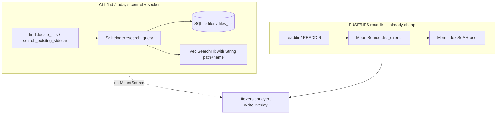

# V-1 — Cheap scan, then refine

| Field | Value |
|-------|--------|
| **Author** | ratarmount-rs |
| **Date** | 2026-08-28 |
| **Status** | Plan (skeptic review in progress) |
| **Item** | [`vectorize-steal-patterns.md`](../vectorize-steal-patterns.md) **V-1** Cheap scan then refine (`partial`, M) |
| **Pairs with** | [`vectors-optimization.md`](../vectors-optimization.md) P0 list/dirents residual; [`beyond-parity-roadmap.md`](../beyond-parity-roadmap.md) **F-3** overlay residual |
| **Audience** | Implementers who already know `MountSource`, `MemIndex` / `EntrySoa`, F-3 locate, and `WriteOverlay` |
| **This document** | Implementation train only. **Do not implement from this file until Status is ACCEPT.** |

---

## Overview

Steal Cloudflare Vectorize’s **two-phase query** (scan a cheap representation, refine only the hits). Do **not** steal SIMD, IVF, PQ, or ANN. Member bytes stay exact.

V-1 finishes the metadata side of that split:

1. Locate (`ratarmount find`, control `search/<pattern>`, socket `search`, FTS) walks **SoA columns + pool ids** (or the 0.7.x `files` catalog) and allocates path strings **only for emitted hits**.
2. `list()` grows a typed **“need FileInfo”** flag so a search-like walk cannot default into `BTreeMap<String, FileInfo>`.
3. Overlay-only names (creates + tombstones) participate in **cheap** search without building a second fat catalog.
4. Regression: `find '*.fits'` RSS on a 200k-member catalog stays near **cheap `list_dirents` / SoA** RSS, not near a fat `list()` map.

This is the same toolbox as P0 density. The remaining tax is path materialization, leftover `list()` callers, overlay-blind locate, and compact-only search returning empty — not cosine math.

---

## What this is not (hard non-goals)

| Do not | Why |
|--------|-----|
| SIMD CRC / memchr / bulk hash | `vectors-optimization.md` **P2**; zlib-rs / rapidgzip, not Vectorize |
| IVF / k-means / PQ / ANN | Members are not points in \(\mathbb{R}^{D}\); wrong `cat` is corruption |
| Approximate member contents | A 95% correct `read()` is a bug |
| Replace the 0.7.x `files` table with centroid files | One SQLite blob per snapshot (V-2) is enough |
| Load a full `MemIndex` just to run sidecar-only CLI `find` | That **raises** RSS vs streaming SQL; see [Decision D1](#d1-two-backends-one-hit-type) |
| Run FTS5 `MATCH` over pool ids | FTS lives in `"files_fts"`; SoA has no inverted index |
| Hydrate `FileInfo` on the locate path “for completeness” | `SearchHit` / `CheapSearchHit` is the emit type; `FileInfo` is getattr/open |
| Lift CLI `find` + `-w` in v1 | Overlay context is the live mount; see [Decision D4](#d4-overlay-is-controlsocket-not-cli-find--w) |
| Tracker / D-Bus / mount `--index-fts` / write-then-read `echo pat > search` | F-3 residuals, not V-1 |
| V-2 snapshot pointer, V-3 remote cache, V-4 commit queue, V-5 offset-order list | Separate items |
| Change nested open / temp spool / `MountSource::open` | No format-matrix update |

---

## Investigation (current code — 2026-08-28)

Two locate paths already exist. They do **not** share a catalog walker. Optimizing FUSE readdir does not automatically optimize `ratarmount find`, and vice versa.



### CLI `find` — sidecar SQL, no `MountSource`

| Step | Location | Notes |
|------|----------|-------|
| Clap | `ratarmount/src/main.rs` `parse_args_from` ~465–488; `find_cli_error` ~569–584 | Rejects `-w` / exports; requires `PATTERN ARCHIVE` |
| Early exit | `main` ~791–800 | **Before** `factory::build_mount_source_ex` — never wraps `FileVersionLayer` or overlay |
| Query | `ratarmount/src/find.rs` `locate_hits` → `open_index_for_find` → `query_index` | Cold-index via `factory::open_path` if sidecar stale; then `SqliteIndex::search_query` |
| Hit type | `ratarmount-index/src/search.rs` `SearchHit` | `path: String`, `name: String`, scalars. **Never `FileInfo`.** |
| SQL | `search_glob_like` ~210–247 | `SELECT` reconstructed `fullpath` + name/size/mtime/offsetheader. Basename `*.fits` predicates on `"name" GLOB` but still **materializes `fullpath` for every hit**. |
| FTS | `search_fts_match` ~249–279 | `"files_fts" MATCH` + JOIN to `files` on `(name, path, offsetheader)` |
| Compact-only | `search_query` ~112–114 | **`Ok(Vec::new())`** — silent empty |
| Limit | `DEFAULT_SEARCH_LIMIT = 10_000` | `*` on a 200k catalog emits at most 10k strings, not 200k |

`find` does **not** call `list()`, `list_dirents()`, MemIndex, FUSE, or overlay. Existing tests (`find_glob`, `find_flag_*`) assert TSV / clap, not RSS.

### Control `search/<pattern>` and socket `search`

| Surface | Location | Catalog |
|---------|----------|---------|
| Control file | `ratarmount-compositing/src/control.rs` `search_text` → `on_search` callback | Same sidecar SQL as find (`find::tsv_search_callback`) |
| Readdir of `search/` | `control.rs` ~372–374 | **Intentionally empty** (no O(catalog) listing) |
| Socket | `ratarmount/src/main.rs` `control_reply` ~2320–2342 | Same callback; TSV + `count N` |
| Wiring | `main.rs` ~1123–1132 | Callback closes over `inputs[0]` + `OpenOptions` only — **no `WriteOverlay`** |
| Status residual | `control.rs` `status_text` ~206–227 | Still calls **`inner.list("/")`** (fat map) to print ≤128 root names. `list_dirents` of the control dir itself does **not** (regression `control_list_dirents_*`). |

Missing sidecar / `:memory:` → stable `error: search requires an on-disk index`. Compact-only live mounts therefore search-empty even when SoA is in RAM.

### FTS5

Additive `"files_fts"` (`fullpath`, `hashes`, unindexed path/name/offsetheader). Created only by `ensure_fts5` (find `--fts`), never by cold `create_writable`. `INDEX_VERSION` stays `0.7.0`. Compact-only: `ensure_fts5` is a no-op; `search_query` returns empty.

There is **no** pool-id FTS. Porting MATCH onto `StringPool` would be a new inverted index — out of V-1.

### `list()` vs `list_dirents()` vs `list_mode()` — no “need FileInfo” flag

**Trait:** `ratarmount-core/src/lib.rs` ~312–347.

| Method | Default | Payload |
|--------|---------|---------|
| `list(path)` | required | `ListResult::Names` or **`Infos(BTreeMap<String, FileInfo>)`** |
| `list_mode` | calls `list()` | names or modes |
| `list_dirents` | calls `list_mode()`, `size = 0` | `CheapDirent { name, mode, size }` |
| `lookup` | required | one `FileInfo` |

**No `ListNeed` type exists** (grep: proposal text in V-1 only).

Live readdir is already cheap:

- FUSE `list_mode_cached` → `source.list_dirents` only (`ratarmount-fuse/src/lib.rs` ~423–437). Test: `readdir_path_does_not_call_fat_list`.
- NFS READDIR → `list_dirents` (`ratarmount-nfs/src/vfs.rs`).
- Compositing wrappers (Prefix, Union default B-4, AutoMount readdir, WriteOverlay, Control, Folder, Transform `list_dirents`, FileVersionLayer) override `list_dirents`.

**Residual fat `list()` on the mount stack** (not find/search, but the V-1 flag exists so these cannot infect a search walk):

| Caller | Why fat today | Need FileInfo? |
|--------|---------------|----------------|
| Default `list_mode` / `list_dirents` | Backends that only implement `list()` | No |
| `ControlFolderMountSource::status_text` | Root names in `status` | Names only |
| `AutoMount::list_names_no_lazy` | Lazy child discovery / eager `-r` | Names only |
| `TransformMountSource::ensure_map` | One-time full-tree BFS | Names + dir-ness |
| `WriteOverlay::list` / `FileVersionLayer::list` / `UnionMountSource::list` | Legacy API | Readdir already uses `list_dirents` |
| Format `MountSource::list` | `index.list()` → `BTreeMap<String, FileInfo>` | Tools / tests |

`FileInfo` (`ratarmount-core/src/lib.rs` ~170–179) carries `linkname: String`, `userdata: Vec<UserData>` (TAR offsets, flags). Fat `list("/")` on a 200k flat TAR allocates that per child.

### FileVersionLayer cheap readdir — already done for FUSE

`ratarmount-compositing/src/versioning.rs`:

- `list_dirents` forwards `inner.list_dirents`; versions-folder synthesizes numbered `CheapDirent`s. **Never** `inner.list()`.
- `list()` still forwards `inner.list()` on normal paths.
- Test `file_version_layer_list_dirents_forwards_zip_without_fat_list` asserts `list_calls == 0`.

**Find / sidecar search does not go through FileVersionLayer.** V-1 does not change versioning semantics. A new `search_cheap` default on the trait must **forward** here (same bug class as pre-P0 `list_dirents`).

### MemIndex / SoA — cheap per directory, no catalog scan API

`ratarmount-index/src/mem.rs`:

- `StringPool`: slab + span ids; `get(id)` is a `&str` slice (no alloc).
- `PathTable`: CSR `offsets` + `seg_ids`.
- `EntrySoa`: parallel `offsetheader/offset/size/mtime/mode/linkname_id/uid/gid/flags/recursiondepth`.
- `list_dirents(dir)` streams **one directory**: still `pool.get(nid).to_string()` per name (and linkname).
- `list(dir)` calls `soa.to_file_info` per child.
- **No** public “visit every `(path_id, name_id, soa_idx)` matching a glob” API.

`SqliteIndex::list_dirents` SELECTs `name, offsetheader, offset, size, mode, linkname, …` for one `"path"` — allocates `String` name/linkname per row, not `FileInfo`.

### Overlay vs search — F-3 residual

`WriteOverlay::list_dirents` (`write_overlay.rs` ~1216–1257) already merges `base.list_dirents` + overlay `read_dir` − `list_deleted`, using `overlay_file_info` only for overlay entries (not a base fat map).

Tombstones live in the overlay SQLite `"files"` table (`deleted = 1`), keyed by `(path, name)`. Creates live on the overlay host directory. **Neither is in the archive sidecar `files` catalog until commit.**

Today:

- CLI `find` **rejects** `-w`.
- Control / socket search **reopens the sidecar** and never asks `WriteOverlay`.
- Uncommitted creates are invisible; uncommitted deletes still appear.

`list_deleted` is **per-directory**. There is no recursive “all tombstones / all overlay creates” helper for locate.

### Benchmarks — no 200k `ratarmount find` RSS

`benchmarks/compare-python-vs-rust.sh` `measure_find` runs kernel **`find "$mount"`** (FUSE tree walk), not `ratarmount find`. Largest default fixture is `small-1000.tar`. MemIndex unit regression uses **220** names. V-1’s 200k RSS bar is **not implemented**.

---

## Goals (this train → V-1 `done`)

1. **Locate never builds `FileInfo`.** Hits are `SearchHit` / `CheapSearchHit` (path + name + size + mtime [+ offsetheader]). `lookup`/`open` remain the refine pass.
2. **SoA / pool-id scan** for live compact catalogs: iterate `name_id` / `path_id` + SoA scalars; `pool.get` as `&str` for glob; allocate `String` paths **only for emitted rows**.
3. **Sidecar SQL find stays streaming SQL.** Do not re-index 200k rows into `MemIndex` to answer `ratarmount find`.
4. **FTS stays SQL `MATCH`.** Same hit type; no SoA FTS.
5. **`ListNeed`** so leftover `list()` callers that only want names cannot trip the default Infos path; search/status/automount-name walks use Cheap.
6. **Overlay-only names in cheap control/socket search** on a live `-w` mount: creates appear, tombstones disappear, no second `BTreeMap<String, FileInfo>`.
7. **Regression** that a 200k-row catalog `*.fits` locate does not construct N `FileInfo`s and stays near cheap-list RSS (see [Verification](#verification)).
8. Compact-only live search **stops returning empty** when SoA is present.

---

## Decisions (locked for this train)

### D1. Two backends, one hit type

Locate has two catalogs today. V-1 keeps both and shares an emit struct.

| Backend | When | Scan representation | Refine (emit) |
|---------|------|---------------------|---------------|
| **SQL sidecar** | CLI `find`; control/socket when `search_cheap` is `None` and a sidecar exists | SQLite `files` / `files_fts` cursor | `SearchHit` strings for **hits only** (already true; keep it) |
| **Live SoA** | Control/socket when the mount implements `search_cheap`; compact-only | `path_id` + `name_id` + SoA idx; glob against `pool.get` `&str` | `CheapSearchHit` strings for **hits only** |

**Do not** unify CLI find onto MemIndex. Opening / sealing 200k SoA rows to answer a sidecar query is the explosion the RSS bar forbids. SQL page cache + hit strings is the cheap scan for the no-mount path.

**Do not** unify FTS onto SoA. `--fts` / `fts:` stays `ensure_fts5` + `MATCH`. Compact-only + `--fts` remains empty/no-op (document; do not invent in-memory FTS).

### D2. `FileInfo` is not the refine type for locate

Vectorize’s refine pass rescores floats. Our locate refine is **path string + TSV scalars**, not `FileInfo`. The phrase “hydrate FileInfo only on hits” in the V-1 TODO is **interpreted as: do not hydrate `FileInfo` on the scan; do not hydrate it on hits either** unless a future caller needs getattr-grade metadata (out of v1). Adding `FileInfo` to `SearchHit` would be a regression.

`lookup` / `open` stay the getattr/open refine for FUSE/NFS.

### D3. `ListNeed` is additive — do not change `list()`’s signature

Breaking every `MountSource` impl is out of scope.

```rust
/// What a listing caller is allowed to force the backend to allocate.
#[derive(Clone, Copy, Debug, Eq, PartialEq)]
pub enum ListNeed {
    /// Names / modes / sizes. Must not build [`FileInfo`] maps.
    Cheap,
    /// Full [`FileInfo`] rows (`list()` today).
    FileInfo,
}

fn list_with(&self, path: &str, need: ListNeed) -> Option<ListResult> {
    match need {
        ListNeed::Cheap => match self.list_dirents(path)? {
            dents => Some(ListResult::Names(dents.into_iter().map(|d| d.name).collect())),
        },
        ListNeed::FileInfo => self.list(path),
    }
}
```

Exact shape may use `ListModeResult` when the caller wants modes; the **invariant** is: `ListNeed::Cheap` must not call `list()` on backends that have `list_dirents`. Default `list()` remains the fat API for tests and rare tools.

**Must migrate in this train** (live FUSE/control paths that still call `list()` for names only):

- `ControlFolderMountSource::status_text` → `inner.list_dirents("/")` (or `list_with(..., Cheap)`).
- `AutoMount::list_names_no_lazy` → `src.list_dirents(&rest)` names.

**Out of the must-migrate set (document as residual, do not block V-1 `done`):**

- `TransformMountSource::ensure_map` one-time BFS via `inner.list()` — first `--transform` readdir, not locate. Follow-up; do not expand V-1 into Transform.
- Format crate `list()` implementations — stay fat for callers that pass `ListNeed::FileInfo`.

Search / control `search/` / socket **must not** call `list()` or `list_with(..., FileInfo)`.

### D4. Overlay is control/socket, not CLI `find -w`

CLI `find` stays no-FUSE and **keeps rejecting** `-w`. Overlay participation is:

- `cat '/mnt/.ratarmount-control/search/*.fits'` on a `-w` mount
- socket `search *.fits` on the same process

Implementation: a **cheap overlay name iterator** on `WriteOverlay`, merged at hit time:

1. Scan base via `search_cheap` (SoA) or sidecar SQL (same as today).
2. Drop any hit whose full path is `is_deleted`.
3. Walk overlay **host tree** + overlay-db tombstone rows as `(dir, name, kind)` **without** `overlay_file_info` / `FileInfo`.
4. If a create’s basename or reconstructed full path matches the glob, emit a `CheapSearchHit` using overlay `symlink_metadata` size/mtime only (already what `list_dirents` does per entry — allowed on **hits**, not on the whole overlay tree as a fat map).

Add `WriteOverlay::list_deleted_all()` (or a cursor) so tombstones are not discovered by walking every base directory. Creates: recursive `read_dir` of the overlay root, skipping `HIDDEN_DB` and sidecars — names only until a glob hit.

**Do not** build `BTreeMap<String, FileInfo>` of overlay ∪ base for search.

**Union / multi-input:** control today searches `inputs[0]` only. V-1 does not invent union-catalog locate.

### D5. Live search is a `MountSource` hook, not a fatter callback

Today `on_search: Arc<dyn Fn(&str) -> String>` cannot see overlay or compact SoA.

Add to `MountSource` (default `None` = “use sidecar callback”):

```rust
fn search_cheap(&self, pattern: &str) -> Option<Vec<CheapSearchHit>> {
    None
}
```

`CheapSearchHit` lives in **`ratarmount-core`** (path, name, size, mtime; optional `offsetheader: Option<u64>`). `ratarmount-index::SearchHit` stays the SQL type; `find.rs` maps in either direction for TSV.

| Impl | Behavior |
|------|----------|
| Default | `None` |
| TAR / ZIP / 7z / other `SqliteIndex`+`MemIndex` formats | `Some(index.scan_glob(pattern))` — SoA when compact-only or mem projection present; else SQL `search_query` mapped to `CheapSearchHit` |
| `WriteOverlay` | Base `search_cheap` (or `None`) + overlay merge ([D4](#d4-overlay-is-controlsocket-not-cli-find--w)) |
| `FileVersionLayer` / Prefix / Control / AutoMount | **Forward** `inner.search_cheap` (versions folder is not a locate corpus) |
| Union | `None` in v1 (keep sidecar of `inputs[0]`) |
| Folder / remote folder | `None` (not a 0.7.x catalog; out of V-1) |

Control `search_text`: if `self.inner.search_cheap(pattern)` is `Some(hits)`, format TSV; else existing `on_search` / missing-index error. Socket uses the same `SearchFn` built from the **outer** `MountSource` (the overlay-wrapped tree), not a sidecar-only closure.

CLI `find` does **not** call `search_cheap`. It stays `SqliteIndex::search_query`.

Factory / `main.rs` glue: pass the mounted `Arc<dyn MountSource>` into the socket callback (small orchestrator-owned change). Control can call `inner` directly and may drop `on_search` for the glob path once `search_cheap` is wired; keep `on_search` as fallback for sidecar-only mounts without a format impl.

### D6. RSS bar means cheap listing, not fat `list()`

The V-1 sentence “stay near `list()` RSS” is **ambiguous** because `list()` is the fat API. **Locked meaning:**

> Peak RSS / allocated `FileInfo` count for `find '*.fits'` (or `search_cheap("*.fits")`) on a 200k-row catalog must stay in the same band as a cheap `list_dirents` / SoA hold of that catalog, and must be **far below** materializing `MemIndex::list("/")` / `BTreeMap<String, FileInfo>`.

A test that only proves “find RSS ≤ fat list RSS” is a **weak bar and is not sufficient**.

CI must not depend on a 200k-member **on-disk TAR** (slow, large). Primary regression is a **synthetic `MemIndex`** with 200k SoA rows (short interned names, ~1% `*.fits` hits). Optional BIG-fixture script may exist; missing fixture → `eprintln!("skip: …")` plus the synthetic test still runs.

Also pin: CLI `find` on a real sidecar must not construct `FileInfo` (spy / debug-assert / unit on `search_query`). `DEFAULT_SEARCH_LIMIT` stays 10_000 unless a follow-up changes it; the 200k case uses a **selective** glob so hit-string count is small. A second case (`*` or `*.txt` with many hits) asserts we still do not build N `FileInfo`s even if we allocate N hit strings (capped by the limit).

### D7. Scope of “scan SoA then refine” vs SQL `fullpath`

SQL already skips `FileInfo`. Remaining SQL cost (reconstruct `fullpath` in the SELECT for every hit) is acceptable in v1. Optional micro-opt (SELECT `path`+`name`, format in Rust) is **not** required to flip V-1 to `done`. Do not spend the train rewriting glob SQL.

SoA work is the **new** `MemIndex::scan_glob`:

- Walk all dir shards / `dirs` map: `(path_id, name_id, last soa_idx)`.
- Skip `isgenerated` and dumpdir tombstone `linkname_id` (same filters as `catalog_filter_sql`).
- Basename glob: `wildcard_match(pool.get(name_id), pattern)` — **no** `String` unless it matches.
- Full-path glob: build a **temporary** path on the stack / a reused `String` buffer from PathTable segments; only `clone` into `CheapSearchHit` on match.
- Respect `DEFAULT_SEARCH_LIMIT`.

This is the Vectorize PQ-scan analogue: columns + ids in, strings out only for survivors.

---

## Non-goals (explicit leftovers — do not silently expand)

- Transform `ensure_map` fat BFS.
- Union-catalog locate.
- CLI `find --write-overlay DIR` (offline overlay merge without a mount).
- Compact-only CLI `find` without a sidecar (still “on-disk index” / empty).
- In-memory FTS for compact-only.
- Raising / removing `DEFAULT_SEARCH_LIMIT`.
- Streaming TSV without `Vec<SearchHit>` (nice-to-have; not the RSS bug).
- Changing `CheapDirent` to hold pool ids (FUSE still needs `String` names at the kernel boundary).
- Offset-order find (V-5).

---

## Implementation train (one PR is OK; slices if parallelizing)

Ownership: **index + core + compositing + CLI glue**. Orchestrator owns `ratarmount/src/factory.rs` / `main.rs` callback wiring if split. Format crates only grow a thin `search_cheap` → index forward (same pattern as `list_dirents`).

### Slice 1 — Core flag + residual name-only callers

**Files:** `ratarmount-core/src/lib.rs`; `ratarmount-compositing/src/control.rs`; `ratarmount-compositing/src/automount.rs`; tests next to those.

- Add `ListNeed`, `CheapSearchHit`, `MountSource::list_with`, `MountSource::search_cheap` (default `None`).
- `status_text` and `list_names_no_lazy` stop calling `list()`.
- Tests: counted `list()` wrapper (same style as `file_version_layer_list_dirents_forwards_zip_without_fat_list`) for control `status` and AutoMount name walk.

### Slice 2 — SoA `scan_glob` + format forwards

**Files:** `ratarmount-index/src/mem.rs` (new scan); `ratarmount-index/src/search.rs` (map SQL → same filters; compact-only SQL stays empty); format `MountSource::search_cheap` on TAR/ZIP/7z at minimum (the indexes find already uses); FileVersionLayer / Prefix / AutoMount **forward**.

- Unit: 200k synthetic SoA, `*.fits` hits, **zero** `to_file_info` / `FileInfo` clones (counter on `EntrySoa::to_file_info` under `#[cfg(test)]` or a test-only hook).
- Unit: compact-only `MemIndex` `scan_glob("*.fits")` returns hits (this is the compact-only locate fix).
- Keep `search_query` compact-only → empty for **SQL** callers (CLI find without sidecar still errors / empty as today).

### Slice 3 — Overlay merge + control/socket wiring

**Files:** `ratarmount-compositing/src/write_overlay.rs`; `control.rs`; `ratarmount/src/main.rs` (socket `SearchFn` from mounted source); **not** factory open paths.

- `search_cheap` on `WriteOverlay`.
- Tests: overlay create `new.fits` appears; base `old.fits` tombstoned disappears; overlay-only name does **not** go through `base.list()`.
- Existing `find_glob` / `control_search` / `control_search_socket` / `search_fts5` stay green.
- CLI `find` + `-w` still rejected (`find_flag` / `find_cli_error`).

### Slice 4 — Docs + catalog row (same commit as behavior)

- [`vectorize-steal-patterns.md`](../vectorize-steal-patterns.md) V-1 checkboxes → `[x]` / residual notes.
- [`beyond-parity-roadmap.md`](../beyond-parity-roadmap.md) F-3 residual: overlay names in **control/socket** search; CLI find still sidecar-only.
- [`vectors-optimization.md`](../vectors-optimization.md) P0: `ListNeed` + leftover `list()` note.
- Root `AGENTS.md` regression catalog: new row (see [Verification](#verification)).
- README: one line under locate / control search if the user-visible claim changes (“write-mount search sees uncommitted names”).

No `docs/embedded-nested-archives.md` change (no open/tmp/nested behavior).

---

## Risks and fail-closed rules

| Risk | Rule |
|------|------|
| Implementer “unifies” find onto MemIndex | Forbidden by D1; RSS test must fail if CLI find (sidecar fixture) suddenly holds a 200k SoA without a mount |
| `search_cheap` default `None` forgotten on FileVersionLayer | Same class as P0 `list_dirents`; test `file_version_layer_search_cheap_forwards_without_list` |
| Overlay merge calls `overlay_file_info` for every overlay file | Only on glob **hits**; test with many overlay names + sparse glob |
| Overlay recursive walk follows host symlinks out of the overlay root | Reuse existing overlay escape rejects (`overlay_rejects_symlink_escape_outside_root`) |
| Control `search/` readdir starts listing the catalog | Keep empty; do not “helpfully” dump hits as dirents |
| FTS JOIN still allocates `FileInfo` | It must not; `row_to_hit` stays scalars |
| `list_with(Cheap)` falling back to `list()` when `list_dirents` is the default trait impl | Default `list_dirents` still derives from `list()`. `list_with(Cheap)` should call `list_dirents` **only if the type overrides it**, or accept that un-upgraded backends stay fat. **v1:** document that `list_with(Cheap)` is `list_dirents` as implemented (including the default chain). Migration of format defaults is **not** required; FUSE already requires overrides. |
| 200k synthetic OOM on small CI | 200k × ~40 B SoA + short pool ≈ low tens of MiB; if a runner is tight, drop to 50k and keep the FileInfo-count assert. Do not skip the happy path. |

---

## Verification

Every behavior change lands with tests in the **same** PR (`AGENTS.md`). Name/doc with `Regression:` + symptom.

| Symptom / claim | Command / test |
|-----------------|----------------|
| SoA scan does not build `FileInfo` | `cargo test -p ratarmount-index --lib scan_glob` (new; 200k synthetic; `to_file_info` count 0) |
| Compact-only locate works live | `cargo test -p ratarmount-index --lib scan_glob_compact` + format `search_cheap` test |
| CLI find still SQL / no `-w` | `cargo test -p ratarmount --bin ratarmount find_glob` · `find_flag` |
| FTS unchanged | `cargo test -p ratarmount-index --lib search_fts5` |
| Control / socket TSV | `cargo test -p ratarmount-compositing --lib control_search` · `cargo test -p ratarmount --bin ratarmount control_search_socket` |
| Overlay create visible, tombstone hidden | `cargo test -p ratarmount-compositing --lib search_cheap_overlay` (new) |
| FileVersionLayer does not fat-list | existing `file_version_layer_list_dirents` + new `search_cheap` forward test |
| `status` / AutoMount names | new counted-`list()` tests in compositing |
| Cheap readdir still cheap | `cargo test -p ratarmount-compositing --lib list_dirents` · `file_version_layer_list_dirents` |
| Find RSS vs fat list (synthetic) | same `scan_glob` test: fat `list("/")` FileInfo count == N; cheap scan == 0 |
| Optional on-disk 200k | `benchmarks/` or `test-harness/` script; `skip:` if fixture absent; **not** a silent pass |

**New `AGENTS.md` catalog row** (implementer adds in the impl PR, not this plan PR):

| Symptom / fix | Commands |
|---------------|----------|
| `find '*.fits'` / control search fat `FileInfo` on large catalog; overlay-only names missing | `cargo test -p ratarmount-index --lib scan_glob` · `cargo test -p ratarmount-compositing --lib search_cheap` · existing `find_glob` / `control_search` / `search_fts5` |

Gates before the impl commit: `cargo fmt --all` · `cargo clippy --workspace --all-targets -- -D warnings` · scoped tests above, then `cargo test --workspace` if the change is cross-crate.

---

## Docs delta (impl PR)

| Doc | Change |
|-----|--------|
| `docs/tasks/vectorize-steal-patterns.md` | V-1 boxes; status `done` or residual list |
| `docs/tasks/beyond-parity-roadmap.md` | F-3 overlay residual narrowed |
| `docs/tasks/vectors-optimization.md` | P0 `ListNeed` note |
| `AGENTS.md` | catalog row |
| `README.md` | only if control search on `-w` is advertised |

This **plan** file is not user-facing product docs.

---

## Suggested impl order

1. Slice 1 (flag + stop name-only `list()`).
2. Slice 2 (SoA scan + compact-only + FileInfo-count regression).
3. Slice 3 (overlay + control/socket).
4. Slice 4 (docs + AGENTS.md).

Slice 2 is the density win. Slice 3 is the F-3 residual. Slice 1 is what makes “cheap search does not force full rows” mechanically true.

---

## Skeptic review log

| Sweep | Agent | Verdict | Folded |
|-------|-------|---------|--------|
| 0 | author (pre-review) | draft | — |

Sweeps 1–3 are filled by a **fresh** skeptic Task each time (never skip sweep 1; cap 3 then BLOCKED).
