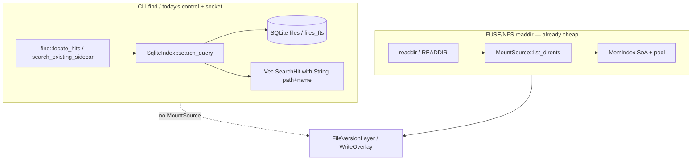

# V-1 — Cheap scan, then refine

| Field | Value |
|-------|--------|
| **Author** | ratarmount-rs |
| **Date** | 2026-08-28 |
| **Status** | **Implemented** `76ce000` |
| **Item** | [`vectorize-steal-patterns.md`](../vectorize-steal-patterns.md) **V-1** Cheap scan then refine (`partial`, M) |
| **Pairs with** | [`vectors-optimization.md`](../vectors-optimization.md) P0 list/dirents residual; [`beyond-parity-roadmap.md`](../beyond-parity-roadmap.md) **F-3** overlay residual |
| **Audience** | Implementers who already know `MountSource`, `MemIndex` / `EntrySoa`, F-3 locate, and `WriteOverlay` |
| **This document** | Implementation train only. **Do not implement from this file until Status is ACCEPT.** |

---

## Overview

Steal Cloudflare Vectorize’s **two-phase query** (scan a cheap representation, refine only the hits). Do **not** steal SIMD, IVF, PQ, or ANN. Member bytes stay exact.

V-1 finishes the metadata side of that split:

1. **CLI `find` / FTS stay streaming SQL** over the 0.7.x `files` / `files_fts` catalog. Allocate path strings only for emitted hits. Do **not** load `MemIndex` to answer sidecar `find`.
2. **Live control/socket / compact-only** walk **SoA columns + pool ids** (`search_cheap` / `MemIndex::scan_glob`) and allocate path strings only for emitted hits.
3. `list()` grows an additive **`ListNeed`** flag (P0 leftover). Cheap search **must not** call `list()` / `list_with(FileInfo)` — the flag is not the locate API.
4. Overlay names (creates, **COW/replace/rename-dest**, tombstones) participate in **cheap** control/socket search without a second fat catalog, via **one** SearchFn (control file ≡ socket). `--prefix` / `--transform` + `-w` last-wins is **residual**.
5. Regression: locate `*.fits` on a 200k-row **synthetic SoA** (and SQL `search_query` on a sidecar) stays near cheap `list_dirents` / SoA RSS, not near a fat `list()` map. **No CI 200k on-disk TAR.** Cold `factory::open_path` for a missing sidecar is **out of the RSS bar**.

This is the same toolbox as P0 density. The remaining tax is leftover `list()` callers, overlay-blind locate, compact-only search returning empty, and implementers “unifying” find onto MemIndex — not cosine math.

**Impl prompt phrase lock:** do **not** tell implementers to “hydrate `FileInfo` only on hits.” Hits are `SearchHit` / `CheapSearchHit`. `FileInfo` is getattr/open only.

---

## What this is not (hard non-goals)

| Do not | Why |
|--------|-----|
| SIMD CRC / memchr / bulk hash | `vectors-optimization.md` **P2**; zlib-rs / rapidgzip, not Vectorize |
| IVF / k-means / PQ / ANN | Members are not points in \(\mathbb{R}^{D}\); wrong `cat` is corruption |
| Approximate member contents | A 95% correct `read()` is a bug |
| Replace the 0.7.x `files` table with centroid files | One SQLite blob per snapshot (V-2) is enough |
| Load a full `MemIndex` just to run sidecar-only CLI `find` | That **raises** RSS vs streaming SQL; see [D1](#d1-two-backends-one-hit-type) |
| Run FTS5 `MATCH` over pool ids | FTS lives in `"files_fts"`; SoA has no inverted index |
| Hydrate `FileInfo` on locate (scan **or** hits) | Emit type is `SearchHit` / `CheapSearchHit` |
| Lift CLI `find` + `-w` in v1 | Overlay context is the live mount; see [D4](#d4-overlay-merge-ownership) |
| Recurse AutoMount nested children in locate | Matches today’s sidecar of `inputs[0]` only; see [D5](#d5-search_cheap-hook-and-forwards) |
| Naive-forward `search_cheap` through `OciImageMountSource` (`layers[0]`) | Image-correct locate is overlayfs merge (PR 8 shipped), not a forward; see [D5](#d5-search_cheap-hook-and-forwards). Folder is a host-tree walk; Union is a path+offsetheader catalog merge. |
| Rewrite Prefix/Transform hit paths or invent Transform inverse | Overlay last-wins on those stacks is residual; see [D4](#d4-overlay-merge-ownership) |
| Tracker / D-Bus / mount `--index-fts` / write-then-read `echo pat > search` | F-3 residuals, not V-1 |
| V-2 snapshot pointer, V-3 remote cache, V-4 commit queue, V-5 offset-order list | Separate items |
| Change nested open / temp spool / `MountSource::open` / `factory.rs` open paths | No format-matrix update; orchestrator owns factory glue |

---

## Investigation (current code — 2026-08-28)

Two locate paths already exist. They do **not** share a catalog walker. Optimizing FUSE readdir does not automatically optimize `ratarmount find`, and vice versa.



### Wrap order (live mount) — required for overlay/search wiring

```
format MountSource
  → Transform?          (apply_compositing, factory.rs ~3162)
  → AutoMount?          (recursive, ~3165)
  → Prefix?             (disable-union multi-source, ~3207)
  → Union?              (n_sources > 1, ~3697)
  → FileVersionLayer?   (~3705)
  → Prefix?             (comp.prefix, ~3708)
  → WriteOverlay?       (main.rs ~954–958, after factory bundle)
  → ControlFolder?      (main.rs ~1123–1133, outermost)
```

Control **wraps overlay**. `tsv_search_callback` closes over `inputs[0]` + `OpenOptions` only — **no `WriteOverlay`**. Socket uses that same sidecar closure. Live `search_cheap` must be invoked on the **outer** `MountSource` (Control → overlay → …) **or** the SearchFn in `main.rs` must hold `overlay_arc` for the sidecar fallback path. Do **not** edit `factory.rs` open paths.

### CLI `find` — sidecar SQL, no `MountSource`

| Step | Location | Notes |
|------|----------|-------|
| Clap | `ratarmount/src/main.rs` `parse_args_from` ~465–488; `find_cli_error` ~569–584 | Rejects `-w` / exports; requires `PATTERN ARCHIVE` |
| Early exit | `main` ~791–800 | **Before** `factory::build_mount_source_ex` — never wraps `FileVersionLayer` or overlay |
| Query | `ratarmount/src/find.rs` `locate_hits` → `open_index_for_find` → `query_index` | Cold-index via `factory::open_path` if sidecar stale; then `SqliteIndex::search_query` |
| Warm open | `SqliteIndex::open_writable` | Leaves `mem: None` — no SoA in the find process |
| Cold/stale | `find.rs` ~198–217 | `factory::open_path` **does** seal a MemIndex when `n ≤ MEM_INDEX_MAX_FILES` (500k). That peak is **index build**, not locate. **Out of the V-1 RSS bar.** |
| Hit type | `ratarmount-index/src/search.rs` `SearchHit` | `path: String`, `name: String`, scalars. **Never `FileInfo`.** |
| SQL | `search_glob_like` ~210–247 | `SELECT` reconstructed `fullpath` + name/size/mtime/offsetheader. Basename `*.fits` predicates on `"name" GLOB` but still **materializes `fullpath` for every hit**. |
| FTS | `search_fts_match` ~249–279 | `"files_fts" MATCH` + JOIN to `files` on `(name, path, offsetheader)` |
| Compact-only | `search_query` ~112–114 | **`Ok(Vec::new())`** — silent empty |
| Limit | `DEFAULT_SEARCH_LIMIT = 10_000` | `*` on a 200k catalog emits at most 10k strings, not 200k |

`find` does **not** call `list()`, `list_dirents()`, MemIndex, FUSE, or overlay. Existing tests (`find_glob`, `find_flag_*`) assert TSV / clap, not RSS.

### Control `search/<pattern>` and socket `search`

| Surface | Location | Catalog |
|---------|----------|---------|
| Control file | `ratarmount-compositing/src/control.rs` `search_text` → `on_search` callback | Same sidecar SQL as find (`find::tsv_search_callback`) |
| Readdir of `search/` | `control.rs` ~372–374 | **Intentionally empty** (no O(catalog) listing) |
| `lookup` + `open` | `control.rs` ~452–454, 485–487 | **`search_text` runs twice** per `cat` (size then body). V-1 **accepts 2×**. Do not “fix” this by caching a `FileInfo` map. |
| Socket | `ratarmount/src/main.rs` `control_reply` ~2320–2342 | Same callback; TSV + `count N` |
| Wiring | `main.rs` ~1123–1132 | Callback closes over `inputs[0]` + `OpenOptions` only — **no `WriteOverlay`** |
| Status residual | `control.rs` `status_text` ~206–227 | Still calls **`inner.list("/")`** (fat map) to print ≤128 root names. `list_dirents` of the control dir itself does **not**. |
| `fts:` on control | `query_index` honors `fts:` prefix; callback uses `LocateOptions::default()` but still splits `fts:` | Live `scan_glob` is glob-only — see [D5](#d5-search_cheap-hook-and-forwards) |

Missing sidecar / `:memory:` → stable `error: search requires an on-disk index`. Compact-only live mounts therefore search-empty even when SoA is in RAM.

Existing `control_search` tests the **callback**, not `MountSource::search_cheap`. They stay green even if live search is wrong — new tests must pin the live path.

### FTS5

Additive `"files_fts"` (`fullpath`, `hashes`, unindexed path/name/offsetheader). Created only by `ensure_fts5` (find `--fts`), never by cold `create_writable`. `INDEX_VERSION` stays `0.7.0`. Compact-only: `ensure_fts5` is a no-op; `search_query` returns empty. `ensure_fts5` already full-rebuilds the table; do not invent a SoA rebuild.

There is **no** pool-id FTS. Porting MATCH onto `StringPool` is out of V-1.

### `list()` vs `list_dirents()` vs `list_mode()` — no “need FileInfo” flag

**Trait:** `ratarmount-core/src/lib.rs` ~312–347.

| Method | Default | Payload |
|--------|---------|---------|
| `list(path)` | required | `ListResult::Names` or **`Infos(BTreeMap<String, FileInfo>)`** |
| `list_mode` | calls `list()` | names or modes |
| `list_dirents` | calls `list_mode()`, `size = 0` | `CheapDirent { name, mode, size }` |
| `lookup` | required | one `FileInfo` |

**No `ListNeed` type exists.** Default `list_dirents` still fat-materializes on backends that only implement `list()`.

Live readdir is already cheap (FUSE `list_mode_cached`, NFS READDIR, compositing `list_dirents` overrides). Residual name-only `list()` callers: `status_text`, `AutoMount::list_names_no_lazy`. Transform `ensure_map` is a one-time BFS — **out of V-1 must-migrate**.

`FileInfo` carries `linkname: String` + `userdata: Vec<UserData>`. Fat `list("/")` on a 200k flat TAR allocates that per child.

### FileVersionLayer cheap readdir — already done for FUSE

`list_dirents` forwards `inner.list_dirents`; versions-folder synthesizes numbered `CheapDirent`s. Test `file_version_layer_list_dirents_forwards_zip_without_fat_list` asserts `list_calls == 0`.

**Find / sidecar search does not go through FileVersionLayer.** A new `search_cheap` default `None` on the trait **must forward** here. Locate must **not** emit `.versions/*` paths (SQL never did).

### MemIndex / SoA — cheap per directory, no catalog scan API

`StringPool::get(id)` is `&str`. `list_dirents(dir)` still `to_string()` per name. `list(dir)` calls `soa.to_file_info`. **No** public catalog-wide `(path_id, name_id, soa_idx)` scan. No shared glob helper matching SQL `GLOB` (`**` collapse, `/` ⇒ full path, LIKE vs GLOB — `search.rs` ~417–450).

`SqliteIndex` formats that already forward `index.list_dirents` (must all get `search_cheap` — same bar):

TAR, ZIP, 7z, CPIO, AR, WARC, CAB, ISO, ASAR, XAR, libarchive, OGG, HTML, PDF.

### Overlay vs search — F-3 residual

`WriteOverlay::list_dirents` last-wins overlay host over base by name, minus `list_deleted`. Overlay host already holds **creates, COW copies, truncates, replace, rename destinations** (`ensure_modifiable` ~288–322). Tombstones: overlay SQLite `"files"` (`deleted = 1`), keyed by `split(normpath)` → folder `""` or `"/dir"` + name. `is_deleted(path)` uses that split. Commit already `SELECT path, name FROM files WHERE deleted = 1`.

**Neither overlay host nor tombstones are in the archive sidecar until commit.**

`:temp:` is the same `WriteOverlay` type — no extra API.

---

## Goals (this train → V-1 `done`)

1. **Locate never builds `FileInfo`.** Hits are `SearchHit` / `CheapSearchHit`.
2. **SoA / pool-id scan** for live compact / format catalogs (`MemIndex::scan_glob`).
3. **Sidecar SQL find stays streaming SQL.** No MemIndex load for `ratarmount find`.
4. **FTS stays SQL `MATCH`.** `fts:` on control/socket also stays SQL (not `scan_glob`).
5. **`ListNeed`** is shipped as the P0 leftover so name-only walks *can* avoid Infos. **V-1 `done` does not depend on Slice 1 alone.**
6. **Overlay last-wins** on control/socket `-w` mounts: host paths override base hits; tombstones drop; no second fat catalog.
7. **Regression** as [D6](#d6-rss-bar) — synthetic SoA + SQL no-`FileInfo`, not a 200k TAR `find` RSS number.
8. Compact-only **live** search stops returning empty when SoA is present. Compact-only **CLI find** without a sidecar stays empty / “on-disk index.”

**V-1 checkbox rewrite** (impl PR updates `vectorize-steal-patterns.md`):

> CLI find / FTS stay streaming SQL (strings on hits only, no `FileInfo`). Live control/socket / compact-only scan SoA + pool ids. Overlay last-wins on control/socket. `ListNeed` additive.

Do not leave the source checkbox as “find / FTS stay on SoA + pool ids” — that is how implementers unify onto MemIndex.

---

## Decisions (locked for this train)

### D1. Two backends, one hit type

| Backend | When | Scan | Emit |
|---------|------|------|------|
| **SQL sidecar** | CLI `find`; control/socket when live `search_cheap` is `None`; **all `fts:` / `--fts`** | SQLite `files` / `files_fts` cursor | `SearchHit` strings for hits only |
| **Live SoA** | Control/socket when the mount stack returns `Some` from `search_cheap` (glob only) | `path_id` + `name_id` + SoA idx; glob against `pool.get` `&str` | `CheapSearchHit` strings for hits only |

**Do not** unify CLI find onto MemIndex. Warm `open_writable` has `mem: None`. Loading SoA for `ratarmount find` is the explosion D6 forbids.

**Do not** unify FTS onto SoA. Compact-only + `--fts` remains empty/no-op.

### D2. `FileInfo` is not the refine type for locate

Locate refine = path string + TSV scalars. **Never** add `FileInfo` to `SearchHit`. The source-TODO phrase “hydrate FileInfo only on hits” is **rejected** as an impl instruction (sweep 1 #6). `lookup` / `open` stay the getattr/open refine.

### D3. `ListNeed` is additive and is **not** the locate API

Do not change `list()`’s signature.

```rust
pub enum ListNeed {
    Cheap,    // must not *require* FileInfo; see caveat
    FileInfo, // today's list()
}

fn list_with(&self, path: &str, need: ListNeed) -> Option<ListResult> { /* ... */ }
```

**Caveat (default chain):** `list_with(Cheap)` is `list_dirents` as implemented. Default `list_dirents` still derives from `list()`. Un-upgraded backends stay fat. FUSE already requires `list_dirents` overrides. **`ListNeed` does not make search cheap** — search must not call `list()` / `list_with(FileInfo)` at all. Prefer `list_dirents` directly for the two migrations.

**Must migrate (P0 leftover, same PR OK):**

- `ControlFolderMountSource::status_text` → `inner.list_dirents("/")`.
- `AutoMount::list_names_no_lazy` → `src.list_dirents(&rest)` names.

**Out of must-migrate:** `TransformMountSource::ensure_map`; format `list()` impls.

**Slice 1 alone is not V-1 `done`.**

### D4. Overlay merge ownership

CLI `find` keeps rejecting `-w`. Overlay participation is control + socket on a live `-w` mount (`:temp:` included).

#### Semantics (match `list_dirents` last-wins)

Not “creates + tombstones” only:

1. Start from **base hits** (SoA or SQL).
2. Drop any hit whose path `WriteOverlay::is_deleted` (same `split(normpath)` as `mark_deleted` — **not** unslashed `join_rel` commit paths).
3. Walk overlay **host tree** (recursive `read_dir`, skip `HIDDEN_DB` + sqlite sidecars, no symlink escape — reuse `ensure_under_root`). Names that match the glob **override** the base hit with the same full path (COW / truncate / replace / rename-dest / new create). Size/mtime from `symlink_metadata` **on hits only**.
4. Tombstone rows: `SELECT path, name FROM files WHERE deleted = 1` (already used at commit). Apply via `is_deleted` / the same keys. `rmdir` already refuses nonempty — no recursive dir-tombstone hole.

**Do not** build `BTreeMap<String, FileInfo>` of overlay ∪ base.

Use **`current_base()`**, not `self.base` (live commit `replace_base` swaps the replacement).

#### Locks (do not invert)

- Do **not** call `overlay_file_info` from locate (that builds `FileInfo`).
- Do **not** hold `db` across `is_deleted`, `current_base().search_cheap`, or `read_dir` (same-thread deadlock). One tombstone `HashSet` from `SELECT path, name FROM files WHERE deleted = 1`, then drop the mutex. Do **not** take `commit_gate` after `db` (create is gate-then-db). Matching `list_dirents` (no gate) is enough; mid-commit races already exist.
- Overlay last-wins is **string equality on the path each layer already uses**. `--prefix` / `--transform` + `-w` locate is **residual**: tombstone/COW may not hide catalog hits; overlay creates appear as mount paths next to catalog paths. Do not rewrite. Do not invent a Transform inverse. F-3 docs must say this.

#### One exclusive SearchFn (control file ≡ socket)

`search_cheap` → `None` means “not implemented, caller may sidecar.” `Some(v)` means “this is the **full** answer.”

There is **one** `Arc<dyn Fn(&str) -> String>` built in `main.rs` (the SearchFn). **`Control.search_text` is that function** (same `Arc` as the socket). It does **not** also prefer `inner.search_cheap` and then call `on_search`. Dual owners are how overlay vanishes on the control file or TSV is last-wins’d twice.

**Day-1 pin:** `main.rs` already builds the callback **before** wrapping Control. SearchFn must close over the **pre-Control** `Arc` (WriteOverlay or factory bundle) plus `overlay_arc`. Do **not** capture Control (chicken-egg / stack overflow). `Control.search_cheap` exists so trait callers/tests see the overlay; SearchFn step 2 calls the pre-Control source (or Control only in tests that construct `Control(overlay)` and call `search_text` via the shared Arc). `Control.search_cheap` **forwards to `inner`**, never to `search_text` / `on_search`.

**SearchFn steps (this is the only locate pipeline for control + socket):**

1. If pattern is `fts:` or the CLI `--fts` bit is set → **never** call `search_cheap` / `scan_glob`. SQL `MATCH` only. Then if `overlay_arc` is `Some`, overlay-merge onto those hit rows. Stop.
2. Else `outer.search_cheap(pattern)` if `Some` → format TSV. **Stop.** (`WriteOverlay` already merged when base was `Some`. **Do not** apply `overlay_arc` again.)
3. Else sidecar SQL (`search_existing_sidecar`). **Any** sidecar `Err` (missing sidecar, `:memory:`, or other) → emit `error: {e}` and **do not** overlay-merge. **Do not** invent overlay-only-on-`[]` when there is no sidecar (compact-only Union / OCI / `:memory:` stay that error). Then, if `overlay_arc` is `Some` **and** sidecar returned `Ok(hits)` (**including empty `Ok([])`** on a real sidecar), overlay-merge onto those rows.

`WriteOverlay::search_cheap`: return `Some(merged)` **only if** `current_base().search_cheap` was `Some`. If base is `None`, return **`None`**.

`Control.search_cheap` **forwards** to `inner` so step 2 on the outer source sees WriteOverlay. That forward is **not** a second merge.

**Residual:** no sidecar and no `search_cheap` → `search requires an on-disk index`. Multi-input sidecar remains `inputs[0]` when live Union is `None` (any source `None`).

Required test: `Control(WriteOverlay(base))` — **identical** TSV from `search_text` and from SearchFn for (i) base `Some` + COW, (ii) base `None` + overlay create (sidecar present), (iii) `fts:`.

### D5. `search_cheap` hook and forwards

`CheapSearchHit` lives in **`ratarmount-core`** (`path`, `name`, `size: i64`, `mtime`, `offsetheader: Option<i64>` — same as `SearchHit`). SoA `size` is `u64` (one cast). SoA `offsetheader < 0` is NULL (same as `mem.rs` today). No cycle (`ratarmount-index` already depends on core).

**New inherent methods (name them so formats stay one-liners):**

- `MemIndex::scan_glob(pattern) -> Vec<CheapSearchHit>`
- `SqliteIndex::search_cheap(pattern) -> Result<Vec<CheapSearchHit>>` — if `mem` is `Some` (compact-only **or** `0 < n ≤ MEM_INDEX_MAX_FILES`) → `scan_glob`; **else SQL** `search_query` mapped to `CheapSearchHit`. Do **not** write `self.mem.as_ref()?.scan_glob(...)` and treat `None` mem as “no search.” Empty archive (`n == 0`, `mem: None`) uses SQL (empty table). Huge catalogs (`n > 500k`) use SQL on the mount’s existing `conn` — extra RSS is hit strings (cap 10k) + page cache already held; **do not** “optimize” that to `None` (would drop WriteOverlay `Some` and open a second sidecar).

```rust
fn search_cheap(&self, pattern: &str) -> Option<Vec<CheapSearchHit>> {
    None
}
```

If `pattern` has `fts:` prefix, **every** `search_cheap` impl (WriteOverlay, format, `SqliteIndex`, wrappers) returns **`None`** immediately (or is never called — SearchFn step 1). SQL `MATCH` only. Test: control `fts:name` does not call `scan_glob` (spy).

| Impl | Behavior |
|------|----------|
| Default | `None` |
| **SqliteIndex formats** (one-liner `self.index.search_cheap(pattern).ok()`) | TAR, ZIP, 7z, CPIO, AR, WARC, CAB, ISO, ASAR, XAR, libarchive, OGG, HTML, PDF. `.ok()` maps `Err` → `None` → SearchFn step 3 (sidecar retry). **Not** `.unwrap_or_default()` (`Some([])` would be a full empty answer). |
| EXT4 / FAT / SquashFS / Git / SQLAR / `SingleFile` / Dropbox | `None` (no `SqliteIndex`; sidecar or residual) |
| `WriteOverlay` | [D4](#d4-overlay-merge-ownership) — **not** a forward |
| **Forward set only** | FileVersionLayer, Prefix, AutoMount (parent catalog only), Transform, Control. Default `None` is the P0 bug class **for this set**. |
| Union | Catalog merge: `None` if any source is `None`; `Some([])` contributes; path+`offsetheader`, later source wins; no B-4; never `sources[0]`. |
| **`OciImageMountSource`** | Overlayfs locate: per-layer `search_cheap`; `None` if any layer is `None`; `Some([])` contributes; collect top→bottom; drop hidden/opaque; never emit `.wh.*`; never `layers[0]` alone. Not Union B-4. Do not recurse `overlay_list_dirents`. |
| Folder / remote folder | Folder: host-tree glob via `read_dir` + `symlink_metadata` (no `list()`; no recurse `S_IFLNK` dirs; `DEFAULT_SEARCH_LIMIT`). Remote folder stays `None`. |

**Do not** naive-forward Union `sources[0]` or OCI `layers[0]`. Folder host-tree glob, Union catalog merge, and OCI overlayfs locate shipped (PR 7 / PR 6 / PR 8).

**Hit path identity:** TSV paths stay **catalog paths** (today’s sidecar). Wrappers in the forward set **forward without rewriting**. Combined with D4 residual: `--prefix` / `--transform` + `-w` last-wins is **not** guaranteed.

**AutoMount:** parent catalog only. **FileVersionLayer:** forward; do not emit `.versions/*` (path rule — not “latest version only”; see D7).

**Factory:** `main.rs` SearchFn / `overlay_arc` only. **Do not touch `factory.rs`.**

**Shared glob:** one helper with SQL `GLOB` semantics (`**` → `*`, `/` ⇒ full-path pred, LIKE vs GLOB). Twin `search_glob` cases (`search.rs` ~417–450). Not SMB `glob_match`.

### D6. RSS bar

**Locked meaning:**

> `FileInfo` construction count for locate (`scan_glob` / `search_query` / control TSV) on a 200k-row catalog is **0**. Peak RSS of the **locate phase** stays in the same band as holding that SoA / SQLite page cache, and **far below** `MemIndex::list("/")` / `BTreeMap<String, FileInfo>`.

**Not sufficient:** “find RSS ≤ fat `list()` RSS.”

**Not in the bar:**

- Cold/stale CLI find calling `factory::open_path` (seals MemIndex up to 500k rows). That is index build. Warm sidecar `search_query` is the locate phase.
- A real 200k-member **on-disk TAR** in default CI. Optional script may exist; missing fixture → `eprintln!("skip: …")`. **Do not claim a 200k TAR `find` RSS test exists.**
- Kernel `find "$mount"` in `benchmarks/compare-python-vs-rust.sh` (different command).

**Primary CI:**

1. Synthetic `MemIndex` 200k SoA rows, short interned names, ~1% `*.fits`. `scan_glob`: `to_file_info` count **0**; path `String` count == hit count (or ≤). Fat `list("/")` FileInfo count == N. If a runner is tight, 50k + the same counts — do not skip the happy path.
2. SQL unit: `search_query("*.fits")` never calls `to_file_info` (spy / `mem` stays `None`).
3. Dense-hit case (`*` or many `*.txt`) still 0 `FileInfo` (hit strings may hit `DEFAULT_SEARCH_LIMIT`).

`DEFAULT_SEARCH_LIMIT` stays 10_000.

### D7. SoA `scan_glob` vs SQL `fullpath`

SQL `fullpath` in the SELECT for hits is acceptable. Do not rewrite glob SQL.

`MemIndex::scan_glob`:

- Walk dir shards / `dirs`: `(path_id, name_id, soa_idx)` for **every** version index, not `versions.last()` only. SQL `search_glob_like` emits one row per `files` row (`ORDER BY fullpath, offsetheader`, no DISTINCT). Last-only would drop GNU incremental / multi-offsetheader members that CLI find still prints. `.versions/*` paths stay omitted (path rule, D5) — that is not a “latest only” rule.
- Skip generated (SoA flag bit 2) and dumpdir tombstones by comparing `pool.get(linkname_id)` to the exact NUL-prefixed `"\0GNU.dumpdir.delete"` (`DUMPDIR_DELETE_LINKNAME` in `search.rs`). **Not** “any nonzero `linkname_id`” (that drops every symlink). Also skip empty names. Copy `catalog_filter_sql` (`search.rs` ~195–207). Twin of `search_skips_generated`.
- Basename glob: match `pool.get(name_id)` `&str` — no `String` unless hit.
- Full-path glob: reused buffer from PathTable segments; `clone` into `CheapSearchHit` on match only.
- `DEFAULT_SEARCH_LIMIT`.
- Shared glob helper ([D5](#d5-search_cheap-hook-and-forwards)).
- Twin test: two `offsetheader`s, same catalog path — SoA hit count == SQL hit count.

---

## Non-goals (explicit leftovers)

- Transform `ensure_map` fat BFS.
- CLI `find --write-overlay DIR`.
- Compact-only CLI `find` without a sidecar.
- In-memory FTS for compact-only.
- Raising / removing `DEFAULT_SEARCH_LIMIT`.
- Streaming TSV without `Vec<SearchHit>`.
- Caching control `search_text` as a `FileInfo` map (2× scan is accepted).
- Changing `CheapDirent` to hold pool ids.
- Offset-order find (V-5).
- Prefix/Transform rewriting locate paths to mount paths (those stacks + `-w` last-wins stay residual).
- AutoMount nested-child locate.
- Naive-forward OCI `layers[0]` (overlayfs locate shipped, PR 8).
- Overlay-only-on-`[]` when there is no sidecar (keep `search requires an on-disk index`).

---

## Implementation train

Ownership: **index + core + compositing + format one-liners + `main.rs` SearchFn**. Orchestrator owns `factory.rs` — **this train does not edit it.**

### Slice 1 — `ListNeed` + name-only `list()` leftovers (not V-1 done)

**Files:** `ratarmount-core/src/lib.rs`; `control.rs` `status_text`; `automount.rs` `list_names_no_lazy`.

- Add `ListNeed`, `CheapSearchHit`, `list_with`, `search_cheap` default `None`.
- Counted-`list()` tests for status and AutoMount names.

### Slice 2 — SoA `scan_glob` + **all** SqliteIndex format forwards

**Files:** `ratarmount-index/src/mem.rs`; `search.rs` (shared glob + **new** `SqliteIndex::search_cheap` / `MemIndex::scan_glob`); **every SqliteIndex format** in [D5](#d5-search_cheap-hook-and-forwards); compositing **forward set only** (FileVersionLayer, Prefix, AutoMount, Transform, Control). **Do not** add OCI/Union/Folder `search_cheap` impls other than default `None`. Do **not** split this slice across worktrees (format one-liners collide).

- 200k synthetic SoA: `to_file_info == 0`.
- Compact-only `scan_glob("*.fits")` hits.
- Glob twin tests vs `search_glob`.
- Two-offsetheader SoA == SQL.
- `search_query` compact-only still empty for SQL/CLI.
- Forward tests: FileVersionLayer / Transform / Prefix / Control / AutoMount parent-only; no `.versions` hits.
- OCI overlayfs locate (PR 8) and Union catalog merge (PR 6) shipped after this slice; do not naive-forward `layers[0]` / `sources[0]`.

### Slice 3 — Overlay last-wins + control/socket SearchFn

**Files:** `write_overlay.rs`; `control.rs`; **`ratarmount/src/main.rs` only** (SearchFn + `overlay_arc`).

- `WriteOverlay::search_cheap` per [D4](#d4-overlay-merge-ownership); `current_base()` after `replace_base`.
- **One** SearchFn `Arc` shared by `Control.search_text` and the socket.
- Tests: create visible; tombstone hidden; **COW/replace overrides size/mtime** (no duplicate TSV); `WriteOverlay` + base `None` → `None` **and** control **file** still shows overlay creates via SearchFn step 3 (sidecar present); `fts:` never enters `scan_glob`; Control(WriteOverlay) file ≡ socket TSV for Some+COW, None+create, `fts:`; compact-only **control** TSV when format returns `Some`.
- Existing `find_glob` / `control_search` / `control_search_socket` / `search_fts5` stay green (callback tests are **not** sufficient).
- CLI `find` + `-w` still rejected.

### Slice 4 — Docs + catalog row (same commit as behavior)

- `vectorize-steal-patterns.md` V-1: **rewritten checkbox** (SQL find + live SoA), not a silent `[x]` on the old wording.
- `beyond-parity-roadmap.md` F-3: overlay last-wins on control/socket; CLI find sidecar-only; `--prefix` / `--transform` + `-w` residuals.
- `vectors-optimization.md` P0: `ListNeed` note.
- `AGENTS.md` catalog row.
- README: one line if `-w` control search is advertised.

No `docs/embedded-nested-archives.md`.

---

## Risks and fail-closed rules

| Risk | Rule |
|------|------|
| Unify find onto MemIndex | Forbidden (D1). Warm find must keep `mem: None`. |
| `search_cheap` `Some` overlay-only when base is `None` | Forbidden (D4). Drops the catalog. |
| `search_cheap` `None` whenever overlay exists | Overlay never appears on unwired formats unless SearchFn step 3 runs. |
| Forgotten wrapper forward | Tests on the **forward set only** (Transform, Prefix, Control, FileVersionLayer, AutoMount parent). Folder / Union / OCI locate shipped (not naive-forwards). |
| Call `overlay_file_info` from locate | **Forbidden** — that hydrates `FileInfo`. `symlink_metadata` size/mtime on hits only. |
| Naive-forward OCI `layers[0]` | **Forbidden** — wrong catalog. Overlayfs merge shipped (PR 8). |
| Dual locate owners (`search_text` prefer + SearchFn) | **Forbidden** — one `Arc`. |
| Hold `db` across `is_deleted` | Deadlock. One tombstone `HashSet`, drop mutex. |
| `search_cheap` on `self.base` | Use `current_base()`. |
| Host symlink escape | Reuse `ensure_under_root` / existing overlay escape tests. |
| Tombstone key mismatch | `is_deleted(hit.path)` / `split(normpath)`, not `join_rel`. |
| Control `search/` readdir lists the catalog | Keep empty. |
| `fts:` through `scan_glob` | Forbidden (D5). |
| Cache search as `FileInfo` map | Forbidden. 2× `search_text` is accepted. |
| `list_with(Cheap)` as “V-1 done” | Slice 1 is P0 leftover only. |
| Claim 200k TAR `find` RSS test | Do not. Synthetic + SQL spy only. |
| Touch `factory.rs` | Forbidden. |
| SMB `glob_match` | Wrong semantics. Shared SQL-GLOB helper. |
| 200k synthetic OOM | Drop to 50k; keep FileInfo-count assert; no silent skip. |

---

## Verification

Every behavior change lands with tests in the **same** PR. Name/doc `Regression:` + symptom.

| Symptom / claim | Command / test |
|-----------------|----------------|
| SoA scan does not build `FileInfo` | `cargo test -p ratarmount-index --lib scan_glob` (200k or 50k synthetic; `to_file_info` count 0) |
| SQL locate does not build `FileInfo` | `cargo test -p ratarmount-index --lib search_query` / spy `mem.is_none()` |
| Glob SoA == SQL GLOB | twin cases vs `search_glob` |
| Compact-only live locate | `scan_glob_compact` + compositing control TSV |
| CLI find still SQL / no `-w` | `cargo test -p ratarmount --bin ratarmount find_glob` · `find_flag` |
| FTS unchanged; `fts:` not SoA | `cargo test -p ratarmount-index --lib search_fts5` + new control `fts:` test |
| Control / socket TSV (callback) | `control_search` · `control_search_socket` (keep green; **not** sufficient) |
| Live `search_cheap` + overlay last-wins | `cargo test -p ratarmount-compositing --lib search_cheap` (create, tombstone, COW/replace, base `None` + control file, `replace_base`, file≡socket, `fts:` spy) |
| Wrapper forwards without `list()` | FileVersionLayer + Transform + Prefix + Control + AutoMount parent-only |
| OCI overlayfs locate | compositing `search_cheap_oci_applies_whiteouts`: whiteout / opaque; no `.wh.` TSV; not `layers[0]` |
| Union catalog merge | compositing `search_cheap_union_merges_all_sources`: not `sources[0]`; path+oh later-wins; any `None` → `None` |
| No `.versions` hits; multi-version SoA == SQL | FileVersionLayer + two-offsetheader `scan_glob` |
| `status` / AutoMount names | counted-`list()` tests |
| Cheap readdir still cheap | `list_dirents` · `file_version_layer_list_dirents` |
| Optional on-disk 200k | script + `skip:` if missing; **not** a silent pass; **not** advertised as the V-1 bar |

**New `AGENTS.md` row** (impl PR, not this plan PR):

| Symptom / fix | Commands |
|---------------|----------|
| Locate fat `FileInfo` on large catalog; overlay last-wins missing on control search | `cargo test -p ratarmount-index --lib scan_glob` · `cargo test -p ratarmount-compositing --lib search_cheap` · `find_glob` · `control_search` · `search_fts5` |

Gates: `cargo fmt --all` · `cargo clippy --workspace --all-targets -- -D warnings` · scoped tests, then `cargo test --workspace` if cross-crate.

---

## Docs delta (impl PR)

| Doc | Change |
|-----|--------|
| `docs/tasks/vectorize-steal-patterns.md` | **Rewrite** V-1 boxes (SQL find + live SoA); do not `[x]` the old SoA-for-find wording |
| `docs/tasks/beyond-parity-roadmap.md` | F-3 overlay last-wins on control/socket; CLI find sidecar-only; `--prefix` / `--transform` + `-w` residuals |
| `docs/tasks/vectors-optimization.md` | P0 `ListNeed` note |
| `AGENTS.md` | catalog row |
| `README.md` | only if `-w` control search is advertised |

This **plan** file is not user-facing product docs.

---

## Suggested impl order

1. Slice 2 (SoA scan + all format + wrapper forwards + FileInfo-count). **This is the density win.**
2. Slice 3 (overlay last-wins + SearchFn). **This is the F-3 residual.**
3. Slice 1 (`ListNeed` + status/AutoMount) — same PR OK, not sufficient for `done`.
4. Slice 4 (docs + AGENTS.md + checkbox rewrite).

---

## Skeptic review log

| Sweep | Agent | Verdict | Folded |
|-------|-------|---------|--------|
| 0 | author (pre-review) | draft | — |
| 1 | fresh Task (2026-08-28) | **REVISE** | All 4 blockers + importants 5–15. |
| 2 | fresh Task (2026-08-28) | **REVISE** | One exclusive SearchFn; `fts:` before `search_cheap`; OCI `None`; Prefix/Transform+`-w` residual; name `search_cheap`/`scan_glob` + else-SQL; all `soa_idx`; lock order + `current_base()`; forward set minus Union/Folder/OCI; no `overlay_file_info`; file≡socket tests. |
| 3 | fresh Task (2026-08-28) | **ACCEPT** | Day-1 pins: SearchFn closes over pre-Control Arc; sidecar `Err` skips overlay-merge; `.ok()` not `.unwrap_or_default()`; dumpdir exact NUL string; `CheapSearchHit.size` is `i64`. |

Stop. Status is **ACCEPT**. Do not implement in this PR.
