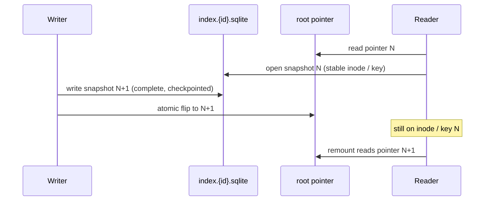

# Plan: V-2 Immutable versioned index + atomic root pointer

| Field | Value |
|-------|--------|
| **Item** | [`docs/tasks/vectorize-steal-patterns.md`](../vectorize-steal-patterns.md) **V-2** (partial, M) |
| **Date** | 2026-08-28 |
| **Status** | Draft plan — **do not implement from this file until skeptic review ends ACCEPT** |
| **Steal** | Cloudflare Vectorize *systems* pattern only: immutable snapshot objects + atomic root pointer. **Not** IVF, PQ, ANN, centroid files, or a split of the 0.7.x `files` table |
| **Pairs with** | G-2 portable index (`done`), V-3 read-through cache (`todo`, needs this etag/id), V-4 WAL coordinator (`partial`, later flips this pointer), F-2 incremental sidecar patch |
| **Ownership** | `ratarmount-index` (pointer types + flip/open helpers) · `ratarmount` factory/CLI (`-c`, `--publish-index`, `--index-id`) · `ratarmount-http` (serve pointer + current blob) · compositing F-2 persist is a **consumer** of the flip helper, not a second pointer format |

---

## Overview

Today a sidecar is a **mutable file at a stable path** (`{archive}.index.sqlite`). Cold `-c` / `SqliteIndex::create_writable` **unlinks that path and writes a new SQLite file in place** with `journal_mode=OFF`. Factory side-table writers (`zstdblocks`, RGZI/GZIDX, `nestedindexes`) and F-2 `patch_sidecar_if_present` then `open_writable` the **same inode** under WAL. G-2 `--publish-index` already does tempfile + `persist` (atomic replace of a destination), but the **live** name is still one object that a second process can open mid-rebuild, and a future S3/GCS `PUT` of that same key would be a torn GET.

V-2 makes the SQLite blob a **snapshot**. A write produces a new object (`index.{id}.sqlite`, one blob, `files` + side tables together). A small **root pointer** is the only thing that moves. Readers bind to `index_id` / `etag` and keep using snapshot N until the pointer flips to N+1. That is the Vectorize root-manifest PUT with ANN removed.



---

## What the code does today (investigation)

### `-c` / `write_index` / `create_writable`

| Piece | Location | Behavior |
|-------|----------|----------|
| CLI `-c` / `--recreate-index` | `ratarmount/src/main.rs` | `clear_index_cache = recreate && !no_recreate`; `write_index = !no_recreate`; `read_only_index = no_recreate` |
| Path pick | `factory.rs` `resolved_index` → `resolve_index_location` | `recreate \|\| clear_index_cache` **skips** existing candidates and returns a writable path (usually `{archive}.index.sqlite`) |
| Cold create | `ratarmount-index` `SqliteIndex::create_writable` | **If the path exists, `remove_file` then `Connection::open`**. Bulk PRAGMAs: `EXCLUSIVE`, `journal_mode=OFF`, `synchronous=OFF` |
| Seal | `into_read_only` | `journal_mode=WAL`, reopen RO so factory `open_writable` is not `database is locked` |
| Warm open | `SqliteIndexedTar::open_with_existing_index` / format `open` | Load sibling if `!recreate` and size > 0; on error, rebuild |
| Discard small | `discard_index_file_if_below_minimum` | Unlink the live path after a successful build |

This is the torn-read window: process B `-c` unlinks + writes journal-off bytes at the **same path** process A (or a G-2 HTTP GET) may open. SQLite WAL isolation does **not** apply across `unlink` + new inode, and does **not** apply to a half-written `journal_mode=OFF` file.

`--publish-index` (`ratarmount/src/publish_index.rs`) already copies via `tempfile` in the dest parent + `persist`. It does **not** version the blob or write a pointer. If `dest == sidecar` it no-ops (same path). **No S3 PUT** (G-2 residual; `aws s3 cp`).

### Warm remount + tarstats

| Piece | Behavior |
|-------|----------|
| `TarStats` | Stored under metadata key `tarstats`: `st_size`, `st_mtime` (+ optional ns), prefix/suffix 512 SHA-256, optional `full_sha256` when `st_size <= TARSTATS_FULL_HASH_MAX` |
| `check_tarstats_matches_archive` | Local path: size + whole-second mtime + stored hashes. Missing `tarstats` → `Ok` (legacy / Python). Missing archive path (`http://`, `oci:{digest}`) → **no-op** |
| `check_tarstats_matches_remote` | After G-2 fetch: size + edge / full hashes. Mismatch → warn + cold index |
| Factory gzip/zstd/bzip2 import | `try_load_gzip_index_blob` / block maps **refuse** the blob when tarstats mismatch |
| F-2 persist | `store_tarstats_for_path` inside the same `BEGIN IMMEDIATE` as suffix delete/insert so remount without `-c` is warm |

V-2 must **not** weaken this. A flipped pointer to snapshot N+1 that was built against archive A must still fail `check_tarstats` when the archive file is replaced. Pointer `archive_tarstats` (optional, recommended) is a **fast reject** before opening the blob; the blob’s own `tarstats` row remains authoritative.

### Nested durable indexes

`nestedindexes` lives **inside the same SQLite sidecar** (Rust-only table; `INDEX_VERSION` stays `0.7.0`). Cold nested open exports a compact blob (`RNIB` v2); warm remount imports after `NestedBodyFingerprint` match. Store path: `factory.rs` `try_store_nested_durable` → `open_or_create_writable_index` → `set_nested_index` on the **live** path. F-2 `delete_from_offsetheader` drops `nestedindexes` keys whose `oh=` is in the rewrite window.

V-2 does **not** split `nestedindexes` into IVF files. The snapshot blob remains one SQLite file. The design tension is **when** a nested store happens: often **after** the outer catalog is sealed and the mount is live (lazy `-l`). That is a write to an already-published snapshot if we flip too early.

### F-2 incremental persist (in-place today)

`WriteOverlay::patch_sidecar_if_present` opens the live sidecar writable, `BEGIN IMMEDIATE`, suffix-deletes `files` / xattrs / `nestedindexes`, re-parses the window, updates tarstats + `zstdblocks`. Comment in `patch.rs`: WAL readers see old **or** new; they never see a suffix hole. That is **same-inode** isolation, not “process A keeps snapshot N after process B commits N+1.”

V-2 generation-changing writes (including F-2 persist) must produce a **new** blob + flip. Same-process live reopen already replaces `MountSource`; other processes must not observe a torn or silently upgraded catalog.

### G-2 discovery (do not regress)

Order today (`apply_remote_index_discovery` + `resolve_index_location`):

1. Explicit `--index-file` (including `:memory:` / `http(s)://` materialize)
2. Local folder candidates (`possible_index_paths`, `oci:{digest}` cache first among folders)
3. HTTP `Link: rel="describedby"` on **archive** HEAD (`parse_link_describedby`; prefer `INDEX_MEDIA_TYPE`)
4. http(s) sibling `{url}.index.sqlite` + `.gz`/`.zst`/`.xz`/`.bz2`
5. OCI 1.1 referrer on local miss

Media type `application/vnd.ratarmount.index.v1+sqlite` names the **blob family**. Inner `INDEX_VERSION` `0.7.0` is the `files` schema. They are different strings. HTTP export `GET /.ratarmount-control/index.sqlite` serves the blob with that Content-Type. **No S3/GCS/Azure sibling GET/PUT in v1.**

---

## Goals

1. **Snapshot semantics:** the bytes of a published SQLite sidecar do not change. A later write is a different object.
2. **Atomic root pointer:** the only in-place replace is a small pointer object (or a POSIX `rename` of that object / of a compatibility hardlink). Readers that already opened snapshot N keep that inode/fd.
3. **`-c` / `write_index` full rebuild:** write a complete new sidecar (temp or `index.{id}.sqlite`), checkpoint, hash, then flip. **Never** `remove_file` + journal-off write at the live `.index.sqlite` path. **Never** in-place PUT of the live `.index.sqlite` on object storage (when that PUT is added later).
4. **Python / G-2 compat:** after flip, `{archive}.index.sqlite` is still a **complete SQLite file** (hardlink or atomic rename onto the conventional name), not JSON. Pointer is an **additional** sibling. Discovery without a pointer still works (legacy implicit snapshot).
5. **V-3 / V-4 can consume the pointer** without another schema break (fields below).
6. **Optional keep-last-K** local snapshot files; prune after a successful flip. Not D1 Time Travel.
7. **One SQLite blob per snapshot.** Do not shard `files` into IVF / centroid files.

## Non-goals (this train)

| Item | Why |
|------|-----|
| IVF / PQ / ANN / centroid files | Explicit V-2 “do not” |
| S3/GCS/Azure sibling GET/PUT | G-2 residual; **design keys only** so a later PR can PUT `index.{id}.sqlite` then the pointer |
| OCI referrer **push** of pointer + blob | Discovery GET stays; push is still residual |
| V-3 LRU cache implementation | Depends on this etag/id; do not build the cache here |
| V-4 commit queue | Uses `flip_pointer` later; do not build the queue here |
| Changing `INDEX_VERSION` / `files` DDL | Pointer is a new document type |
| Splitting `nestedindexes` / `zstdblocks` out of the blob | One snapshot file |
| Eventual consistency for `-w` overlay reads | POSIX; only the **published index object** is snapshot-versioned |
| Windows-as-first-class hardlink/symlink semantics | POSIX `rename` + same-directory tempfile; document WinFsp residual (F-5) |

---

## Pointer object

New media type (distinct from the sqlite blob family):

`application/vnd.ratarmount.index.pointer.v1+json`

Canonical local name (next to archive, same folder rules as the sidecar):

`{archive}.index.pointer.json`

HTTP sibling (when remote sibling GET exists): `{url}.index.pointer.json` **before** `{url}.index.sqlite`.

### Schema (v1)

```json
{
  "schema": "ratarmount.index.pointer.v1",
  "index_id": "01K3Q0EXAMPLEULID0000000000",
  "etag": "sha256:0123…64hex",
  "sha256": "0123…64hex",
  "created": "2026-08-28T15:00:00.000Z",
  "previous_id": "01K3P9EXAMPLEULID0000000000",
  "media_type": "application/vnd.ratarmount.index.v1+sqlite",
  "index_version": "0.7.0",
  "blob": "archive.tar.index.01K3Q0EXAMPLEULID0000000000.sqlite",
  "archive_tarstats": {
    "st_size": 123456,
    "st_mtime": 1756389600,
    "prefix512_sha256": "…",
    "suffix512_sha256": "…",
    "full_sha256": null
  }
}
```

| Field | Required | Role |
|-------|----------|------|
| `schema` | yes | Constant `ratarmount.index.pointer.v1`. Reject unknown. |
| `index_id` | yes | **Generation** id (ULID). Unique per flip even if bytes match a previous `-c`. V-4 job records and `--index-id` bind here. |
| `etag` | yes | `sha256:` + hex of the **sealed, checkpointed** blob. V-3 cache key (stable across republish of identical bytes). |
| `sha256` | yes | Same digest without the `sha256:` prefix (or identical to `etag` stripped). Two spellings so HTTP/S3 ETag and local verify share one hash. Implement as one computed value, two JSON keys. |
| `created` | yes | RFC 3339 UTC. Spec “created”; not a second clock in the blob. |
| `previous_id` | no | Prior `index_id` after a flip. Omitted on first snapshot. Enables keep-last-K walk without directory glob heuristics. |
| `media_type` | yes | Must be `INDEX_MEDIA_TYPE` (`…index.v1+sqlite`). Prevents pointing at a pointer. |
| `index_version` | yes | Echo `INDEX_VERSION` (`0.7.0`). Not a substitute for opening the blob. |
| `blob` | yes | Relative file name (local) or relative URL key (remote design). Never a second SQLite schema. |
| `archive_tarstats` | no (write it when known) | Copy of blob `tarstats` for V-3 revalidate / fail-closed before download. Blob row still wins on conflict. |

**Do not** put IVF file lists, page maps, or member offsets in the pointer. V-3 caches **ranges of this blob** (and later seek-map slabs) keyed by `etag`. V-4 stores `index_id` on the job and calls the same flip helper.

### Why both `index_id` and `etag`

- Identical catalog rebuilt with `-c` → new `index_id`, same `sha256`/`etag`. V-3 cache **hits**. keep-last-K may **hardlink** by hash instead of storing two copies.
- Bad `-c` rollback → `--index-id <previous_id>` flips the pointer back (or remounts that blob without flipping). `etag` alone cannot name “the generation I had before this rebuild.”

### Compatibility hardlink / conventional name

After a successful flip on a local filesystem:

1. Snapshot file ` {archive}.index.{index_id}.sqlite ` exists, immutable, checkpointed, no live `-wal`/`-shm`.
2. `{archive}.index.sqlite` is the **same bytes** via `link` + `rename` over the conventional name, or a single `rename` of the new snapshot onto `.index.sqlite` **plus** a hardlink retained at the versioned name **before** the rename (create versioned name first, then `link` to a tempfile name, then `rename` onto `.index.sqlite`).
3. Pointer JSON is written via same-directory tempfile + `rename` **last** (or immediately after the conventional-name update; see flip order).

Readers that only know G-2 / Python still open `.index.sqlite` and get a complete catalog. Readers that know V-2 open the pointer, verify `sha256`, bind `index_id`.

**If hardlink fails** (some FS): keep the versioned file and `rename` a **copy** onto `.index.sqlite` only after the versioned file is fsync’d. Cost is one extra copy; still no journal-off write at the live name.

---

## Write classes (what flips vs what does not)

### Generation-changing (new blob + pointer flip)

| Trigger | Today | V-2 |
|---------|-------|-----|
| `-c` / `clear_index_cache` / failed warm + rebuild | `create_writable` unlinks live path | `create_writable(Some(temp_or_versioned))`; flip after seal + side tables that belong to this build |
| First cold index (`write_index`, no existing sidecar) | Create at live path | Same as rebuild: build off to the side, flip (creates pointer + conventional name) |
| F-2 `patch_sidecar_if_present` | `open_writable` + in-place txn | Copy or vacuum-into a new snapshot (or rebuild suffix on a copied file), then flip. **Do not** `BEGIN IMMEDIATE` on the inode other mounts have opened as N |
| `--publish-index` / `--publish-index-to` | Atomic copy of whatever the live path is | Publish **current snapshot bytes** (by `etag`) to dest; if dest is the conventional sibling, also write dest pointer. Still no S3 PUT |
| `--index-minimum-file-count` discard | `remove_file` live path | Delete **this** snapshot + flip pointer to “absent” (remove pointer + conventional name). Do not leave a pointer at a missing blob |
| V-4 executor finish (later) | n/a | Call the same `flip_pointer` |

### Same-generation enrichment (before the **first** flip of this build)

During one cold open, factory already: create catalog → `into_read_only` → `persist_gzip_index_blob` / `store_zstd_blocks_in_index` / `store_bzip2_blocks` on the **same** path. Those writes must happen on the **unpublished** temp/versioned inode, **then** checkpoint, hash, flip once.

Do **not** flip after `files` insert and again after RGZI; one pointer generation per open/rebuild.

### Nested durable after the mount is live

This is the awkward write: lazy `-r -l` stores `nestedindexes` minutes after the pointer flipped.

**v1 rule (fail closed, cheap):** nested durable **may** `open_writable` the current snapshot inode **only when** (a) local filesystem, (b) this process created or already holds a writable generation, and (c) the snapshot has **not** been `--publish-index`’d / is not a fetched remote blob. Treat as same-inode WAL enrichment of the local working copy. **Do not** do this to a materialized HTTP/OCI sidecar (those stay immutable; next `-c` or a later explicit “promote nested” can snapshot).

**v1 non-goal:** every nested store creates `index_id` N+1. That would explode keep-last-K on a 200-nested first walk and is not required to unblock V-3.

Document this as an explicit residual in the V-2 landing PR (AGENTS.md row + this plan). A follow-up can COW-flip on nested store if operators need published remotes to include nested blobs without `-c`.

### What never writes a snapshot

- `--no-recreate-index` / `read_only_index`
- `:memory:` / `index_in_memory`
- `write_index = false`
- Failed tarstats (rebuild is generation-changing; the **failed** blob is not published)

---

## Flip algorithm (local)

All new files in the **same directory** as the destination (so `rename` is atomic on POSIX).

1. Allocate `index_id` (ULID).
2. Build into `.{archive_stem}.index.{id}.tmp` (or `NamedTempFile` in parent). **Do not** unlink `{archive}.index.sqlite` first.
3. Insert `files`, seal (`finalize_build` / drop `filestmp` / `parentfolders`).
4. Same-inode side tables for this build (RGZI, zstdblocks, bzip2blocks, eager nested if already known).
5. `PRAGMA wal_checkpoint(TRUNCATE); PRAGMA journal_mode = DELETE;` (or OFF). Close all writers. Confirm no `{path}-wal` / `{path}-shm` remain (or they are 0-byte and unlinked).
6. `fsync` file + parent dir (best-effort; log if unsupported).
7. SHA-256 the file → `etag` / `sha256`.
8. `rename` tmp → `{archive}.index.{index_id}.sqlite` (immutable name).
9. Install conventional `{archive}.index.sqlite` via hardlink/rename as above (readers of the old conventional name who already have an fd keep the **old inode**).
10. Write pointer JSON to `.{stem}.index.pointer.json.tmp`, fsync, `rename` onto `{archive}.index.pointer.json`.
11. keep-last-K: walk `previous_id` chain; unlink versioned files beyond K; never unlink a blob still named by the current pointer; never unlink an inode still referenced by a live `IndexLocation` in **this** process (other processes keep fds).

**Pointer last** so a crash after blob install but before pointer update leaves readers on N (orphan N+1 file is reclaimable by keep-last-K or next `-c`). Crash after conventional-name rename but before pointer: G-2 readers see N+1 bytes; V-2 readers still on pointer N until repair. **Accept this** (G-2 already had atomic replace of `.index.sqlite`). Optional repair on next open: if conventional file `sha256` != pointer `sha256`, trust conventional and rewrite pointer (or the reverse — **pick one in implementation**: **pointer wins** if present and blob exists; if pointer blob missing, fall back to conventional and rewrite pointer). Recommended: **pointer wins** when its `blob` file exists and hashes; else conventional + synthesize pointer.

Remote PUT order (design only, not implemented): upload immutable `index.{id}.sqlite` (verify size), **then** PUT pointer key. Never PUT the live `.index.sqlite` key as the mutation. A later compatibility copy of current bytes to `.index.sqlite` is optional and **not** the commit.

---

## Discovery changes

Insert **after** explicit `--index-file` and **before** treating a local `.index.sqlite` as the only answer:

1. `--index-file` / `:memory:` unchanged. If explicit path is a pointer JSON (`schema` field), resolve `blob` relative to it and verify hash. If explicit path is SQLite, use as today (synthesize an in-memory pointer with a random `index_id` and computed `etag` for V-3; do not write it unless `write_index`).
2. Local `{archive}.index.pointer.json` (and folder-candidate equivalents: `folder / (archive_path with '/' → '_').index.pointer.json` — **same** `possible_index_paths` stem rule, suffix `.index.pointer.json` instead of `.index.sqlite`).
3. If pointer present: open `blob`, verify `sha256`; on mismatch **fail closed** (do not mount the wrong catalog). Then `check_tarstats_*` as today.
4. Else existing local `.index.sqlite` (legacy). Warm remount unchanged.
5. HTTP `Link`: prefer `type="application/vnd.ratarmount.index.pointer.v1+json"`, else today’s sqlite `describedby`.
6. Sibling GET: try `{url}.index.pointer.json` then today’s sqlite + compressed suffixes.
7. OCI referrer: unchanged (sqlite artifactType). Pointer-as-referrer is residual.

`--index-id <ULID>` (new, required value, `num_args = 1`, clap-steal test): look up local versioned file or walk pointer `previous_id` / directory `*.index.{id}.sqlite`. Does not steal the archive path. Missing id → exit 2. Does not fetch S3.

`-c` ignores existing pointer for **input** (does not load N) but **writes** N+1 + flip (`previous_id` = old id if any).

---

## HTTP export

Keep `GET /.ratarmount-control/index.sqlite` as the **current blob** (`INDEX_MEDIA_TYPE`, Range, existing tests).

Add `GET /.ratarmount-control/index.pointer` (JSON, new media type). `Link` on the **blob** response may add a second describedby to the pointer path; inbound discovery still parses **archive** HEAD, not tree export. Do not break `index_content_type` tests.

---

## keep-last-K

- Flag or env: `--index-keep-snapshots K` (default **2**: current + one previous). `K=1` means only current versioned file + conventional name. `K=0` means “no extra versioned files” (only conventional `.index.sqlite` + pointer); rollback `--index-id` then fails. **Default 2.**
- Local only. Do not invent object-store lifecycle in this train.
- Prune after successful flip. Never prune the `index_id` in the current pointer.
- Hardlink-by-`sha256` when two generations share bytes.

---

## V-3 and V-4 consumption (do not implement)

**V-3** process-local LRU key (from steal-patterns): `(backend, url/etag, range)`.

Use:

```text
(backend, archive_url, pointer.etag, range)
```

`etag` is content-addressed; republish of the same sidecar does not bust the cache. Pointer fetch is a **tiny** GET; blob pages use `etag`. On pointer `index_id` change with **new** `etag`, miss. On `index_id` change with **same** `etag`, hit. Revalidate: pointer `archive_tarstats` vs remote size/edges (existing `check_tarstats_matches_remote`). Skip `file://` and `:memory:` as already specified in V-3.

**V-4** job record: overlay generation + `expected_previous_id`. Executor writes snapshot N+1 (or F-2 copy-patch). Coordinator `flip_pointer` only if current `index_id == expected_previous_id` (compare-and-swap). That is the portable “WAL stores ids, executor writes blobs, coordinator commits root.” F-7 remote multipart later PUTs blob then pointer with the same CAS (`If-Match` / generation).

---

## Crate / API sketch (implementation PR, not this plan)

Prefer `ratarmount-index` so factory/F-2/HTTP share one type:

- `IndexPointer` struct + `parse` / `serialize` / `verify_blob(path)`
- `INDEX_POINTER_MEDIA_TYPE`, `INDEX_POINTER_SCHEMA`, `pointer_path_for_archive`, `versioned_blob_path(archive, index_id)`
- `flip_local_pointer(opts) -> Result<IndexPointer>`
- `resolve_index_location` grows a pointer-aware step; **do not** change `IndexLocation` to Memory vs Path only without a way to return `index_id` (either extra out-param / small struct `ResolvedIndex { location, pointer: Option<IndexPointer> }` or store id in OpenOptions). Orchestrator owns `factory.rs` glue.

`create_writable`: add a path that **does not** `remove_file` the live conventional name. Implementation should write to the tmp/versioned path only. Keep a test that the live `.index.sqlite` inode/bytes are unchanged until flip.

---

## Tests (same landing PR as the code; required)

Name/doc with `Regression:` and the symptom.

| Layer | Test | Symptom / assert |
|-------|------|------------------|
| `ratarmount-index` | `create_writable` / flip helper | Live conventional path is **not** unlinked during build; after flip, old fd/inode still reads pre-flip `files` count |
| `ratarmount-index` | pointer parse | Required fields; unknown `schema` rejected; `etag` ↔ `sha256` consistent |
| `ratarmount-index` | hash mismatch | Pointer `sha256` ≠ file bytes → error, no silent mount |
| `ratarmount-index` | tarstats | Flip then replace archive bytes → `check_tarstats_matches_archive` still `Mismatch` (existing warm_index / `check_tarstats` stay green) |
| `ratarmount-index` | keep-last-K | Third flip with `K=2` deletes the oldest versioned file, not current |
| `ratarmount` factory / bin | two processes | Mount A `cat`s a member while process B `-c` rebuilds; A’s bytes unchanged; remount sees new catalog if archive unchanged |
| `ratarmount` bin | `--index-id` clap-steal | `num_args = 1`; archive path not stolen (same pattern as `publish_index_flag`) |
| `ratarmount` bin | `--publish-index` | Copies snapshot bytes; dest `.index.sqlite` is SQLite magic, not JSON; pointer written next to dest when dest is default sibling |
| F-2 | `patch_sidecar_if_present` | Persist writes a new `index_id`; a second `SqliteIndex::open_read_only` on the **pre-flip path/inode** still has old suffix rows (or the old inode was unlinked but fd-valid). Existing `regression_incremental_*` / `live_commit*` stay green |
| HTTP | pointer GET | New path Content-Type; existing `index_content_type` still sqlite |
| Nested | `nested_durable` | Eager/lazy store still imports on remount for **local** writable snapshot (enrichment residual). Remote-fetched sidecar is not mutated |
| G-2 | discovery | No pointer → `.index.sqlite` still warms. Pointer + matching blob wins. `link_describedby` tests still pass for sqlite type |

Do **not** land a pointer-only change without the two-process `-c` test. That is the V-2 acceptance row in steal-patterns.

Shell skip: if a helper needs `flock`/`lsof` only, prefer a pure unit test that holds `File::open` across `flip_local_pointer` and reads SQLite via the held fd / old path.

---

## Docs delta (same implementation PR)

| Doc | Change |
|-----|--------|
| [`vectorize-steal-patterns.md`](../vectorize-steal-patterns.md) | V-2 checkboxes; status → `done` or leftover residuals |
| [`beyond-parity-roadmap.md`](../beyond-parity-roadmap.md) G-2 | Pointer sibling + “no in-place PUT of live sqlite”; S3 still residual |
| [`phase10-remote.md`](../../phase10-remote.md) | Discovery order includes pointer |
| [`README.md`](../../../README.md) | Shared index row: snapshot + pointer |
| root [`AGENTS.md`](../../../AGENTS.md) | New regression catalog row: “`-c` torn sidecar / half-written index” |
| [`mount-options-parity.md`](../../mount-options-parity.md) | `--index-id`, `--index-keep-snapshots` if shipped |

No nested/tmp matrix change unless factory open/spool behavior changes (it should not).

---

## Risks / open residuals (folded; not blockers for the plan)

1. **Nested durable after flip** — v1 local WAL enrichment; published remotes wait for `-c` or a later COW. Stated above.
2. **F-2 copy cost** — copy-on-write of a multi-GB sidecar to patch a suffix is expensive. Prefer SQLite backup/`VACUUM INTO` to the new versioned path, then suffix patch on the copy, then flip. Still cheaper than a full `create_index_body` of the prefix (F-2 invariant).
3. **WAL leftovers** — publishing with `-wal` present is a corrupt snapshot. Checkpoint + journal DELETE is mandatory in the flip helper; test it.
4. **Conventional name vs pointer crash window** — pointer-wins repair; documented.
5. **Python writers** still unlink+rewrite `.index.sqlite`. V-2 readers who opened N keep N; V-2 remount after Python `-c` sees new bytes at conventional name; pointer may be stale until repair. Accept (we do not control Python).
6. **MSRV 1.74** — ULID via a small crate or time+rand hex; do not pull a 2024-edition dep.

---

## Suggested implementation slices (after ACCEPT)

1. `ratarmount-index`: pointer types, `create_writable` tmp path, `flip_local_pointer`, checkpoint, tests (hash, inode, tarstats, keep-K).
2. Factory `-c` / cold create / discard-minimum use flip. Two-process regression.
3. F-2 persist uses copy + flip (owns compositing `patch_sidecar_if_present` + formats-tar patch tests).
4. CLI `--index-id` / `--index-keep-snapshots` + `--publish-index` pointer sibling + clap-steal.
5. HTTP pointer GET + docs + AGENTS.md row.

Slice 1 is independently mergeable if factory still reads conventional `.index.sqlite`. Do not flip product behavior half-way without slice 2.

---

## Verification commands (implementation PR)

```bash
cargo fmt --all
cargo clippy -p ratarmount-index -p ratarmount-compositing -p ratarmount-http -p ratarmount --all-targets -- -D warnings
cargo test -p ratarmount-index --lib
cargo test -p ratarmount-compositing --lib live_commit
cargo test -p ratarmount --bin ratarmount publish_index
cargo test -p ratarmount --bin ratarmount nested_durable
cargo test -p ratarmount-http --lib index_content_type
cargo test -p ratarmount-index --lib check_tarstats
cargo test -p ratarmount-formats-tar --lib warm_index
# plus new filters: pointer, flip, index_id (names TBD)
```

Run new filters **separately** (`cargo test` does not treat `|` as OR).

---

## Skeptic review log

| Sweep | Agent | Verdict | Folded into |
|-------|-------|---------|-------------|
| 1 | (pending) | | |
| 2 | (pending) | | |
| 3 | (pending) | | |

**Plan verdict:** in review (sweep 1 not started). Target: **ACCEPT** or **BLOCKED** (cap 3).
