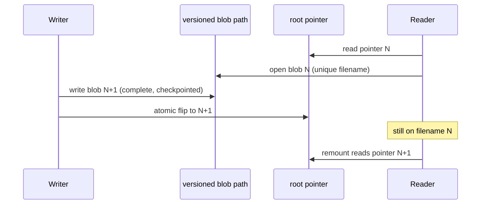

# Plan: V-2 Immutable versioned index + atomic root pointer

| Field | Value |
|-------|--------|
| **Item** | [`docs/tasks/vectorize-steal-patterns.md`](../vectorize-steal-patterns.md) **V-2** (partial, M) |
| **Date** | 2026-08-28 |
| **Status** | Draft plan — **do not implement from this file until skeptic review ends ACCEPT** |
| **Steal** | Cloudflare Vectorize *systems* pattern only: immutable snapshot objects + atomic root pointer. **Not** IVF, PQ, ANN, centroid files, or a split of the 0.7.x `files` table |
| **Pairs with** | G-2 portable index (`done`), V-3 read-through cache (`todo`, needs this etag/id), V-4 WAL coordinator (`partial`, later flips this pointer), F-2 incremental sidecar patch |
| **Ownership** | `ratarmount-index` (pointer types + flip/open helpers) · `ratarmount` factory/CLI (`-c`, `--publish-index`, `--index-id`) · `ratarmount-http` (serve pointer + current blob) · compositing F-2 persist is a **consumer** of the flip helper, not a second pointer format |

---

## Overview

Today a sidecar is a **mutable file at a stable path** (`{archive}.index.sqlite`). Cold `-c` / `SqliteIndex::create_writable` **unlinks that path and writes a new SQLite file in place** with `journal_mode=OFF`. It does **not** remove `{path}-wal` / `{path}-shm`. After `into_read_only` the mount reopens that **filename** in WAL (`journal_mode=WAL`). SQLite names WAL/SHM from the open **path**, not the inode: process A that opened `{archive}.index.sqlite` does **not** keep snapshot N when process B unlinks and recreates the same name.

Factory side-table writers (`zstdblocks`, RGZI/GZIDX, `nestedindexes`), `--hashes`, and F-2 `patch_sidecar_if_present` then `open_writable` the same path. G-2 `--publish-index` already does tempfile + `persist` (atomic replace of a destination), but the **live** name is still one object that a second process can open mid-rebuild, and a future S3/GCS `PUT` of that same key would be a torn GET.

V-2 makes the SQLite blob a **snapshot**. A write produces a new object (one blob: `files` + side tables). A small **root pointer** is the only thing that moves. **When a pointer exists, V-2 readers open the versioned blob path**, never the conventional `.index.sqlite` name for the live catalog. That conventional name remains a G-2 / Python compatibility **copy** (separate inode, no hardlink). No-pointer + `--no-recreate-index` is the only remaining conventional RO open (see Goal 2). Readers bind to `index_id` / `etag` and keep using snapshot N until the pointer flips to N+1.



**Published** means: pointer has been flipped, `etag` is the SHA-256 of those bytes, and **no** later `open_writable` is allowed on that filename. That is the Vectorize root-manifest PUT with ANN removed.

---

## What the code does today (investigation)

### `-c` / `write_index` / `create_writable`

| Piece | Location | Behavior |
|-------|----------|----------|
| CLI `-c` / `--recreate-index` | `ratarmount/src/main.rs` | `clear_index_cache = recreate && !no_recreate`; `write_index = !no_recreate`; `read_only_index = no_recreate` |
| Path pick | `factory.rs` `resolved_index` → `resolve_index_location` | `recreate \|\| clear_index_cache` **skips** existing candidates and returns a writable path (usually `{archive}.index.sqlite`) |
| Cold create | `SqliteIndex::create_writable` (`lib.rs` ~477–479) | **If the path exists, `remove_file` then `Connection::open`**. Does **not** unlink `-wal`/`-shm`. Bulk PRAGMAs: `EXCLUSIVE`, `journal_mode=OFF`, `synchronous=OFF` |
| Seal | `into_read_only` (`lib.rs` ~1002–1022) | `journal_mode=WAL`, reopen RO **by path** so factory `open_writable` is not `database is locked` |
| Warm open | `SqliteIndexedTar::open_with_existing_index` / format `open` | Load sibling if `!recreate` and size > 0; on error, rebuild |
| Discard small | `discard_index_file_if_below_minimum` (`lib.rs` ~2157–2173) | `remove_file` the given path **after** create + side tables (`factory.rs` ~1718–1719). Live RO fd survives unlink |
| Every format crate | `create_writable_for_open(index_path)` | Writes whatever path factory passed (today: conventional) |
| `--hashes` after mount | `main.rs` ~851–914 | `SqliteIndex::open_writable` on the resolved sidecar |
| Rapidgzip persist | `factory.rs` `persist_rapidgzip_index_blob` ~2113–2150 | Same live path as RGZI |
| Warm `try_load_*` | `factory.rs` ~1869–1871, ~2365, ~2563 | Prefer `open_writable` then fall back RO (to avoid the RO banner) |
| `open_or_create_writable_index` | `factory.rs` ~2386–2391 | `open_writable` if exists else `create_writable` |
| ZIP `--commit-overlay` | `write_overlay.rs` ~1569–1570, ~1822+ | Full archive rewrite, **no** sidecar patch; next open is failed-warm + rebuild |
| On-exit persist | `overlay_commit` → `patch_sidecar_if_present` | Same in-place F-2 path; on-exit does **not** reopen in-process |

**Torn-read (accurate):** process B `-c` unlinks the conventional **filename** and writes journal-off bytes there. Process A’s WAL/SHM still resolve against that filename. Isolation is **not** “A keeps inode N.” V-2 fixes this by never opening the conventional name for the mount catalog.

`--publish-index` (`ratarmount/src/publish_index.rs`) already copies via `tempfile` in the dest parent + `persist`. It does **not** version the blob or write a pointer. If `dest == sidecar` it no-ops (same path). **No S3 PUT** (G-2 residual; `aws s3 cp`).

### Warm remount + tarstats

| Piece | Behavior |
|-------|----------|
| `TarStats` | Stored under metadata key `tarstats`: `st_size`, `st_mtime` (+ optional ns), prefix/suffix 512 SHA-256, optional `full_sha256` when `st_size <= TARSTATS_FULL_HASH_MAX` |
| `check_tarstats_matches_archive` | Local path: size + whole-second mtime + stored hashes. Missing `tarstats` → `Ok` (legacy / Python). Missing archive path (`http://`, `oci:{digest}`) → **no-op** |
| `check_tarstats_matches_remote` | After G-2 fetch: size + edge / full hashes. Mismatch → warn + cold index |
| Factory gzip/zstd/bzip2 import | `try_load_*` **refuse** the blob when tarstats mismatch |
| F-2 persist | `store_tarstats_for_path` inside the same `BEGIN IMMEDIATE` as suffix delete/insert so remount without `-c` is warm |

V-2 must **not** weaken this. Pointer `archive_tarstats` is a **fast reject** before opening the blob; the blob’s own `tarstats` row remains authoritative.

### Nested durable indexes

`nestedindexes` lives **inside the same SQLite sidecar** (Rust-only table; `INDEX_VERSION` stays `0.7.0`). Cold nested open exports a compact blob (`RNIB` v2); warm remount imports after `NestedBodyFingerprint` match. Store path: `factory.rs` `try_store_nested_durable` → `open_or_create_writable_index` → `set_nested_index` on the **live** path. F-2 `delete_from_offsetheader` drops `nestedindexes` keys whose `oh=` is in the rewrite window. `NestedOpenContext.outer_index_path` is re-resolved with `recreate=false` (`factory.rs` ~3175–3202) — today that is the conventional/XDG file.

V-2 does **not** split `nestedindexes` into IVF files. After the pointer flips, that blob is **published**: no `open_writable`. Eager `-r` stores onto the unpublished tmp **before** flip. Lazy `-l` stores after flip are **not persisted** in v1 (log + in-process only; remount may rebuild that nested table). Not a silent WAL mutate of the published etag.

### F-2 incremental persist (in-place today)

`WriteOverlay::patch_sidecar_if_present` (`write_overlay.rs` ~1045–1101) opens the live sidecar writable, `BEGIN IMMEDIATE`, suffix-deletes `files` / xattrs / `nestedindexes`, re-parses the window, updates tarstats + `zstdblocks`. `patch.rs` ~27–30: one txn so concurrent readers **never see a suffix hole**. That is same-inode WAL, not “process A keeps snapshot N after process B commits N+1.” There is **no** `VACUUM INTO` / `backup` helper in-repo. `rusqlite` is `features = ["bundled"]` only (no `backup` crate feature). `VACUUM INTO` is SQL and does not need that feature. Raw `fs::copy` of a WAL-mode DB while a connection is open is **not** a consistent snapshot.

Live interval commit then `replace_base` (`write_overlay.rs` ~178, ~718). On-exit persist does not reopen; the next remount is warm because tarstats were bumped.

### G-2 discovery (do not regress)

Order today (`apply_remote_index_discovery` + `resolve_index_location`):

1. Explicit `--index-file` (including `:memory:` / `http(s)://` materialize)
2. Local folder candidates (`possible_index_paths`, `oci:{digest}` cache first among folders)
3. HTTP `Link: rel="describedby"` on **archive** HEAD (`parse_link_describedby`; prefer `INDEX_MEDIA_TYPE` **only** — `location.rs` ~206–231)
4. http(s) sibling `{url}.index.sqlite` + `.gz`/`.zst`/`.xz`/`.bz2`
5. OCI 1.1 referrer on local miss

`possible_index_paths` (`location.rs` ~155–170): empty folder → `default_index_path` = archive os_str + `.index.sqlite`. Non-empty folder → `folder / (archive_path with '/' replaced by '_').index.sqlite` (underscored **full path**, not basename).

Media type `application/vnd.ratarmount.index.v1+sqlite` names the **blob family**. Inner `INDEX_VERSION` `0.7.0` is the `files` schema. HTTP export `GET /.ratarmount-control/index.sqlite` serves the blob. Blob GET `Link` is **not** inbound discovery (`parse_link_describedby` is archive HEAD only). **No S3/GCS/Azure sibling GET/PUT in v1.**

`try_install_remote_index` (`remote_open.rs` ~136–150) opens the fetch as SQLite and reads `tarstats`. A pointer JSON pushed through that helper will fail open and drop the tempfile.

---

## Goals

1. **Snapshot semantics:** once published, the bytes of that SQLite file do not change. A later write is a different object + flip. **No** `wal_checkpoint` / `open_writable` / `query_only`-violating write on published N (including F-2 `VACUUM INTO` source).
2. **Who may open which filename** (this replaces the old “never open conventional” sentence):
   - **Writers** (`create_writable`, F-2 dest, hashes-before-flip) **never** `create_writable` / `remove_file` a conventional `possible_index_paths` candidate. Guard in `create_writable`.
   - **Readers with a valid pointer** (mount, find, interval reopen, HTTP GET, `--no-recreate-index`) open **only** `ResolvedIndex.location` (versioned blob), `open_read_only`.
   - **No pointer + `write_index`:** promote: copy conventional → new versioned name + write pointer, then open the versioned path.
   - **No pointer + `!write_index`:** open conventional **read-only**. Residual torn-read exists **only** against a foreign writer that still journal-off-rewrites that name (Python `-c`). V-2 writers do not create that window.
3. **Atomic root pointer:** the only in-place replace is the small pointer JSON (same-directory tempfile + `rename`).
4. **`-c` / `write_index` full rebuild:** write a complete new sidecar at a **new** versioned path, checkpoint, hash, flip. **Never** `remove_file` + journal-off write at the live conventional path. **Never** in-place PUT of the live `.index.sqlite` on object storage (when that PUT is added later).
5. **Python / G-2 compat:** `{archive}.index.sqlite` remains a **complete SQLite file** (a **copy**, separate inode). Pointer is an additional sibling. Discovery without a pointer still works.
6. **V-3 / V-4 consume `index_id` + `etag`** without another schema break.
7. **Optional keep-last-K** local versioned files; prune after a successful flip. Not D1 Time Travel.
8. **One SQLite blob per snapshot.** Do not shard `files` into IVF / centroid files.

## Non-goals (this train)

| Item | Why |
|------|-----|
| IVF / PQ / ANN / centroid files | Explicit V-2 “do not” |
| S3/GCS/Azure sibling GET/PUT | G-2 residual; **design object keys only**. Any `s3::` / `PUT` in the implementation PR is out of scope |
| OCI referrer **push** of pointer + blob | Discovery GET stays; push is still residual |
| V-3 LRU cache implementation | Depends on this etag/id |
| V-4 commit queue | Uses `flip_pointer` later |
| Changing `INDEX_VERSION` / `files` DDL | Pointer is a new document type; `index_version` is echo-only |
| Splitting `nestedindexes` / `zstdblocks` out of the blob | One snapshot file |
| Persisting lazy nested durables after flip | v1 skip (see write classes) |
| Eventual consistency for `-w` overlay reads | POSIX |
| Hardlinks between conventional and versioned names | SQLite WAL is per path; two names + one inode = two WAL files |
| ULID crate | MSRV 1.74; generate ids without a new dep (see pointer) |
| Windows-as-first-class | POSIX `rename` + same-directory tempfile; WinFsp residual (F-5) |

---

## Pointer object

New media type (distinct from the sqlite blob family):

`application/vnd.ratarmount.index.pointer.v1+json`

`INDEX_VERSION` stays `"0.7.0"`. Do not bump it because the pointer is “v1.”

Canonical local name: `{archive}.index.pointer.json` next to the archive.

Folder candidates: **`possible_pointer_paths` = `possible_index_paths` with suffix `.index.pointer.json` instead of `.index.sqlite`**. Same slash→underscore rule. HTTP sibling (when remote sibling GET exists): `{url}.index.pointer.json` **before** `{url}.index.sqlite`.

### Schema (v1)

One digest field. User spec is `{schema, index_id, etag/sha256, created, optional previous_id}`. steal-patterns.md currently says `generated_at` — the **landing PR** edits that file to `created` so V-3 does not look for the other key.

```json
{
  "schema": "ratarmount.index.pointer.v1",
  "index_id": "1756389600123-a1b2c3d4e5f60789",
  "etag": "sha256:0123456789abcdef0123456789abcdef0123456789abcdef0123456789abcdef",
  "created": "2026-08-28T15:00:00.000Z",
  "previous_id": "1756389500000-0f0e0d0c0b0a0908",
  "media_type": "application/vnd.ratarmount.index.v1+sqlite",
  "index_version": "0.7.0",
  "blob": "_home_me_data_archive.tar.index.1756389600123-a1b2c3d4e5f60789.sqlite",
  "archive_tarstats": {
    "st_size": 123456,
    "st_mtime": 1756389600,
    "prefix512_sha256": "…",
    "suffix512_sha256": "…",
    "full_sha256": null
  }
}
```

| Field | Required | Role |
|-------|----------|------|
| `schema` | yes | Constant `ratarmount.index.pointer.v1`. Reject unknown. |
| `index_id` | yes | **Generation** id. Format `{unix_ms}-{16 lowercase hex}` from `SystemTime` + 8 random bytes (or `sha2` of pid+time+path). **No `ulid` / `uuid` crate.** Unique per flip even if bytes match a previous `-c`. V-4 jobs and `--index-id` bind here. |
| `etag` | yes | **Only** digest field: `sha256:` + 64 lowercase hex of the sealed, checkpointed blob. V-3 cache key. If a legacy/extra `sha256` key appears, **fail closed** unless it equals `etag` with the prefix stripped (hex case-insensitive). Do not write `sha256` on new pointers. |
| `created` | yes | RFC 3339 UTC. |
| `previous_id` | no | Prior `index_id`. Omitted on first snapshot. keep-last-K walk. |
| `media_type` | yes | Must be `INDEX_MEDIA_TYPE`. Prevents pointing at a pointer. |
| `index_version` | yes | Echo `INDEX_VERSION` (`0.7.0`) only. |
| `blob` | yes | **Same-directory** relative name from `versioned_blob_path`. Next-to-archive: `archive.tar.index.{id}.sqlite` (`default_index_path` is `os_str + ".index.sqlite"`). XDG: **leading `_`** because `format!("{archive_s}.index.sqlite").replace('/', "_")` turns `/home/…` into `_home_…`. **Not** a bare `index.{id}.sqlite`. |
| `archive_tarstats` | write when known | Fast reject for V-3. Blob `tarstats` still wins on conflict. |

**Do not** put IVF file lists, page maps, or member offsets in the pointer.

### Why both `index_id` and `etag`

- Identical catalog rebuilt with `-c` → new `index_id`, same `etag`. V-3 cache **hits**. Do **not** hardlink the two blobs (WAL-per-path). Two files with identical bytes is acceptable; keep-last-K still prunes the older **generation**.
- `--index-id <previous_id>` names a generation; `etag` alone cannot.

### Naming (one pair of functions)

| Function | Rule |
|----------|------|
| `possible_index_paths` | unchanged |
| `possible_pointer_paths` | same folders / slash→underscore, suffix `.index.pointer.json` |
| `index_path_stem(path)` | `strip_suffix` **longest first**: `.index.pointer.json` then `.index.sqlite`. Do **not** `replace(".index.sqlite", …)`. |
| `versioned_blob_path(path, index_id)` | sibling `{stem}.index.{id}.sqlite`. If stem fails (`--index-file custom.db`): `{file}.index.{id}.sqlite`. |
| keep-last-K / `--index-id` walk | **that directory only** |

Kill every other blob-name sketch in implementation (`index.{id}.sqlite` as a local filename). Remote object-key sketch (not implemented): `{archive_key}.index.{id}.sqlite` then pointer key `{archive_key}.index.pointer.json`.

### Conventional name is a copy, not a hardlink

After flip:

1. Versioned blob `{stem}.index.{id}.sqlite` exists, journal DELETE/OFF, no `-wal`/`-shm`, immutable.
2. Pointer JSON renamed into place (**commit**).
3. Conventional `{archive}.index.sqlite` (or folder-candidate sqlite name) is replaced by **atomic copy** (`tempfile` + `persist`, same as `--publish-index`). Separate inode.

V-2 `ResolvedIndex.location` is the versioned path. G-2 / Python open the conventional copy. **Never** `journal_mode=WAL` on the conventional name from ratarmount-rs after this train. **Never** hardlink conventional ↔ versioned.

---

## Crash / foreign-writer repair (one table; not “pick in the PR”)

Compare `sha256(conventional)` to pointer `etag` and to SHA-256 of each keep-last-K versioned file in **that directory**.

| State | Action |
|-------|--------|
| Pointer valid (blob exists, file hash == `etag`) and conventional hash == `etag` | OK |
| Pointer valid, conventional missing or corrupt | **Pointer wins.** Repair conventional by atomic copy from pointer blob. |
| Pointer valid, conventional hash == some **other** local versioned blob we own | Mid-flip crash after an extra copy. **Pointer wins.** Repair conventional from pointer blob. |
| Pointer valid, conventional is valid SQLite, **conventional tarstats match the archive**, **pointer blob tarstats do not** (or pointer blob missing), hash ≠ pointer | **Foreign rewrite** (Python `-c`). Conventional wins. **Synthesize = copy conventional → new versioned blob first, then CAS pointer** (same order as flip). CAS: write pointer only if file bytes still equal the stale pointer we read. |
| Pointer valid, conventional hash ≠ `etag`, pointer blob **does** match the archive, conventional missing/stale/unreadable | **Pointer wins.** Repair conventional by atomic copy from pointer blob. **This includes** “flip step 9 done, step 10 failed, keep-last-K would have pruned N”: do **not** treat leftover conventional N as Python. |
| Pointer invalid (missing blob or hash fail), conventional valid SQLite | Synthesize: copy conventional → versioned **first**, then CAS pointer. |
| Both invalid | Fail closed → cold rebuild (`write_index`) or error if `--no-recreate-index`. |

**Prune only after** `sha256(conventional) == pointer.etag`. A failed G-2 copy + `K=1` must **not** delete N until conventional matches N+1 (otherwise the leftover conventional N looks like a foreign rewrite and rolls the pointer back).

Two synthesizers: CAS on pointer bytes. If CAS loses, re-read and follow the table. Do **not** CAS the pointer before the versioned blob exists.

---

## Write classes

**Published** = pointer flipped, `etag` frozen. After that, **no** `open_writable` / `create_writable` on that filename (nested, hashes, `try_load_*`, side tables).

### Generation-changing (new blob + pointer flip)

| Trigger | Today | V-2 |
|---------|-------|-----|
| `-c` / `clear_index_cache` / failed warm + rebuild | `create_writable` unlinks conventional | Allocate unpublished tmp/versioned path; format crates write **there**; flip once |
| First cold index | Create at conventional | Same: build off to the side, flip |
| F-2 `patch_sidecar_if_present` (interval + on-exit) | `open_writable` + in-place txn | Sequence below. On-exit: flip, do **not** reopen in-process. Interval: `overlay_commit.rs` `reopen_live_archive` + `sidecar_path_for_patch` must open **pointer `blob` / `ResolvedIndex.location`**, not `resolve_index_location(..., false)` conventional. `replace_base` `MountSource` catalog fd = N+1. Never `Connection::open` conventional. |
| ZIP `--commit-overlay` remount rebuild | `create_writable(conventional)` after failed warm | Same flip path as cold rebuild |
| `--publish-index` / `--publish-index-to` | Atomic copy of live path | Copy **current snapshot bytes**. Rehash; **refuse** to write a dest pointer whose `etag` ≠ digest of bytes copied. Dest conventional is SQLite magic, not JSON. Still no S3 PUT |
| `--index-minimum-file-count` | `remove_file` after side tables | Count on **unpublished tmp before flip**. Below minimum: delete tmp, do **not** write pointer/conventional. If a prior pointer exists, treat as “absent”: remove pointer + old conventional (versioned N may stay until keep-last-K). Never flip then discard |
| `--hashes` after open (`main.rs`) | `open_writable` published path | Either run on unpublished tmp **before** flip (preferred when hashes were requested at open), or generation-changing COW (`VACUUM INTO` + hash + flip). **Forbidden** on the published filename |
| V-4 executor finish (later) | n/a | Same `flip_local_pointer`; CAS `expected_previous_id` |

### Same-generation enrichment (unpublished tmp only)

Today `open_path_impl` resolves, opens the format, persists side tables, discards, and **returns** (`factory.rs` ~1653–1721). Eager AutoMount runs later in `build_mount_source_ex` → `apply_compositing` (~3678–3694). `apply_compositing` does **not** receive `open_path`’s path; it re-resolves with `recreate=false` or uses `OpenOptions.index_file_path` (~3175–3202). `write_nested_index` is a `bool` copied into every later `NestedOpenContext`.

**Required factory sequence** (do not flip inside `open_path` before AutoMount):

1. Allocate `index_id` + unpublished `location` (`versioned_blob_path` or `.tmp`).
2. `open_path` / a `MountBundle` **returns `ResolvedIndex`** (unpublished). Do **not** set `OpenOptions.index_file_path` to the conventional name. That field is **not** the live catalog path.
3. Pass `location` into every format `create_writable_for_open`.
4. Persist gzip / rapidgzip / zstd / bzip2 on **tmp**.
5. `--hashes` requested at open: fill on **tmp**.
6. `--index-minimum-file-count`: count on tmp; maybe abort (no flip, no AutoMount persist).
7. Thread `location` into `apply_compositing` — **do not re-resolve** mid-build. Eager `-r` nested stores on **tmp**.
8. Checkpoint, hash, **flip once after the eager scan**.
9. After flip: `write_nested_index = false` (interior mutability on `AutoMountOptions` / layer). Lazy `-l` must not persist.

Do **not** flip after `files` and again after RGZI. Flip-before-eager makes `try_store_nested_durable` hit a published blob or the conventional create path (`create_writable` unlinks `{archive}.index.sqlite`) while the real blob is elsewhere; the post-flip conventional copy would wipe those `nestedindexes`.

### After flip (forbidden vs skip)

| Writer | v1 |
|--------|----|
| `try_load_gzip_index_blob` / zstd / bzip2 | **`open_read_only` only**. No `open_writable` “to skip the banner” |
| `ratarmount/src/find.rs` `open_existing_sidecar` / `open_index_for_find` / `sidecar_tarstats_ok` | Today `open_writable` (~176, ~217–223). **All find opens are `open_read_only`.** Cold find may still call `factory::open_path` (which flips). After that, find reads the published blob RO. Regression: find does not create `{published}-wal` |
| `try_store_nested_durable` lazy `-l` | **Skip persist** (log). In-process MemIndex stays. Remount may rebuild that nested table. User-visible vs today: `-r -l` remounts lose newly discovered `nestedindexes` until next generation-changing write. Mention in README. Do not COW-flip per nested open in v1 |
| `NestedOpenContext.outer_index_path` | Published **blob** path, read-only |
| `open_or_create_writable_index` on a published path | **Must not** be called |

### What never writes a snapshot

- `--no-recreate-index` / `read_only_index`
- `:memory:` / `index_in_memory`
- `write_index = false`
- Failed tarstats (rebuild is generation-changing; the failed blob is not published)
- Materialized HTTP/OCI sidecar (immutable; next `-c` is a local snapshot)

---

## Flip algorithm (local)

All new files in the **same directory** as the destination pointer (POSIX `rename` atomic).

1. Allocate `index_id`.
2. Build into unpublished `{stem}.index.{id}.tmp` (or `NamedTempFile` in that parent). **Do not** unlink `{archive}.index.sqlite` first. **Do not** reuse the conventional filename.
3. Insert `files`, seal (`finalize_build` / drop `filestmp` / `parentfolders`).
4. Same-filename side tables + eager nested + optional hashes on that unpublished file.
5. `PRAGMA wal_checkpoint(TRUNCATE); PRAGMA journal_mode = DELETE;` (or OFF). Close writers. Assert no `{path}-wal` / `{path}-shm` (or 0-byte unlinked).
6. `fsync` file + parent dir (best-effort; log if unsupported).
7. SHA-256 → `etag`.
8. `rename` tmp → `{stem}.index.{index_id}.sqlite`.
9. Write pointer JSON to a tempfile in the same dir, fsync, `rename` onto `{stem}.index.pointer.json`. **This is the commit.**
10. Atomic **copy** onto conventional `.index.sqlite` (G-2). Failure here is not a lost commit; repair table pointer-wins + copy.
11. keep-last-K: walk `previous_id`; unlink versioned files beyond K **only after** `sha256(conventional) == pointer.etag`. **Never** unlink the `index_id` named by the current pointer. `K=0` means **no previous** versioned files; the **current** `blob` name always remains.

**Pointer last** among catalog objects. Conventional copy is after the pointer (G-2 lag of one copy is OK; repair fixes it).

Remote PUT order (design only): upload immutable versioned blob, **then** PUT pointer. Never PUT the live `.index.sqlite` key as the mutation.

### F-2 persist (mandatory sequence; not “copy or vacuum”)

No `fs::copy` of a live WAL file. No rusqlite `backup` feature. **Do not** call `SqliteIndex::open_read_only` as the `VACUUM INTO` source: it sets `PRAGMA query_only = ON` (`lib.rs` ~432–438, ~1023–1025). SQLite treats `VACUUM INTO` as a write (ATTACH dest); `query_only=1` → `attempt to write a readonly database`. A writer `wal_checkpoint` on published N **changes bytes** and breaks `etag`.

1. `open_for_snapshot_copy(path)` = `SQLITE_OPEN_READ_ONLY` **without** `query_only`. New helper on `SqliteIndex`. Forbid `open_writable` / checkpoint on published N.
2. Autocommit `VACUUM INTO '{escaped_dest}'` (escape `'` in the dest SQL literal). Not inside `BEGIN`. rusqlite 0.32 bundled SQLite is 3.27+ (`VACUUM INTO` exists).
3. `open_writable` **only the copy**.
4. Existing suffix patch + tarstats + `set_zstd_blocks` + hashes + `rebuild_fts_if_present` (same txn shape as today, on the copy).
5. Checkpoint + `journal_mode=DELETE` **on the copy**.
6. `flip_local_pointer` (`previous_id` = N).
7. Interval: `reopen_live_archive` / `sidecar_path_for_patch` use **N+1 blob path**; `replace_base` catalog fd = N+1. On-exit: no reopen; next remount reads the pointer.

Same-process mount keeps the N connection until `replace_base`. Other processes stay on filename N.

---

## Discovery changes

1. `--index-file` / `:memory:` unchanged. If explicit path is pointer JSON (`schema` field), resolve `blob` in the **same directory**, verify `etag`. If explicit path is SQLite, use as today; synthesize an in-memory pointer (computed `etag`, ephemeral `index_id`) for V-3 — do not write it unless `write_index`.
2. Local `possible_pointer_paths`. If present: repair table, then open **versioned** `blob`, verify `etag`; mismatch → fail closed. Then `check_tarstats_*`.
3. Else existing `possible_index_paths` (legacy). Synthesize pointer only if `write_index`.
4. HTTP `Link` on **archive** HEAD: new preference — pointer media type first, then today’s sqlite `INDEX_MEDIA_TYPE`. **New fetch/install helper** for JSON (do **not** reuse `try_install_remote_index` as-is). On pointer failure, fall through to sqlite `describedby` (keep `link_describedby_archive_head` / `apply_remote_index_discovery_follows_archive_link` green).
5. Sibling GET: `{url}.index.pointer.json` then today’s sqlite + compressed suffixes. Pointer install verifies `etag` after fetching `blob` (relative to the pointer URL).
6. OCI referrer: unchanged (sqlite `artifactType`). Pointer-as-referrer is residual.

Blob-export `Link` on `GET /.ratarmount-control/index.sqlite` is **not** inbound. Do not add a second describedby there in a way that `index_content_type` tests must change beyond Content-Type of the sqlite body. Prefer leaving blob `Link` as today.

`--index-id <id>` (new, required value, `num_args = 1`, clap-steal test): look up `{stem}.index.{id}.sqlite` in the resolved folder. Missing → exit 2. Does not steal the archive path. Does not fetch S3.

`-c` ignores existing pointer for **input** (does not load N) but writes N+1 + flip (`previous_id` = old id if any).

---

## HTTP export

**Pick one algorithm:** every `GET` / Range of `/.ratarmount-control/index.sqlite` **re-reads the pointer** and opens `blob` after `etag` verify. Do **not** serve the conventional copy. Do **not** capture `HttpOptions.index_sidecar` once at startup as the only path (`main.rs` ~917 / ~1350–1356 today). `handle_index_sidecar` today `metadata` then later `File::open` (`handler.rs` ~1324–1398) — a captured conventional path + tempfile `persist` can mix sizes across a flip.

Tests: Range mid-flip does not mix N/N+1 `Content-Length`; interval commit + `--http` serves N+1 bytes.

Add `GET /.ratarmount-control/index.pointer` (JSON, new media type). Inbound clients still parse **archive** HEAD, not tree export. Leave blob `Link` as today.

---

## keep-last-K

- `--index-keep-snapshots K` (default **2**: current + one previous). `K=1` = only current versioned file + conventional copy. `K=0` = no *previous* versioned files; current `blob` **always** remains.
- Local only.
- Prune after successful flip. Never prune the current pointer’s `index_id`.
- No hardlink-by-hash (WAL-per-path). Identical `etag` across generations may be two files until prune.

---

## V-3 and V-4 consumption (do not implement)

**V-3** LRU key:

```text
(backend, archive_url, pointer.etag, range)
```

`etag` is content-addressed. Pointer GET is tiny; blob pages use `etag`. New `index_id` + same `etag` → cache hit. Revalidate with `archive_tarstats` vs `check_tarstats_matches_remote`. Skip `file://` and `:memory:`.

If V-3 ever cached a blob that ratarmount then `open_writable`’d, the cache would be wrong. That is why post-flip mutation is forbidden.

**V-4** job record: overlay generation + `expected_previous_id`. Executor writes snapshot N+1 (F-2 `VACUUM INTO` + patch). Coordinator `flip_local_pointer` only if current `index_id == expected_previous_id`. F-7 later PUTs blob then pointer with the same CAS.

---

## Crate / API (one contract; not three options)

In `ratarmount-index` (not `OpenOptions` / `ratarmount-core`):

```text
ResolvedIndex {
  location: PathBuf,      // versioned blob path V-2 opens
  pointer: Option<IndexPointer>,
  conventional: PathBuf,  // G-2 / Python copy
}
```

- `IndexPointer` + `parse` / `serialize` / `verify_blob(path)`
- `INDEX_POINTER_MEDIA_TYPE`, `INDEX_POINTER_SCHEMA`
- `possible_pointer_paths`, `versioned_blob_path`
- `flip_local_pointer(...) -> Result<IndexPointer>`
- `repair_index_pointer(...)` implements the repair table

`create_writable`: unpublished tmp/versioned paths only. **Refuse** if `path` is a `possible_index_paths` conventional candidate or the conventional sibling of an existing pointer (prevents leaked factory paths from today’s unlink). Test: conventional inode unchanged until the post-flip copy.

`resolve_index_location` today returns `IndexLocation`. **Slice 2 migrates every caller** (do not leave these on conventional after a pointer exists):

| Caller | File | Today |
|--------|------|-------|
| `resolved_index` | `factory.rs` ~1467 | mount open |
| `apply_compositing` outer index | `factory.rs` ~3175–3202 | re-resolve `recreate=false` |
| `open_existing_sidecar` / `open_index_for_find` / `sidecar_tarstats_ok` | `find.rs` ~176–223 | `open_writable` |
| `sidecar_path_for_patch` | `write_overlay.rs` ~1018–1037 | interval/on-exit patch |
| `reopen_live_archive` | `overlay_commit.rs` ~192–266 | `open_with_existing_index(conventional)` |
| `apply_remote_index_discovery` | `remote_open.rs` ~39 | local cache hit |
| `--hashes` after mount | `main.rs` ~876 | `open_writable` |
| `resolved_on_disk_index` / publish / HTTP sidecar | `main.rs` ~917, ~1324, ~1350 | captured path |

Either change `resolve_index_location` to return `ResolvedIndex` or add `resolve_index_v2` and switch all of the above in slice 2. Do **not** set `OpenOptions.index_file_path` to conventional after a pointer exists.

Factory (orchestrator-owned `factory.rs`) follows the numbered sequence in **Same-generation enrichment** (return `ResolvedIndex` / `MountBundle`; flip **after** eager AutoMount).

**Slice 1** (`ratarmount-index` types + flip + `open_for_snapshot_copy` + tests) is mergeable **without** product behavior only if factory still opens conventional. The two-process `-c` catalog test is **deferred to slice 2**. Slice 1 must not claim the torn-read bug is fixed.

---

## Tests (same landing PR as the code that claims the behavior)

Name/doc with `Regression:` and the symptom.

| Layer | Test | Symptom / assert |
|-------|------|------------------|
| `ratarmount-index` | flip helper | Conventional path **not** unlinked during build; after flip, a connection opened on **pre-flip versioned path** still sees old `files` row count (catalog read, not `cat` of a member) |
| `ratarmount-index` | WAL isolation | Open versioned N writable (WAL); conventional name must **not** be opened writable; no `{conventional}-wal` created |
| `ratarmount-index` | pointer parse | Required fields; unknown `schema` rejected; extra `sha256` ≠ `etag` → fail closed |
| `ratarmount-index` | hash mismatch | Pointer `etag` ≠ file bytes → error, no silent mount |
| `ratarmount-index` | repair table | Foreign: conventional tarstats match archive, pointer blob does not → synthesize (blob first, then pointer). Flip + failed conventional copy + `K=1` does **not** roll back to N. Pointer-valid + missing conventional recopies |
| `ratarmount-index` | tarstats | Flip then replace archive → `check_tarstats_matches_archive` still `Mismatch` |
| `ratarmount-index` | keep-last-K | Third flip with `K=2` deletes oldest versioned file, not current. `K=0` leaves current `blob` on disk |
| `ratarmount-index` | discard-minimum | Below-threshold tmp is deleted; no pointer written; prior pointer removed |
| `ratarmount` factory / bin | two processes | Mount A holds a **catalog** lookup (path exists / size from index) while B `-c`; A’s catalog rows unchanged. Remount sees N+1 if archive unchanged |
| `ratarmount` bin | `--index-id` clap-steal | `num_args = 1` |
| `ratarmount` bin | `--publish-index` | Dest `.index.sqlite` is SQLite magic; dest pointer `etag` == digest of dest bytes; refuse if they would diverge |
| `ratarmount` bin | `find` | `open_read_only` only; `{published}-wal` does not appear |
| F-2 | `patch_sidecar_if_present` | New `index_id`; filename N still has old suffix rows. Source is `open_for_snapshot_copy` (not `open_read_only`). Existing `regression_incremental_*` / `live_commit*` stay green |
| F-2 | interval reopen | Replacement index path equals N+1; conventional is not `Connection::open`’d |
| HTTP | pointer GET + Range | New path Content-Type; `index_content_type` still sqlite; Range mid-flip does not mix sizes; interval + `--http` serves N+1 |
| Nested | `nested_durable` | Eager remount still imports. After flip, no `{published}-wal`. Lazy `-r -l` after flip logs skip |
| G-2 | discovery | No pointer → `.index.sqlite` still warms. Pointer + matching blob wins. Pointer fetch fail → sqlite `describedby` still used |
| Loaders | `try_load_*` | Warm remount uses `open_read_only` only |

Do **not** land a “V-2 done” claim without the two-process **catalog** test. Member `cat` alone can pass while the index is torn.

---

## Docs delta (same implementation PR)

| Doc | Change |
|-----|--------|
| [`vectorize-steal-patterns.md`](../vectorize-steal-patterns.md) | V-2 checkboxes; `generated_at` → `created`; status |
| [`beyond-parity-roadmap.md`](../beyond-parity-roadmap.md) G-2 | Pointer sibling; no in-place PUT of live sqlite; S3 still residual |
| [`phase10-remote.md`](../../phase10-remote.md) | Discovery order includes pointer |
| [`README.md`](../../../README.md) | Shared index row: snapshot + pointer; `-r -l` nested durables persist only until flip (eager `-r` unchanged) |
| root [`AGENTS.md`](../../../AGENTS.md) | Row: “`-c` torn sidecar / half-written index” — catalog lookup across `-c` |
| [`mount-options-parity.md`](../../mount-options-parity.md) | `--index-id`, `--index-keep-snapshots` if shipped |

No nested/tmp matrix change unless factory open/spool behavior changes (it should not).

---

## Risks / residuals (not open product questions)

1. **Lazy nested after flip** — v1 skip persist. Follow-up: batched COW-flip (V-4-shaped), not per-open.
2. **F-2 `VACUUM INTO` cost** — full sidecar copy then suffix patch. Still cheaper than `create_index_body` of the prefix. No `backup` feature.
3. **WAL leftovers** — checkpoint + journal DELETE mandatory; tested.
4. **G-2 conventional copy lag** — pointer is commit; repair recopies.
5. **MSRV 1.74** — no ULID crate; `sha2` already in `ratarmount-index`.
6. **Python writers** — foreign-rewrite row in the repair table (not “pointer always wins”).

---

## Suggested implementation slices (after ACCEPT)

1. `ratarmount-index`: pointer types, `ResolvedIndex`, `flip_local_pointer`, `open_for_snapshot_copy`, `create_writable` refuse conventional, repair, tests. Factory unchanged → **do not** claim torn-read fixed.
2. Factory `MountBundle` + flip **after** eager AutoMount. Migrate every `resolve_index_location` caller. Two-process catalog regression. `try_load_*` / `find.rs` RO. `--hashes` before flip.
3. F-2 `VACUUM INTO` via `open_for_snapshot_copy` + flip. `reopen_live_archive` / `sidecar_path_for_patch` on blob N+1.
4. CLI `--index-id` / `--index-keep-snapshots` + `--publish-index` pointer + clap-steal.
5. HTTP pointer GET + docs + AGENTS.md row + steal-patterns `created`.

---

## Verification commands (implementation PR)

```bash
cargo fmt --all
cargo clippy -p ratarmount-index -p ratarmount-compositing -p ratarmount-http -p ratarmount --all-targets -- -D warnings
cargo test -p ratarmount-index --lib
cargo test -p ratarmount-compositing --lib live_commit
cargo test -p ratarmount --bin ratarmount publish_index
cargo test -p ratarmount --bin ratarmount nested_durable
cargo test -p ratarmount-http --lib index_content_type
cargo test -p ratarmount-index --lib check_tarstats
cargo test -p ratarmount-formats-tar --lib warm_index
# plus new filters: pointer, flip, index_id (names TBD)
```

Run new filters **separately** (`cargo test` does not treat `|` as OR).

---

## Skeptic review log

| Sweep | Agent | Verdict | Folded into |
|-------|-------|---------|-------------|
| 1 | bc-28264c67 | **REVISE** (14 findings) | WAL-per-path: V-2 opens versioned filename only; no hardlinks; two-process test is catalog rows not `cat`. Post-flip mutation forbidden; lazy nested skip; publish rehash. F-2 = `VACUUM INTO` only (no `fs::copy`, no backup feature). Repair table (foreign Python vs pointer-wins). `K=0` keeps current blob. Writer table: hashes, rapidgzip, `try_load_*` RO, ZIP rebuild, discard-before-flip. `possible_pointer_paths` + same-dir `blob` names. No ULID crate. Pointer fetch helper; blob `Link` not inbound. One `ResolvedIndex` API; not `OpenOptions`. Single `etag` field; `created`; steal-patterns rename in landing PR. `INDEX_VERSION` echo-only. `patch.rs` citation fixed to ~27–30. |
| 2 | bc-82260cee | **REVISE** (9 major, 2 nits) | `open_for_snapshot_copy` (no `query_only`); factory flip **after** eager AutoMount + thread `ResolvedIndex` (no mid-build re-resolve); `find.rs` all RO; `reopen_live_archive` / `sidecar_path_for_patch` / HTTP per-GET pointer→blob; repair: prune after conventional matches, synthesize copy-first, foreign only if pointer blob tarstats fail; Goal 2 exception for no-pointer + `!write_index`; `index_path_stem` longest-first + `--index-file custom.db` + XDG leading `_`; list every `resolve_index_location` caller for slice 2; `create_writable` refuse conventional; lazy `-l` tests + README. |
| 3 | (pending) | | |

**Plan verdict:** sweep 2 folded; awaiting sweep 3 (cap). Target: **ACCEPT** or **BLOCKED**.
