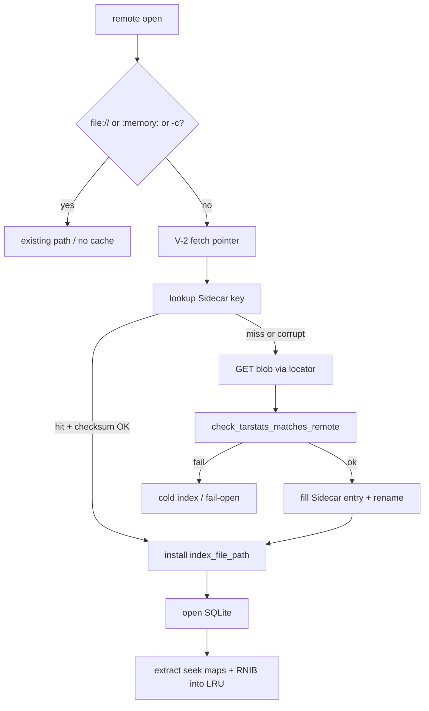

# Plan: V-3 read-through cache for remote sidecars

| Field | Value |
|-------|--------|
| **ID** | V-3 |
| **Parent** | [`docs/tasks/vectorize-steal-patterns.md`](../vectorize-steal-patterns.md) |
| **Date** | 2026-08-28 |
| **Status** | Plan — skeptic-plan-review in progress |
| **Effort** | L (implement); this document is plan-only |
| **Ownership** | `ratarmount-index` (cache + keys) · `ratarmount` `remote_open.rs` (HTTP/OCI fill) · `ratarmount-compress` (seek-map populate) · factory glue is orchestrator unless the implement task owns `factory.rs` |
| **Depends** | **V-2** immutable index + atomic root pointer (`index_id`, `etag`/`sha256`, `archive_tarstats`) |
| **Not** | Cloudflare Durable Objects / Queues / colo Cache · G-3 payload / uncompressed member-body cache · SQLite-over-HTTP VFS in v1 |

**Implement of this plan is blocked until V-2 lands.** Current `main` (as of 2026-08-28, `5475d28`) has **no** pointer type, no `index_id`, and no root-pointer fetch. Grep hits for `index_id` / root pointer exist only in the V-2 TODO. The rest of this document **assumes the V-2 pointer exists** with the shape already specified there. If V-2 ships a different schema, remap fields; do not invent a parallel identity.

---

## 1. Why this exists

Vectorize puts Cloudflare Cache in front of R2 so colo queries hit cached centroid files instead of cold object GETs. The steal is that split, not ANN.

Remote ratarmount already Range-GETs **archive** bytes. The stall this item targets is **metadata I/O**:

- Full GET of `{archive}.index.sqlite` (and compressed siblings) on every cold discovery.
- Today’s “cache” is a URL-derived filename under `--index-folders` / XDG. A nonempty file **skips all remote discovery** with **no ETag / pointer revalidation**.
- Seek maps (`zstdblocks` / `bzip2blocks` / RGZI / GZIDX) and outer `nestedindexes` RNIB blobs live **inside** that SQLite sidecar. Remount that misses the sidecar pays the GET again, then re-reads those tables.

FUSE cannot hide a 100 ms RTT per 4 KiB if someone later pages a remote SQLite. v1 does **not** add that VFS. v1 pins the **small, hot, already-fetched metadata objects** so a second mount does not GET them again, and so a republished sidecar cannot be served from a URL-only leftover.

---

## 2. Investigation (current `main`)

### 2.1 Remote HTTP index fetch

| Piece | Location | Behavior today |
|-------|----------|----------------|
| Discovery order | `ratarmount/src/remote_open.rs` `apply_remote_index_discovery` | Skip if `-c` / `clear_index_cache` / `:memory:` / explicit `--index-file`. Else `resolve_index_location` → if that path is a nonempty file, **return** (no HEAD, no sibling GET). Else HTTP `Link: rel="describedby"` on archive HEAD → `sibling_index_candidates` → OCI referrer on local miss. **No S3/GCS/Azure sibling GET** (G-2 residual). |
| HTTP GET | `ratarmount-index/src/location.rs` `fetch_index_http` | `ureq::get` full body → kept tempfile (`RATARMOUNT_INDEX_TMPDIR` or std temp). **No `ETag` / `If-None-Match` / Range.** User-Agent `ratarmount-rs/0.1`. **No Basic/Cookie** (auth is on `ratarmount-remote` archive probes only). |
| Materialize | `maybe_fetch_index_url` / `materialize_index_file` | `file://` → local path (no copy unless compressed). `http(s)://` → download. gzip/xz/zstd/bzip2 sidecar → decompress to a second tempfile; require `SQLite format 3\0`. |
| Install | `try_install_remote_index` | Open RO → `tarstats()` required (missing → delete fetch, fail-open). `check_tarstats_matches_remote` → copy into `cache_dest` (first folder candidate) → set `opts.index_file_path`. |
| Probe | `ratarmount-remote` `HttpProbe` | `content_length`, `accept_ranges`, `link`. **No ETag field.** |
| OCI | `fetch_oci_index_referrer` | Nonempty local path → skip registry. Else Referrers API → blob GET to tempfile. Subject digest is content identity for the **layer**, not a V-2 `index_id`. |
| Tests | `apply_remote_index_discovery_follows_archive_link` | Fake TCP server; asserts sidecar install. **No GET-count / remount cache assertion.** |

`is_index_url` is `http(s)://` or `file://` only. `sibling_index_url` is http(s) only. `:memory:` is `IndexLocation::Memory` / `MEMORY_INDEX`.

### 2.2 tarstats

`TarStats` (`ratarmount-index`): `st_size`, `st_mtime`, `st_mtime_ns`, `prefix512_sha256`, `suffix512_sha256`, optional `full_sha256` (archives ≤ `TARSTATS_FULL_HASH_MAX` = 256 KiB).

`check_tarstats_matches_remote(stored, st_size, prefix, suffix, full)` compares **archive** size + edge (or full) hashes. Mismatch → `IndexError::Mismatch`; caller cold-indexes (fail-open). **mtime is not used** on the remote path.

`http_fingerprint` / `oci_fingerprint` issue extra Range GETs of the **archive** (not the sidecar) to build those hashes.

Path-based `check_tarstats_matches_archive` is a **no-op** when `archive_path` does not exist (URL labels, `oci:{digest}`). A second mount that hits the URL-named local file never re-runs `check_tarstats_matches_remote` at discovery time.

### 2.3 Seek maps and RNIB (inside the sidecar)

| Object | Storage | Open path |
|--------|---------|-----------|
| `zstdblocks` / `bzip2blocks` | SQLite side tables `(blockoffset, dataoffset)` | factory import after index open (`open_seekable_zstd_from_path`, live-Range variants) |
| RGZI / GZIDX / gztool | `gzipindexes` / `gzipindex` / `gztoolindex` `(data BLOB)` | factory G3 / rapidgzip import |
| RNIB | `nestedindexes.blob` (`RNIB` magic, v2 columnar; v1 JSON still decodes) | `factory.rs` `try_load_nested_durable` → `SqliteIndex::get_nested_index` keyed by `NestedMemberKey` + `NestedBodyFingerprint` |

There are **no** standalone remote URLs for seek maps or RNIB today. They are not independently Range-GET’d. Nested open forces compact-only / no nested SQLite; RNIB is read from the **outer** on-disk sidecar.

### 2.4 What already looks like a cache (and why it is not V-3)

- `--index-folders` default `["", $XDG_CACHE_HOME/ratarmount, ~/.ratarmount]`. Remote URL → filename with `/` replaced by `_`. Identity is **the URL string**, not ETag / tarstats.
- `path_is_nonempty_file` short-circuit is a **sticky local copy**. Republish at the same URL keeps serving the old blob.
- OCI `{digest}` local file skips referrer (correct for **layer** digest; wrong if we later want a newer index for the same digest — out of V-3).
- NFS/export `ReaderLru` and G3-A decoded-window LRU are **payload / decoder** caches. Do not reuse them.
- G-3 (roadmap `todo`) is **decompressed member chunks by content hash**. Different layer.

### 2.5 V-2 pointer on current `main`

**Absent.** V-2 still-open shape (plan assumption):

```text
{ schema, index_id, etag/sha256, generated_at, archive_tarstats }
```

Readers bind to `index_id`. Writer publishes blob `index.{id}.sqlite` then atomically replaces the pointer. That etag/id is the cache identity V-3 needs.

---

## 3. Goals and non-goals

### Goals (implement train, after V-2)

1. Process-local read-through LRU for **metadata objects** only:
   - SQLite sidecar (whole blob in v1; key space allows a later `range` for pages)
   - Seek-map blobs (`zstdblocks`, `bzip2blocks`, RGZI/GZIDX/gztool)
   - Outer `nestedindexes` RNIB blobs
2. Keys include **ETag / `index_id` / archive tarstats**, never URL alone.
3. Miss → existing remote fetch → verify → fill → serve. Hit → checksum → serve. Corrupt hit → delete entry → refetch (fail-closed).
4. Skip `file://` and `:memory:` (and local-path indexes, `index_in_memory`, `-c` / `clear_index_cache`).
5. Do **not** cache uncompressed archive / member bodies (G-3).
6. Regression: second mount of an http(s) archive with a published sidecar does not GET the sidecar body again. Pointer HEAD/GET (small) may run. Corrupting the cached blob refetches.
7. Bench hook: cold vs warm remount wall + GET count on a fake HTTP server.

### Non-goals

| Item | Why |
|------|-----|
| Cloudflare Cache, Durable Objects, Queues, Workers | Wrong runtime (parent explicit `n/a`) |
| G-3 content-addressed **payload** cache | Decompressed member bytes; do not duplicate |
| rusqlite HTTP VFS / per-4 KiB Range GET of a live remote SQLite | Not on `main`; SQLite already pages a **local** file after `materialize_index_file`. Inventing a VFS is a separate L. Reserve `range` on the key; do not build the VFS in V-3. |
| S3/GCS/Azure sibling GET/PUT | G-2 / V-2 residual. V-3 must not add object-store discovery. Cache API is backend-agnostic so a future V-2 fetch lights up. |
| Caching archive Range windows | That is the live `HttpRangeFile` / S3 reader, not this LRU |
| Changing `INDEX_MEDIA_TYPE` / `INDEX_VERSION` 0.7.0 | Pointer + blob family stay V-2 / G-2 |
| Cross-user / system daemon cache | XDG of the mounting user only |
| Auth material in the cache | Store bytes + identity; fill uses existing HTTP/OCI auth |

---

## 4. Assumed V-2 surface (do not implement here)

Implement binds to whatever V-2 actually exports. This plan needs **at least**:

```text
IndexPointer {
  schema,          // pointer schema, not INDEX_VERSION
  index_id,        // immutable blob id
  etag,            // sha256 of the sidecar blob and/or HTTP ETag
  generated_at,
  archive_tarstats // TarStats (size + edge/full hashes)
}

fetch_index_pointer(archive_url) -> Option<IndexPointer>
blob_locator(pointer) -> URL or OCI digest   // e.g. index.{id}.sqlite
```

V-3 cache **identity** is `(index_id, etag)` plus a tarstats fingerprint copied from the pointer (and re-checked against the live archive as today). The pointer URL is a **locator**, not the key.

If V-2 is not on the branch, implement PRs **must not land**. This plan PR is docs-only.

---

## 5. Design

### 5.1 What “process-local LRU (XDG cache dir)” means

Not a colo cache and not a Durable Object. Two tiers, one key space:

| Tier | Lifetime | Role |
|------|----------|------|
| In-process map + LRU list | One `ratarmount` process | Avoid re-read/re-parse of maps already filled this mount |
| On-disk under XDG | Until cap eviction or `-c` | Second process / remount hit |

Directory (create on first fill):

```text
$XDG_CACHE_HOME/ratarmount/sidecar-v3/
  # fallback: ~/.cache/ratarmount/sidecar-v3/
```

Do **not** reuse the existing URL-mangled files in `$XDG_CACHE_HOME/ratarmount/` as V-3 hits. Those names are URL-only. V-3 may **read** one as a migration candidate only after pointer identity + tarstats + blob checksum match; otherwise ignore.

Default size cap: **256 MiB** of on-disk payload (`RATARMOUNT_SIDECAR_CACHE_BYTES`, `0` = disable disk tier). In-process cap: **64 MiB** decoded / mapped (`RATARMOUNT_SIDECAR_CACHE_MEM_BYTES`). Evict LRU on-disk files first by `mtime`/`atime` of the entry; then drop in-process slots.

Write: temp file in the same directory + `rename`. Partial files are not entries.

### 5.2 Key (never URL alone)

```text
SidecarCacheKey {
  kind: Sidecar | SeekMap { table } | Rnib { member_storage_key },
  index_id: String,          // V-2
  etag: String,              // V-2 etag/sha256 (lowercase hex if sha256)
  tarstats_fp: String,       // canonical: st_size + prefix + suffix + full (empty if absent)
  range: Option<(u64, u64)>, // v1: None == whole object
}
```

`table` for seek maps is one of `zstdblocks` | `bzip2blocks` | `gzipindexes` | `gzipindex` | `gztoolindex`.

On-disk filename is a **hash of the key** (sha256 of a stable encoded tuple), not a URL. A sidecar URL / OCI digest is stored in the entry **manifest** for miss-fill and debug logs only.

Same URL + new `index_id`/`etag` → different key → miss → fetch new blob. Old entry ages out via LRU. That is the V-2 payoff.

URL-only collision test is mandatory: two pointers that share a locator string and differ in `etag` must not share a file.

### 5.3 Object kinds and fill

**Network fill in v1 is sidecar-only** (HTTP GET / OCI blob GET / future V-2 object-store GET). Seek-map and RNIB entries are **derived** after a verified sidecar is open. They are not independently fetched from the network on `main`, and V-3 must not invent sibling URLs for them.



| Kind | Value stored | Populate |
|------|--------------|----------|
| `Sidecar` | Exact sidecar bytes after decompress (SQLite image) **or** the compressed wire bytes plus a codec tag — pick **decompressed SQLite** so remount does not re-decompress | After `try_install_remote_index` would succeed |
| `SeekMap` | Table payload: blob bytes for gzip* / gztool; canonical encoding of `(blockoffset, dataoffset)` pairs for zstd/bzip2 | After RO open of the installed sidecar |
| `Rnib` | `nestedindexes.blob` bytes + fingerprint columns needed to accept/reject | Same open; one entry per `member_key` |

Extraction is best-effort: missing tables → no extra entries. Nested open (`try_load_nested_durable`) may consult the in-process/on-disk `Rnib` kind **before** opening the outer SQLite if the outer path is only needed for that blob. If the RNIB cache misses, fall through to today’s SQLite read.

**Whole sidecar when small** is v1 for every sidecar we fetch (typical indexes are far under the 256 MiB cap). If a sidecar is larger than the remaining cap, either:

- evict LRU until it fits, or
- skip disk fill and keep a process-only mapping of the existing tempfile

Do not Range-slice a SQLite file in v1. `range` stays `None`.

**“Sidecar pages”** in the parent TODO = the objects we refuse to re-GET (SQLite image that SQLite will page locally) plus a reserved key field for a future VFS. Not a v1 HTTP pager.

### 5.4 Skip rules (hard)

Do not **read or write** the V-3 cache when any of:

- Index spec is `:memory:` / `opts.index_in_memory`
- Index spec is `file://` or a local filesystem path (including `maybe_fetch_index_url` after `file://` strip)
- `opts.clear_index_cache` / `-c`
- Archive input is not a remote discovery path (plain local file open)
- Cache disabled (`RATARMOUNT_SIDECAR_CACHE_BYTES=0` and mem cap 0)

`file://` archives that still discover an **http(s)** `--index-file` **may** cache that remote index (the skip is on the **index source**, not the archive scheme). Local `--index-file /path` never fills.

### 5.5 Revalidation and fail-closed

1. Always fetch/parse the V-2 pointer when discovery runs (small object). Pointer miss → today’s fail-open discovery (Link / sibling) **without** treating a URL-named XDG file as a hit.
2. Cache lookup uses pointer identity. Hit with matching on-disk checksum (sha256 of file == `etag` when etag is a sha256; otherwise store `sha256` alongside and compare).
3. Still run `check_tarstats_matches_remote` against the **live archive** on first use of a hit in a process (pointer already carries `archive_tarstats`; a replaced archive must not keep a matching `index_id` if V-2 writers refresh tarstats — if they do not, this check is the backstop).
4. Checksum mismatch, truncated file, or SQLite magic fail → `remove_file` + miss + refetch. Never serve a corrupt sidecar.
5. **Remove or bypass** `path_is_nonempty_file` as a sufficient skip for remote URLs. That short-circuit is the stale-URL bug V-3 exists to close.

### 5.6 G-3 boundary (payload)

The cache module exposes only the three kinds above. There is no `MemberBody` / `RangeWindow` kind. Callers in `factory.rs` / compress must not write decompressed member bytes into this LRU.

G3-A’s decoded-window LRU on `SeekableGzipReader` stays. V-3 stores **checkpoint blobs and offset maps**, which are indexes into compressed streams, not plaintext.

### 5.7 Module placement

| New / change | Crate | Notes |
|--------------|-------|--------|
| `sidecar_cache.rs` | `ratarmount-index` | Key, encode/decode, disk LRU, checksum, skip predicates. **No** `ureq` if avoidable — fill is injected. |
| `fetch_index_http` | `ratarmount-index` | After V-2: optional `If-None-Match` when etag is an HTTP ETag; still not the identity by itself. |
| `apply_remote_index_discovery` / `try_fetch_http_index` / `try_install_remote_index` | `ratarmount/src/remote_open.rs` | Pointer → lookup → fill. Orchestrator-owned glue. |
| `HttpProbe.etag` | `ratarmount-remote` | Optional; useful for logs / V-2 HTTP etag. Not sufficient as a sole key. |
| Seek-map extract | factory + existing import helpers | After sidecar install |
| RNIB extract / optional pre-SQLite get | `factory.rs` `try_load_nested_durable` | Keep fingerprint check identical |

Do **not** add a new workspace crate for v1. Do **not** put cache logic in `ratarmount-remote` (that crate is Range/listing). Do **not** use Cloudflare types or a queue.

### 5.8 Concurrency

`Mutex` around the in-process map (std, MSRV 1.74). Disk: one entry file per key hash; `rename` is the publish. Two processes filling the same key may duplicate work; last rename wins if checksums match. Do not flock unless a test proves we need it.

### 5.9 Auth and backends

Fill functions receive the same URL/locator discovery already uses. HTTP Basic/Cookie must apply to **sidecar GET** if they apply to the archive (today `fetch_index_http` does not send them — implement should fix that in the same train if V-2’s pointer/blob GET goes through `ratarmount-remote`; do not leave unauthenticated index GET next to an authenticated archive). Cache files are the blob bytes only.

S3/GCS/Azure: no fill in v1. When V-2 adds pointer+blob GET for those schemes, call the same `SidecarCache::get_or_fill`. The parent’s “second mount of `s3://…`” regression is **then** in scope, not before.

---

## 6. Tests (same implement PR; required)

Name tests `Regression:` + symptom. Prefer `ratarmount-index` unit tests for keys/skip/corrupt; `ratarmount` / `remote_open` for GET count.

| Test | Layer | Assert |
|------|-------|--------|
| URL-only collision | index unit | Same locator, different `etag` → different files; putting B must not return A’s bytes |
| Skip `file://` | index unit | `put`/`get` on `file://` or local path is a no-op (no XDG write) |
| Skip `:memory:` | index unit | no-op |
| Corrupt fail-closed | index unit | Flip a byte in the sidecar file → next `get` is miss; fill closure runs |
| Tarstats mismatch | index / remote_open | Pointer etag matches but live archive fingerprint does not → do not install cache hit; cold path |
| HTTP remount GET count | `remote_open` fake TCP (extend `apply_remote_index_discovery_follows_archive_link`) | First mount: ≥1 GET of sidecar body. Second mount same pointer: **0** sidecar body GETs. Pointer HEAD/GET allowed. |
| HTTP remount after pointer flip | same harness | New `index_id`/`etag` → sidecar GET happens; old entry not returned |
| RNIB extract | index or factory | After fill, `Rnib` kind get returns the same bytes as `nestedindexes.blob` |
| Seek-map extract | index or factory | `zstdblocks` pairs round-trip from cache kind |
| No payload kind | index unit | API has no member-body insert (compile-time / no public fn) |
| Cap eviction | index unit | Tiny cap + two sidecars → older file gone |

Fake HTTP only. Do not require live S3. If a CLI tool is missing, skip with `eprintln!("skip: …")` plus the pure unit tests above.

Bench (optional in implement PR, required before anyone claims a remote-mount win): same fake server, print GET count + wall for cold vs warm.

### Catalog row (add to `AGENTS.md` when implement lands, not in this plan PR)

```text
| Remote sidecar remount re-GETs / stale URL cache | `cargo test -p ratarmount-index --lib sidecar_cache` · `cargo test -p ratarmount --bin ratarmount apply_remote_index` |
```

---

## 7. Docs (when implement lands)

| Doc | Change |
|-----|--------|
| [`vectorize-steal-patterns.md`](../vectorize-steal-patterns.md) | V-3 status → `partial`/`done`; checkboxes |
| [`phase10-remote.md`](../../phase10-remote.md) | Short “sidecar cache” note: XDG dir, env caps, skip `file://` / `:memory:`, not G-3 |
| [`beyond-parity-roadmap.md`](../beyond-parity-roadmap.md) | G-3 remains payload; one-line “do not confuse with V-3” |
| README feature table | Only if we advertise “remote index cache” to users |

This plan PR adds **this file** and a pointer from the V-3 section. It does **not** flip V-3 to done.

---

## 8. Implement phases (after V-2)

| Phase | Work | Exit |
|-------|------|------|
| 0 | Confirm V-2 pointer type is on the branch; map fields into `SidecarCacheKey` | If missing → stop (blocked) |
| 1 | `sidecar_cache.rs` + unit tests (key, skip, corrupt, cap) | `cargo test -p ratarmount-index --lib sidecar_cache` |
| 2 | Wire discovery: pointer → get_or_fill → `try_install_remote_index`; delete URL-file short-circuit | HTTP remount GET-count test green |
| 3 | Extract seek-map + RNIB kinds; optional nested durable get | extract tests green |
| 4 | Auth on sidecar GET if still missing; `HttpProbe.etag` optional | existing HTTP cookie/basic tests still green |
| 5 | Docs + AGENTS.md catalog row | fmt/clippy/test |

Do not ship Phase 2 without Phase 1 tests. Do not ship without the remount GET-count test.

---

## 9. Risks

| Risk | Mitigation |
|------|------------|
| V-2 pointer shape differs | Phase 0 remap; keys stay `(index_id, etag, tarstats_fp)` |
| Implement starts on current `main` | Hard gate: no pointer → no cache land |
| Operators treat XDG URL-files as the cache | New `sidecar-v3/` dir; do not key by URL |
| Whole-sidecar disk blow-up | 256 MiB cap + eviction; skip disk if one blob > cap |
| Stale archive, same pointer | Keep `check_tarstats_matches_remote` on hit |
| Confusing V-3 with G-3 | No payload kind; docs sentence |
| S3 regression copied from parent TODO | HTTP first; S3 when V-2 fetch exists |
| `fetch_index_http` unauthenticated | Fix in Phase 4 of the same implement train |
| Double cache (folder candidate + V-3) | Discovery must not accept URL-only folder files |

---

## 10. Verification commands (implement)

```bash
cargo fmt --all
cargo clippy -p ratarmount-index -p ratarmount-remote -p ratarmount --all-targets -- -D warnings
cargo test -p ratarmount-index --lib sidecar_cache
cargo test -p ratarmount --lib apply_remote_index
cargo test -p ratarmount --bin ratarmount apply_remote_index
# existing discovery / tarstats must stay green:
cargo test -p ratarmount-index --lib check_tarstats
cargo test -p ratarmount --bin ratarmount apply_remote_index_discovery_follows_archive_link
```

Plan-only PR: no code gates beyond markdown existing in-tree.

---

## 11. Explicit implement blocker

```text
IMPLEMENT BLOCKED ON V-2
```

Current `main` has no `IndexPointer`, no `index_id`, no atomic root pointer object. V-3 keys and revalidation are specified against that pointer. Landing the cache on URL-or-HTTP-ETag-only would recreate the stale-sidecar bug this item is meant to close.

This **plan** can still ACCEPT: implementers know the gate, the skip rules, the three kinds, the GET-count test, and the G-3 / DO / VFS non-goals.

---

## 12. Skeptic-plan-review

Protocol: never skip sweep 1; fresh Task skeptic each sweep; fold blockers; cap 3 then BLOCKED. Stop at ACCEPT or BLOCKED. No implementation in this PR.

| Sweep | Verdict | Folded into |
|-------|---------|-------------|
| 1 | _pending_ | |
| 2 | | |
| 3 | | |

**Final:** _pending_
