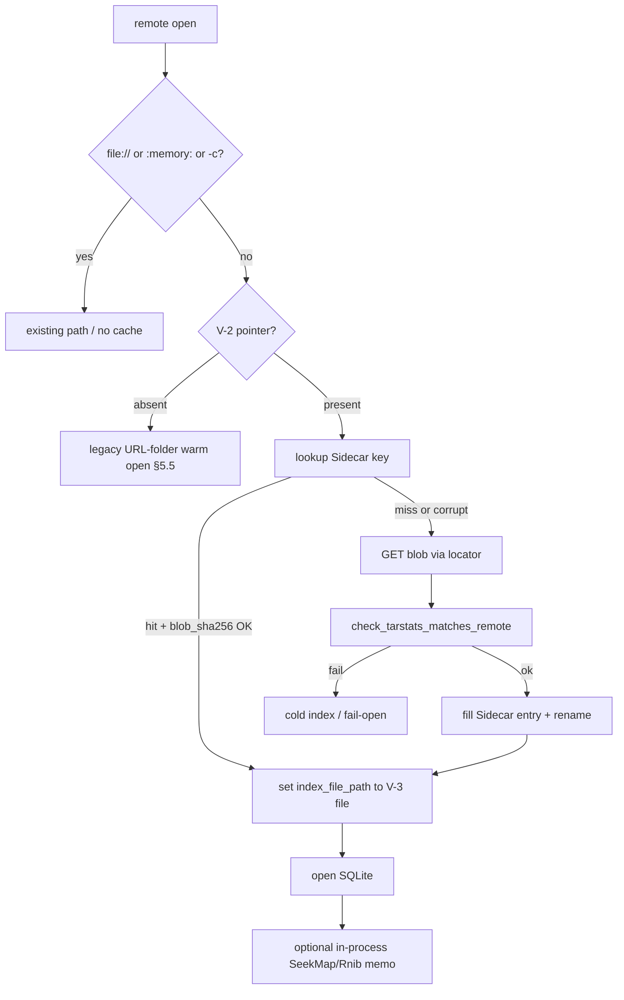

# Plan: V-3 read-through cache for remote sidecars

| Field | Value |
|-------|--------|
| **ID** | V-3 |
| **Parent** | [`docs/tasks/vectorize-steal-patterns.md`](../vectorize-steal-patterns.md) |
| **Date** | 2026-08-28 |
| **Status** | Plan — skeptic-plan-review **ACCEPT** (implement still blocked on V-2) |
| **Effort** | L (implement); this document is plan-only |
| **Ownership** | `ratarmount-index` (cache + keys) · `ratarmount` `remote_open.rs` (HTTP/OCI fill) · `ratarmount/src/factory.rs` `resolved_index` / `remote_index_setup` / nested durable (orchestrator unless the implement task owns factory) · not `ratarmount-compress` (seek maps already live in index + factory import) |
| **Depends** | **V-2** immutable index + atomic root pointer (`index_id`, `etag`/`sha256`, `archive_tarstats`) |
| **Not** | Cloudflare Durable Objects / Queues / colo Cache · G-3 payload / uncompressed member-body cache · SQLite-over-HTTP VFS in v1 |

**Implement of this plan is blocked until V-2 lands.** Current `main` (as of 2026-08-28, `5475d28`) has **no** pointer type, no `index_id`, and no root-pointer fetch. Grep hits for `index_id` / root pointer exist only in the V-2 TODO. The rest of this document **assumes the V-2 pointer exists** with the shape already specified there. If V-2 ships a different schema, remap fields; do not invent a parallel identity.

---

## 1. Why this exists

Vectorize puts Cloudflare Cache in front of R2 so colo queries hit cached centroid files instead of cold object GETs. The steal is that split, not ANN.

Remote ratarmount already Range-GETs **archive** bytes. The stall this item targets is **metadata I/O**:

- Full GET of `{archive}.index.sqlite` (and compressed siblings) on every cold discovery.
- Today’s “cache” is a URL-derived filename under `--index-folders` / XDG. A nonempty file **skips all remote discovery** with **no ETag / pointer revalidation**.
- Seek maps (`zstdblocks` / `bzip2blocks` / RGZI / GZIDX) and outer `nestedindexes` RNIB blobs live **inside** that SQLite sidecar. Remount that misses the sidecar pays the GET again, then re-reads those tables.

FUSE cannot hide a 100 ms RTT per 4 KiB if someone later pages a remote SQLite. v1 does **not** add that VFS. v1 pins the **small, hot, already-fetched metadata objects** so a second mount does not GET them again, and so a republished sidecar cannot be served from a URL-only leftover.

---

## 2. Investigation (current `main`)

### 2.1 Remote HTTP index fetch

| Piece | Location | Behavior today |
|-------|----------|----------------|
| Discovery order | `ratarmount/src/remote_open.rs` `apply_remote_index_discovery` | Skip if `-c` / `clear_index_cache` / `:memory:` / explicit `--index-file` (`opts.index_file_path.is_some()`). Else `resolve_index_location` → if that path is a nonempty file, **return without setting `index_file_path`**. Else HTTP `Link: rel="describedby"` on archive HEAD → `sibling_index_candidates` → OCI referrer on local miss. |
| Remount hit (actual) | `factory.rs` `remote_index_setup` → `resolved_index` → `resolve_index_location` | After discovery returns, live-Range open still resolves the URL-mangled folder candidate (`possible_index_paths`: `'/'` → `'_'`). **This is the remount warm path**, not only the discovery short-circuit. `check_tarstats_matches_archive` is a **no-op** when `archive_path` is a URL label (`!exists`). Seek-map import (`try_load_zstd_blocks` / gzip blob) uses the same no-op. |
| Explicit `--index-file http(s)://` | `main.rs` → `OpenOptions.index_file_path` raw URL; `resolve_index_location` → `maybe_fetch_index_url` | Discovery **returns immediately** (explicit path set). Every process full-GETs. No pointer, no V-3, no auth. |
| Object-store open | `open_s3_like` (`s3://` / `gs://` / `az://` / `ftp://` / `ipfs://`) | **Never calls** `apply_remote_index_discovery`. G-2 residual is not only “no sibling GET” — discovery is not invoked. |
| HTTP GET | `ratarmount-index/src/location.rs` `fetch_index_http` | `ureq::get` full body → kept tempfile (`RATARMOUNT_INDEX_TMPDIR` or std temp). **No `ETag` / `If-None-Match` / Range.** User-Agent `ratarmount-rs/0.1`. **No Basic/Cookie** (`probe_http` already sends them; `ratarmount-index` must not depend on `ratarmount-remote` — inject the fetch). |
| Materialize | `maybe_fetch_index_url` / `materialize_index_file` | `file://` → local path (no copy unless compressed). `http(s)://` → download. gzip/xz/zstd/bzip2 sidecar → decompress to a second tempfile; require `SQLite format 3\0`. |
| Install | `try_install_remote_index` | Open RO → `tarstats()` required (missing → delete fetch, fail-open). `check_tarstats_matches_remote` → copy into URL-mangled `cache_dest` (first folder candidate) → set `opts.index_file_path`. |
| Probe | `ratarmount-remote` `HttpProbe` | `content_length`, `accept_ranges`, `link`. **No ETag field.** |
| OCI | `fetch_oci_index_referrer` | Nonempty local path → skip registry (`return Ok(None)`). Else Referrers API → blob GET to tempfile. Subject digest is the **layer**, not a V-2 `index_id`. This skip is independent of the HTTP `path_is_nonempty_file` short-circuit. |
| Tests | `apply_remote_index_discovery_follows_archive_link` | Fake TCP server; asserts sidecar install. **No GET-count / remount cache assertion.** Lives under `ratarmount` **bin** tests (`--bin ratarmount`), not `--lib` (crate has no `[lib]`). |

`is_index_url` is `http(s)://` or `file://` only. `sibling_index_url` is http(s) only. `:memory:` is `IndexLocation::Memory` / `MEMORY_INDEX`.

### 2.2 tarstats

`TarStats` (`ratarmount-index`): `st_size`, `st_mtime`, `st_mtime_ns`, `prefix512_sha256`, `suffix512_sha256`, optional `full_sha256` (archives ≤ `TARSTATS_FULL_HASH_MAX` = 256 KiB).

`check_tarstats_matches_remote(stored, st_size, prefix, suffix, full)` compares **archive** size + edge (or full) hashes. Mismatch → `IndexError::Mismatch`; caller cold-indexes (fail-open). **mtime is not used** on the remote path.

`http_fingerprint` / `oci_fingerprint` issue extra Range GETs of the **archive** (not the sidecar) to build those hashes.

Path-based `check_tarstats_matches_archive` is a **no-op** when `archive_path` does not exist (URL labels, `oci:{digest}`). A second mount that hits the URL-named local file never re-runs `check_tarstats_matches_remote` at discovery time.

### 2.3 Seek maps and RNIB (inside the sidecar)

| Object | Storage | Open path |
|--------|---------|-----------|
| `zstdblocks` / `bzip2blocks` | SQLite side tables `(blockoffset, dataoffset)` | factory import after index open (`open_seekable_zstd_from_path`, live-Range variants) |
| RGZI / GZIDX / gztool | `gzipindexes` / `gzipindex` / `gztoolindex` `(data BLOB)` | factory G3 / rapidgzip import |
| RNIB | `nestedindexes.blob` (`RNIB` magic, v2 columnar; v1 JSON still decodes) | `factory.rs` `try_load_nested_durable` → `SqliteIndex::get_nested_index` keyed by `NestedMemberKey` + `NestedBodyFingerprint` |

There are **no** standalone remote URLs for seek maps or RNIB today. They are not independently Range-GET’d. Nested open forces compact-only / no nested SQLite; RNIB is read from the **outer** on-disk sidecar.

### 2.4 What already looks like a cache (and why it is not V-3)

- `--index-folders` default `["", $XDG_CACHE_HOME/ratarmount, ~/.ratarmount]`. Remote URL → filename with `/` replaced by `_`. Identity is **the URL string**, not ETag / tarstats.
- `path_is_nonempty_file` short-circuit is a **sticky local copy**. Republish at the same URL keeps serving the old blob.
- OCI `{digest}` local file skips referrer (correct for **layer** digest; wrong if we later want a newer index for the same digest — out of V-3).
- NFS/export `ReaderLru` and G3-A decoded-window LRU are **payload / decoder** caches. Do not reuse them.
- G-3 (roadmap `todo`) is **decompressed member chunks by content hash**. Different layer.

### 2.5 V-2 pointer on current `main`

**Absent.** V-2 still-open shape (plan assumption):

```text
{ schema, index_id, etag/sha256, generated_at, archive_tarstats }
```

Readers bind to `index_id`. Writer publishes blob `index.{id}.sqlite` then atomically replaces the pointer. That etag/id is the cache identity V-3 needs.

---

## 3. Goals and non-goals

### Goals (implement train, after V-2)

1. Process-local read-through LRU for **metadata objects** only:
   - SQLite sidecar (whole blob in v1; key space allows a later `range` for pages)
   - Seek-map blobs (`zstdblocks`, `bzip2blocks`, RGZI/GZIDX/gztool)
   - Outer `nestedindexes` RNIB blobs
2. Keys include **ETag / `index_id` / archive tarstats**, never URL alone.
3. Miss → existing remote fetch → verify → fill → serve. Hit → checksum → serve. Corrupt hit → delete entry → refetch (fail-closed).
4. Skip `file://` and `:memory:` (and local-path indexes, `index_in_memory`, `-c` / `clear_index_cache`).
5. Do **not** cache uncompressed archive / member bodies (G-3).
6. Regression: second mount of an http(s) archive with a published sidecar does not GET the sidecar body again. Pointer HEAD/GET (small) may run. Corrupting the cached blob refetches.
7. Bench hook: cold vs warm remount wall + GET count on a fake HTTP server.

### Non-goals

| Item | Why |
|------|-----|
| Cloudflare Cache, Durable Objects, Queues, Workers | Wrong runtime (parent explicit `n/a`) |
| G-3 content-addressed **payload** cache | Decompressed member bytes; do not duplicate |
| rusqlite HTTP VFS / per-4 KiB Range GET of a live remote SQLite | Not on `main`; SQLite already pages a **local** file after `materialize_index_file`. Inventing a VFS is a separate L. Reserve `range` on the key; do not build the VFS in V-3. |
| S3/GCS/Azure sibling GET/PUT | G-2 / V-2 residual. V-3 must not add object-store discovery. Cache API is backend-agnostic so a future V-2 fetch lights up. |
| Caching archive Range windows | That is the live `HttpRangeFile` / S3 reader, not this LRU |
| Changing `INDEX_MEDIA_TYPE` / `INDEX_VERSION` 0.7.0 | Pointer + blob family stay V-2 / G-2 |
| Cross-user / system daemon cache | XDG of the mounting user only |
| Auth material in the cache | Store bytes + identity; fill uses existing HTTP/OCI auth |

---

## 4. Assumed V-2 surface (do not implement here)

Implement binds to whatever V-2 actually exports. This plan needs **at least**:

```text
IndexPointer {
  schema,          // pointer schema, not INDEX_VERSION
  index_id,        // immutable blob id
  etag,            // sha256 of the sidecar blob and/or HTTP ETag
  generated_at,
  archive_tarstats // TarStats (size + edge/full hashes)
}

fetch_index_pointer(archive_url) -> Option<IndexPointer>
blob_locator(pointer) -> URL or OCI digest   // e.g. index.{id}.sqlite
```

V-3 cache **identity** is `(index_id, etag)` plus a tarstats fingerprint copied from the pointer (and re-checked against the live archive as today). The pointer URL is a **locator**, not the key.

If V-2 is not on the branch, implement PRs **must not land**. This plan PR is docs-only.

---

## 5. Design

### 5.1 What “process-local LRU (XDG cache dir)” means

Not a colo cache and not a Durable Object. Two tiers, one key space:

| Tier | Lifetime | Role |
|------|----------|------|
| In-process map + LRU list | One `ratarmount` process | Avoid re-read/re-parse of maps already filled this mount |
| On-disk under XDG | Until cap eviction or `-c` | Second process / remount hit |

Directory (create on first fill):

```text
$XDG_CACHE_HOME/ratarmount/sidecar-v3/
  # fallback: ~/.cache/ratarmount/sidecar-v3/
```

Do **not** reuse the existing URL-mangled files in `$XDG_CACHE_HOME/ratarmount/` as V-3 hits. Those names are URL-only. V-3 may **read** one as a migration candidate only after pointer identity + tarstats + blob checksum match; otherwise ignore.

Default size cap: **256 MiB** of on-disk payload (`RATARMOUNT_SIDECAR_CACHE_BYTES`, `0` = disable disk tier). In-process cap: **64 MiB** decoded / mapped (`RATARMOUNT_SIDECAR_CACHE_MEM_BYTES`). Evict LRU on-disk files by **mtime** (touch mtime on hit; do not trust `atime` / `relatime`); then drop in-process slots. Caps 0 with a pointer present still set `skip_folder_index_fallback` (cold / tempfile; no leftover URL-file).

Write: temp file in the same directory + `rename`. Partial files are not entries.

### 5.2 Key (never URL alone)

```text
SidecarCacheKey {
  kind: Sidecar | SeekMap { table } | Rnib { member_storage_key },
  index_id: String,          // V-2
  etag: String,              // V-2 etag field — treat as **opaque** (do not sniff sha256 vs HTTP ETag)
  tarstats_fp: String,       // canonical: st_size + prefix + suffix + full (empty if absent)
  range: Option<(u64, u64)>, // v1: None == whole object
}
```

On-disk **Sidecar** filename is a hash of `(kind, index_id, etag, tarstats_fp, range)`, not a URL. Entry **manifest** stores locator + **`blob_sha256` always computed** over the SQLite image (compare this on hit; do not assume `etag == sha256`). SeekMap/Rnib kinds are in-process only and do not need a filename.

Same URL + new `index_id`/`etag` → different key → miss → fetch new blob. Old entry ages out via LRU. That is the V-2 payoff.

URL-only collision test is mandatory: two pointers that share a locator string and differ in `etag` must not share a file.

**V-3 `Sidecar` disk hits require a V-2 pointer.** No pointer → do not enter this key space (legacy path, §5.5).

### 5.3 Object kinds and fill

**Network fill in v1 is sidecar-only** (HTTP GET / OCI blob GET / future V-2 object-store GET via `open_s3_like`, not discovery-only). Seek-map and RNIB are **not** independently fetched. V-3 must not invent sibling URLs for them.

**Decision (sweep 1+2):** SeekMap / Rnib are **in-process only** (not XDG). v1 **does not** change `try_load_nested_durable` / `try_load_zstd_blocks` / gzip-blob import — those stay on today’s SQLite read of the (read-only) outer sidecar. Required unit test: in-process `put`/`get` memo for SeekMap and Rnib kinds (so the LRU types exist and cannot accept a member-body). No factory rewrite, no `NestedOpenContext` fields, no disk RNIB key. Reuse `SqliteIndex::get_zstd_blocks` / `get_nested_index` / `NestedMemberKey::storage_key` if a later PR wires the memo.



| Kind | Persistence | Value | Populate |
|------|-------------|-------|----------|
| `Sidecar` | XDG + in-process | Decompressed SQLite image | Pointer-backed fill only |
| `SeekMap` | In-process only | Reuse `get_zstd_blocks` / gzip blob bytes already in the open sidecar | Optional memo after RO open; not a remount identity |
| `Rnib` | In-process only | `get_nested_index` result | Optional memo; nested open still reads outer SQLite |

**Whole sidecar when small** is v1 for every pointer-backed sidecar we fetch (typical indexes are far under the 256 MiB cap). If a sidecar is larger than the remaining cap, either evict LRU until it fits, or skip disk fill and keep the existing tempfile process-only.

Do not Range-slice a SQLite file in v1. `range` stays `None`.

**“Sidecar pages”** in the parent TODO = the objects we refuse to re-GET (SQLite image that SQLite will page locally) plus a reserved key field for a future VFS. Not a v1 HTTP pager.

### 5.4 Skip rules (hard)

Do not **read or write** the V-3 **Sidecar** disk cache when any of:

- No V-2 pointer for this archive (legacy; §5.5)
- Index spec is `:memory:` / `opts.index_in_memory`
- Index spec is `file://` or a local filesystem path that was **not** produced by a V-3 fill (including `maybe_fetch_index_url` after `file://` strip). After a pointer-backed install, `index_file_path` **is** a local V-3 file — that is a hit artifact, not a skip.
- `opts.clear_index_cache` / `-c`
- Cache disabled (`RATARMOUNT_SIDECAR_CACHE_BYTES=0` **and** mem cap 0). GET-count remount tests **must not** set the disk cap to 0.

**`--index-file http(s)://`:** see §5.5 (locator equality in `open_remote_input` / `remote_index_setup`, not inside `maybe_fetch_index_url`). Local `--index-file /path` never fills.

### 5.5 Revalidation, remount sites, pointer-absent policy

V-3 identity is **not** closed by deleting one `if path_is_nonempty_file` in discovery. Remount hits today:

| Site | File | What it does |
|------|------|----------------|
| Discovery short-circuit | `apply_remote_index_discovery` | Nonempty folder candidate → return; **`index_file_path` stays `None`** |
| Factory resolve | `remote_index_setup` → `resolved_index` → `resolve_index_location` | Opens the URL-mangled `--index-folders` file for the URL label |
| OCI referrer skip | `fetch_oci_index_referrer` | Nonempty local → skip registry |
| Seek-map import | factory `try_load_*` | Trusts that sidecar; tarstats no-op on URL labels |

**Pointer present (V-3 path):**

1. Fetch/parse the V-2 pointer **before** any nonempty-folder skip (HTTP arm of `open_remote_input`, OCI arm, and `remote_index_setup` when the label is a remote URL).
2. Lookup `Sidecar` by `(index_id, etag, tarstats_fp)`. Hit: compare stored `blob_sha256` to a fresh hash of the file; SQLite magic required. Then `check_tarstats_matches_remote` against the **live archive**.
3. Miss / corrupt / tarstats fail: GET blob via locator, verify, `rename` into `sidecar-v3/`, set `opts.index_file_path` to **that** file.
4. **Do not copy** pointer-backed installs into the URL-mangled `cache_dest`. Stop writing those files on the V-3 path.
5. Bypass `apply_remote_index_discovery`’s nonempty-file skip **and** `fetch_oci_index_referrer`’s nonempty skip when a pointer is present (OCI is in v1 **only** for pointer-backed subjects; otherwise OCI stays on today’s `oci:{digest}` local file).
6. **CAS / immutable:** a V-3 Sidecar file must never be opened writable **or unlinked**. Default CLI is `write_index: true`. `read_only_index` alone is not enough: TAR/ZIP `open_from_reader` → `SqliteIndex::create_writable` **`remove_file`s** an existing path (dir-writable is enough; chmod 0444 does not save it). When `index_file_path` is a V-3 file, live-Range must use `open_with_existing_index_from_reader` (and a ZIP warm equivalent), not `create_writable` / `create_writable_for_open`. Factory `persist_*`, `store_*_blocks_in_index`, `open_writable` (WAL/shm), and AutoMount `try_store_nested_durable` must not target a V-3 path. GET-count must assert no `-wal`/`-shm` beside the CAS file and unchanged bytes/`blob_sha256`. Locally produced seek maps / RNIB stay **in-process only** in v1. Cross-process persistence of maps you just built is a V-2 republish. Optional writable sibling outside `sidecar-v3/` is **out of v1** and must not be consulted on remount when a pointer exists.
7. **No folder fallback:** pointer present + no successful V-3 install (GET fail, tarstats fail, both caps 0, corrupt) → `resolved_index` / `remote_index_setup` **must not** use `possible_index_paths` leftovers. Cold index or a throwaway tempfile only. `OpenOptions` has no such field today — add `skip_folder_index_fallback: bool` (name bikeshed-OK) set whenever a pointer was fetched. Factory honors it even if `index_file_path` is still `None`.
8. When `opts.index_file_path` is already a V-3 cache path, `resolved_index` uses it and does not replace it with a URL-mangled candidate.

**`--index-file http(s)://` (pointer-present):** do **not** wire `get_or_fill` inside `maybe_fetch_index_url` / `fetch_index_http` (those functions see only the index URL — a URL-only key). In `open_remote_input` (HTTP arm) or `remote_index_setup` (has archive label + explicit URL): if `explicit_url == blob_locator(pointer)` (string equality only; no “equivalent fetch”), `get_or_fill` and set `index_file_path` to the **local V-3 file** *before* `resolve_index_location` so `maybe_fetch_index_url` is not invoked. On fill **failure**, leave `index_file_path` as `None` + `skip_folder_index_fallback` — do **not** leave the HTTP URL in `index_file_path` (that re-enters `resolve_index_location` → folder leftover). If the explicit URL does not equal the locator: treat as pointer-absent for that flag (legacy GET of the explicit URL, no V-3 write). Without a pointer: today’s full GET, no V-3 write.

**Pointer absent (legacy G-2; default until publishers write pointers):**

- Keep today’s URL-folder warm open (`resolve_index_location` + `try_install_remote_index` `cache_dest` copy).
- **Stale-URL risk remains documented.** Do not claim the parent “0 sidecar GETs + fail-closed on republish” bar on this path.
- Pointer-less remotes **never** enter the V-3 GET-count test.
- Fail-open Link/sibling GET still runs when the URL-file is missing.

**Fail-closed (pointer path only):** checksum mismatch, truncate, or bad magic → `remove_file` + miss + refetch. Never serve a corrupt V-3 sidecar.

### 5.6 G-3 boundary (payload)

The cache module exposes only the three kinds above. There is no `MemberBody` / `RangeWindow` kind. Callers must not write decompressed member bytes into this LRU.

G3-A’s decoded-window LRU on `SeekableGzipReader` stays (payload). Optional in-process SeekMap/Rnib memos are **indexes** (offset maps / RNIB / RGZI blobs), not plaintext members.

### 5.7 Module placement

| New / change | Crate | Notes |
|--------------|-------|--------|
| `sidecar_cache.rs` | `ratarmount-index` | Key, encode/decode, disk LRU, `blob_sha256`, skip predicates. **No** `ureq` / **no** `ratarmount-remote` dep — fill is injected. |
| Pointer-backed fill | `remote_open.rs` `apply_remote_index_discovery` / `try_fetch_http_index` / `try_install_remote_index` | Pointer → get_or_fill → set `index_file_path` to V-3 file. No URL-mangled `cache_dest` copy. |
| Explicit `--index-file http(s)` | `open_remote_input` / `remote_index_setup` | Locator equality vs `blob_locator(pointer)`; set local V-3 path **before** `resolve_index_location`. **Not** inside `maybe_fetch_index_url`. |
| Factory remount | `factory.rs` `resolved_index` / `remote_index_setup` | Honor V-3 `index_file_path`; honor `skip_folder_index_fallback`; never open V-3 path writable. |
| OCI skip | `ratarmount-remote` `fetch_oci_index_referrer` | Bypass nonempty local skip when pointer present. |
| Future S3/GCS/Azure | `open_s3_like` | Not discovery. When V-2 adds object-store pointer+blob GET, call `get_or_fill` from this arm. |
| `HttpProbe.etag` | `ratarmount-remote` | Optional log aid. Not a sole key. Auth for sidecar GET lives here or in an injected fetcher — not in the cache module. |

Do **not** add a new workspace crate for v1. Do **not** put cache logic in `ratarmount-remote` (Range/listing). Do **not** change `try_load_nested_durable` to a disk RNIB lookup. Do **not** use Cloudflare types or a queue.

### 5.8 Concurrency

`Mutex` around the in-process map (std, MSRV 1.74). Disk: one entry file per key hash; `rename` is the publish. Two processes filling the same key may duplicate work; last rename wins if checksums match. Do not flock unless a test proves we need it.

### 5.9 Auth and backends

Fill is injected (no `ratarmount-remote` dep from `ratarmount-index`). **Do not leave an unauthenticated sidecar/pointer GET next to an authenticated archive** (Basic/Cookie already on `probe_http`). Cache files are blob bytes only.

S3/GCS/Azure **and `rclone://`**: no fill in v1. `open_s3_like` and the rclone arm do not call discovery. When V-2 adds object-store pointer+blob GET, wire `get_or_fill` **inside those arms**, not by hoping discovery runs. Do **not** flip V-3 to `done` on HTTP-only. The parent’s `s3://…` remount regression is then in scope, not before.

---

## 6. Tests (same implement PR; required)

Name tests `Regression:` + symptom. Prefer `ratarmount-index` unit tests for keys/skip/corrupt; `ratarmount` / `remote_open` for GET count.

| Test | Layer | Assert |
|------|-------|--------|
| URL-only collision | index unit | Same locator, different `etag` → different files; putting B must not return A’s bytes |
| Skip `file://` | index unit | `put`/`get` on `file://` or local path is a no-op (no XDG write) |
| Skip `:memory:` | index unit | no-op |
| No pointer → no V-3 file | index / bin | Pointer-absent remount may still warm-open a URL-mangled file; **no** `sidecar-v3/` write |
| Corrupt fail-closed | index unit | Flip a byte in the sidecar file → next `get` is miss; fill closure runs |
| Tarstats mismatch | index / bin | Pointer etag matches but live archive fingerprint does not → do not install cache hit; cold path |
| HTTP remount GET count | `--bin ratarmount` fake TCP **with a pointer** | First mount: ≥1 GET of sidecar body. Second mount same pointer: **0** sidecar body GETs. **Default `write_index=true`** (not only the `write_index: false` Link test). Pointer HEAD/GET allowed. Disk cap must not be 0. V-3 file bytes + `blob_sha256` unchanged after the first mount. |
| HTTP remount after pointer flip | same harness | New `index_id`/`etag` → sidecar GET; old entry not returned |
| Leftover URL-file ignored (hit) | bin | Stale URL-mangled folder file with wrong bytes is not used when pointer + V-3 entry exist |
| Leftover URL-file ignored (miss) | bin | Pointer present, **no** `sidecar-v3/` file, leftover URL-mangled wrong bytes → not used (cold / tempfile) |
| Explicit `--index-file http` | bin | Locator matches pointer: second process does not re-GET sidecar body. Locator mismatch or no pointer: no V-3 write |
| Factory does not clobber V-3 path | factory / bin | `remote_index_setup` keeps `index_file_path` pointing at the V-3 file; that path is opened read-only |
| SeekMap/Rnib memo types | index unit | In-process put/get for those kinds; no disk file; no member-body insert |
| No payload kind | index unit | API has no member-body insert (compile-time / no public fn) |
| Cap eviction | index unit | Tiny cap + two sidecars → older file gone |

Fake HTTP only. Do not require live S3. If a CLI tool is missing, skip with `eprintln!("skip: …")` plus the pure unit tests above.

Bench (optional in implement PR, required before anyone claims a remote-mount win): same fake server, print GET count + wall for cold vs warm.

### Catalog row (add to `AGENTS.md` when implement lands, not in this plan PR)

```text
| Remote sidecar remount re-GETs / stale URL cache | `cargo test -p ratarmount-index --lib sidecar_cache` · `cargo test -p ratarmount --bin ratarmount apply_remote_index` |
```

(`ratarmount` has no `[lib]`; do not use `cargo test -p ratarmount --lib`.)

---

## 7. Docs (when implement lands)

| Doc | Change |
|-----|--------|
| [`vectorize-steal-patterns.md`](../vectorize-steal-patterns.md) | V-3 status → `partial`/`done`; checkboxes |
| [`phase10-remote.md`](../../phase10-remote.md) | Short “sidecar cache” note: XDG dir, env caps, skip `file://` / `:memory:`, not G-3 |
| [`beyond-parity-roadmap.md`](../beyond-parity-roadmap.md) | G-3 remains payload; one-line “do not confuse with V-3” |
| README feature table | Only if we advertise “remote index cache” to users |

This plan PR adds **this file** and a pointer from the V-3 section. It does **not** flip V-3 to done.

---

## 8. Implement phases (after V-2)

| Phase | Work | Exit |
|-------|------|------|
| 0 | Confirm V-2 pointer type is on the branch; map fields into `SidecarCacheKey` | If missing → stop (blocked) |
| 1 | `sidecar_cache.rs` + unit tests (key, skip, corrupt, cap, no-pointer no-write) | `cargo test -p ratarmount-index --lib sidecar_cache` |
| 2 | Wire fill sites + `skip_folder_index_fallback` + V-3 path always RO; `--index-file http` in `open_remote_input`/`remote_index_setup` only; OCI skip bypass | GET-count with `write_index=true` + leftover miss/hit + factory-clobber + CAS-unchanged tests green |
| 3 | SeekMap/Rnib **types** + unit memo test; do not change nested durable / persist targets | `sidecar_cache` memo test + existing `nested_durable` / zstdblocks green |
| 4 | Authenticated sidecar/pointer GET (injected); never unauthenticated next to an authenticated archive | existing HTTP cookie/basic tests stay green |
| 5 | Docs + AGENTS.md catalog row. Do not mark V-3 `done` until `open_s3_like` is wired or the parent S3 row is explicitly residual | fmt/clippy/test |

Do not ship Phase 2 without Phase 1 tests. Do not ship without the pointer-backed remount GET-count test.

---

## 9. Risks

| Risk | Mitigation |
|------|------------|
| V-2 pointer shape differs | Phase 0 remap; keys stay `(index_id, etag, tarstats_fp)` |
| Implement starts on current `main` | Hard gate: no pointer → no cache land |
| Operators treat XDG URL-files as the cache | New `sidecar-v3/` dir; do not key by URL |
| Whole-sidecar disk blow-up | 256 MiB cap + eviction; skip disk if one blob > cap |
| Stale archive, same pointer | Keep `check_tarstats_matches_remote` on hit |
| Confusing V-3 with G-3 | No payload kind; docs sentence |
| S3 regression copied from parent TODO | HTTP first; S3 when V-2 fetch exists |
| `fetch_index_http` unauthenticated | Fix in Phase 4 of the same implement train |
| Double cache (folder candidate + V-3) | Pointer path: no URL-mangled `cache_dest`; factory must not clobber V-3 `index_file_path` |
| Pointer-absent remount still stale | Documented legacy; V-3 GET-count tests require a pointer; do not call V-3 `done` on that path |
| `--index-file http` bypasses discovery | Phase 2 wires `maybe_fetch_index_url` / `resolve_index_location` |
| OCI nonempty skip survives HTTP-only fix | Phase 2 bypasses `fetch_oci_index_referrer` skip when pointer present |
| S3 / rclone never call discovery | Residual until those arms + V-2 object-store GET |
| Default `write_index` mutates CAS | V-3 path always RO; persist/RNIB store must not target it; GET-count uses `write_index=true` |
| Pointer-present leftover URL-file on install fail | `skip_folder_index_fallback`; leftover-miss test |
| `get_or_fill` inside `maybe_fetch_index_url` | Forbidden; locator equality before `resolve_index_location` |

---

## 10. Verification commands (implement)

```bash
cargo fmt --all
cargo clippy -p ratarmount-index -p ratarmount-remote -p ratarmount --all-targets -- -D warnings
cargo test -p ratarmount-index --lib sidecar_cache
cargo test -p ratarmount --bin ratarmount apply_remote_index
# existing discovery / tarstats / nested durable must stay green:
cargo test -p ratarmount-index --lib check_tarstats
cargo test -p ratarmount --bin ratarmount apply_remote_index_discovery_follows_archive_link
cargo test -p ratarmount --bin ratarmount nested_durable
```

Plan-only PR: no code gates beyond markdown existing in-tree.

---

## 11. Explicit implement blocker

```text
IMPLEMENT BLOCKED ON V-2
```

Current `main` has no `IndexPointer`, no `index_id`, no atomic root pointer object. V-3 keys and revalidation are specified against that pointer. Landing the cache on URL-or-HTTP-ETag-only would recreate the stale-sidecar bug this item is meant to close.

This **plan** can ACCEPT once skeptic review agrees the remount sites, pointer-absent policy, and in-process-only derived kinds are specified (sweep 1 folds). Implementers must not guess factory vs discovery, must not cache without a pointer, and must not treat HTTP-only as V-3 `done`.

---

## 12. Skeptic-plan-review

Protocol: never skip sweep 1; fresh Task skeptic each sweep; fold blockers; cap 3 then BLOCKED. Stop at ACCEPT or BLOCKED. No implementation in this PR.

| Sweep | Verdict | Folded into |
|-------|---------|-------------|
| 1 | **REVISE** | §2.1 remount/`open_s3_like`/`--index-file`/OCI; §5.2 opaque etag + `blob_sha256` + pointer-required hits; §5.3 SeekMap/Rnib in-process only; §5.4–5.5 pointer-absent legacy + factory `resolved_index`; §5.7–5.9 / §6 / §8 call-site list |
| 2 | **REVISE** | §5.3 memo types + unit test; §5.5 CAS/RO + `skip_folder_index_fallback` + leftover-miss; `--index-file` locator equality before `resolve_index_location`; §5.1 mtime; §5.9 rclone + auth must; §6 `write_index=true` GET-count |
| 3 | **ACCEPT** | Nits folded as implement notes: `create_writable` unlink (§5.5.6), `--index-file` fill-fail must not re-enter `resolve_index_location` with the HTTP URL (§5.5) |

**Final: ACCEPT**

Implement remains `IMPLEMENT BLOCKED ON V-2`. No further skeptic sweeps. Do not implement in this PR.
