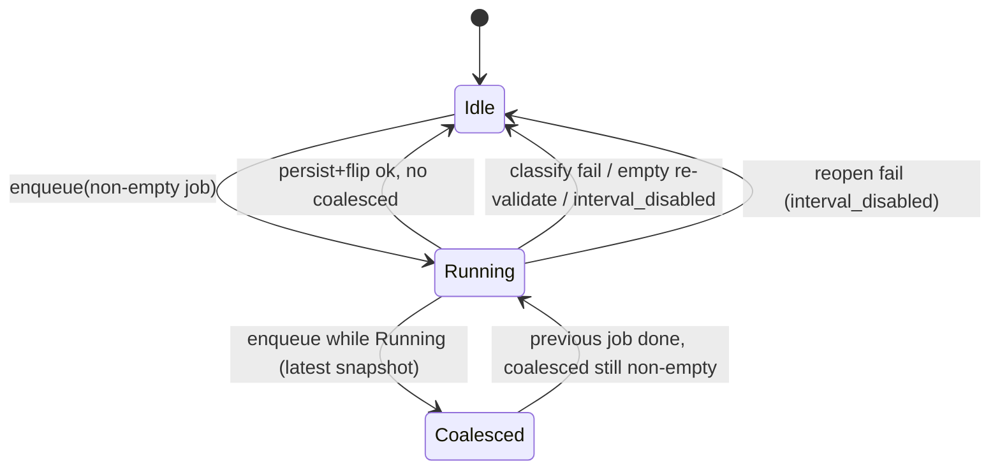

# Plan: V-4 WAL coordinator + executor (overlay commit queue)

| Field | Value |
|-------|--------|
| **Item** | [`vectorize-steal-patterns.md`](../vectorize-steal-patterns.md) **V-4** (partial, M) |
| **Date** | 2026-08-28 |
| **Status** | DRAFT — skeptic-plan-review in progress |
| **Scope** | In-process single-writer commit queue for live interval / on-exit (and in-process offline when a `WriteOverlay` exists). Job = overlay file list + generation. Executor does splice / ZIP rebuild / sidecar patch. Coordinator flips the visible archive + index. |
| **Ownership** | `ratarmount-compositing` (`write_overlay.rs`) + `ratarmount/src/overlay_commit.rs`. **Not** factory. **Not** formats-tar splice math. |
| **Out of this train** | Durable Objects / Queues / Workers; IVF / ANN; V-2 pointer schema; F-7 remote multipart; P2 overlay FileInfo cookies; gzip live splice; live ZIP; cross-process archive flock |

Pairs with: [`tar-zst-live-commit-design.md`](../tar-zst-live-commit-design.md) (F-2 persist / classify / K11), [`beyond-parity-roadmap.md`](../beyond-parity-roadmap.md) **F-2** (done) / **F-7** (todo), [`vectors-optimization.md`](../vectors-optimization.md) **P2** overlay cookies (related, not redesigned here).

---

## Overview

Vectorize keeps a small WAL of mutation *ids* and lets one executor rebuild objects; only the coordinator flips the root pointer. ratarmount-rs already has the persist bodies (last-frame `.tar.zst` splice, uncompressed GNU `tar --append`, offline ZIP rebuild, F-2 sidecar patch). What it does **not** have is an explicit single-writer *job* with a generation, so a second tick can start another splice or an on-exit persist can pile on after SIGTERM.

This train adds that coordinator. It does **not** change how a splice is computed. Overlay folder + hidden SQLite `files` table stay the mutation log. The job is a **snapshot of overlay paths + `commit_generation`**, not a row-mutation stream and not the spliced bytes.

**Consistency split (non-negotiable):**

| Surface | Model |
|---------|--------|
| FUSE/NFS `read` after overlay `write` (`-w`) | **Immediately consistent.** Serve overlay host bytes. Do not wait for archive republish. Do not treat overlay as eventually consistent. |
| Visible **base archive + index** after commit | **Async, single-writer.** Sibling tmp + `persist` rename (local). Later F-7 uploads, then a V-2 pointer flip — do not invent that pointer here. |

---

## What is already shipped (do not reimplement)

| Piece | Location | Behavior |
|-------|----------|----------|
| Overlay mutation log | `WriteOverlay` overlay dir + `HIDDEN_DB` `files` | Present / deleted rows + host files. This **is** the WAL payload store. |
| `commit_gate: RwLock<()>` | `write_overlay.rs` | Overlay **writers** take a read lock. Persist / reset take the write lock. `lookup` / `has_file` / `overlay_file_info` / `MountSource::open` are **not** gated. |
| `commit_generation: AtomicU64` | `WriteOverlay` | Bumped after successful persist (live: after `replacement` swap; atomic: after persist). `content_generation()` = this + inner base. FUSE `sweep_if_generation_advanced` / NFS reader LRU already watch it. |
| `interval_disabled` | K11 | Persist-ok + reopen-err (or cleanup-err) → further ticks fail; overlay kept. |
| Idle filter | `commit_live_idle` | Host mtime older than interval **and** no open write fd (`write_fds`). Hot files stay in the overlay. Delete tombstones are settled and go out on the same tick. |
| Interval thread | `overlay_commit::spawn_interval_commits` | **One** thread. Poll ≤ 1 s. Calls `commit_live_idle` **synchronously** — a long splice blocks the next poll. |
| On-exit | `maybe_commit_on_exit` → `commit_atomic` | Persist only; **no** reopen / overlay reset. Runs on the **main** thread after unmount / export stop. |
| Live `.tar.zst` classify | `classify_tar_zst_path` | Any `offsetheader` before the rewrite window → `earlier_frame_err`; **entire** tick skipped; archive bytes unchanged. Offline `--commit-overlay` is the escape hatch (rewrite from affected frame). |
| Offline `--commit-overlay` | free fn `commit_overlay(overlay_path, archive, opts)` | Walks the overlay **path**. Does **not** take `commit_gate`. ZIP = full rebuild; tar.zst = splice; gzip/bz2/xz = GNU tar. Separate process from a live mount. |
| F-2 sidecar patch | `patch_sidecar_if_present` + `IndexPatchWindow` | Interval reopen callback / on-exit after persist. Prefix frames not rescanned. |
| Overlay-tagged `FileInfo` | `overlay_file_info` | Full `FileInfo` + `UserData::Other("overlay:{path}")`. P2 wants a compact cookie — **not this train**. |

### Why a queue is still residual

The interval thread being single-threaded is **not** a coordinator:

1. **SIGTERM overlap.** Interval persist holds `commit_gate` write. FUSE unmount can return while that persist is still running. `maybe_commit_on_exit` then calls `commit_atomic` on the main thread. Today the write lock serializes them; on-exit may persist a **second** snapshot (or an empty plan after reset). There is no job id, no coalesce, no “already running → no-op”.
2. **No job identity.** Persist re-walks the overlay under the write lock. There is no recorded generation + file list that a second tick can compare.
3. **RO overlay open waits on persist.** `open_overlay_fd` takes `commit_gate.read()`. FUSE `open` of an overlay path therefore **blocks** for the whole GNU-tar / last-frame splice. `lookup` / already-open `OverlayFd` do not. That is a latency footgun; it is **not** the Vectorize “eventual overlay” model, but it must be named so we do not make it worse.
4. **F-7 needs a hook.** Remote multipart cannot hold `commit_gate` for the upload. The portable part is: enqueue lightweight job → executor writes an object → coordinator flips. V-4 ships the in-process shape; F-7 plugs in later with a V-2 pointer (not designed here).
5. **Offline free function is ungated.** In-process tests (or a future in-process caller) can overlap `commit_overlay` with `commit_live`. Live mount vs a **second process** `--commit-overlay` is a different residual (flock); out of v1.

---

## Goals & non-goals

### Goals (this train)

1. **Single-writer commit queue** on `WriteOverlay`: interval / on-exit / in-process offline enqueue one job. A second enqueue while `Running` **no-ops or coalesces** — it must not start a second splice.
2. **Job record** is `CommitJob { generation, kind, deleted_paths, append_entries }` (plus archive path / format already known). Not a per-row mutation stream. Not the spliced bytes.
3. **Fail closed** on live prefix-frame `.tar.zst` mutate using existing `classify_tar_zst_path` / `earlier_frame_err`. Classify **before** the executor writes the sibling tmp. Entire job skipped; overlay and archive untouched.
4. **Hot-file invariant** unchanged: open write fds and mtime younger than `--commit-overlay-interval` stay in the overlay (`commit_live_idle` / `overlay_entry_is_idle`).
5. **Overlay reads immediately consistent:** `lookup` / `has_file` / `overlay_file_info` / already-open overlay fds stay ungated. FUSE `read` after `write` still sees overlay host bytes **before** the base republish. Do not route overlay reads through the executor.
6. **Existing tests stay green** (run filters separately; `cargo test` does not treat `\|` as OR):
   - `cargo test -p ratarmount-compositing --lib commit_overlay_zip`
   - `cargo test -p ratarmount-compositing --lib commit_overlay`
   - `cargo test -p ratarmount-fuse --lib overlay_commit_live_delete_shifts`
   - `cargo test -p ratarmount-nfs --lib overlay_commit_live_delete_shifts`
7. **Later F-7 / V-2:** coordinator flip is a small function (`flip_visible_local` today). Do not invent a root-pointer JSON schema, IVF files, or Durable Objects.

### Non-goals

| Item | Why |
|------|-----|
| Durable Objects, Cloudflare Queues, Workers | Wrong runtime. One process, one writer. |
| IVF / PQ / ANN / centroid files | Explicit Vectorize non-goal. |
| V-2 pointer object `{schema, index_id, etag, …}` | Separate item. V-4 only leaves a flip hook. |
| F-7 multipart upload / write-through | Same queue later; do not implement upload here. |
| P2 overlay FileInfo compact cookies | Related (`commit_generation` already invalidates caches). Do **not** change `overlay_file_info` shape. |
| Redesign `FileInfo` / inode cache / FUSE `DIR_CACHE_TTL` | `sweep_if_generation_advanced` stays. 30 s readdir residual stays. |
| Gzip live splice / live ZIP | Still rejected by `live_commit_is_supported`. |
| Cross-process flock on the archive | Second `ratarmount --commit-overlay` vs a live mount. Residual; document only. |
| Changing splice / `rewrite_tar_suffix` / seek-table rules | F-2 already shipped. |
| New CLI flags | Interval / on-exit / `--commit-overlay` stay. |
| Unlock overlay **writes** for the duration of persist | v1 keeps persist exclusive vs writers so GNU tar / splice see a stable snapshot. Queue does not mean “writes proceed during splice”. |
| Control-socket `commit` | Not a product surface today. Do not add. |

---

## Key decisions

| # | Decision | Rationale |
|---|----------|-----------|
| K1 | **Queue lives on `WriteOverlay`**, not a new crate and not the CLI thread. Interval thread and on-exit become `enqueue` callers. Persist helpers stay private. | Crate ownership: compositing owns overlay + persist. Binary only schedules. |
| K2 | **Executor is the existing interval thread plus a “run if idle” call from on-exit / in-process offline.** No second thread, no `async`, no extra dependency. If no interval thread exists (on-exit-only mount), the caller **runs the job inline** on the same queue state so two inline callers still cannot overlap. | Smallest change that gives single-writer + coalesce. A dedicated executor thread is a follow-on if F-7 uploads must not block unmount. |
| K3 | **States: `Idle` \| `Running { job }` \| `Coalesced { job }`.** Enqueue while `Idle` → `Running` and execute. Enqueue while `Running` → store latest snapshot as `Coalesced` (or no-op if the new plan is empty / identical). When `Running` finishes, if `Coalesced` is set, it becomes the next `Running` **only if** `kind` allows (interval idle). On-exit / offline drain: wait for `Running` then run one final snapshot (or take `Coalesced`). | Matches “second tick no-ops or coalesces”. Coalesce = latest file list + current generation, not a FIFO of splices. |
| K4 | **Job is a path-list snapshot + `commit_generation` at enqueue**, produced by existing `collect_overlay_commit_plan_from_conn`. Executor **re-validates** idle/write-fd for interval jobs immediately before persist (drop files that went hot; leave them in overlay). It does **not** re-walk the whole overlay for new names (those wait for the next tick / coalesced job). | Spec: lightweight list, not bytes. Re-validate prevents persisting a file the user re-opened for write after enqueue. New names belong to the next job. |
| K5 | **Prefix-frame classify is coordinator-side, fail-closed, before sibling tmp.** Use `classify_tar_zst_path` on the job’s `deleted_paths` (and replace-as-delete). Failure: job aborted, state → `Idle`, overlay + archive unchanged, error text unchanged (`append-only` / whole commit skipped). Offline `.tar.zst` still uses `offline_tar_zst_from_idx` (not this reject). | Existing tests assert exact error class and byte-identical prefix. Do not start an executor that would rewrite the prefix under a live reader. |
| K6 | **Persist still holds `commit_gate` write for the persist + flip critical section.** Overlay writers (create/unlink/mkdir/rename/truncate) still wait. This keeps GNU `tar --append` / splice `FileOnDisk` stable. The queue’s job is overlapping-**splice** prevention, not concurrent writers. | Unlocking writes during persist is a new race (hot file after snapshot, GNU tar reading a changing inode). Out of v1. |
| K7 | **RO overlay open must not take `commit_gate`.** Split `open_overlay_fd`: write flags keep the read-lock (serialize with persist); read-only open uses the same confinement/`O_NOFOLLOW` path **without** the gate (same as `has_file` / `MountSource::open`). FUSE `cat` of an overlay file during a long splice stays on the host inode. | Immediate overlay consistency + no extra wait that looks like “eventual”. Does not redesign FileInfo. |
| K8 | **Flip order unchanged (K11):** persist sibling → `persist()` over archive → reopen (interval) → `replacement = Some` → `commit_generation += 1` → `forget_committed_overlay` (idle) or full reset (full live). Reopen-fail: overlay kept, `interval_disabled`, remount required. On-exit / `commit_atomic`: persist + generation bump, **no** reset. | `overlay_commit_live_delete_shifts` (FUSE + NFS) depends on generation advancing so cached base readers re-lookup. Do not bump generation before the new bytes are visible. |
| K9 | **In-process offline** (`commit_overlay` free function) stays path-based for the CLI one-shot. When the caller already has a `WriteOverlay` (library / tests), add `WriteOverlay::commit_offline` that enqueues with `kind: Offline` so it cannot overlap a live tick. Do **not** make the path-based CLI take a live mount’s gate (different process). | Spec says “offline enqueue”; the realistic overlap is in-process. Cross-process flock is documented residual. |
| K10 | **ZIP stays offline full rebuild.** Live queue never accepts ZIP (`live_commit_is_supported` unchanged). `commit_overlay_zip` tests keep calling the free function. | Do not invent live ZIP. |
| K11 | **V-2 / F-7 hook is a named function, not a schema.** `fn flip_visible_local(archive, tmp)` is today’s `NamedTempFile::persist`. Comment + `#[allow]`-free stub module note: F-7 replaces the last step with “upload immutable object, then publish V-2 pointer”. No JSON pointer, no `index_id` field, no IVF. | User spec: later uses V-2 pointer; do not invent it. |
| K12 | **P2 overlay cookies are adjacent, not in scope.** Queue flip already bumps `commit_generation`. FUSE/NFS caches already sweep on that. Do not change `overlay_file_info` to a compact cookie in this PR. | User spec. |

---

## Proposed design

### State machine



`Coalesced` holds **one** job (latest snapshot), not a queue of N splices. Two interval fires during a 60 s splice → one running persist + at most one follow-up snapshot.

### Job record

```rust
enum CommitKind {
    /// `--commit-overlay-interval`: idle filter; forget only job paths.
    LiveIdle { idle_for: Duration },
    /// Full live persist + overlay reset (tests / explicit `commit_live`).
    LiveFull,
    /// On-exit: persist, no reopen, no overlay reset.
    OnExit,
    /// In-process offline (`WriteOverlay::commit_offline`): format-specific
    /// persist including earlier-frame zstd splice / ZIP rebuild. No reopen.
    Offline,
}

struct CommitJob {
    /// `commit_generation` observed at enqueue (detect stale job if another
    /// flip won — should not happen under single-writer, asserted in tests).
    generation: u64,
    kind: CommitKind,
    deleted_paths: HashSet<String>,
    /// `(rel, is_directory)` — same as `OverlayCommitPlan.append_entries`.
    append_entries: Vec<(String, bool)>,
}
```

Do **not** store GNU `deletions_nul` / `appends_nul` on the job; rebuild those from the path lists when the executor calls `persist_by_format` (or keep `OverlayCommitPlan` crate-private and have the job own one). Prefer **one** `OverlayCommitPlan` inside the job so ZIP / GNU tar nul lists stay in sync.

`OverlayCommitPlan` stays crate-private. The queue API is `enqueue_*` / `commit_live` wrappers, not a public mutation stream.

### Live interval sequence (target)

```mermaid
sequenceDiagram
  participant T as interval thread
  participant Q as queue on WriteOverlay
  participant C as classify
  participant E as persist_by_format
  participant F as flip (persist rename + swap)
  participant R as FUSE/NFS overlay read

  T->>Q: enqueue LiveIdle (collect plan, short read lock)
  alt plan empty
    Q-->>T: Ok(false)
  else Q is Running
    Q->>Q: Coalesced = latest plan
    Q-->>T: Ok(false) no-op this fire
  else Idle
    Q->>C: classify_tar_zst_path (live zstd only)
    alt prefix-frame
      C-->>T: Err(append-only); Idle; archive untouched
    else ok
      Q->>Q: Running = job
      Q->>E: commit_gate.write(); persist sibling tmp
      Note over R: lookup / OverlayFd / RO open ungated
      E->>F: persist() + reopen + swap + gen++ + forget job paths
      F-->>T: Ok(true)
      alt Coalesced set
        Q->>Q: run coalesced as next job
      end
    end
  end
```

### On-exit vs interval

| | Interval | On-exit |
|--|----------|---------|
| Enqueue | `LiveIdle` | `OnExit` |
| Idle filter | yes | no (whole overlay) |
| If `Running` | coalesce | **wait** for `Running` (main thread joins / polls the queue), then one `OnExit` snapshot of whatever is **still** in the overlay |
| Reopen / reset | yes / forget job paths | no / no |
| `interval_disabled` | further interval jobs fail | `commit_atomic` already errors; keep that |

SIGTERM during a long splice: interval thread finishes persist+forget; on-exit waits, then sees remaining hot files (or empty) and persists those without resetting. No second splice of the same settled names.

### Fail-closed classify (live zstd)

Reuse, do not fork:

- `find_last_n_tar_window` → `rewrite_window_start_uncomp`
- For each path in `job.deleted_paths`: `classify_tar_zst_path`
- `TarZstPathClass::OverlayOnly` / `LastWindow` only
- Any earlier-frame → `earlier_frame_err`, **no** sibling tmp, **no** `persist()`

Offline `CommitKind::Offline` on `.tar.zst` uses existing `commit_overlay_tar_zst` / `offline_tar_zst_from_idx` (prefix-frame delete **allowed**). The queue must not apply the live reject to `Offline`.

### Immediate overlay reads (do not make these eventual)

| Path | Today | V-4 |
|------|-------|-----|
| `has_file` / `lookup` / `overlay_file_info` / `list` | No `commit_gate` | Unchanged |
| `MountSource::open` overlay tag | Host `O_NOFOLLOW`; NotFound → `current_base()` | Unchanged |
| FUSE already-open `OverlayFd` | `pread` unlinked inode | Unchanged (POSIX) |
| FUSE RO `open` → `open_overlay_fd` | **Takes `commit_gate.read()`** — waits on persist | **K7:** RO open ungated |
| Overlay **writes** | `commit_gate.read()` | Still gated vs persist (K6) |
| Base member after offset-shifting commit | FUSE/NFS watch `content_generation` | Flip still bumps it (K8) |

### V-2 pointer (later — do not invent)

V-2 will add an immutable sidecar blob + atomic root pointer. V-4 flip today is local `rename`. Implementation comment on `flip_visible_local` only:

```text
F-7: executor finishes upload of archive N+1 (and later index blob).
Coordinator publishes the V-2 pointer (not this module).
Do not PUT a live .index.sqlite in place.
```

No new types. No `index_id` on `CommitJob`.

### P2 overlay cookies (out of scope)

`vectors-optimization.md` P2: “Overlay file-info cache: compact cookie + size/mtime, not full `FileInfo`.” That cache would key on `commit_generation` + overlay path. V-4 already bumps that counter on flip. **Do not** change `overlay_file_info` or FUSE `store_fi` in this train. Mention in the V-4 PR so P2 does not invent a second generation.

---

## API / interface changes

### `ratarmount-compositing`

| Symbol | Change |
|--------|--------|
| `WriteOverlay` | Private `commit_queue: Mutex<QueueState>`. No public WAL type. |
| `commit_live` / `commit_live_idle` / `commit_atomic` | Same signatures. Internally enqueue + run/inline. Tests keep calling these. |
| `WriteOverlay::commit_offline` | **New**, optional in v1 if tests need in-process overlap. Free `commit_overlay` unchanged for CLI. |
| `live_commit_is_supported` | Unchanged. |
| `OverlayCommitPlan` | Stays private. May move into the job. |
| `classify_tar_zst_path` / persist helpers | Unchanged behavior. |

No new workspace crate. No new Cargo features.

### `ratarmount` binary

| Symbol | Change |
|--------|--------|
| `spawn_interval_commits` | Still one thread. Calls `commit_live_idle` (now queue-aware). After `Ok`/`Err`, does not start another persist itself. |
| `maybe_commit_on_exit` / `apply_live_commit(..., false)` | `commit_atomic` waits out `Running` then snapshots. |
| clap | No new flags. |

### FUSE / NFS

No protocol change. K7 is compositing `open_overlay_fd` only. NFS overlay create/write already use the same overlay methods.

---

## Test plan

Rules: drive shipped functions; generate payloads; name regressions `Regression:`. Skip only if a tool is missing **and** a unit test covers the core logic.

| Case | Layer | Assert |
|------|--------|--------|
| **Regression: two interval fires during a long splice** | compositing | Hold persist with a test hook / slow `reopen` **or** inject `Running` and call `commit_live_idle` twice. Second call `Ok(false)` or coalesce; **one** `persist()`; archive not truncated; prefix bytes `cmp` identical. |
| Coalesce latest names | compositing | While `Running`, create a second idle file; after first job, coalesced job persists the new name once. |
| Prefix-frame mutate fail-closed | compositing | Existing `live_commit_tar_zst_earlier_frame_delete_unchanged` + mixed append+delete still `Err`, archive unchanged. Queue must not write tmp first. |
| Hot files stay | compositing | Existing `commit_live_idle` tests (open write fd / young mtime). Queue re-validate drops a file that went hot after enqueue. |
| Overlay read during persist | compositing + fuse | `lookup` / RO `open_overlay_fd` / `cat` of an overlay file while a test persist holds the write lock returns overlay bytes (K7). Must not hang the test (timeout). |
| Generation flip | fuse + nfs | Existing `overlay_commit_live_delete_shifts` stay green (generation bump after swap). |
| ZIP / offline splice | compositing | `commit_overlay_zip` + `commit_overlay` (incl. earlier-frame delete, seek-table) stay green. |
| On-exit after interval | compositing / bin | Interval persist then `commit_atomic`: no duplicate members; remaining hot files flushed once. |
| `interval_disabled` | compositing | Existing persist+reopen-fail: second tick skipped via `interval_disabled`, not `Ok(false)`. |
| Empty second tick | compositing | Existing `Ok(false)` after forget. |

**Must stay green (CI / agent):**

```bash
cargo fmt --all -- --check
cargo clippy -p ratarmount-compositing -p ratarmount-fuse -p ratarmount-nfs -p ratarmount --all-targets -- -D warnings
cargo test -p ratarmount-compositing --lib commit_overlay_zip
cargo test -p ratarmount-compositing --lib commit_overlay
cargo test -p ratarmount-compositing --lib live_commit
cargo test -p ratarmount-fuse --lib overlay_commit_live_delete_shifts
cargo test -p ratarmount-nfs --lib overlay_commit_live_delete_shifts
cargo test -p ratarmount --test commit_overlay_live
```

Add an AGENTS.md catalog row for the overlapping-interval regression in the implementation PR (not this plan-only change).

---

## PR plan (implementation; not this docs PR)

### PR 1 — Queue state + job snapshot (library)

- **Title:** `compositing: single-writer overlay commit queue`
- **Files:** `ratarmount-compositing/src/write_overlay.rs` (or `commit_queue.rs` + `mod`)
- **Behavior:** `Idle` / `Running` / `Coalesced`; `commit_live*` / `commit_atomic` go through enqueue. Persist/classify/flip **unchanged**. K7 RO `open_overlay_fd` split.
- **Tests:** unit tests on the state machine (second enqueue no-ops; coalesce keeps latest list; `interval_disabled` short-circuit). Existing `live_commit` / `commit_overlay*` green.
- **Docs:** none user-facing if behavior is identical except RO open no longer waits.

### PR 2 — Overlap regression + on-exit drain

- **Title:** `compositing: coalesce overlapping overlay commits`
- **Depends:** PR 1
- **Tests:** injected long persist; two `commit_live_idle`; readers never see truncated `.tar.zst`; on-exit waits then one snapshot. AGENTS.md catalog row.
- **Docs:** one paragraph in [`docs/zstd-random-access.md`](../../zstd-random-access.md) / mount-options if operator-visible (“interval ticks coalesce; overlay reads stay live”).

### PR 3 (optional, same release if small)

- `WriteOverlay::commit_offline` for in-process overlap with live ticks. CLI `commit_overlay` free function unchanged.

F-7 / V-2 are **not** PRs in this train.

---

## Risks

| Risk | Severity | Mitigation |
|------|----------|------------|
| Coalesce persists a name the user deleted during `Running` | Medium | Re-validate plan under write lock before persist; missing host file → drop append; tombstone still in `deleted_paths` only if still deleted in DB |
| Classify after tmp write | **High** | K5: classify first |
| Double `persist()` tears `.tar.zst` | **High** | Single `Running`; persist only from executor; sibling tmp + rename |
| Generation bump before swap | **High** | K8; existing shift tests |
| RO open ungated + persist `forget` unlinks | Low | POSIX: already-open fd keeps inode; new open falls through to `current_base()` (existing `MountSource::open` NotFound path) |
| On-exit wait deadlocks interval thread | Medium | Interval thread must not wait on on-exit. On-exit waits for `Running`. No lock order inversion: queue mutex held only for state transitions, not during persist (persist uses `commit_gate` only). |
| Treating offline live-reject | Medium | `CommitKind::Offline` skips live classify |
| Scope creep into P2 cookies / V-2 JSON | Medium | K11–K12; skeptic checklist |
| Unlocking writes during persist “because Vectorize” | **High** | Explicitly refused (K6) |

---

## Observability

Reuse existing log lines. Add:

| Event | Level | Shape |
|-------|--------|--------|
| Second tick coalesced | `debug` | `overlay commit coalesced (already running)` |
| Second tick no-op empty | `debug` | existing “nothing idle to do” |
| Prefix-frame | `error` | unchanged `earlier_frame_err` |

No new metrics.

---

## Docs delta (implementation PRs)

| Trigger | File |
|---------|------|
| Operator-visible coalesce / “reads stay live during commit” | [`docs/zstd-random-access.md`](../../zstd-random-access.md), maybe [`docs/mount-options-parity.md`](../../mount-options-parity.md) |
| V-4 status | [`vectorize-steal-patterns.md`](../vectorize-steal-patterns.md) V-4 checkboxes |
| New regression | `AGENTS.md` catalog |

This **plan-only** PR adds this file. Do not flip V-4 to `done`.

---

## Open questions (non-blocking)

1. **Dedicated executor thread vs inline (K2)?** Recommendation: inline + interval thread for v1. Revisit when F-7 upload must outlive unmount.
2. **Cross-process flock?** Recommendation: residual. Document “do not `--commit-overlay` a file that is live-mounted”.
3. **Public `commit_offline`?** Recommendation: only if an in-process test needs it; CLI stays on the free function.

---

## Skeptic-plan-review log

| Sweep | Result | Folded |
|-------|--------|--------|
| 1 | *pending* | |
| 2 | *pending* | |
| 3 | *pending* | |

Stop at **ACCEPT** or **BLOCKED** (cap 3).

---

## References

- V-4 spec: [`docs/tasks/vectorize-steal-patterns.md`](../vectorize-steal-patterns.md)
- Live persist / classify: [`docs/tasks/tar-zst-live-commit-design.md`](../tar-zst-live-commit-design.md)
- Overlay + persist: [`ratarmount-compositing/src/write_overlay.rs`](../../../ratarmount-compositing/src/write_overlay.rs)
- Interval / on-exit: [`ratarmount/src/overlay_commit.rs`](../../../ratarmount/src/overlay_commit.rs)
- FUSE generation sweep: [`ratarmount-fuse/src/lib.rs`](../../../ratarmount-fuse/src/lib.rs) (`sweep_if_generation_advanced`, `overlay_commit_live_delete_shifts`)
- NFS generation sweep: [`ratarmount-nfs/src/vfs.rs`](../../../ratarmount-nfs/src/vfs.rs)
- P2 cookies: [`docs/tasks/vectors-optimization.md`](../vectors-optimization.md)
- F-7: [`docs/tasks/beyond-parity-roadmap.md`](../beyond-parity-roadmap.md)
