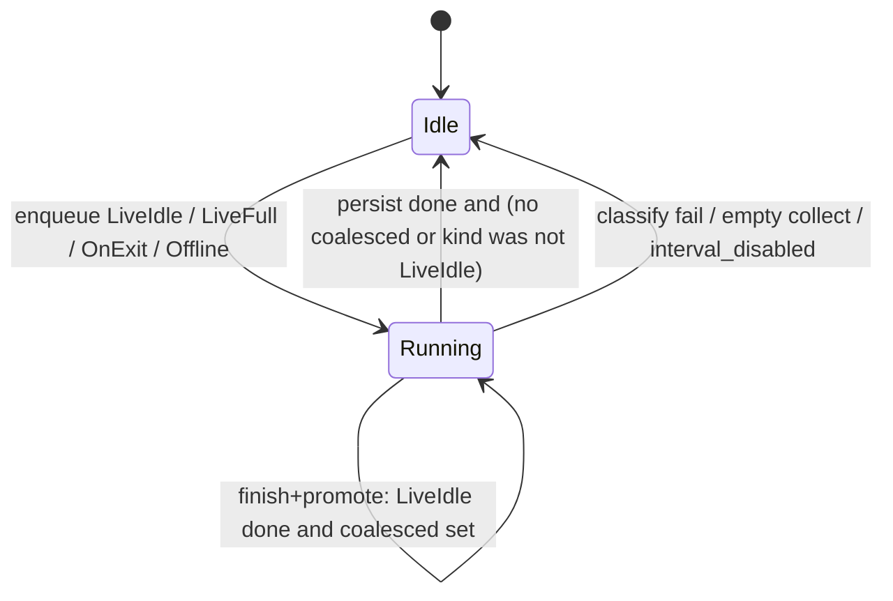

# Plan: V-4 WAL coordinator + executor (overlay commit queue)

| Field | Value |
|-------|--------|
| **Item** | [`vectorize-steal-patterns.md`](../vectorize-steal-patterns.md) **V-4** (partial, M) |
| **Date** | 2026-08-28 |
| **Status** | **BLOCKED** (skeptic-plan-review cap 3). Sweeps 1–3 folded; no 4th sweep. |
| **Scope** | In-process single-writer commit queue for live interval / on-exit (and in-process offline when a `WriteOverlay` exists). Job = overlay file list + generation. Executor does splice / ZIP rebuild / sidecar patch. Coordinator flips the visible archive + index. |
| **Ownership** | `ratarmount-compositing` (`write_overlay.rs`) + `ratarmount/src/overlay_commit.rs`. **Not** factory. **Not** formats-tar splice math. |
| **Out of this train** | Durable Objects / Queues / Workers; IVF / ANN; V-2 pointer schema; F-7 remote multipart; P2 overlay FileInfo cookies; gzip live splice; live ZIP; cross-process archive flock |

Pairs with: [`tar-zst-live-commit-design.md`](../tar-zst-live-commit-design.md) (F-2 persist / classify / K11), [`beyond-parity-roadmap.md`](../beyond-parity-roadmap.md) **F-2** (done) / **F-7** (todo), [`vectors-optimization.md`](../vectors-optimization.md) **P2** overlay cookies (related, not redesigned here).

---

## Overview

Vectorize keeps a small WAL of mutation *ids* and lets one executor rebuild objects; only the coordinator flips the root pointer. ratarmount-rs already has the persist bodies (last-frame `.tar.zst` splice, uncompressed GNU `tar --append`, offline ZIP rebuild, F-2 sidecar patch). What it does **not** have is an explicit single-writer *job* with a generation, so a second tick can start another splice or an on-exit persist can pile on after SIGTERM.

This train adds that coordinator. It does **not** change how a splice is computed. Overlay folder + hidden SQLite `files` table stay the mutation log. The job is a **lightweight identity** (kind + `commit_generation` + optional coalesce hint of overlay paths), not a row-mutation stream and not the spliced bytes. The **persist plan** is still collected under `commit_gate` write immediately before splice (same as `commit_live_inner` today).

**Consistency split (non-negotiable):**

| Surface | Model |
|---------|--------|
| FUSE/NFS `read` after overlay `write` (`-w`) | **Immediately consistent.** Serve overlay host bytes. Do not wait for archive republish. Do not treat overlay as eventually consistent. |
| Visible **base archive + index** after commit | **Async, single-writer.** Sibling tmp + `persist` rename (local). Later F-7 uploads, then a V-2 pointer flip — do not invent that pointer here. |

---

## What is already shipped (do not reimplement)

| Piece | Location | Behavior |
|-------|----------|----------|
| Overlay mutation log | `WriteOverlay` overlay dir + `HIDDEN_DB` `files` | Present / deleted rows + host files. This **is** the WAL payload store. |
| `commit_gate: RwLock<()>` | `write_overlay.rs` | Overlay **writers** take a read lock. Persist / reset take the write lock. `lookup` / `has_file` / `overlay_file_info` / `MountSource::open` are **not** gated. |
| `commit_generation: AtomicU64` | `WriteOverlay` | Bumped after successful persist (live: after `replacement` swap; atomic: after persist). `content_generation()` = this + inner base. FUSE `sweep_if_generation_advanced` / NFS reader LRU already watch it. |
| `interval_disabled` | K11 | Persist-ok + reopen-err (or cleanup-err) → further ticks fail; overlay kept. |
| Idle filter | `commit_live_idle` | Host mtime older than interval **and** no open write fd (`write_fds`). Hot files stay in the overlay. Delete tombstones are settled and go out on the same tick. |
| Interval thread | `overlay_commit::spawn_interval_commits` | **One** thread. Poll ≤ 1 s. Calls `commit_live_idle` **synchronously**. Today the `JoinHandle` is **dropped** (detached). V-4 returns it and main joins before on-exit (K14). |
| On-exit | `maybe_commit_on_exit` → `commit_atomic` | Persist only; **no** reopen / overlay reset. Runs on the **main** thread after unmount / export stop. |
| Live `.tar.zst` classify | `classify_tar_zst_path` | Any `offsetheader` before the rewrite window → `earlier_frame_err`; **entire** tick skipped; archive bytes unchanged. Offline `--commit-overlay` is the escape hatch (rewrite from affected frame). |
| Offline `--commit-overlay` | free fn `commit_overlay(overlay_path, archive, opts)` | Walks the overlay **path**. Does **not** take `commit_gate`. ZIP = full rebuild; tar.zst = splice; gzip/bz2/xz = GNU tar. Separate process from a live mount. |
| F-2 sidecar patch | `patch_sidecar_if_present` + `IndexPatchWindow` | Interval reopen callback / on-exit after persist. Prefix frames not rescanned. |
| Overlay-tagged `FileInfo` | `overlay_file_info` | Full `FileInfo` + `UserData::Other("overlay:{path}")`. P2 wants a compact cookie — **not this train**. |

### Why a queue is still residual

The interval thread being single-threaded is **not** a coordinator:

1. **SIGTERM / on-exit overlap.** Interval persist holds `commit_gate` write. FUSE unmount can return while that persist is still running. `maybe_commit_on_exit` then calls `commit_atomic` on the main thread. Today the write lock serializes them, but `commit_live_idle` drops its **read** lock before `commit_live_inner` takes **write** — on-exit can win that gap, persist without forgetting host files, then interval splices the same names again. There is no job id, no “already running → no-op”, and a naive `Coalesced` promote after OnExit repeats that bug.
2. **No job identity.** Persist already re-walks under the write lock (keep that). There is no recorded generation + kind that a second tick can compare for coalesce vs drain.
3. **RO overlay open waits on persist.** `open_overlay_fd` takes `commit_gate.read()`. FUSE `open` of an overlay path therefore **blocks** for the whole GNU-tar / last-frame splice. `lookup` / already-open `OverlayFd` do not. That is a latency footgun; it is **not** the Vectorize “eventual overlay” model, but it must be named so we do not make it worse.
4. **F-7 needs a hook.** Remote multipart cannot hold `commit_gate` for the upload. The portable part is: enqueue lightweight job → executor writes an object → coordinator flips. V-4 ships the in-process shape; F-7 plugs in later with a V-2 pointer (not designed here).
5. **Offline free function is ungated.** In-process tests (or a future in-process caller) can overlap `commit_overlay` with `commit_live`. Live mount vs a **second process** `--commit-overlay` is a different residual (flock); out of v1.

---

## Goals & non-goals

### Goals (this train)

1. **Single-writer commit queue** on `WriteOverlay`: interval / on-exit / in-process offline enqueue one job. A second enqueue while `Running` **no-ops or coalesces** — it must not start a second splice.
2. **Job record** is lightweight: `CommitKind` + `commit_generation` (+ optional coalesce hint). Not a per-row mutation stream. Not the spliced bytes. The executor **re-collects** `OverlayCommitPlan` under the persist write lock (K4).
3. **Fail closed** on live prefix-frame `.tar.zst` mutate using existing `classify_tar_zst_path` / `earlier_frame_err`. Classify **before** the executor writes the sibling tmp. Entire job skipped; overlay and archive untouched.
4. **Hot-file invariant** unchanged: open write fds and mtime younger than `--commit-overlay-interval` stay in the overlay (`commit_live_idle` / `overlay_entry_is_idle`).
5. **Overlay reads immediately consistent:** `lookup` / `has_file` / `overlay_file_info` / already-open overlay fds stay ungated. FUSE `read` after `write` still sees overlay host bytes **before** the base republish. Do not route overlay reads through the executor.
6. **Existing tests stay green** (run filters separately; `cargo test` does not treat `\|` as OR):
   - `cargo test -p ratarmount-compositing --lib commit_overlay_zip`
   - `cargo test -p ratarmount-compositing --lib commit_overlay`
   - `cargo test -p ratarmount-fuse --lib overlay_commit_live_delete_shifts`
   - `cargo test -p ratarmount-nfs --lib overlay_commit_live_delete_shifts`
7. **Later F-7 / V-2:** coordinator flip is a small function (`flip_visible_local` today). Do not invent a root-pointer JSON schema, IVF files, or Durable Objects.

### Non-goals

| Item | Why |
|------|-----|
| Durable Objects, Cloudflare Queues, Workers | Wrong runtime. One process, one writer. |
| IVF / PQ / ANN / centroid files | Explicit Vectorize non-goal. |
| V-2 pointer object `{schema, index_id, etag, …}` | Separate item. V-4 only leaves a flip hook. |
| F-7 multipart upload / write-through | Same queue later; do not implement upload here. |
| P2 overlay FileInfo compact cookies | Related (`commit_generation` already invalidates caches). Do **not** change `overlay_file_info` shape. |
| Redesign `FileInfo` / inode cache / FUSE `DIR_CACHE_TTL` | `sweep_if_generation_advanced` stays. 30 s readdir residual stays. |
| Gzip live splice / live ZIP | Still rejected by `live_commit_is_supported`. |
| Cross-process flock on the archive | Second `ratarmount --commit-overlay` vs a live mount. Residual; document only. |
| Changing splice / `rewrite_tar_suffix` / seek-table rules | F-2 already shipped. |
| New CLI flags | Interval / on-exit / `--commit-overlay` stay. |
| Unlock overlay **writes** for the duration of persist | v1 keeps persist exclusive vs writers so GNU tar / splice see a stable snapshot. Queue does not mean “writes proceed during splice”. |
| Control-socket `commit` | Not a product surface today. Do not add. |

---

## Key decisions

| # | Decision | Rationale |
|---|----------|-----------|
| K1 | **Queue lives on `WriteOverlay`**, not a new crate and not the CLI thread. Interval thread and on-exit become `enqueue` callers. Persist helpers stay private. | Crate ownership: compositing owns overlay + persist. Binary only schedules. |
| K2 | **Executor is whoever transitions `Idle → Running`.** That stack must **drain until `Idle`** before returning (K13). No second thread, no `async`. Interval thread is one such executor; on-exit / `commit_live` / `commit_offline` are executors when they find `Idle`. If they find `Running`, they **wait** (K14) — they do not start a second splice. | Smallest single-writer. A dedicated executor thread is a follow-on if F-7 uploads must not block unmount. |
| K3 | **States: `Idle` \| `Running { kind, generation }` + optional `coalesced: Option<LiveIdleHint>`.** `coalesced` is a **side slot**, not a third state. Enqueue `LiveIdle` while `Idle` → `Running` and this stack becomes executor. Enqueue `LiveIdle` while `Running` → set/replace `coalesced`, return `Ok(false)` (this stack is **not** the executor). **Finish + promote is one queue-mutex transition:** if `Running.kind` was `LiveIdle` and `coalesced` is set → stay `Running { LiveIdle }` (hint discarded; persist will re-collect). If `Running.kind` was `OnExit` / `Offline` / `LiveFull` → **discard `coalesced`** and go `Idle`. The **same executor stack** must loop (K13) until the transition lands on `Idle`. Never persist a stored path list. Never promote coalesced after OnExit/Offline/LiveFull. | Sweep-1 B1 + sweep-2 B2: promote without an in-stack drain leaves `Running` with no executor. |
| K4 | **Job identity is not the persist plan.** Enqueue may snapshot paths as a **hint** for coalesce/no-op (`same names?` / empty). Persist **always** calls `collect_overlay_commit_plan_from_conn` under `commit_gate` **write** (today’s `commit_live_inner`), including idle cutoff, `write_fds`, and parent-dir retain (`skipped` / `path_is_under_rel`). Do not persist a path list collected under a read lock. Do not “re-validate by dropping names from a stale list” — that misses a parent dir whose child went hot, which `live_commit_idle_nested_hot_sibling_keeps_parent` covers. | Sweep-1 B2: hot-file invariant is the full collect under write lock, not a filtered snapshot. Spec “file list + generation” = job **identity**; bytes still come from the overlay dir at persist time. |
| K5 | **Prefix-frame classify stays inside the persist body, fail-closed, before sibling tmp.** Live zstd: `scan` → `find_last_n_tar_window` → `classify_tar_zst_path` on the **just-collected** plan’s `deleted_paths` → only then `splice_zstd_last_frames_replace`. Failure: `earlier_frame_err`, no tmp, overlay + archive unchanged. Do **not** classify a stale enqueue list before `Running`. `CommitKind::Offline` must call `commit_overlay_tar_zst` / `offline_tar_zst_from_idx` (prefix-frame delete **allowed**), never live `persist_tar_zst_plan`. | Existing tests assert exact error class and byte-identical prefix. Classify needs the rewrite window from `find_last_n` (already true in `persist_tar_zst_plan`). |
| K6 | **Persist still holds `commit_gate` write for the persist + flip critical section.** Overlay writers (create/unlink/mkdir/rename/truncate) still wait. This keeps GNU `tar --append` / splice `FileOnDisk` stable. The queue’s job is overlapping-**splice** prevention, not concurrent writers. | Unlocking writes during persist is a new race (hot file after snapshot, GNU tar reading a changing inode). Out of v1. |
| K7 | **RO overlay open must not take `commit_gate`.** Split `open_overlay_fd`: write flags keep the read-lock (serialize with persist); read-only open uses the same confinement/`O_NOFOLLOW` path **without** the gate (same as `has_file` / `MountSource::open`). FUSE `cat` of an overlay file during a long splice stays on the host inode. | Immediate overlay consistency + no extra wait that looks like “eventual”. Does not redesign FileInfo. |
| K8 | **Flip order unchanged (K11):** persist sibling → `persist()` over archive → reopen (interval) → `replacement = Some` → `commit_generation += 1` → `forget_committed_overlay` (idle) or full reset (full live). Reopen-fail: overlay kept, `interval_disabled`, remount required. On-exit / `commit_atomic`: persist + generation bump, **no** reset. | `overlay_commit_live_delete_shifts` (FUSE + NFS) depends on generation advancing so cached base readers re-lookup. Do not bump generation before the new bytes are visible. |
| K9 | **In-process offline** (`commit_overlay` free function) stays path-based for the CLI one-shot. When the caller already has a `WriteOverlay` (library / tests), add `WriteOverlay::commit_offline` (`CommitKind::Offline`, same wait-for-Idle + discard-coalesced rule as OnExit) so it cannot overlap a live tick. Do **not** make the path-based CLI take a live mount’s gate (different process). Do **not** flip V-4 to `done` until `commit_offline` exists (sweep-1 nit). Cross-process flock stays residual. | Spec says “offline enqueue”; the realistic overlap is in-process. |
| K10 | **ZIP stays offline full rebuild.** Live queue never accepts ZIP (`live_commit_is_supported` unchanged). `commit_overlay_zip` tests keep calling the free function. | Do not invent live ZIP. |
| K11 | **V-2 / F-7 hook is a named function, not a schema.** `fn flip_visible_local(archive, tmp)` is today’s `NamedTempFile::persist`. Comment + `#[allow]`-free stub module note: F-7 replaces the last step with “upload immutable object, then publish V-2 pointer”. No JSON pointer, no `index_id` field, no IVF. | User spec: later uses V-2 pointer; do not invent it. |
| K12 | **P2 overlay cookies are adjacent, not in scope.** Queue flip already bumps `commit_generation`. FUSE/NFS caches already sweep on that. Do not change `overlay_file_info` to a compact cookie in this PR. | User spec. |
| K13 | **Drain until Idle on the executor stack.** After persist+flip (or empty collect / classify `Err` / `interval_disabled`), finish+promote. If the mutex transition left `Running { LiveIdle }`, **immediately** take `commit_gate` write again, re-collect, persist. Repeat until finish lands on `Idle`. Do **not** return from `commit_live_idle` / `commit_live` / `commit_atomic` leaving `Running`. The next interval poll is not an executor: if it sees `Running` it only sets `coalesced` (or no-ops). On `GOT_TERM`, the interval thread still finishes this drain, then exits. | Sweep-2 B2: finish+promote + “interval does not start another persist” + `term_requested` before the next poll = `Running` forever; on-exit waits forever. |
| K14 | **Stop the interval thread, then join, then on-exit. Never pass `stop: None`.** `spawn_interval_commits` returns `JoinHandle<()>` and **always** takes a stop flag (`NfsStop` or a new `AtomicBool` / `CommitStop` — same “is_stopped” check as today). After `mount_blocking` / export stop returns, **every** caller: `request_stop()` → `join()` → `maybe_commit_on_exit`. Do **not** `let _ = spawn(...)`. Do **not** join without stopping: FUSE-only daemon (`run_fuse_only` child, `main.rs` ~2072) today passes `stop: None` and exits the poll loop **only** on `GOT_TERM`. Clean `fusermount -u` / `umount` returns from `mount_blocking` **without** setting `GOT_TERM` (`spawn_signal_fuse_unmount` is TERM→unmount, not unmount→TERM). A literal “join before on-exit” on that path **hangs**; on-exit never runs. NFS / `run_exports` / `run_fuse_and_nfs` already `request_stop()` — they still must **join the interval handle**, not only the NFS handle. Waiters that find `Running` (tests): `while Running { condvar.wait }` **without** `commit_gate`; notify on **every** Idle transition (success, empty collect, classify `Err`, `interval_disabled`). Lock order: queue mutex → release → wait → queue mutex → Idle → release → `commit_gate` write → collect. Interval never waits on on-exit. `run_fuse_only` **foreground** today does **not** spawn interval (pre-existing); do not invent a join there unless this train also starts the thread (then same stop-then-join). | Sweep-2 B1 mechanism + sweep-3 B1 FUSE-only hang. |
| K15 | **`commit_live` is `LiveFull`.** Wait like OnExit if `Running` (do not coalesce a full wipe into a `LiveIdle` hint). After persist, full `reset_overlay_dir` + `DELETE FROM files` (today’s `commit_live` / `idle_for: None` path). Existing two-tick tests (`live_commit_tar_zst_empty_second_tick`, last-window replace) stay: first call wipes, second is `Ok(false)`. | Sweep-2 nit: LiveFull-while-Running was unspecified; mis-wiring idle forget would break those tests. |
| K16 | **On-exit generation bump without `replacement` swap is intentional.** Product `maybe_commit_on_exit` runs **after** FUSE/NFS have stopped. Do not “fix” K8 by swapping on-exit or bumping gen while a live FUSE fs still has handles. In-process tests that call `commit_atomic` with a live FUSE/NFS adapter are out of v1 (same as today). | Sweep-2 nit (Hunt-5). |

---

## Proposed design

### State machine



`coalesced` is a **side slot on `Running`**, not a state that stops persist. Two interval fires during a 60 s splice → one running persist + at most one follow-up **LiveIdle** after finish+promote. OnExit/Offline **discard** the slot (K3).

### Job record

```rust
enum CommitKind {
    /// `--commit-overlay-interval`: idle filter; forget only persisted paths.
    LiveIdle { idle_for: Duration },
    /// Full live persist + overlay reset (tests / explicit `commit_live`).
    LiveFull,
    /// On-exit: persist, no reopen, no overlay reset.
    OnExit,
    /// In-process offline (`WriteOverlay::commit_offline`): ZIP rebuild /
    /// `commit_overlay_tar_zst` (earlier-frame splice allowed). No reopen.
    Offline,
}

/// Queue identity only. Persist plan is collected under commit_gate write.
struct CommitJob {
    generation: u64,
    kind: CommitKind,
}

/// Optional coalesce hint (not the persist plan). Used to no-op identical
/// LiveIdle ticks and to decide “run one more idle collect after this job”.
struct LiveIdleHint {
    generation: u64,
    /// Path set from a *read-lock* peek; discarded at persist time.
    names: HashSet<String>,
}
```

`OverlayCommitPlan` stays crate-private and is built **only** under `commit_gate` write, immediately before `persist_by_format` / `commit_overlay_tar_zst` / `commit_overlay_zip`. GNU `deletions_nul` / `appends_nul` stay on that plan (do not rebuild from a stale hint). The queue API is `enqueue_*` / existing `commit_live*` wrappers, not a public mutation stream.

### Live interval sequence (target)

```mermaid
sequenceDiagram
  participant T as interval thread
  participant Q as queue on WriteOverlay
  participant E as collect + persist under write lock
  participant F as flip (persist rename + swap)
  participant R as FUSE/NFS overlay read

  T->>Q: enqueue LiveIdle (identity + optional name hint)
  alt Q is Running
    Q->>Q: coalesced = latest LiveIdle hint
    Q-->>T: Ok(false) this fire
  else Idle
    Q->>Q: Running = {LiveIdle, generation}
    Q->>E: commit_gate.write()
    E->>E: collect_overlay_commit_plan_from_conn (idle + parent retain)
    alt plan empty
      E-->>T: Ok(false)
    else live zstd prefix-frame
      E-->>T: Err(append-only); no sibling tmp
    else ok
      Note over R: lookup / OverlayFd / RO open ungated
      E->>E: persist_by_format (scan / find_last_n / classify / splice)
      E->>F: persist() + reopen + swap + gen++ + forget collected paths
      F-->>T: Ok(true)
    end
    loop drain until Idle (K13)
      Q->>Q: finish+promote (one mutex)
      alt still Running LiveIdle
        Q->>E: collect + persist again
      else Idle
        Q->>Q: Condvar notify waiters (K14)
      end
    end
  end
```

### On-exit vs interval

| | Interval | On-exit |
|--|----------|---------|
| Enqueue | `LiveIdle` | `OnExit` |
| Idle filter | yes (at **persist** collect, write lock) | no (whole overlay, fresh collect) |
| If `Running` | set `coalesced` hint; this fire returns `Ok(false)` (not the executor) | **Wait without `commit_gate`** (K14) until Idle. Main **joins** the interval `JoinHandle` first. Then fresh collect of host files **still** present. Interval never waits on on-exit. |
| After persist | forget **collected** paths (`forget_committed_overlay`) | **no** overlay reset (files stay on disk) |
| Reopen | yes (interval) | no |
| Next LiveIdle | finish+promote may run one more idle collect | coalesced **discarded** — must not splice the same still-present names |
| `interval_disabled` | further interval jobs fail | `commit_atomic` already errors; keep that |

SIGTERM during a long splice: interval thread finishes persist+forget; on-exit waits for Idle, discards any coalesced LiveIdle, then persists remaining hot / unforgotten files once. Settled names already forgotten by the interval job are not in the fresh collect.

### Fail-closed classify (live zstd)

Reuse `persist_tar_zst_plan`, do not fork a second classify on the enqueue hint:

- Under write lock: collect plan → `scan` → `find_last_n_tar_window` → `classify_tar_zst_path` on that plan’s `deleted_paths`
- `TarZstPathClass::OverlayOnly` / `LastWindow` only
- Any earlier-frame → `earlier_frame_err`, **no** sibling tmp, **no** `persist()`

`CommitKind::Offline` on `.tar.zst` must call existing `commit_overlay_tar_zst` / `offline_tar_zst_from_idx` (prefix-frame delete **allowed**). Never route Offline through live `persist_tar_zst_plan`.

### Immediate overlay reads (do not make these eventual)

| Path | Today | V-4 |
|------|-------|-----|
| `has_file` / `lookup` / `overlay_file_info` / `list` | No `commit_gate` | Unchanged |
| `MountSource::open` overlay tag | Host `O_NOFOLLOW`; NotFound → `current_base()` | Unchanged |
| FUSE already-open `OverlayFd` | `pread` unlinked inode | Unchanged (POSIX) |
| FUSE RO `open` → `open_overlay_fd` | **Takes `commit_gate.read()`** — waits on persist | **K7:** RO open ungated |
| Overlay **writes** | `commit_gate.read()` | Still gated vs persist (K6) |
| Base member after offset-shifting commit | FUSE/NFS watch `content_generation` | Flip still bumps it (K8) |

### V-2 pointer (later — do not invent)

V-2 will add an immutable sidecar blob + atomic root pointer. V-4 flip today is local `rename`. Implementation comment on `flip_visible_local` only:

```text
F-7: executor finishes upload of archive N+1 (and later index blob).
Coordinator publishes the V-2 pointer (not this module).
Do not PUT a live .index.sqlite in place.
```

No new types. No `index_id` on `CommitJob`.

### P2 overlay cookies (out of scope)

`vectors-optimization.md` P2: “Overlay file-info cache: compact cookie + size/mtime, not full `FileInfo`.” That cache would key on `commit_generation` + overlay path. V-4 already bumps that counter on flip. **Do not** change `overlay_file_info` or FUSE `store_fi` in this train. Mention in the V-4 PR so P2 does not invent a second generation.

---

## API / interface changes

### `ratarmount-compositing`

| Symbol | Change |
|--------|--------|
| `WriteOverlay` | Private `commit_queue: Mutex<QueueState>`. No public WAL type. |
| `commit_live` / `commit_live_idle` / `commit_atomic` | Same signatures. Internally enqueue + run/inline. Tests keep calling these. |
| `WriteOverlay::commit_offline` | **New**, optional in v1 if tests need in-process overlap. Free `commit_overlay` unchanged for CLI. |
| `live_commit_is_supported` | Unchanged. |
| `OverlayCommitPlan` | Stays private. May move into the job. |
| `classify_tar_zst_path` / persist helpers | Unchanged behavior. |

No new workspace crate. No new Cargo features.

### `ratarmount` binary

| Symbol | Change |
|--------|--------|
| `spawn_interval_commits` | Still one thread. **Returns `JoinHandle<()>`** (today dropped). **Stop flag required** (K14) — no `Option<NfsStop>` `None` arm. Drain until Idle (K13) inside `commit_live_idle`. Poll loop exits on `term_requested()` **or** `stop.is_stopped()`. |
| Call sites that must stop→join→on-exit | `main.rs`: `run_exports` (~1653), `run_fuse_and_nfs` fg (~1888) and daemon child (~1961), FUSE-only **daemon child** (~2072; today `stop: None` — **the hang**). Do not touch a join on `run_fuse_only` foreground (~2026) unless interval is spawned there. |
| `maybe_commit_on_exit` / `apply_live_commit(..., false)` | Only after stop+join. Then `commit_atomic` condvar-waits if still `Running` (tests), **without** `commit_gate`. |
| clap | No new flags. |

### FUSE / NFS

No protocol change. K7 is compositing `open_overlay_fd` only. NFS overlay create/write already use the same overlay methods.

---

## Test plan

Rules: drive shipped functions; generate payloads; name regressions `Regression:`. Skip only if a tool is missing **and** a unit test covers the core logic.

| Case | Layer | Assert |
|------|--------|--------|
| **Regression: two interval fires during a long splice** | compositing | Hold persist with a test hook / slow `reopen` **or** inject `Running` and call `commit_live_idle` from a **second** stack. Second call `Ok(false)` (sets `coalesced` only). **One** `persist()` while the overlap is in flight. The **first** stack then drain-promotes and may persist once more (K13) — that is the coalesced idle collect, not a concurrent splice. Archive not truncated; prefix bytes `cmp` identical. |
| Coalesce is another idle **collect**, not a stored path list | compositing | While `Running`, create a second idle file **and** a hot child under a dir. The **executor** drain (not the overlapping caller) re-collects under write lock: new idle name once; parent dir of the hot child **not** appended / not forgotten (`live_commit_idle_nested_hot_sibling_keeps_parent` stays green). |
| Prefix-frame mutate fail-closed | compositing | Existing `live_commit_tar_zst_earlier_frame_delete_unchanged` + mixed append+delete still `Err`, archive unchanged. No sibling tmp on reject. |
| Hot files stay | compositing | Existing `commit_live_idle` tests (open write fd / young mtime). Persist collect under write lock, not a filtered enqueue list. |
| Overlay read during persist | **fuse** | (1) `cat` of a **non-zero** overlay file while persist holds `commit_gate` write: overlay bytes, no hang (K7 RO open ungated). (2) After swap+forget, FUSE `open` of that name: `has_file` false or `open_overlay_fd` ENOENT → `file_info_for_open` re-lookup → `open_source_backend` serves **base** bytes, not size-0 `Empty`. Do not only assert “must not hang”. |
| Generation flip | fuse + nfs | Existing `overlay_commit_live_delete_shifts` stay green. **Note:** FUSE test is a mock `OffsetShiftSource` (no `WriteOverlay`); NFS test calls real `commit_live_uncompressed_tar`. Wire `commit_live` as LiveFull (K15) so the NFS catalog test still sees gen-after-swap. |
| ZIP / offline splice | compositing | `commit_overlay_zip` + `commit_overlay` (incl. earlier-frame delete, seek-table) stay green. |
| **Regression: on-exit after interval does not splice twice** | compositing | Interval persist (forget settled names) then `commit_atomic` / OnExit: no duplicate TAR members; remaining hot files flushed once; coalesced LiveIdle discarded. |
| **Regression: on-exit wait does not deadlock** | compositing + bin | (1) Overlap a long persist with `commit_atomic` on another thread: atomic must not take `commit_gate` write until Idle; timeout = fail. (2) `spawn_interval_commits` with a stop flag (not `None`): `request_stop()` then join returns when Idle **without** `GOT_TERM`. (3) **Regression:** FUSE-only daemon path (`stop` was `None`): after `mount_blocking` returns from a clean unmount (no SIGTERM), stop+join completes and `maybe_commit_on_exit` runs. |
| LiveFull two ticks | compositing | Existing `commit_live` (not idle) empty-second-tick / last-window replace stay green (full wipe, K15). |
| `interval_disabled` | compositing | Existing persist+reopen-fail: second tick skipped via `interval_disabled`, not `Ok(false)`. |
| Empty second tick | compositing | Existing `Ok(false)` after forget. |

**Must stay green (CI / agent):**

```bash
cargo fmt --all -- --check
cargo clippy -p ratarmount-compositing -p ratarmount-fuse -p ratarmount-nfs -p ratarmount --all-targets -- -D warnings
cargo test -p ratarmount-compositing --lib commit_overlay_zip
cargo test -p ratarmount-compositing --lib commit_overlay
cargo test -p ratarmount-compositing --lib live_commit
cargo test -p ratarmount-fuse --lib overlay_commit_live_delete_shifts
cargo test -p ratarmount-nfs --lib overlay_commit_live_delete_shifts
cargo test -p ratarmount --test commit_overlay_live
```

Add an AGENTS.md catalog row for the overlapping-interval regression in the implementation PR (not this plan-only change).

---

## PR plan (implementation; not this docs PR)

### PR 1 — Queue state + job snapshot (library)

- **Title:** `compositing: single-writer overlay commit queue`
- **Files:** `ratarmount-compositing/src/write_overlay.rs` (or `commit_queue.rs` + `mod`)
- **Behavior:** `Idle` / `Running { kind }` + **side-slot** `coalesced` (not a third state). `commit_live` = LiveFull (K15); `commit_live_idle` = LiveIdle; `commit_atomic` = OnExit. Persist/classify/flip **unchanged**. **K13 + K14 land in PR 1** (queue must not merge with write-then-wait). K7 RO `open_overlay_fd` split may land here or PR 2. Stop flag is **required** on `spawn_interval_commits` (signature change; all `main.rs` sites compile-touch).
- **Tests:** second `LiveIdle` enqueue no-ops; drain until Idle; OnExit discards coalesced; wait does not hold `commit_gate`; stop-without-`GOT_TERM` join; `interval_disabled` short-circuit. Existing `live_commit` / `commit_overlay*` green.
- **Docs:** none user-facing if behavior is identical except RO open no longer waits.

### PR 2 — Overlap regression + on-exit drain

- **Title:** `compositing: coalesce overlapping overlay commits`
- **Depends:** PR 1
- **Tests:** injected long persist; two `commit_live_idle`; readers never see truncated `.tar.zst`; on-exit waits then one snapshot. AGENTS.md catalog row.
- **Docs:** one paragraph in [`docs/zstd-random-access.md`](../../zstd-random-access.md) / mount-options if operator-visible (“interval ticks coalesce; overlay reads stay live”).

### PR 3 — In-process offline enqueue (required to close V-4 “offline”, not optional for `done`)

- `WriteOverlay::commit_offline` (`CommitKind::Offline` → `commit_overlay_zip` / `commit_overlay_tar` / `commit_overlay_tar_zst`, **not** live `persist_tar_zst_plan`).
- Wait-for-Idle + discard coalesced (same as OnExit). CLI `commit_overlay` free function unchanged.
- Do not mark V-4 `done` in `vectorize-steal-patterns.md` until this lands.

F-7 / V-2 are **not** PRs in this train.

---

## Risks

| Risk | Severity | Mitigation |
|------|----------|------------|
| Coalesce persists a name the user deleted during `Running` | Medium | Persist **re-collects** under write lock (K4); missing host file is not in `append_entries`; tombstone only if still `deleted=1` in DB |
| OnExit + promote coalesced LiveIdle splices the same names twice | **High** | K3: discard coalesced on OnExit/Offline; wait for Idle; fresh collect. New regression test. |
| Classify after tmp write | **High** | K5: classify first |
| Double `persist()` tears `.tar.zst` | **High** | Single `Running`; persist only from executor; sibling tmp + rename |
| Generation bump before swap | **High** | K8; existing shift tests |
| RO open ungated + persist `forget` unlinks | Low | Already-open `OverlayFd` keeps the inode. New FUSE `open` after forget: ENOENT → `file_info_for_open` re-lookup → `open_source_backend` (not size-0 `Empty` unless lookup size is 0). K7 test asserts both. |
| On-exit wait deadlocks interval thread | **High** | K14: wait without `commit_gate`; **stop then join** (never `stop: None`); lock order queue mutex → release → gate write. FUSE-only clean umount must not hang (sweep-3). |
| Finish+promote leaves `Running` with no executor | **High** | K13: executor drains until Idle; interval poll is not a second executor. |
| Treating offline live-reject | Medium | `CommitKind::Offline` skips live classify |
| Scope creep into P2 cookies / V-2 JSON | Medium | K11–K12; skeptic checklist |
| Unlocking writes during persist “because Vectorize” | **High** | Explicitly refused (K6) |

---

## Observability

Reuse existing log lines. Add:

| Event | Level | Shape |
|-------|--------|--------|
| Second tick coalesced | `debug` | `overlay commit coalesced (already running)` |
| Second tick no-op empty | `debug` | existing “nothing idle to do” |
| Prefix-frame | `error` | unchanged `earlier_frame_err` |

No new metrics.

---

## Docs delta (implementation PRs)

| Trigger | File |
|---------|------|
| Operator-visible coalesce / “reads stay live during commit” | [`docs/zstd-random-access.md`](../../zstd-random-access.md), maybe [`docs/mount-options-parity.md`](../../mount-options-parity.md) |
| V-4 status | [`vectorize-steal-patterns.md`](../vectorize-steal-patterns.md) V-4 checkboxes |
| New regression | `AGENTS.md` catalog |

This **plan-only** PR adds this file. Do not flip V-4 to `done`.

---

## Open questions (non-blocking)

1. **Dedicated executor thread vs inline (K2)?** Recommendation: inline + interval thread for v1. Revisit when F-7 upload must outlive unmount.
2. **Cross-process flock?** Recommendation: residual. Document “do not `--commit-overlay` a file that is live-mounted”.
3. **Public `commit_offline`?** Required to close the V-4 “offline enqueue” checkbox (K9). CLI stays on the free function. Cross-process flock stays residual.

---

## Skeptic-plan-review log

| Sweep | Result | Folded |
|-------|--------|--------|
| 1 | **BLOCKED** (B1 on-exit+coalesce double persist; B2 persist must re-collect under write lock) | K3 rewritten (discard coalesced on OnExit/Offline; finish+promote one mutex transition; never persist a stored path list). K4 job = identity; persist = `collect_overlay_commit_plan_from_conn` under write lock (parent-dir retain). K5 classify stays inside persist after `find_last_n`. K9 `commit_offline` required to mark V-4 done. Tests: on-exit-after-interval no duplicate; FUSE `open` for K7; coalesce uses write-lock collect. Nits on mermaid / Offline persist path folded. |
| 2 | **BLOCKED** (B1 on-exit wait vs detached thread / `commit_gate` deadlock; B2 finish+promote leaves `Running` with no executor) | K13: executor drains until Idle. K14: wait without `commit_gate`; `JoinHandle` joined before on-exit; lock order queue mutex → release → gate write. K15: `commit_live` is LiveFull (wait, do not coalesce into LiveIdle). K16: on-exit gen bump without swap is intentional. Tests: deadlock timeout; K7 FUSE ENOENT fallthrough; PR1 must not treat Coalesced as a state. |
| 3 | **BLOCKED** (FUSE-only daemon join hangs: `stop: None` + clean umount does not set `GOT_TERM`) | K14 rewritten: stop flag required; after `mount_blocking` always `request_stop()` → `join()` → on-exit; do not join without stop. Call sites listed (`run_exports`, `run_fuse_and_nfs` ×2, FUSE-only child ~2072). Test: join without `GOT_TERM`. Condvar is `while Running { wait }` + notify on every Idle. K14 moved into PR 1. Cap 3 — **no 4th sweep**. |

Stop at **ACCEPT** or **BLOCKED** (cap 3).

---

## References

- V-4 spec: [`docs/tasks/vectorize-steal-patterns.md`](../vectorize-steal-patterns.md)
- Live persist / classify: [`docs/tasks/tar-zst-live-commit-design.md`](../tar-zst-live-commit-design.md)
- Overlay + persist: [`ratarmount-compositing/src/write_overlay.rs`](../../../ratarmount-compositing/src/write_overlay.rs)
- Interval / on-exit: [`ratarmount/src/overlay_commit.rs`](../../../ratarmount/src/overlay_commit.rs)
- FUSE generation sweep: [`ratarmount-fuse/src/lib.rs`](../../../ratarmount-fuse/src/lib.rs) (`sweep_if_generation_advanced`, `overlay_commit_live_delete_shifts`)
- NFS generation sweep: [`ratarmount-nfs/src/vfs.rs`](../../../ratarmount-nfs/src/vfs.rs)
- P2 cookies: [`docs/tasks/vectors-optimization.md`](../vectors-optimization.md)
- F-7: [`docs/tasks/beyond-parity-roadmap.md`](../beyond-parity-roadmap.md)
