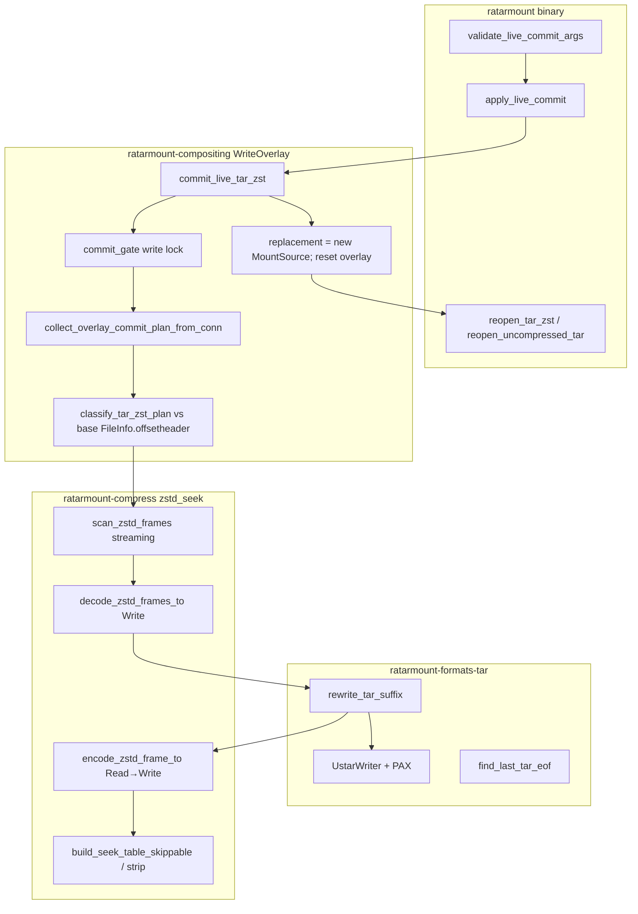
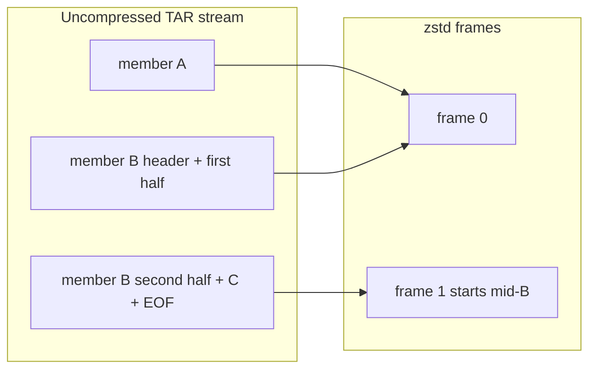

# Live overlay commit for multi-frame / seekable `.tar.zst`

| Field | Value |
|-------|--------|
| **Author** | TBD |
| **Date** | 2026-08-15 |
| **Status** | Implemented (v1 live path; PR 7 offline `--commit-overlay` is follow-on) |
| **Scope** | Live `--commit-overlay-interval` / `--commit-overlay-on-exit` for `.tar.zst` via last-frame rewrite |
| **Out of this train** | Efficient gzip splice; `tar --append -z`; concatenated `.tar.gz` visibility |

---

## Overview

ratarmount-rs already live-commits a write overlay into an **uncompressed** `.tar` (`WriteOverlay::commit_live_uncompressed_tar`: sibling copy, GNU `tar --delete`/`--append`, atomic replace, reopen `MountSource`, reset overlay). Compressed TAR is offline-only today (`commit_overlay_tar` materializes, runs GNU tar, `recompress_replace` for gzip/bzip2/xz). `live_commit_is_supported` rejects every compressed format, including zstd.

This design extends live interval / on-exit commit to **`.tar.zst`** by treating zstd frames as independent: **copy every prefix frame byte-for-byte and rewrite only the last frame** (or last N if the TAR end-of-archive marker is not fully contained there). Official seek-table footers (`0x8F92EAB1`) are rebuilt or dropped. Single-frame `tar | zstd` files fall back to a full last-frame rewrite (same *recompress* cost class as today's offline gzip TAR commit) and are documented as expensive: persist still copies the whole compressed file and reopen still reindexes the whole TAR. **Never refuse on size** — warn and spill.

GNU `tar --append` cannot operate on a last-frame blob that starts mid-TAR-member (`split -b 8M | zstd >>`). The design therefore adds an **in-tree POSIX ustar writer with PAX for long names**, not a GNU-tar subprocess, on the uncompressed last-frame suffix.

**Gzip is not in this train.** Empirically (2026-08-15): `tar --append -zf` exits 2 (`Cannot update compressed archives`); `cat extra.tar.gz >> concat.tar.gz` is invisible to GNU tar / Python tarfile / ratarmount default `ignore_zeros: false`. G3 inflate checkpoints are not deflate cut points.

---

## Background & Motivation

### Current live path (uncompressed TAR only)

| Piece | Location | Behavior |
|-------|----------|----------|
| CLI flags | `ratarmount/src/main.rs` (`--commit-overlay-on-exit`, `--commit-overlay-interval`) | Durable `-w` required; `:temp:` rejected |
| Startup gate | `overlay_commit::validate_live_commit_args` → `live_commit_is_supported` | Single file; uncompressed TAR only |
| Interval thread | `overlay_commit::spawn_interval_commits` → `apply_live_commit(..., reopen_and_reset=true)` | Promptless; logs success / nothing / error |
| On-exit | `overlay_commit::maybe_commit_on_exit` → `apply_live_commit(..., false)` | Persist only; no reopen/reset |
| Persist | `WriteOverlay::persist_uncompressed_tar_plan` | Sibling `NamedTempFile` in dest parent, GNU tar, `persist` |
| Live swap | `WriteOverlay::commit_live_uncompressed_tar` | Persist + `replacement` swap + `reset_overlay_dir` + `DELETE FROM files` under **one** `commit_gate` write lock |
| Reopen | `reopen_uncompressed_tar` | `SqliteIndexedTar::create_index` with `index_in_memory: true` |
| NFS invalidate | `ratarmount-nfs/src/reader.rs` `fi_is_overlay_tagged` | Overlay-tagged `FileInfo` (`userdata` `overlay:…`) is dropped after commit so the next READ re-looks up the new TAR base |

`WriteOverlay` already has the live-swap class we need (`replacement: RwLock<Option<Arc<dyn MountSource>>>`, `commit_gate`, overlay-tagged `FileInfo`). The missing piece is a persist body that understands zstd frames.

### Current offline compressed TAR

`commit_overlay_tar` in `ratarmount-compositing/src/write_overlay.rs` accepts `CompressionFormat::Gzip | Bzip2 | Xz` only. `CompressionFormat::Zstd` hits:

```text
Currently, commit-overlay supports ZIP, uncompressed TAR, and gzip/bzip2/xz compressed TAR
```

`recompress_replace` has no zstd arm. Offline `.tar.zst` is therefore **not** an escape hatch today.

### Why last-frame zstd works (and gzip does not)

Zstd frames are independently decompressible. This repo already maps them:

- `ratarmount-compress/src/zstd_seek.rs`: private `FrameInfo { compressed_offset, uncompressed_offset, compressed_size: Option<u64>, uncompressed_size: Option<u64> }`. Seek-table and multi-frame scan fill `Some`; the type still allows unknown. The **public** `ZstdFrameInfo` uses concrete `u64` sizes; `scan_zstd_frames` **errors** if a size cannot be determined.
- Open priority: seek table (`SEEKABLE_MAGIC = 0x8F92_EAB1`) → multi-frame scan (`ZSTD_findFrameCompressedSize`) → full decode
- `build_seek_table_skippable` is already public and emits a valid skippable footer (used by tests today; persist will use it in production)
- Producer recipes and `-i` notes live in `docs/zstd-random-access.md`

Appending to a multi-frame `.tar.zst` is: copy `bytes[0 .. last_frame.compressed_offset]`, emit a new last frame whose uncompressed payload is `(old_suffix_without_EOF || new_ustar_members || two_zero_blocks)`, optionally append a new seek table.

Gzip members are **not** independent in the same way. That path stays rejected.

### Pain points this solves

1. Operators mounting large **chunked / seekable** `.tar.zst` (the recommended producer shape) cannot live-commit overlay adds without unmount + full recompress.
2. Full **recompress** of a multi-GiB archive to add a few files is wasteful when only the last 8 MiB frame changed. Last-frame rewrite avoids prefix *encode*; it does **not** avoid prefix *copy* or reopen *reindex* (see Cost model).
3. `tar --append` on a last-frame blob is incorrect when the frame is a TAR *suffix*, not a standalone archive.

---

## Goals & Non-Goals

### Goals (v1 product)

1. `--commit-overlay-on-exit` and `--commit-overlay-interval` accept a **single host file** that is `.tar.zst` / `.tzst` / `.tar.zstd` (or zstd magic + ustar body), with durable `-w` (not `:temp:`).
2. **Append-only last-window path:** overlay-created names, and replace/delete of a name **only when every TAR version** of that name has `offsetheader` in the rewrite window. If **any** earlier version of the name lives before the window, reject (do not silently drop only the newest copy).
3. **Prefix frames are byte-identical** after commit (hash of `bytes[..rewrite_start]` unchanged).
4. **Seek table:** if the input had a footer, the output has a correct footer for the new last frame; if it did not, do not invent one. Never leave a stale footer.
5. **Single-frame fallback:** allowed for both interval and on-exit; full last-frame rewrite (= full recompress). **Never refuse on size.** Warn when last-frame uncompressed size exceeds 64 MiB; spill decoded/encoded suffix above 256 MiB (`DEFAULT_MEMORY_CAP`). Interval stays user-controlled.
6. After persist: **reopen → swap `replacement` → reset overlay** under one lock (same order as uncompressed TAR). If persist succeeds and reopen fails: **do not reset** the overlay; disable further interval ticks; log that a remount is required. NFS overlay-tag re-lookup keeps working after a successful swap. FUSE uses re-lookup / `has_file` / `WriteOverlay::open` fallback, not the NFS overlay-tag LRU.
7. `live_commit_is_supported` (or a sibling) accepts zstd-TAR **without** enabling gzip/bzip2/xz/ZIP.
8. Tests drive shipped functions; fixture bytes are generated then packed; `cmp` after commit; no independently hard-coded expected payload.

### Non-goals (v1)

| Item | Reason |
|------|--------|
| Gzip / bzip2 / xz live splice | Empirically not a last-member append; G3 checkpoints ≠ deflate cuts |
| Delete/replace when **any** version of the name has `offsetheader` before the rewrite window | Would require rewriting every frame from that member through EOF; v1 **rejects** the **entire** tick (pending appends are not persisted). Uncompressed GNU `tar --delete` removes every occurrence; dropping only the last-window copy would silently undelete an earlier version. |
| Offline `--commit-overlay` for `.tar.zst` | Follow-on (PR 7). Not required to ship live. Call out that it is **not** an escape hatch until then |
| GNU long-name (`L`/`K`) writer | PAX covers long names; parser already reads both |
| Sparse / xattr / hard-link commit | Overlay does not produce these; GNU tar `--append` xattrs are a residual today too |
| Rewriting last frame as many small frames | One new last frame is enough; preserves seekability of the prefix |
| Matching original zstd level / dict / checksums on the rewritten frame | Unrecoverable; use a fixed default level (3) |
| Live commit of **plain** `.zst` (single-file mount, not TAR) | Different product; reject |
| Union / multi-input live commit | Same restriction as today (`inputs.len() == 1`) |
| Changing FUSE/NFS `commit_gate` read-side policy | Accept existing race: lookups/reads are not gated (same as uncompressed TAR) |

---

## Key Decisions

| # | Decision | Rationale |
|---|----------|-----------|
| K1 | **v1 is append-only + last-window mutate of a name only when *every* version is in-window.** Walk must work on **both** stacks: default factory `FileVersionLayer` (first tick) **and** raw `SqliteIndexedTar` after swap. If `versions(path) > 1`, try `lookup("{path}.versions/{i}", 0)` first (layer); else `lookup(path, i)` (raw TAR). Collect `offsetheader` from **any** `UserData::Tar` in the vec, not `last()` (`FileVersionLayer::tag_file` pushes `Other("versionlayer:file")`). If **any** version has `offsetheader < rewrite_window_start`, hard-error the **entire** tick. | `FileVersionLayer::lookup` discards `file_version` on a plain path (`let _ = file_version; inner.lookup(&path, 0)`). Older copies are only `{path}.versions/{i}` (1 = oldest). `file_versions` defaults **on**. A test that wraps raw TAR without the layer passes while the CLI stack silent-undeletes. |
| K2 | **In-tree POSIX ustar writer + PAX for long names/links and size ≥ 8 GiB.** GNU long-name is follow-on. | Last frame may start mid-member; GNU `tar --append` cannot run on that blob. Overlay trees routinely exceed the 100-byte ustar name field. Test helpers `synthetic_ustar` / `build_pax_xattr_tar` already prove the format. |
| K3 | **Never call GNU tar on the zstd path.** `ensure_gnu_tar` stays uncompressed-TAR-only. | Avoids a hidden GNU-tar dependency and the mid-member footgun. |
| K4 | **Never refuse on size.** Allow interval and on-exit for single-frame and huge last frames. Warn if last-frame uncompressed > 64 MiB (startup + each tick). Spill decoded/encoded suffix above 256 MiB. Do not silently demote interval to on-exit-only. | Same recompress class as offline gzip commit. Interval is user-set (`0` default). A surprise “interval ignored” is worse than a loud warning. There is **no** `error "rewrite window exceeds cap"` branch. |
| K5 | **Seek table: rewrite if present, omit if absent, never leave stale.** If any frame `cSize`/`dSize` exceeds `u32::MAX` (seekable-format limit), **drop** the table and log. | `try_load_seek_table_from_reader` prefers a footer over a multi-frame scan. A stale last-entry size is a **silent wrong-read** (High). |
| K6 | **Locate TAR EOF as the last two consecutive 512-byte zero blocks at stream-aligned offsets in the decoded suffix.** If not fully contained, decode one more previous frame (no size refuse). | This repo’s `parse_tar_into_index` (`ignore_zeros: false`) breaks on the **first** 512-byte zero block (both `next`-block branches `break`). That is not the POSIX “two zero blocks” story. Write-side still uses the **last two-zero pair** so concatenated-TAR frames are not truncated. Stream alignment uses `uncompressed_offset`, not suffix index 0. |
| K7 | **Reopen must honor the original mount `OpenOptions` (especially `ignore_zeros` and `encoding`).** | Multi-frame `xargs tar -c \| zstd >>` requires `-i` to index past per-frame EOFs. Today's `reopen_uncompressed_tar` uses `OpenOptions::default()` — fix that when generalizing reopen. |
| K8 | **Public frame-map + encode APIs live in `ratarmount-compress`; ustar writer + suffix rewriter in `ratarmount-formats-tar`; `WriteOverlay` orchestrates.** Compositing gains a runtime dep on `ratarmount-formats-tar` (no cycle: tar → core/index/compress). | Matches crate ownership. Avoids stuffing TAR knowledge into compress or zstd knowledge into formats-tar. |
| K9 | **Streaming I/O everywhere in the persist path.** Frame scan does not slurp the compressed file. Decode/encode/splice/suffix-rewrite use `Read`/`Write` (tempfile spill), never `Vec<u8>` as the only API. | Today's `build_frame_map_from_reader` is `read_to_end` + `build_frame_map_from_bytes`. `find_frame_compressed_size` needs the **entire compressed frame** in the buffer (`measure_frame_slice` errors if `comp > src.len()`). A 2 GiB single-frame file (allowed by K4) cannot live as suffix + encoded frame + transform `Vec`s. |
| K10 | **Gzip stays explicitly rejected** in `live_commit_is_supported` with a message that names gzip. | Prevents a `format != None` refactor from silently enabling it. |
| K11 | **Success path is `persist → reopen → swap+reset`** (same as uncompressed). On reopen **failure**: do **not** reset the overlay; set `interval_disabled` (interval thread exits / skips further ticks); log that a **remount is required**. Overlay still serves the committed names; prefix members still match the new file (byte-identical). | Reset-before-reopen leaves minutes of “overlay gone, `replacement` still old” during `create_index_body` (ungated reads miss). Reset-without-swap serves last-window members from a **stale frame map**. Leaving the overlay + disabling ticks is the safer live-mount residual; a duplicate append is prevented by the disable flag, not by emptying the overlay. |
| K12 | **FUSE after commit is re-lookup + `has_file` + `WriteOverlay::open` fallback**, not the NFS overlay-tag LRU. Accept 30s `DIR_CACHE_TTL` stale readdir as the same residual as uncompressed live commit. Open `OverlayFd` handles survive persist (pread on unlinked inode or ENOENT). | `file_info_for_open` / `file_info_for_ino` always re-lookup when `overlay.is_some()`. `open` uses `ov.has_file` (false after reset) and falls through to `source.open`. `WriteOverlay::open` already falls back to `current_base()` on overlay `NotFound`. Live commit does not call `invalidate_dir_cache`. |

---

## Proposed Design

### High-level architecture



### Live interval sequence

```mermaid
sequenceDiagram
  participant T as interval thread
  participant OV as WriteOverlay
  participant Z as scan/decode/encode
  participant W as ustar suffix rewrite
  participant FS as sibling tmp + persist
  participant R as reopen zstd+TAR
  participant NFS as ReaderLru

  T->>OV: commit_live_tar_zst(archive, reopen)
  OV->>OV: commit_gate.write()
  OV->>OV: collect plan from overlay sqlite + walk
  alt plan empty
    OV-->>T: Ok(false)
  else plan has earlier-frame mutate
    OV-->>T: Err(append-only ...)
  else last-window / append
    OV->>Z: scan_zstd_frames(archive)
    Z-->>OV: frames + seek_table_span
    OV->>Z: decode last N until EOF contained (spill if >256MiB)
    Z->>W: suffix Read+Seek + stream_offset
    W->>W: last two-zero EOF; drop last-window deletes; append members → Write
    W-->>Z: new suffix file
    Z->>FS: copy prefix (Take); encode_zstd_frame_to; optional seek table
    FS->>FS: sync + persist over archive
    OV->>R: reopen(archive, original OpenOptions + index_in_memory)
    alt reopen Ok
      R-->>OV: Arc<dyn MountSource>
      OV->>OV: replacement=Some; reset_overlay_dir; DELETE FROM files
      NFS->>NFS: next READ: overlay: tag miss → lookup new TAR
    else reopen Err
      OV-->>T: Err; overlay kept; interval_disabled; remount required
    end
  end
```

### Frame / TAR geometry

Two producer shapes (already documented in `docs/zstd-random-access.md`):

1. **Complete-TAR frames** — `xargs -n 40 tar -c -I 'zstd' >> archive.tar.zst`. Each frame is a standalone TAR with its own two-zero EOF. Last-frame rewrite is “append into that mini-TAR.” Mount needs `-i` to see earlier frames.
2. **Split suffix frames** — `tar -c | split -b 8M --filter='zstd >> archive.tar.zst'`. Last frame often starts **mid-member**. The uncompressed last frame is a TAR suffix, not an archive. GNU tar cannot append to it.



Rewrite of frame 1: decode F1 → `[tail-of-B][C][zero][zero]` → keep `[tail-of-B][C]` as raw bytes → append new ustar members → new EOF → encode one zstd frame → concatenate `F0 || new_F1 || optional_seek_table`.

### Cost model (not “O(last frame)” end-to-end)

Last-frame rewrite avoids prefix **recompress**. An interval tick on a 20 GiB multi-frame archive with an 8 MiB last frame is still:

| Step | Cost |
|------|------|
| `scan_zstd_frames` | Footer-only if seek table; else walk frames (grow per-frame buffer until `find_frame_compressed_size`; no whole-file slurp) |
| Decode last N | O(uncompressed last-N); spill to tempfile above 256 MiB |
| Encode new last frame | O(uncompressed last-N + new members) |
| Persist prefix copy | **O(compressed prefix)** `io::copy` of `Take` — same as `persist_uncompressed_tar_plan` |
| Reopen | `open_seekable_zstd` + `create_index_body` **sequentially decompresses and parses the entire uncompressed TAR** into an in-memory index |

**Disk headroom:** sibling `NamedTempFile` needs ~1× compressed size free on the same filesystem (copy of prefix + new last frame + optional seek table). Document **2× compressed size** as the safe operator requirement (tmp + original until `persist` unlinks the old inode).

**README / docs residual (PR 5):** say “rewrites only the last zstd frame (does not recompress the prefix). Persist still copies the compressed file; remount still reindexes the whole TAR.” Do **not** promise “cheap” without that sentence. Optional follow-on (not v1): incremental in-memory index update.

K4 huge single-frame: full copy + full decode + full encode + full reindex while holding `commit_gate`. Warn; do not refuse.

### Algorithm: last-N window + EOF

**Never refuse on size.** The only hard errors here are “TAR EOF not found after including every frame” (truncated archive) and I/O / decode failures.

```
scan_zstd_frames(path) -> ZstdFrameMap { frames, seek_table }

n = 1
loop:
  if n > frames.len():
      error "TAR EOF not found (truncated?)"
  window_plain = sum(frames[len-n..].uncompressed_size)
  if window_plain > 64 MiB:
      warn (each tick; K4)
  # Decode to Cursor/tempfile — NEVER require a Vec of the whole suffix
  suffix = decode_zstd_frames_to(path, frames, from_idx=len-n, sink)
      # sink is NamedTempFile if window_plain > 256 MiB (DEFAULT_MEMORY_CAP)
      # else a Cursor<Vec<u8>> or a small NamedTempFile (either is Read+Seek)
  base = frames[len-n].uncompressed_offset
  eof = find_last_tar_eof(suffix, stream_offset = base)
  if eof is Some(end):
      window_start_comp = frames[len-n].compressed_offset
      rewrite_window_start_uncomp = base
      break
  n += 1

# Classify plan against rewrite_window_start_uncomp (all versions — K1)
# Then streaming suffix rewrite + encode + persist (no Vec-only hook)
```

`find_last_tar_eof` is specified below (stream-aligned last two-zero pair). Decode **one more** previous frame when that pair is not fully contained. Growing `n` can only make more members in-window (single-frame ⇒ window start 0 ⇒ every version is in-window and original-member delete becomes a full rewrite — allowed).

**`find_last_tar_eof(suffix, stream_offset)`**

TAR blocks are 512-aligned in the *uncompressed stream*, not necessarily at `suffix[0]`.

```
align = (512 - (stream_offset % 512)) % 512
last = None
for i in align, align+512, ... while i+1024 <= suffix.len():
    if suffix[i..i+1024] all zero:
        last = Some(i)
return last
```

Using the **last** pair (not the first) preserves concatenated-TAR frames that contain their own EOFs (shape 1). The first pair would truncate later members. This is a **write-side** rule. Do not cite the indexer as “stops at first pair”: `parse_tar_into_index` (`ignore_zeros: false`) breaks on the **first 512-byte zero block**; the next-block read does not change control flow (both branches `break`).

If the suffix starts mid-member, bytes before the first accepted header are **opaque prefix** and are copied raw (see PR 2 contract for the first-header rule).

**Spill, not refuse.** `DEFAULT_MEMORY_CAP` (256 MiB) is the **in-RAM** threshold, same class as `DecodedBody`. Above it, decoded suffix and encoded frame live in `NamedTempFile`. There is no `MAX_REWRITE_WINDOW` error.

**Give-up.** If EOF is not found after including all frames, fail: the archive has no TAR end marker (truncated). Do not invent an EOF in the middle of a member.

### Algorithm: plan classification (K1)

`OverlayCommitPlan` already has `deleted_paths` and `append_entries`. Replaces are delete+append (`collect_overlay_commit_plan_from_conn`). Classify **after** the last-N window is known. Empty overlay dirs are append-only (not in `deleted_paths`).

`lookup(path, 0)` is **newest only**. Factory wraps `FileVersionLayer` **before** `WriteOverlay` (`file_versions` defaults on). `FileVersionLayer::lookup` **discards** `file_version` on a plain path and always returns newest; older copies are `{path}.versions/{i}` (1 = oldest). `tag_file` **pushes** `UserData::Other("versionlayer:file")`, so `userdata.last()` is never `Tar`. After a successful swap, `current_base()` is a bare `SqliteIndexedTar`: `lookup(path, i)` works; `{path}.versions/{i}` does **not**.

Walk that works on **both** stacks (do not downcast):

```
fn tar_offsetheaders_in(fi: &FileInfo) -> impl Iterator<Item = u64>:
    # any UserData::Tar — NOT userdata.last()
    fi.userdata.iter().filter_map(|u| match u {
        UserData::Tar(t) => t.offsetheader,
        _ => None,
    })

fn lookup_version(base, path, i) -> Option<FileInfo>:
    # i is 1-based oldest-first, matching FileVersionLayer / SqliteIndex
    if base.versions(path) > 1:
        if let Some(fi) = base.lookup(&format!("{path}.versions/{i}"), 0):
            return Some(fi)             # FileVersionLayer (first tick)
    base.lookup(path, i)                # raw SqliteIndexedTar (post-swap) or nver==1

fn all_tar_offsetheaders(base, path) -> Vec<u64>:
    out = []
    nver = base.versions(path)
    if nver == 0:
        if let Some(fi) = base.lookup(path, 0):
            out.extend(tar_offsetheaders_in(&fi))
        return out
    for i in 1..=nver:
        if let Some(fi) = lookup_version(base, path, i):
            out.extend(tar_offsetheaders_in(&fi))
    # also newest at the plain path (covers nver==1 layer + untagged inner)
    if let Some(fi) = base.lookup(path, 0):
        out.extend(tar_offsetheaders_in(&fi))
    out.dedup()
    return out

ohs = all_tar_offsetheaders(overlay.current_base(), path)
if ohs is empty:
    cheap                               # overlay-only this session
else if any oh < rewrite_window_start_uncomp:
    reject path                         # includes “v2 in last frame, v1 in prefix”
else:
    last-window mutate: drop every in-window occurrence of this name in the suffix
```

If a looked-up `FileInfo` has `nver > 0` but **no** `UserData::Tar` at all (unexpected backend), reject rather than guess.

**Entire tick fails together.** If the user appends `new.txt` **and** `rm`s an earlier-frame member (or a name that still has a prefix-frame version), persist does not run. Pending appends stay in the overlay. Error text names the bad path **and** says the commit was skipped entirely:

```
error: live overlay commit for .tar.zst is append-only (and last-frame replace/delete);
       '/old/from/archive.txt' has a version in an earlier zstd frame
       (delete would undelete that copy). The whole commit was skipped
       (including pending appends). Undo the delete or omit
       --commit-overlay-interval / --commit-overlay-on-exit.
```

Interval thread logs this at `error` and **leaves the overlay intact**. Next tick fails the same way until they restore the name or drop live-commit flags. Do **not** commit appends and refuse deletes in v1.

**After a successful tick**, overlay reset means the just-appended names are now in `current_base()` (the replacement `SqliteIndexedTar` — **no** `FileVersionLayer`, same as today's uncompressed swap) with `offsetheader` in the last frame. A later edit of that name is last-window replace — cheap — **unless** an older version of the same name still exists in a prefix frame, in which case the next delete/replace is rejected.

### PR 2 contract: suffix rewrite + ustar writer (formats-tar)

This is the long pole. Ship these signatures in PR 2 so PR 4 does not invent a second API.

```rust
/// Stream-aligned last two-zero-block pair.
/// `stream_offset` is the uncompressed TAR offset of `suffix` byte 0
/// (`ZstdFrameInfo.uncompressed_offset` of the first decoded frame).
/// Returns the byte offset in `suffix` of the first of those two blocks.
pub fn find_last_tar_eof<R: Read + Seek>(
    suffix: &mut R,
    stream_offset: u64,
) -> io::Result<Option<u64>>;

pub struct RewriteTarSuffix<'a> {
    /// Normalized archive-relative paths to drop (last-window only; caller classified).
    pub deleted_paths: &'a HashSet<String>,
    /// New members to append after the kept prefix (overlay files / dirs / symlinks).
    pub append: &'a [UstarMember<'a>],
    /// Same as the mount (`OpenOptions.encoding`); used to decode ustar/PAX/GNU names
    /// when matching `deleted_paths`. Default `"utf-8"`.
    pub encoding: &'a str,
}

/// Copy kept last-window bytes, drop deleted names (with their PAX/`L`/`K` helpers),
/// append `append`, write two zero blocks. `suffix` is the decoded last-N window
/// (Cursor or tempfile). `out` is the new uncompressed last-frame body.
pub fn rewrite_tar_suffix<R, W>(
    suffix: &mut R,
    stream_offset: u64,
    opts: &RewriteTarSuffix<'_>,
    out: &mut W,
) -> io::Result<RewriteTarSuffixStats>
where
    R: Read + Seek,
    W: Write;
```

Do **not** ship a `Vec<u8>`-only `rewrite_tar_suffix`. Persist always uses `FileOnDisk` + `O_NOFOLLOW` for overlay file bodies (same confinement as `WriteOverlay::realpath` + `open_overlay_fd`).

#### `TarMemberCursor` (extract from the indexer; do not fork 400 lines)

`parse_tar_into_index` is coupled to batch inserts, dumpdir, nested-TAR detection, sparse maps, and xattrs. PR 2 extracts a **read-only** walker used by `rewrite_tar_suffix` (and later, optionally, by the indexer). Methods:

```rust
pub struct TarMemberCursor<R> { /* reader, pos, encoding, pax_global, pending x/L/K */ }

impl<R: Read + Seek> TarMemberCursor<R> {
    pub fn new(reader: R, start_pos: u64, stream_offset: u64, encoding: &str) -> Self;

    /// Next logical member, or None at last two-zero EOF / reader EOF.
    /// Pending typeflag `x` / `L` / `K` are consumed into the returned member
    /// (their raw byte spans are recorded so a drop can skip them too).
    pub fn next_member(&mut self) -> Result<Option<TarRawMember>>;
}

pub struct TarRawMember {
    /// Inclusive start of the first helper header (PAX `x` / GNU `L`/`K`) or the
    /// ustar header if none. Absolute in `suffix`.
    pub raw_start: u64,
    /// Exclusive end of padded body (next header / EOF).
    pub raw_end: u64,
    /// Logical path after PAX `path` / GNU long name / ustar name, decoded with
    /// `encoding`, then `normalize_archive_rel_path`.
    pub logical_path: String,
    /// Typeflag of the *file* header (`0`/`5`/`2`/…), not of the helper.
    pub typeflag: u8,
}
```

`next_member` applies pending `x` to the following file header, then clears pending. It does **not** insert index rows, detect nested TARs, or materialize sparse maps. Header payload sizes use `MAX_HEADER_PAYLOAD_BYTES` (16 MiB); do not `vec![0; claimed]`.

#### Global PAX `g`

Typeflag `g` has no file path. **Copy every `g` header+body raw** and keep applying its records to subsequent **copied** members’ logical-path resolution (same as the indexer). Never treat `g` as a deletable path. A `g` that sits immediately before a dropped member is still copied (global; it applies to later kept members too).

#### First valid header (mid-member suffix)

Mid-member payload can collide with a plausible checksum.

**Rule:** scan stream-aligned 512-byte slots from `align = (512 - (stream_offset % 512)) % 512`. Accept the **first** slot that (1) is not a zero block, (2) has `ustar` / `GNU  ` / `ustar\0` magic at +257, **and** (3) has a valid ustar checksum. Bytes before that slot are opaque prefix and are copied raw.

If **no** slot before `find_last_tar_eof` checksums, treat the entire suffix up to EOF as opaque prefix (copy raw, then append new members + new EOF). Last-window **delete** cannot drop a member in that case — classification already required every version of a deleted name to be in-window, so this is a hostile/corrupt suffix; fail `rewrite_tar_suffix` with “could not parse last-window TAR headers; cannot apply last-window delete” if `deleted_paths` is non-empty. Append-only (empty `deleted_paths`) still succeeds (opaque copy + append).

Do **not** skip a failed checksum and keep scanning after a later “lucky” header in the middle of a payload if an earlier aligned slot already looked like a header but failed checksum — only the first magic+checksum hit starts the walk. After the walk starts, checksum failures are errors (truncated/corrupt last window).

#### Encoding

`deleted_paths` are overlay walk strings (host paths, typically UTF-8). Suffix names must be decoded with the **same** `OpenOptions.encoding` as the mount (K7). Pass `encoding` into `TarMemberCursor`. Matching uses `normalize_archive_rel_path` on both sides.

#### Writer

Promote `synthetic_ustar` / `build_pax_xattr_tar` into `ratarmount-formats-tar/src/write.rs`.

```rust
pub struct UstarMember<'a> {
    pub path: &'a str,           // archive-relative; no leading '/'
    pub payload: UstarPayload<'a>,
    pub mode: u32,
    pub uid: u32,
    pub gid: u32,
    pub mtime: u64,
}

pub enum UstarPayload<'a> {
    /// Tests / tiny fixtures only. Persist must not use this for overlay files.
    File { bytes: &'a [u8] },
    /// Production persist: open with `O_NOFOLLOW` (caller passes already-confined path).
    FileOnDisk { path: &'a Path, size: u64 },
    Directory,
    Symlink { target: &'a str },
}

pub fn write_ustar_members<W: Write>(out: &mut W, members: &[UstarMember<'_>]) -> io::Result<()>;
pub fn write_tar_eof<W: Write>(out: &mut W) -> io::Result<()>; // 1024 zero bytes
```

**Header rules (v1)**

| Field | Policy |
|-------|--------|
| name | If `path` fits in 100 bytes: ustar name. Else PAX `path=` + ustar name = last 100 bytes of `path` (not a prefix). |
| directory | Typeflag `'5'`. Write the ustar name **with a trailing `/`** (GNU tar and `parse_tar_into_index` treat `typeflag == b'5' \|\| name.ends_with('/')`). |
| PAX header *name* | `PaxHeaders.0/` + truncated `path` so the **entire** PAX ustar name is ≤ 100 bytes. Truncate the path suffix, never the `PaxHeaders.0/` prefix. Example: `PaxHeaders.0/` is 13 bytes → at most 87 bytes of path. |
| linkpath | If `target` fits in 100 bytes: ustar linkname. Else PAX `linkpath=` + ustar linkname = last 100 bytes of target. |
| size | Octal 11 digits if `< 8 GiB`; else PAX `size=` and ustar size 0 (POSIX.1-2001). |
| typeflag | `'0'` file, `'5'` directory, `'2'` symlink. |
| magic | `ustar\0` + version `00` (POSIX). |
| checksum | Classic `sum` with 8 spaces in the checksum field; store `"{:06o}\\0 "`. |
| uid/gid/mtime/mode | From overlay `symlink_metadata`. |
| Overlay file body | `FileOnDisk` only. Caller (`WriteOverlay`) opens via `realpath` + `O_NOFOLLOW` (or passes the confined host path and the writer opens `O_NOFOLLOW`). Never follow host symlinks out of `-w`. |

**Not in v1 writer:** GNU `L`/`K`, sparse `S`, xattrs, hard links.

Writer unit tests must round-trip through `SqliteIndexedTar::open_from_reader` (the real parser), not a second toy reader.

### Public zstd APIs (compress)

Private `FrameInfo` stays private (`compressed_size` / `uncompressed_size` are `Option<u64>`). Public `ZstdFrameInfo` is **not** a copy-paste of that struct: every size is a concrete `u64`. `scan_zstd_frames` **errors** if a size cannot be determined. Keep `SeekableZstd` internals unchanged.

```rust
#[derive(Clone, Debug)]
pub struct ZstdFrameInfo {
    pub compressed_offset: u64,
    pub uncompressed_offset: u64,
    pub compressed_size: u64,      // required; scan fails otherwise
    pub uncompressed_size: u64,    // required; scan fails otherwise
}

#[derive(Clone, Debug)]
pub struct ZstdFrameMap {
    pub frames: Vec<ZstdFrameInfo>,
    /// Byte range of the skippable seek-table frame if present `[start, file_len)`.
    pub seek_table: Option<std::ops::Range<u64>>,
}

pub fn scan_zstd_frames<R: Read + Seek>(reader: &mut R) -> Result<ZstdFrameMap>;
pub fn scan_zstd_frames_path(path: &Path) -> Result<ZstdFrameMap>;

/// Decode frames `[from_idx..]` into `out` (Cursor, tempfile, …). Last-N only.
pub fn decode_zstd_frames_to<R, W>(
    reader: &mut R,
    map: &ZstdFrameMap,
    from_idx: usize,
    out: &mut W,
) -> Result<u64>
where
    R: Read + Seek,
    W: Write;

/// Streaming encode. Returns `(compressed_len, plain_len)`.
pub fn encode_zstd_frame_to<R, W>(src: R, dst: &mut W, level: i32) -> Result<(u64, u64)>
where
    R: Read,
    W: Write;

// Convenience for tests / tiny frames only — not the persist path:
pub fn encode_zstd_frame(data: &[u8], level: i32) -> Result<Vec<u8>>;

// already public:
// pub fn build_seek_table_skippable(frames: &[(u32, u32)]) -> Vec<u8>;
```

PR 3 splice is TAR-agnostic and **streaming** (no `Vec` transform hook):

```rust
/// Copy compressed prefix `[0, frames[from_idx].compressed_offset)`,
/// decode frames `[from_idx..]`, run `transform`, encode one new last frame,
/// write optional rebuilt seek table. `transform` reads the decoded suffix
/// and writes the new uncompressed last-frame body.
pub fn splice_zstd_last_frames<R, W, F>(
    src: &mut R,
    map: &ZstdFrameMap,
    from_idx: usize,
    transform: F,
    dst: &mut W,
) -> Result<SpliceStats>
where
    R: Read + Seek,
    W: Write,
    F: FnOnce(&mut dyn SeekRead, u64 /* stream_offset */, &mut dyn Write) -> io::Result<()>;

/// Sibling NamedTempFile in `path.parent()`, splice, sync, persist.
pub fn splice_zstd_last_frames_replace<F>(
    path: &Path,
    from_idx: usize,
    transform: F,
) -> Result<SpliceStats>
where
    F: FnOnce(&mut dyn SeekRead, u64, &mut dyn Write) -> io::Result<()>;
```

`SeekRead` is already `Read + Seek + Send` (`ratarmount-compress/src/seekable_body.rs`). A `&mut dyn Read` cannot be passed to `rewrite_tar_suffix` / `find_last_tar_eof` / `TarMemberCursor` (`Read + Seek`). Splice **materializes last-N to a `NamedTempFile` (or `Cursor` if small)** and passes `&mut dyn SeekRead` so PR 4 does **not** copy the suffix again. `from_idx` is chosen by the **caller** (PR 4 last-N loop + `find_last_tar_eof`). Compress does **not** depend on `ratarmount-formats-tar`.

**Streaming scan (K9).** Prefer `try_load_seek_table_from_reader` (footer-only; already excludes the skippable table from `frames`). Else walk:

1. `pos = 0`.
2. Read 8 bytes. Skippable magic `0x184D2A50..=0x184D2A5F` → skip `8 + u32le size` (no uncompressed bytes).
3. Zstd magic → grow a buffer from `pos` (start 256 KiB, double, **no 64 MiB cap**) until `zstd_safe::find_frame_compressed_size` succeeds **and** `comp <= buf.len()`. Record `compressed_size = comp`. Uncompressed size from `get_frame_content_size`, or `Decoder::single_frame()` on the **exact** `buf[..comp]` slice (same as `measure_frame_slice` — never a live `File` as the decoder source). `seek` to `pos + comp`; discard buffer.
4. **Do not** use a counting `Read` + `Decoder::single_frame()` on the file to obtain `compressed_size`. The Rust `zstd` decoder fills an input buffer and will pull **past** the frame end; `counted_comp` includes those extra bytes and the next frame’s `compressed_offset` is wrong. Persist then `Take`s a truncated/shifted prefix.
5. Stop at EOF or non-magic. If a seek table occupies the tail, set `seek_table` and do not treat it as a data frame.

One compressed frame in RAM is allowed by K4 (never refuse on size). Scan still must **not** slurp the *whole multi-frame file* into one `Vec`.

Offsets-matching `export_zstd_blocks` on a tiny file is **not** proof of no-slurp. PR 1 must include a **two-frame** fixture where **frame 0 is larger than 64 MiB compressed** and frame 1’s scanned `compressed_offset` equals the real start of frame 1. Mock `Read+Seek` still records `max(len)` of any single `read` and **forbids** `read_to_end` of the whole file.

**Seek-table rebuild.** Prefix entries keep their original `(cSize, dSize)` from the map. Last `n` entries are replaced by **one** entry `(new_comp as u32, new_plain as u32)`. If any value exceeds `u32::MAX`, omit the footer and `log::warn`. Persist still produces a valid multi-frame file.

**Encode level.** `3` (zstd default). Do not try to parse the original frame's compression parameters.

**Skippable frames between data frames** live inside the prefix byte copy (`[0 .. window_start_comp]`), so they are preserved automatically. Skippable frames *after* the last data frame and *before* the old seek table are dropped with the old last frame / old table — acceptable.

### Persist / atomic replace

Mirror `persist_uncompressed_tar_plan`:

- `NamedTempFile::new_in(archive.parent())` so `persist` is the same-filesystem rename.
- Write prefix by `io::copy` of a `Take` on the original `File` (do not slurp prefix).
- Decode last-N and encode the new frame through **tempfile / `io::copy`**, never `write_all(&vec)` of a multi-hundred-MiB buffer. `encode_zstd_frame_to` writes directly into the sibling tmp (or into an intermediate tempfile if the encoder needs a rewind — prefer direct write so we only need one extra file).
- Write optional seek table (known after encode returns `(comp_len, plain_len)`).
- `sync_all` + `persist(archive)`.

On failure **before** `persist`, the original inode is untouched (same as uncompressed TAR).

**After successful `persist` (K11):**

```
match reopen(archive):
  Ok(src) =>
      replacement = Some(src)
      reset_overlay_dir + DELETE FROM files
      Ok(true)
  Err(e)  =>
      # overlay NOT reset — still serves committed names; prefix matches new file
      set interval_disabled
      Err("persist succeeded; reopen failed (remount required): {e}")
```

On-exit (`commit_atomic` / `reopen_and_reset=false`) is persist-only and does not reopen or reset (unchanged). Tests stub reopen `Err` and assert overlay files are **still present** and the second tick is skipped via `interval_disabled`, not via `Ok(false)` from an empty walk.

### `live_commit_is_supported` extension

Today (`write_overlay.rs`):

```rust
if is_zip_archive(archive)? { return Err(... ZIP ...); }
if format != CompressionFormat::None { return Err(... got {format:?} ...); }
if !is_uncompressed_tar(archive)? { return Err(...); }
```

New logic:

```
if zip → reject (unchanged)
match detect_compression(archive):
  None → require is_uncompressed_tar (unchanged)
  Zstd → require looks_like_tar_zst(archive)
  Gzip | Bzip2 | Xz → reject "live overlay commit supports uncompressed TAR and .tar.zst only (got {format:?}; gzip/bzip2/xz stay offline --commit-overlay)"
  other → reject similarly
```

`looks_like_tar_zst`:

1. Extension `.tar.zst` / `.tzst` / `.tar.zstd` only (`name_suggests_compressed_tar` already lists these). **Not** `.taz` — in this repo `.taz` is grouped with `.tar.z` (compress/gzip-era). Magic-first `detect_compression` still sends a gzip `.taz` to the Gzip reject arm; listing `.taz` as a zstd live-commit extension is still wrong.
2. Else decode the first **data** frame (skip skippable) and `body_looks_like_tar` (`ratarmount-compress/src/seekable_body.rs`).
3. Plain `.zst` that is not a TAR body → reject (“plain .zst is not a TAR; live commit not supported”).

Startup warning (K4): if zstd and (`frames.len() == 1` or last-frame uncompressed > 64 MiB), `eprintln!` + `log::warn` once from `validate_live_commit_args`.

### Reopen after swap

Replace the hard-coded `reopen_uncompressed_tar` in `ratarmount/src/overlay_commit.rs` with a dispatcher that receives the mount `OpenOptions`:

```rust
fn reopen_live_archive(archive: &Path, opts: &OpenOptions) -> Result<Arc<dyn MountSource>, String> {
    let mut o = opts.clone();
    o.index_in_memory = true; // interval swap must not fight the on-disk index
    match detect_compression(archive) {
        Ok(CompressionFormat::None) => SqliteIndexedTar::create_index(...),
        Ok(CompressionFormat::Zstd) => {
            let threads = o.threads_for("zstd");
            let body = open_seekable_zstd_with_threads(archive, threads)?;
            SqliteIndexedTar::create_index_body(archive, body, None, &o, VERSION)
        }
        other => Err(...),
    }
}
```

**Do not import `zstdblocks` on interval reopen.** The compressed offsets changed. A warm `zstdblocks` side table from *before* persist is stale. `create_index_body` + a fresh `scan`/`seek table` is correct. On the **next process** start, `check_tarstats_matches_archive` already invalidates the sidecar (size/mtime changed) — same as any in-place archive replace. Do not write `zstdblocks` from the interval thread.

`apply_live_commit` today branches on `reopen_and_reset`. Generalize to `commit_live` that picks uncompressed vs zstd persist inside `WriteOverlay` (one lock, one plan). Suggested API:

```rust
impl WriteOverlay {
    pub fn commit_live(
        &self,
        archive: &Path,
        reopen: impl FnOnce(&Path) -> Result<Arc<dyn MountSource>>,
    ) -> Result<bool> { /* detect + persist_* + swap + reset */ }

    pub fn commit_atomic(&self, archive: &Path) -> Result<bool> { /* persist only */ }
}
```

Keep the old `commit_live_uncompressed_tar` / `commit_uncompressed_tar_atomic` as thin wrappers so NFS tests and compositing tests compile; have them call the dispatcher (no deprecation churn required if we update call sites in the same PR).

`spawn_interval_commits` today does **not** carry `OpenOptions`. It must: pass the real mount `ignore_zeros`, `encoding`, and `threads_for("zstd")` into reopen (K7). Today's `reopen_uncompressed_tar` uses `OpenOptions { index_in_memory: true, ..Default }` (`ignore_zeros: false`, `encoding: "utf-8"`).

Do **not** go through `factory::open_zstd` (would import stale `zstdblocks`).

### NFS after commit

No protocol change. Matches the code:

- Overlay files get `UserData::Other("overlay:{path}")` in `WriteOverlay::overlay_file_info`.
- `ReaderLru::get_or_open` evicts `fi_is_overlay_tagged` slots (`ratarmount-nfs/src/reader.rs`).
- After reset, lookup hits `current_base()` (replacement `SqliteIndexedTar` over the new zstd `ContentBackend::Body`).
- PR 6: sibling of `overlay_commit_live_then_nfs_read_readdir` that packs a **multi-frame** `.tar.zst`. Same assertions: readdir contains the committed name; READ bytes `cmp` the generated payload.

### FUSE after commit (not the NFS path)

There is **no** overlay-tag reader LRU on FUSE. Do not document “FUSE uses the same overlay-tag / replacement path.”

Actual mechanism (`ratarmount-fuse/src/lib.rs`):

| Hook | Behavior |
|------|----------|
| `file_info_for_open` / `file_info_for_ino` | When `overlay.is_some()`, **always re-lookup** `source.lookup(path, 0)` so create/write sizes are visible. |
| `open` | If `write \|\| ov.has_file(&path)` → `open_overlay_fd`. After reset `has_file` is false → fall through to `source.open`. |
| `WriteOverlay::open` | Overlay-tagged `FileInfo` + host `NotFound` already falls back to `current_base().lookup` + `open` (“Live commit wiped the overlay file”). |
| `list_mode_cached` | 30s `DIR_CACHE_TTL`. Live commit does **not** call `invalidate_dir_cache` (that method lives on the FUSE type, not `WriteOverlay`). **v1 residual:** stale readdir for up to 30s — same as uncompressed TAR live commit. Do not add a generation counter in this train. |
| Open `OverlayFd` | Survives persist. `pread` on the unlinked overlay inode still sees old bytes until the handle is closed; a new `open` uses the base. Accept (same as uncompressed). |

PR 5 `commit_overlay_live.rs` tar.zst case: on-exit SIGTERM (NFS or FUSE, matching the existing uncompressed test) plus `cmp` of generated bytes.

### CLI copy

Update help strings that say “uncompressed TAR only”:

- `main.rs` `--commit-overlay-on-exit` / `--commit-overlay-interval`
- `validate_live_commit_args` error text (`require a single uncompressed TAR` → `require a single uncompressed TAR or .tar.zst`)

Gzip must still fail validation with an explicit message that **names gzip**. Existing test `live_commit_rejects_gzip_and_zip` plus a `.tar.zst` accept test. When the message grows “and `.tar.zst`”, assert with `contains("gzip")` / `contains("uncompressed")` — do not require the exact old string only.

---

## API / Interface Changes

### `ratarmount-compress`

| Symbol | Change |
|--------|--------|
| `ZstdFrameInfo`, `ZstdFrameMap` | **New**, public (concrete `u64` sizes; not a copy of private `FrameInfo`) |
| `scan_zstd_frames`, `scan_zstd_frames_path` | **New** (streaming; errors if a size is unknown) |
| `decode_zstd_frames_to`, `encode_zstd_frame_to` | **New** (`Read`/`Write`; persist path) |
| `encode_zstd_frame(&[u8]) -> Vec<u8>` | **New**, tests / tiny frames only |
| `splice_zstd_last_frames`, `splice_zstd_last_frames_replace` | **New** in PR 3 (`FnOnce(&mut dyn SeekRead, u64, &mut dyn Write)`) |
| `build_seek_table_skippable` | Unchanged signature; used in production persist, not tests only |
| `SeekableZstd` | Unchanged open priority |

### `ratarmount-formats-tar`

| Symbol | Change |
|--------|--------|
| `write.rs` module | **New** |
| `UstarMember`, `UstarPayload`, `write_ustar_members`, `write_tar_eof` | **New** |
| `find_last_tar_eof`, `rewrite_tar_suffix`, `RewriteTarSuffix` | **New** (`Read+Seek` → `Write`) |
| `TarMemberCursor`, `TarRawMember` | **New** read-only walker |
| `SqliteIndexedTar` | Unchanged |

### `ratarmount-compositing`

| Symbol | Change |
|--------|--------|
| `live_commit_is_supported` | Accept zstd-TAR; still reject gzip/zip |
| `WriteOverlay::commit_live` / `commit_atomic` | **New** dispatcher |
| `WriteOverlay::commit_live_uncompressed_tar` | Calls dispatcher (behavior unchanged for `.tar`) |
| `WriteOverlay::commit_live_tar_zst` | **New** (or private persist helper) |
| Cargo.toml | Runtime dep on `ratarmount-formats-tar` |

`OverlayCommitPlan` stays crate-private. Classification is inside persist.

### `ratarmount` binary

| Symbol | Change |
|--------|--------|
| `apply_live_commit` | Dispatch; pass `OpenOptions` into reopen |
| `validate_live_commit_args` | Accept `.tar.zst`; warn on large last frame |
| `spawn_interval_commits` | **Must** carry the real mount `OpenOptions` (today it does not) |
| clap help | Text only |

No new flags.

---

## Data Model Changes

None in SQLite schemas.

- Overlay DB (`files` table) unchanged.
- TAR index rebuilt in memory on each successful interval tick (`index_in_memory: true`) — **full sequential decode+parse**, not an incremental patch of last-frame members.
- On-disk sidecar index + `zstdblocks` become **stale by tarstats** (size/mtime). Next cold open rebuilds. Do not rewrite `zstdblocks` from the commit thread.

No migration.

---

## Alternatives Considered

### A. GNU `tar --append` on a decompressed last frame

**Idea:** Decode last frame to a temp `.tar`, run GNU tar, recompress.

**Rejected.** Last frame is often a suffix (`split -b 8M`). GNU tar will either refuse or parse from offset 0 as a new archive and corrupt the mid-member tail. Even for complete-TAR frames, we would still need an in-tree path for shape 2. Adding GNU tar as a requirement for zstd also hurts the “no extra tools” story that the ustar writer enables.

### B. Full decompress → GNU tar → full zstd (offline path, used live)

**Idea:** Same as today's gzip offline commit.

**Rejected as the v1 live path.** Destroys multi-frame / seek-table geometry (result is one giant frame unless we re-split). Cost is O(entire archive) every interval tick. Acceptable only as the **documented single-frame fallback**, which is exactly “last frame = whole file.”

### C. Rewrite from the frame that contains a deleted member through EOF

**Idea:** If the user deletes `old.txt` in frame 2 of 10, copy frames 0–1, decode 2..end, drop the member, recompress 2..end as one or many frames.

**Deferred.** Correct, and the right offline escape hatch (PR 7). For v1 live it turns a cheap append into an unbounded suffix rewrite when someone `rm`s an old file. Prefer a hard error so interval ticks stay predictable.

### D. `cat new_members.tar.zst >> archive.tar.zst`

**Idea:** Encode overlay members as their own frame and concatenate.

**Rejected as the only mechanism.** Works for *new* names if the reader uses `-i` (each frame is a complete TAR with its own EOF). Fails for last-window replace (old member still visible; newest-wins depends on FileVersionLayer / last-offsetheader). Also fails without `-i` (first EOF wins — empirically the gzip concat lesson). We still use **one** rewritten last frame so default `ignore_zeros: false` mounts see the new members (they sit *before* the final EOF).

### E. On-exit-only for single-frame; interval refused

**Idea:** Avoid surprise multi-minute interval ticks.

**Rejected (K4).** Interval is explicit and default-off. Warning is enough. Refusing interval only for single-frame would make “works on my 8 MiB multi-frame fixture, fails on the user's `zstd -o` file” look like a format bug.

---

## Security & Privacy Considerations

| Threat | Severity | Mitigation |
|--------|----------|------------|
| Overlay path escape during member read for commit | Medium | Existing `ensure_under_root` / `O_NOFOLLOW`; persist must open overlay files the same way (`realpath` + `O_NOFOLLOW`), never follow host symlinks out of `-w` |
| Hostile last-frame PAX size (huge `size` field) | Medium | Reuse `MAX_HEADER_PAYLOAD_BYTES` (16 MiB) when *parsing* the suffix; do not `vec![0; claimed]` |
| Hostile / truncated zstd last frame | Low | Decode errors abort persist; original inode untouched |
| Stale seek table → wrong file bytes served | **High** | Always strip old footer; write new or none (K5). Tests must remount via `open_seekable_zstd` (seek-table priority) and `cmp` |
| TOCTOU on archive path during persist | Low | Same as uncompressed: copy/rewrite to sibling tmp, `persist` over the path. Concurrent writers to the archive file itself are out of scope (single process owns the mount) |
| Password / encrypted zstd | n/a | zstd frames are not 7z-encrypted; no new secret handling |
| Resource exhaustion (interval on huge single-frame) | Medium | Warning at 64 MiB last-frame; tempfile spill above 256 MiB; `commit_gate` write lock blocks overlay writes for the duration (same as a long GNU tar on a huge `.tar`) |

No new network surface. No auth changes.

---

## Observability

| Event | Level | Message shape |
|-------|--------|----------------|
| Interval success | `info` | `interval overlay commit wrote {path} (zstd last {n} frame(s), last_plain={plain} B last_comp={comp} B prefix_copy={copy} B reindex={secs}s)` |
| Nothing to do | `debug` | unchanged |
| Earlier-frame mutate | `error` | path + “whole commit skipped including pending appends”; overlay kept |
| Single-frame / large window | `warn` (startup + each tick) | `live .tar.zst commit will rewrite {bytes} uncompressed (single-frame or large last frame); persist still copies the compressed file` |
| Seek table dropped (u32 overflow) | `warn` | `dropping zstd seek table: frame size exceeds u32` |
| Persist ok, reopen failed | `error` | `persist succeeded; overlay kept; reopen failed (remount required): {e}` (further ticks disabled) |
| Persist / other failure | `error` | existing `interval overlay commit failed: {e}` |
| On-exit | stderr `committed write overlay into …` (existing) |

No new metrics subsystem. Optional later: tick duration histogram.

---

## Rollout Plan

1. Land PRs 1–3 as library-only (no CLI change). Safe to merge independently; no user-visible behavior.
2. Land PR 4 (overlay persist). Still no CLI; compositing tests cover the cheap path.
3. Land PR 5 (CLI + docs). Feature is on when users pass the existing flags and a `.tar.zst`. **No feature flag** — same as uncompressed live commit.
4. Land PR 6 (NFS test) **in parallel with PR 5** (PR 6 only needs PR 4).
5. Rollback: revert PR 5 to restore “uncompressed only” at the CLI gate; library PRs can stay.

**Staged risk:** first release documents “append-only; last-frame rewrite (no prefix recompress); persist still copies the compressed file and remount reindexes; single-frame is full recompress.” Do not advertise “cheap” or “any overlay mutation.”

**Docs in the CLI PR** (absolute HTTPS links, per project rules):

- [README.md](https://github.com/hilather/ratarmount-rs/blob/main/README.md) — cheat sheet line 121 and Features table
- [docs/mount-options-parity.md](https://github.com/hilather/ratarmount-rs/blob/main/docs/mount-options-parity.md) — on-exit / interval rows
- [docs/nfs-export.md](https://github.com/hilather/ratarmount-rs/blob/main/docs/nfs-export.md) — live commit paragraphs
- [docs/zstd-random-access.md](https://github.com/hilather/ratarmount-rs/blob/main/docs/zstd-random-access.md) — new “Live overlay commit” section (producer recipes stay valid; note last-frame rewrite)
- [docs/parity-todo.md](https://github.com/hilather/ratarmount-rs/blob/main/docs/parity-todo.md) — live commit residual
- [AGENTS.md](https://github.com/hilather/ratarmount-rs/blob/main/AGENTS.md) — regression catalog row

### Effort

~11–15 engineering days for PRs 1–6. The in-tree writer + `TarMemberCursor` is the long pole (PR 2: extra day of slack). PR 3’s splice shape is the one PR 4 ships (streaming, TAR-agnostic). PR 6 overlaps PR 5.

---

## Risks

| Risk | Severity | Mitigation |
|------|----------|------------|
| Stale seek table after rewrite | **High** | K5; test opens via seek-table priority and reads a member that lived in the prefix **and** the new member |
| Mid-member last frame treated as a TAR | **High** | Never GNU-tar the blob; opaque prefix copy; dedicated fixture (`split -b` style) |
| First-EOF vs last-EOF (concatenated TAR frames) | **High** | Always last two-zero pair; fixture of two complete-TAR frames + append |
| Delete of last-window version undeletes prefix version | **High** | K1 walk on **FileVersionLayer** (`.versions/{i}`) and raw TAR; collect any `UserData::Tar`; compositing test wraps `FileVersionLayer::new(tar)` with the same name in both frames |
| `ignore_zeros` lost on reopen | Medium | K7; carry real `OpenOptions`; complete-TAR fixture remounted **with** `-i` (sees prefix + new) and **without** `-i` (sees last-frame members including new; does not invent prefix names default parsing never saw) |
| `build_frame_map_from_reader` slurp used by mistake | Medium | New streaming `scan_zstd_frames`; mock `Read+Seek` forbids whole-file `read_to_end` |
| Persist then reopen fail → duplicate next tick / stale map | Medium | K11: `persist → reopen → swap+reset` on success; reopen-fail keeps overlay and sets `interval_disabled` (remount required) |
| Seek table `u32` overflow | Low | Drop table + warn; prefix + new member reads still work |
| Interval tick holds `commit_gate` for a huge single-frame encode | Medium | Warn; tempfile; document 2× compressed disk headroom |
| FUSE 30s stale readdir / live `OverlayFd` | Low | Same residual as uncompressed live commit; document |
| Overlay-only replace after first tick classified as earlier-frame | Low | After reset the member is in the last frame **unless** an older version remains in a prefix frame (then reject — K1) |
| Compositing → formats-tar dep surprises crate graph | Low | No cycle; formats-tar already a compositing *dev*-dep |

---

## Test plan (cross-cutting)

Rules (project-wide): drive **shipped** functions; generate payload bytes; pack; `cmp`; skip only if a tool is missing **and** a pure unit test covers the core logic. Name regressions with `Regression:`.

| Case | Layer | How |
|------|--------|-----|
| Multi-frame append | compress + compositing | Two frames, overlay file with unique `format!("p-{}\n", pid)`, `commit_live`, decode all, `cmp` |
| Single-frame fallback | compress + compositing | One frame; same `cmp`; prefix empty |
| Seek-table rewrite | compress | Input with `build_seek_table_skippable`; after rewrite `seek_table.is_some()`; prefix + new `cmp`; stale-footer negative documents the bug class |
| Seek-table `u32` overflow | compress | Fixture whose new last-frame size exceeds `u32::MAX` **or** a unit test that injects the overflow branch; footer dropped; prefix + new reads still work |
| Last frame starts mid-member | formats-tar + compress | Split uncompressed TAR inside a payload; zstd each half; append; `cmp` split member + new file |
| Last-window replace | compositing | Append `tick.bin` tick 1; reset; change `tick.bin` tick 2; one name; second payload |
| Earlier-frame delete rejected | compositing | Seed member in frame 0; `unlink`; `Err`; archive bytes unchanged |
| **All-versions delete-undelete** | compositing | **Regression:** wrap `FileVersionLayer::new(tar)` (default factory order); same name in frame 0 **and** last frame; `unlink`; `commit_live` is `Err`; archive bytes unchanged. Also run the same fixture on raw `SqliteIndexedTar` (post-swap stack). |
| Second tick empty overlay | compositing | `Ok(false)`; no duplicate names |
| Persist + reopen-fail | compositing | Stub reopen `Err` after persist; overlay files **still present**; second tick skipped via `interval_disabled`, not `Ok(false)` from an empty walk |
| **K7 `-i` remount** | compositing / PR 5 | **Regression:** two complete-TAR frames; mount with `ignore_zeros`; interval append; reopen with `-i` sees prefix-frame names **and** new member (`cmp`) |
| **K7 without `-i`** | compositing / PR 5 | Same fixture remounted **without** `-i`: new members (before final EOF) are visible; prefix-frame names that default parsing never saw stay invisible (do not “lose” them — they were never in the default index) |
| Live NFS read after interval | `ratarmount-nfs` | Sibling of `overlay_commit_live_then_nfs_read_readdir` with multi-frame `.tar.zst` |
| CLI gzip still rejected | compositing + bin | `live_commit_rejects_gzip_and_zip` **and** bin interval-on-`.tar.gz` exit 2. Message will mention `.tar.zst`; assert `contains("gzip")` / `contains("uncompressed")`, **not** the exact old string only |
| CLI `.tar.zst` accepted | bin / `commit_overlay_live.rs` | On-exit SIGTERM path like the uncompressed test |
| Writer / cursor | formats-tar | See PR 2 test plan (mid-member `stream_offset`, two EOF pairs, PAX long path, PAX `size=` ≥ 8 GiB field / small payload, symlink, empty dir + trailing `/`, last-window drop of a PAX-named member including its `x` helper) |
| Streaming scan no-slurp + large first frame | compress | **Two-frame** fixture: frame 0 **> 64 MiB compressed**; scanned `frames[1].compressed_offset` equals the real start of frame 1. Mock `Read+Seek` forbids whole-file `read_to_end`. Offsets-matching `export_zstd_blocks` on a tiny file is **not** sufficient |

---

## Open Questions

Resolved in this draft (see Key Decisions). Remaining, non-blocking:

1. **Should PR 7 (offline `--commit-overlay` for `.tar.zst`, including rewrite-from-affected-frame) ship in the same release train?** Recommendation: **no** — keep v1 live-only so the last-frame path lands. Offline zstd is the delete-originals escape hatch; until it exists, the error message must not point at `--commit-overlay` as if it worked for zstd.
2. **Encode level 3 vs 1 for interval speed?** Recommendation: **3**. Interval is not a tight loop by default; level 1 is a one-line knob later if ticks are slow.
3. **Should `commit_live_uncompressed_tar` stay as the public name?** Recommendation: add `commit_live` and keep the old name as a wrapper to avoid a noisy rename in NFS tests.

Decided in revision: never refuse on size (K4); K1 walk on FileVersionLayer (`.versions/{i}`) and raw TAR; splice hook is `SeekRead`; persist → reopen → swap+reset (reopen-fail keeps overlay + `interval_disabled`); scan grows until `find_frame_compressed_size` (no counting decoder); FUSE 30s `DIR_CACHE_TTL` residual (K12); PR 3 TAR-agnostic / PR 4 owns last-N; PR 6 ∥ PR 5.

---

## References

- Live uncompressed persist / swap: [`ratarmount-compositing/src/write_overlay.rs`](https://github.com/hilather/ratarmount-rs/blob/main/ratarmount-compositing/src/write_overlay.rs) (`commit_live_uncompressed_tar`, `persist_uncompressed_tar_plan`, `live_commit_is_supported`, `commit_overlay_tar`, `recompress_replace`)
- Interval / on-exit / reopen: [`ratarmount/src/overlay_commit.rs`](https://github.com/hilather/ratarmount-rs/blob/main/ratarmount/src/overlay_commit.rs)
- CLI flags: [`ratarmount/src/main.rs`](https://github.com/hilather/ratarmount-rs/blob/main/ratarmount/src/main.rs)
- Zstd frames / seek table: [`ratarmount-compress/src/zstd_seek.rs`](https://github.com/hilather/ratarmount-rs/blob/main/ratarmount-compress/src/zstd_seek.rs) (`FrameInfo`, `try_load_seek_table_from_reader`, `build_frame_map_from_bytes`, `build_seek_table_skippable`, `SEEKABLE_MAGIC`)
- TAR parser / test writers: [`ratarmount-formats-tar/src/lib.rs`](https://github.com/hilather/ratarmount-rs/blob/main/ratarmount-formats-tar/src/lib.rs) (`parse_tar_into_index` two-zero EOF, `ignore_zeros`, `synthetic_ustar`, `build_pax_xattr_tar`, `create_index_body`)
- Factory zstd open: [`ratarmount/src/factory.rs`](https://github.com/hilather/ratarmount-rs/blob/main/ratarmount/src/factory.rs) (`open_zstd`, `open_tar_body`)
- NFS live invalidate: [`ratarmount-nfs/src/vfs.rs`](https://github.com/hilather/ratarmount-rs/blob/main/ratarmount-nfs/src/vfs.rs) (`overlay_commit_live_then_nfs_read_readdir`), [`ratarmount-nfs/src/reader.rs`](https://github.com/hilather/ratarmount-rs/blob/main/ratarmount-nfs/src/reader.rs) (`fi_is_overlay_tagged`)
- Docs: [zstd-random-access.md](https://github.com/hilather/ratarmount-rs/blob/main/docs/zstd-random-access.md), [nfs-export.md](https://github.com/hilather/ratarmount-rs/blob/main/docs/nfs-export.md), [mount-options-parity.md](https://github.com/hilather/ratarmount-rs/blob/main/docs/mount-options-parity.md)
- Seekable format: [zstd seekable compression format](https://github.com/facebook/zstd/blob/dev/contrib/seekable_format/zstd_seekable_compression_format.md)
- Empirical gzip notes (2026-08-15): `tar --append -zf` → exit 2; concat `.tar.gz` only visible with `--ignore-zeros`

---

## PR Plan

Each PR is independently reviewable and mergeable. Library PRs first; CLI last. Implementation follows this order after design approval.

---

### PR 1 — Public streaming zstd frame map + encode/decode helpers

- **PR title:** `compress: public streaming zstd frame map and single-frame encode`
- **Files/components affected:**
  - `ratarmount-compress/src/zstd_seek.rs`
  - `ratarmount-compress/src/lib.rs` (re-exports)
- **Dependencies:** none
- **Description:** Export `ZstdFrameInfo` / `ZstdFrameMap` with **concrete `u64` sizes** (scan errors if unknown). `scan_zstd_frames` prefers the existing seek-table loader; else walks **without** slurp-to-`Vec` of the whole file. Grow a per-frame window (256 KiB, double, **no 64 MiB cap**) until `find_frame_compressed_size` succeeds; `seek(pos + comp)`. **Do not** use a counting `Decoder::single_frame()` on the file for `compressed_size` (over-read). Uncompressed size may use `single_frame()` only on the exact `buf[..comp]` slice. Ship `decode_zstd_frames_to` and `encode_zstd_frame_to` as the persist APIs; `encode_zstd_frame(&[u8]) -> Vec<u8>` is tests-only. Reuse `build_seek_table_skippable`. Do not change `SeekableZstd` open behavior.
- **Test plan:**
  - `cargo fmt --all`
  - `cargo test -p ratarmount-compress --lib zstd`
  - Offsets may match `export_zstd_blocks`, but that is **not** the no-slurp proof.
  - Mock `Read+Seek`: record `max(len)` of any `read`; panic / error on `read_to_end` of the whole file.
  - **Two-frame fixture:** frame 0 **> 64 MiB compressed**; `frames[1].compressed_offset` equals the real start of frame 1 (not a slurp of a tiny file).
  - Seek-table file sets `seek_table: Some`; encode_to → decode_to roundtrip of generated bytes.
  - `cargo clippy -p ratarmount-compress --all-targets -- -D warnings`

---

### PR 2 — In-tree ustar + PAX writer and TAR-EOF / suffix rewrite

- **PR title:** `formats-tar: ustar/PAX writer and last-EOF suffix rewrite`
- **Files/components affected:**
  - `ratarmount-formats-tar/src/write.rs` (new)
  - `ratarmount-formats-tar/src/lib.rs` (`mod write; pub use`)
- **Dependencies:** none (parallel with PR 1)
- **Description:** Ship the **PR 2 contract** above: `find_last_tar_eof`, `rewrite_tar_suffix` (`Read+Seek` → `Write`), `TarMemberCursor` / `TarRawMember`, `UstarMember` + PAX (long names/links, `size=` ≥ 8 GiB field). Directory names with trailing `/`. PAX header name `PaxHeaders.0/` + truncated path ≤ 100 bytes. Global PAX `g` always copied. Encoding passed in. Persist-facing `FileOnDisk` + `O_NOFOLLOW`. **No GNU tar.** Extra day of slack vs the original calendar.
- **Test plan:**
  - `cargo fmt --all`
  - `cargo test -p ratarmount-formats-tar --lib write`
  - Round-trip through `SqliteIndexedTar::open_from_reader`: short name, path > 100 bytes (PAX), PAX `size=` (ustar size 0, small payload — do not allocate 8 GiB), symlink, empty directory (name ends with `/`).
  - `find_last_tar_eof`: mid-payload suffix (`stream_offset` not 512-aligned to member start); two EOF pairs → last pair wins.
  - `rewrite_tar_suffix`: drop a last-window PAX-named member including its `x` helper; append generated payload; reopen; `cmp`.
  - `cargo clippy -p ratarmount-formats-tar --all-targets -- -D warnings`

---

### PR 3 — Last-frame `.tar.zst` splice (no overlay)

- **PR title:** `compress: last-frame tar.zst splice with seek-table rewrite`
- **Files/components affected:**
  - `ratarmount-compress/src/zstd_seek.rs` (or new `zstd_splice.rs`)
  - `ratarmount-compress/src/lib.rs`
- **Dependencies:** PR 1 only. **No** `ratarmount-formats-tar` dependency (not even a dev-dep).
- **Description:** Freeze the streaming, TAR-agnostic splice shipped to PR 4: `splice_zstd_last_frames` / `splice_zstd_last_frames_replace` with `transform: FnOnce(&mut dyn SeekRead, u64, &mut dyn Write)`. Splice materializes last-N to a tempfile/`Cursor` so the hook is seekable; PR 4 must not copy the suffix again. Caller passes `from_idx`. **PR 4 owns the last-N loop** (`find_last_tar_eof` lives in formats-tar). Rebuild or drop seek table (K5). Persist copies prefix with `Take` and `io::copy`s the encoded frame; never `write_all(&vec)` of the new frame. Do **not** ship a `Vec`-only or `&mut dyn Read` hook.
- **Test plan:**
  - `cargo fmt --all`
  - `cargo test -p ratarmount-compress --lib splice` (or `zstd_`)
  - Multi-frame: prefix bytes `cmp` identical; transform ran (e.g. append 1 KiB zeros); remount via `open_seekable_zstd` (multi-frame **and** seek-table fixtures).
  - Single-frame: `from_idx == 0`; output is one new frame.
  - Seek table: footer magic present; last `compressed_size` matches new frame; prefix uncompressed range `cmp` generated seed.
  - Seek-table `u32` overflow branch: footer dropped; reads still work.
  - Negative: leave old footer on purpose in a loader test so reviewers see why rewrite is mandatory.
  - `cargo clippy -p ratarmount-compress --all-targets -- -D warnings`

---

### PR 4 — Overlay live persist for `.tar.zst` (library)

- **PR title:** `compositing: live last-frame commit for .tar.zst`
- **Files/components affected:**
  - `ratarmount-compositing/src/write_overlay.rs`
  - `ratarmount-compositing/src/lib.rs` (exports if any)
  - `ratarmount-compositing/Cargo.toml` — runtime `ratarmount-formats-tar`
- **Dependencies:** PR 1, PR 2, PR 3
- **Description:** Extend `live_commit_is_supported` (K10; `.tar.zst` / `.tzst` / `.tar.zstd` only, not `.taz`). Persist: scan → grow last-N until EOF (PR 4 owns this loop) → classify **all versions on both stacks** (K1: `.versions/{i}` then `lookup(path, i)`; any `UserData::Tar`) → `rewrite_tar_suffix` with overlay `FileOnDisk` + `O_NOFOLLOW` via the `SeekRead` splice hook → persist. Then **reopen → swap+reset** (K11). Reopen-fail: overlay kept, `interval_disabled`, remount required. `commit_live` dispatcher; uncompressed path still GNU tar. **Do not** call `ensure_gnu_tar` on the zstd path. Mixed plan with an earlier-frame mutate fails the **entire** tick.
- **Test plan:**
  - `cargo fmt --all`
  - `cargo test -p ratarmount-compositing --lib live_commit`
  - Generated payloads, `cmp` after reopen via `open_seekable_zstd` + `create_index_body`:
    - multi-frame append
    - single-frame fallback
    - seek-table rewrite
    - last-frame-starts-mid-member
    - last-window replace (two ticks)
    - earlier-frame delete → `Err`, archive unchanged
    - **Regression:** same name in frame 0 and last frame; unlink → `Err`; archive unchanged
    - mixed plan (append + earlier-frame delete) → `Err`; new name **not** in archive
    - persist + stubbed reopen `Err` → overlay files **still present**; second tick skipped via `interval_disabled`
    - empty second tick `Ok(false)`
    - **Regression:** `FileVersionLayer::new(tar)` wrap (default factory); same name in frame 0 and last frame; unlink → `Err`
    - **Regression:** complete-TAR multi-frame remount with `ignore_zeros` sees prefix + new
    - same fixture without `ignore_zeros` sees new members; does not claim prefix names
    - `live_commit_rejects_gzip_and_zip` still passes (`contains` gzip / uncompressed — not the exact old string)
    - `live_commit_accepts_tar_zst`
  - `cargo clippy -p ratarmount-compositing --all-targets -- -D warnings`

---

### PR 5 — CLI, reopen options, docs

- **PR title:** `cli: live overlay commit for .tar.zst`
- **Files/components affected:**
  - `ratarmount/src/overlay_commit.rs` (`apply_live_commit`, `validate_live_commit_args`, `reopen_*`, `spawn_interval_commits` carries `OpenOptions`)
  - `ratarmount/src/main.rs` (help strings; pass options into spawn)
  - `ratarmount/tests/commit_overlay_live.rs`
  - `README.md`, `docs/mount-options-parity.md`, `docs/nfs-export.md`, `docs/zstd-random-access.md`, `docs/parity-todo.md`
  - `AGENTS.md` regression catalog
- **Dependencies:** PR 4
- **Description:** Accept `.tar.zst` / `.tzst` / `.tar.zstd` at the startup gate; reject gzip with an explicit string (tests must not require the exact pre-change message). Warn on large/single-frame (K4); never refuse on size. `spawn_interval_commits` carries the real mount `OpenOptions`. Reopen via `open_seekable_zstd_with_threads` + `create_index_body` with original `ignore_zeros` / `encoding` (K7), `index_in_memory: true` — not `factory::open_zstd`. Docs use **absolute HTTPS** links and the cost-model residual (no prefix recompress; persist still copies; remount reindexes; 2× compressed disk headroom). Catalog row for the new tests. May land in parallel with PR 6.
- **Test plan:**
  - `cargo fmt --all`
  - `cargo test -p ratarmount --test commit_overlay_live`
  - New on-exit SIGTERM case: multi-frame `.tar.zst`, overlay file with pid-unique bytes, `cmp` after extract (`zstd -d | tar -x` or in-process decode). Skip only if `zstd` CLI missing **and** the compositing unit tests already covered the rewriter; prefer not skipping — generate frames via the `zstd` crate in-process.
  - `cargo test -p ratarmount --bin ratarmount` filters that assert gzip interval still exits 2 and `.tar.zst` validates.
  - `cargo clippy -p ratarmount --all-targets -- -D warnings`

---

### PR 6 — NFS live read after `.tar.zst` interval

- **PR title:** `nfs: re-lookup after live tar.zst overlay commit`
- **Files/components affected:**
  - `ratarmount-nfs/src/vfs.rs` (sibling of `overlay_commit_live_then_nfs_read_readdir`)
  - `AGENTS.md` catalog row (if not fully covered in PR 5)
- **Dependencies:** PR 4 only (library persist + `commit_live`). **May land in parallel with PR 5.**
- **Description:** Same pattern as the uncompressed test: create overlay file via NFS, `commit_live` with zstd reopen (`open_seekable_zstd` + `create_index_body`), readdir contains the name, READ `cmp` generated bytes. Proves overlay-tag eviction still works when the new base is `ContentBackend::Body` (zstd) rather than a raw `File`.
- **Test plan:**
  - `cargo fmt --all`
  - `cargo test -p ratarmount-nfs --lib overlay_commit_live`
  - `cargo clippy -p ratarmount-nfs --all-targets -- -D warnings`

---

### PR 7 — Follow-on (not v1): offline `--commit-overlay` for `.tar.zst`

- **PR title:** `compositing: offline --commit-overlay last-frame / suffix rewrite for .tar.zst`
- **Files/components affected:** `commit_overlay_tar` / `recompress_replace`; docs
- **Dependencies:** PR 4
- **Description:** Offline path uses the same splice. Append/last-window = last-frame rewrite. Delete/replace of earlier members = rewrite **from the frame containing `offsetheader` through EOF** (copy prefix frames, decode suffix frames, GNU tar **or** in-tree drop+append, recompress as one or N frames). Do **not** full-recompress to a single frame unless the archive was already single-frame. **Not required** to ship live v1. Until this lands, live error text must not claim offline `--commit-overlay` works for zstd.
- **Test plan:** Offline add/replace/delete on multi-frame and single-frame fixtures; prefix-frame hash unchanged on append; earlier-frame delete changes from the affected frame onward; seek table rebuilt.

---

### Suggested calendar

| Days | Work |
|------|------|
| 1–2 | PR 1 (streaming scan + encode_to) — parallel with PR 2 |
| 2–6 | PR 2 (ustar writer + cursor + EOF) — long pole, **+1 day slack** |
| 6–8 | PR 3 (streaming TAR-agnostic splice; no formats-tar dep) |
| 8–12 | PR 4 (overlay classify all-versions + persist + compositing tests) |
| 12–15 | PR 5 (CLI + docs + bin test) **∥ PR 6** (NFS test) |

PR 7 is a later increment.
